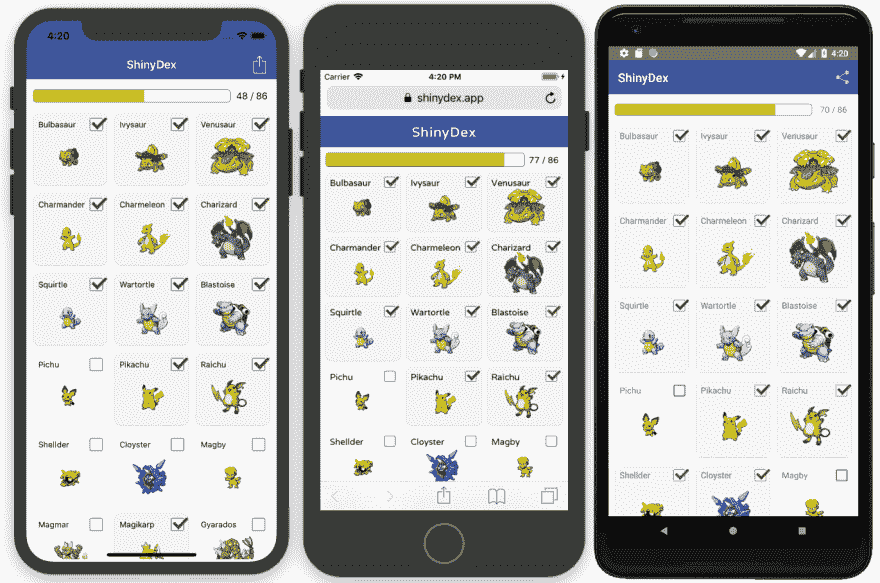

# 如何从一个代码库构建 PWA、iOS 应用和 Android 应用

> 原文：<https://dev.to/progress/how-to-build-a-pwa-an-ios-app-and-an-android-appfrom-one-codebase-50nc>

我有很长一段在 web 和本地之间选择的历史，经常是错误的。我构建了为本地应用而开发的 web 应用，也浪费时间构建了没有受众的本地应用。

在我目前的工作中，作为一名专注于移动开发的倡导者，我每周都会和那些后悔自己的 web 或原生决定的开发人员交谈。有时候，直到遇到网络的限制，你才意识到你需要一个原生应用，相反，有时候，只有在你经历了构建多个原生应用的漫长过程后，你才意识到一个网络应用满足了你的需求。

好消息是 JavaScript 开发人员不再需要做出这个艰难的选择。通过使用最近发布的 [NativeScript 和 Angular integration](https://blog.angular.io/apps-that-work-natively-on-the-web-and-mobile-9b26852495e7) ，现在很容易从一个代码库构建一个 PWA(渐进式 Web 应用程序)、一个原生 iOS 应用程序和一个原生 Android 应用程序。

[T2】](https://res.cloudinary.com/practicaldev/image/fetch/s--ad3Rd1LM--/c_limit%2Cf_auto%2Cfl_progressive%2Cq_auto%2Cw_880/https://thepracticaldev.s3.amazonaws.com/i/amvmhghgeolyelx7nf35.png)

在本文中，我将向您展示它是如何工作的。您将了解构建所有三个平台所需的步骤，以及我自己在这个过程中学到的一些技巧和诀窍。

## 你在建造什么

上个月，我开发了一个基于神奇宝贝的清单应用，并将其部署到 Google Play、iOS 应用商店和网络上。该应用程序是一个特意设计的简单应用程序，旨在帮助教授 NativeScript 和 Angular 技术堆栈如何工作。

[T2】](https://res.cloudinary.com/practicaldev/image/fetch/s--csO_JxNT--/c_limit%2Cf_auto%2Cfl_progressive%2Cq_auto%2Cw_880/https://thepracticaldev.s3.amazonaws.com/i/ppb7xmjowx52f5i5n6ny.png)

在本文中，我将带您构建一个类似清单风格的应用程序，如下所示。

[T2】](https://res.cloudinary.com/practicaldev/image/fetch/s--EUgzDam2--/c_limit%2Cf_auto%2Cfl_progressive%2Cq_66%2Cw_880/https://thepracticaldev.s3.amazonaws.com/i/z3vcxqluc3h34shb7920.gif)

请随意跟随，作为启动您自己的代码共享应用程序的一种方式，或者只是浏览代码，以获得整个过程如何工作的高级概念。

## 启动你的应用

当您准备好构建时，第一步是安装 Angular CLI、NativeScript CLI 和 NativeScript schematics，所有这些都可以在 npm 上找到。打开终端或命令提示符，运行以下命令。

```
npm install -g @angular/cli
npm install -g nativescript
npm install -g @nativescript/schematics 
```

Enter fullscreen mode Exit fullscreen mode

这些工具的作用如下。

*   [**Angular CLI**](https://cli.angular.io/) 是构建和运行 [Angular](https://angular.io/) 应用的命令行界面。
*   [**NativeScript**](https://www.nativescript.org/) 是一个开源框架，用于用 JavaScript 或 TypeScript 构建 iOS 和 Android 应用。
*   [**NativeScript schematics**](https://github.com/NativeScript/nativescript-schematics)是一个 Angular CLI 扩展，增加了做 native script 相关事情的能力。正如你马上会看到的，这使得你的 Angular 应用可以在 iOS 和 Android 上运行。

安装完成后，下一步是创建一个应用程序。为此，请在终端或命令提示符下运行以下命令。

```
ng new Checklist --collection @nativescript/schematics --shared --sample 
```

Enter fullscreen mode Exit fullscreen mode

让我们来分析一下这里发生了什么。

*   `ng new`是用于启动新 Angular 应用程序的 Angular CLI 命令。
*   `Checklist`是您的应用程序名称。对于您自己的应用程序，您需要在此提供您自己的价值。
*   `--collection @nativescript/schematics`标志告诉 Angular CLI 关于 NativeScript schematics 的信息，这使得这个应用程序可以通过 NativeScript 在 iOS 和 Android 上运行。
*   `--shared`标志告诉 NativeScript schematics 您希望从代码共享项目模板开始。
*   `--sample`标志具有本地脚本 schematics 支架，我们稍后会看到一些示例组件。当您构建自己的应用程序时，您可能希望忽略此标志。

现在你有了一个应用程序，让我们看看如何运行它。

## 运行您的应用

首先，`cd`进入你刚刚构建的新应用。

```
cd Checklist 
```

Enter fullscreen mode Exit fullscreen mode

接下来，运行`npm install`来安装应用程序所需的依赖项。

```
npm install 
```

Enter fullscreen mode Exit fullscreen mode

从这里开始，有三个不同的命令可以用来运行您的应用程序。

首先，`ng serve`是你如何在网络上运行你新创建的应用程序。继续从您的终端或命令提示符运行这个命令。

```
ng serve 
```

Enter fullscreen mode Exit fullscreen mode

命令完成后，您将看到一条关于 Angular Live Development 服务器监听的消息。

[T2】](https://res.cloudinary.com/practicaldev/image/fetch/s--_hO2xW5C--/c_limit%2Cf_auto%2Cfl_progressive%2Cq_auto%2Cw_880/https://thepracticaldev.s3.amazonaws.com/i/1aqqxd1tw77hrsmp2eiz.png)

如果你按照说明并在浏览器中访问`localhost:4200`，你会看到默认的 web 应用程序正在运行，这是一个简单的显示足球运动员的主从式应用程序。

[T2】](https://res.cloudinary.com/practicaldev/image/fetch/s--GwNTCZTJ--/c_limit%2Cf_auto%2Cfl_progressive%2Cq_auto%2Cw_880/https://thepracticaldev.s3.amazonaws.com/i/tw9k93r4x7w92uybw85m.png)

如果你以前做过 Angular 开发，你会感觉非常熟悉，因为这和你用来构建 Angular web 应用程序的工作流程是一样的——这很酷！

但是当然，你不仅仅是在为 web 构建这个工作流，当你把 NativeScript 带入画面时，真正的奇迹就发生了。

但在你在 iOS 和 Android 上运行这个应用之前，我需要给出一个警告:因为 NativeScript 应用是真正的原生 iOS 和 Android 应用，所以你需要在你的开发机器上安装一组额外的系统要求来构建这些应用。查看本地脚本文档上的[页面，了解您需要完成的必要设置步骤。](https://docs.nativescript.org/angular/start/general-requirements)

> **注意**:native script 的下一个版本，NativeScript 5.0，有一些有趣的变化，允许你在没有任何本地设置的情况下运行应用程序。你可以[在 GitHub](https://github.com/NativeScript/nativescript-cli/issues/3813) 上了解更多。

设置完成后，返回到您的终端或命令提示符，使用`Ctrl` + `C`停止您的`ng serve`命令，然后执行`npm run android`。该命令需要一分钟的时间来运行，因为 NativeScript 正在构建一个完全原生的 Android 应用程序。完成后，您将看到以下屏幕。

[T2】](https://res.cloudinary.com/practicaldev/image/fetch/s--_C5r4Unk--/c_limit%2Cf_auto%2Cfl_progressive%2Cq_auto%2Cw_880/https://thepracticaldev.s3.amazonaws.com/i/mh3iqf1o2sgstq65mzzi.png)

如果你是在 macOS 上开发，你也可以试着运行`npm run ios`，它通过一个类似的过程运行，但是在 iOS 上构建并启动你的应用。完成后，你会看到这个屏幕。

[T2】](https://res.cloudinary.com/practicaldev/image/fetch/s--DzAFkWqR--/c_limit%2Cf_auto%2Cfl_progressive%2Cq_auto%2Cw_880/https://thepracticaldev.s3.amazonaws.com/i/fwqznmj6p6zpbpv63s2h.png)

有了一个代码库和一组简单明了的命令，你现在可以在三个地方运行同一个应用。

很酷吧。

现在你已经知道如何运行你的应用程序，让我们深入你的应用程序的代码，看看发生了什么。

## 翻阅代码

从项目的根目录开始，这里是您需要了解的顶级文件夹。

```
Checklist/
├── App_Resources
├── platforms
└── src 
```

Enter fullscreen mode Exit fullscreen mode

*   `App_Resources`文件夹是 NativeScript 存储 iOS 和 Android 配置文件和图像资源的地方，比如应用程序的图标和闪屏。在应用程序开发的后期，您会希望使用 NativeScript CLI 的`tns resources generate`命令切换到您自己的图像资源。
*   `platforms`文件夹是 NativeScript 存储你生成的 iOS 和 Android 应用的地方；您可以将它视为您的本地项目的一个`dist`文件夹。
*   文件夹是你的源代码所在的地方，你 95%的时间都在这里度过。

> **注意**:根文件夹里还有一堆其他的配置文件，比如一个用于 Angular CLI 定制的`angular.json`文件，一个用于管理依赖关系的`package.json`文件，还有一系列用于配置 TypeScript 的`tsconfig.json`文件。开始时，最好不要动这些文件；您可以稍后再来查看它们，并对它们进行自定义以满足您的项目需求。

因为`src`文件夹是您花费大部分时间的地方，所以让我们更详细地研究一下该文件夹的内容。

```
src/
├── app
│   ├── app.component.css
│   ├── app.component.html
│   ├── app.component.tns.html
│   ├── app.component.ts
│   ├── app.module.tns.ts
│   ├── app.module.ts
│   ├── app.routes.ts
│   ├── app.routing.tns.ts
│   ├── app.routing.ts
│   └── barcelona
│       └── ...
├── app.css
├── assets
├── index.html
├── main.tns.ts
├── main.ts
├── package.json
└── styles.css 
```

Enter fullscreen mode Exit fullscreen mode

如果你以前构建过 Angular web 应用程序，这种结构看起来会非常熟悉。所有 Angular apps 都有一个用于初始化的`main.ts`文件，一个用于[模块声明](https://angular.io/guide/ngmodules)的`app.module.ts`文件，一系列用于[设置路由](https://angular.io/guide/router)的`app.routing.ts`文件，以及一个用作 [app 的第一个组件](https://angular.io/guide/entry-components)的`app.component.ts`文件。

> **提示**:如果你是 Angular 的新手，想要更深入地了解这些概念，可以看看 [Angular 快速入门教程](https://angular.io/guide/quickstart)。您在那里学到的所有概念都直接适用于本文中的代码共享结构。

NativeScript 的代码共享工作流的一个独特概念是你在一些应用程序文件上看到的`.tns`命名约定(例如`app.routing.tns.ts`)。

默认情况下，NativeScript schematics 包括 web 和移动应用程序中的所有项目文件，毕竟，您是在尝试共享代码。然而，在某些情况下，你需要创建特定于网络和手机的文件，这就是`.tns`扩展的用武之地。

例如，以`app.module.ts`和`app.module.tns.ts`文件为例。当你在网上运行你的应用程序时，Angular CLI 会像你预期的那样使用你的`app.module.ts`文件。然而，当你在 iOS 或 Android 上运行你的应用时，NativeScript schematics 会抓取并使用你的`app.module.tns.ts`文件。这种约定是根据需要拆分 web 和移动代码的强大方法，当您使用这种设置构建自己的应用程序时，会经常用到它。

现在你已经对你的项目结构有了一点了解，让我们来构建一些新的东西。

## 构建您的 web 用户界面

在 starter 应用程序中，你的大部分代码都在一个`src/app/barcelona`文件夹中，因为这是你之前在应用程序中看到的构建播放器列表的代码。在本节中，您将为 web 创建一个全新的组件，在下一节中，您将看到让相同的组件在原生 iOS 和 Android 应用程序中工作是多么容易。

让我们从搭建一些文件开始。为此，首先使用`cd`命令导航到您的`src/app`文件夹。

```
cd /src/app 
```

Enter fullscreen mode Exit fullscreen mode

接下来，创建一个名为`list`的新文件夹，并在该文件夹中创建以下文件。

```
. app
└── list
    ├── list.common.ts
    ├── list.component.css
    ├── list.component.html
    ├── list.component.ts
    ├── list.module.ts
    └── list.service.ts 
```

Enter fullscreen mode Exit fullscreen mode

> **提示**:当您更熟悉使用 NativeScript schematics 时，您可以使用一系列命令来帮助生成组件和模块。更多信息见[本地脚本原理图文档](https://github.com/NativeScript/nativescript-schematics#generating-components-modules-directives-etc)。

以下是放入这些文件的第一步。不要太担心这段代码到底在做什么，因为我们稍后会讨论一些需要注意的重要事情。

`list.common.ts`

```
import { Routes } from '@angular/router';

import { ListComponent } from './list.component';
import { ListService } from './list.service';

export const COMPONENT_DECLARATIONS: any[] = [
  ListComponent
];

export const PROVIDERS_DECLARATIONS: any[] = [
  ListService
];

export const ROUTES: Routes = [
  { path: 'list', component: ListComponent },
]; 
```

Enter fullscreen mode Exit fullscreen mode

`list.component.css`

```
ul {
  list-style: none;
  padding: 0;
  margin: 0;
}

li {
  border-style: solid;
  border-width: 0 0 1px 0;
  border-color: #C0C0C0;
  display: flex;
  align-items: center;
  cursor: pointer;
}

li.selected {
  background-color: #C0C0C0;
}

img {
  height: 96px;
  width: 96px;
} 
```

Enter fullscreen mode Exit fullscreen mode

`list.component.html`

```
<ul>
  <li *ngFor="let item of items" [class.selected]="item.selected" (click)="itemTapped(item)">
    
    <span>{{ item.name }}</span>
  </li>
</ul> 
```

Enter fullscreen mode Exit fullscreen mode

`list.component.ts`

```
import { Component, OnInit } from '@angular/core';

import { ListService } from './list.service';

@Component({
  selector: 'app-list',
  templateUrl: './list.component.html',
  styleUrls: ['./list.component.css']
})
export class ListComponent implements OnInit {
  items: any[];

  constructor(private listService: ListService) { }

  ngOnInit() {
    this.listService.get().subscribe((data: any) => {
      this.items = data;
    });
  }

  itemTapped(item) {
    this.listService.toggleSelected(item);
  }
} 
```

Enter fullscreen mode Exit fullscreen mode

`list.module.ts`

```
import { NgModule } from '@angular/core';
import { CommonModule } from '@angular/common';
import { HttpClientModule } from '@angular/common/http';
import { RouterModule } from '@angular/router';

import { ROUTES, COMPONENT_DECLARATIONS, PROVIDERS_DECLARATIONS } from './list.common';

@NgModule({
  imports: [
    CommonModule,
    HttpClientModule,
    RouterModule.forRoot(ROUTES)
  ],
  exports: [
    RouterModule
  ],
  declarations: [
    ...COMPONENT_DECLARATIONS
  ],
  providers: [
    ...PROVIDERS_DECLARATIONS
  ]
})
export class ListModule { } 
```

Enter fullscreen mode Exit fullscreen mode

`list.service.ts`

```
import { Injectable } from '@angular/core';
import { HttpClient } from '@angular/common/http';
import { map } from 'rxjs/operators';

@Injectable()
export class ListService {
  saved: any[];

  constructor(private http: HttpClient) {
    let saved = localStorage.getItem('items');
    if (saved) {
      this.saved = JSON.parse(saved);
    } else {
      this.saved = [];
    }
  }

  get() {
    return this.http.get('https://rawgit.com/tjvantoll/ShinyDex/master/assets/151.json')
      .pipe(
        map((data: any) => {
          const returnData = [];
          data.results.forEach((item) => {
            item.selected = this.saved.indexOf(item.id) != -1;
            returnData.push(item);
          })
          return returnData;
        })
      );
  }

  toggleSelected(item) {
    if (item.selected) {
      this.saved.splice(this.saved.indexOf(item.id), 1);
    } else {
      this.saved.push(item.id);
    }

    item.selected = !item.selected;
    this.save();
  }

  save() {
    localStorage.setItem('items', JSON.stringify(this.saved));
  }
} 
```

Enter fullscreen mode Exit fullscreen mode

同样，如果您不理解这段代码中的所有内容，也不要担心。现在，您需要知道的是，这是一个相当简单的 Angular 组件，它从 API 加载数据并在列表中显示。

要激活这个新组件以便你可以试用，首先，把这个新组件添加到你的`app.module.ts`文件中，这样 Angular 就知道它了。下面是您的新`app.module.ts`文件应该是什么样子。

```
import { NgModule } from '@angular/core';
import { BrowserModule } from '@angular/platform-browser';

import { AppRoutingModule } from './app.routing';
import { AppComponent } from './app.component';
import { ListModule } from './list/list.module';

@NgModule({
  declarations: [
    AppComponent,
  ],
  imports: [
    BrowserModule,
    AppRoutingModule,
    ListModule
  ],
  providers: [],
  bootstrap: [AppComponent]
})
export class AppModule { } 
```

Enter fullscreen mode Exit fullscreen mode

接下来，更改`app.routes.ts`文件中的默认路径，这样 Angular 默认导航到新的列表组件。新的`app.routes.ts`文件应该是这样的。

```
import { Routes } from '@angular/router';

export const ROUTES: Routes = [
  { path: '', redirectTo: '/list', pathMatch: 'full' },
]; 
```

Enter fullscreen mode Exit fullscreen mode

最后，为了让这个应用程序看起来更好，将下面的代码粘贴到你的`src/styles.css`文件中，这是你为 Angular 应用程序添加全局 CSS 的地方。

```
html, body { margin: 0; }
body {
  font-family: -apple-system,BlinkMacSystemFont,"Segoe UI",Roboto,"Helvetica Neue",Arial,sans-serif;
} 
```

Enter fullscreen mode Exit fullscreen mode

准备就绪后，返回到您的终端或命令提示符并运行`ng serve`。命令运行后，打开浏览器并访问`localhost:4200`，您应该会看到一个简单的清单，如下所示。

[T2】](https://res.cloudinary.com/practicaldev/image/fetch/s--oj_yvZBc--/c_limit%2Cf_auto%2Cfl_progressive%2Cq_66%2Cw_880/https://thepracticaldev.s3.amazonaws.com/i/s4pcazk4jvafwyvr6whp.gif)

你现在拥有的应用程序是一个非常简单的应用程序，允许用户选择项目。如果你看一下`list.service.ts`中的代码，你可以看到应用程序还会使用`localStorage`记住用户的选择——这意味着当用户返回应用程序时，所有选择都会保留。

此时，您已经有了一个非常简单的移动应用程序。如果你愿意，你可以遵循许多在线指南中的一个，为这个应用提供一个服务人员，并使它成为一个渐进的 web 应用——毕竟，目前你只是使用 Angular CLI 来构建一个 Web 应用。

不过，这个工作流程的真正乐趣在于，将这样的功能性应用转化为原生 iOS 和 Android 应用是多么容易。让我们看看如何做到这一点。

## 创建您的 iOS 和 Android 应用程序

当使用 NativeScript schematics 将 web 界面转换为移动界面时，您的首要任务是确定哪些代码可以重用，哪些代码不可以重用。让我们回到组成这个组件的文件列表。

```
. app
└── list
    ├── list.common.ts
    ├── list.component.css
    ├── list.component.html
    ├── list.component.ts
    ├── list.module.ts
    └── list.service.ts 
```

Enter fullscreen mode Exit fullscreen mode

对于这个例子，您需要创建一个特定于 NativeScript 的标记文件(`.html`)、样式文件(`.css`)和模块文件(`.module.ts`)。为此，向前创建三个新文件，`list.component.tns.css`、`list.component.tns.html`和`list.module.tns.ts`。您的文件树现在应该看起来像这样。

```
. app
└── list
    ├── list.common.ts
    ├── list.component.css
    ├── list.component.html
    ├── list.component.tns.css (new)
    ├── list.component.tns.html (new)
    ├── list.component.ts
    ├── list.module.ts
    ├── list.module.tns.ts (new)
    └── list.service.ts 
```

Enter fullscreen mode Exit fullscreen mode

请记住，Angular CLI 在为 NativeScript 构建时会自动获取您的`.tns.*`文件中的代码，在为 web 构建时会自动获取您的非`.tns`文件中的代码。因此，`.tns`文件是您需要放置特定于 NativeScript 的代码的地方。

为此，首先打开您的`list.module.tns.ts`文件并粘贴以下代码。

```
import { NgModule, NO_ERRORS_SCHEMA } from '@angular/core';
import { NativeScriptCommonModule } from 'nativescript-angular/common';
import { NativeScriptHttpClientModule } from 'nativescript-angular/http-client';
import { NativeScriptRouterModule } from 'nativescript-angular/router';

import { ROUTES, COMPONENT_DECLARATIONS, PROVIDERS_DECLARATIONS } from './list.common';

@NgModule({
  imports: [
    NativeScriptCommonModule,
    NativeScriptHttpClientModule,
    NativeScriptRouterModule,
    NativeScriptRouterModule.forRoot(ROUTES)
  ],
  exports: [
    NativeScriptRouterModule
  ],
  declarations: [
    ...COMPONENT_DECLARATIONS
  ],
  providers: [
    ...PROVIDERS_DECLARATIONS
  ],
  schemas: [
    NO_ERRORS_SCHEMA
  ]
})
export class ListModule { } 
```

Enter fullscreen mode Exit fullscreen mode

您需要一个特定于 NativeScript 的模块文件，这样您就可以声明特定于 NativeScript 的导入，比如`NativeScriptHttpClientModule`和`NativeScriptRouterModule`。但是，请注意您的`list.module.ts`和`list.module.tns.ts`文件是如何从您的`list.common.ts`文件中提取路由、声明和提供者的。这使您能够在一个地方添加这些声明，而不必在每次需要进行小的更新时更改两个不同的模块文件。

下一个要更改的文件是应用程序的标记文件。为此，打开您的`list.component.tns.html`文件并粘贴以下代码。

```
<ListView [items]="items">
  <ng-template let-item="item">
    <FlexboxLayout [class.selected]="item.selected" (tap)="itemTapped(item)">
      <Image [src]="item.image"></Image>
      <Label [text]="item.name"></Label>
    </FlexboxLayout>
  </ng-template>
</ListView> 
```

Enter fullscreen mode Exit fullscreen mode

> **提示**:需要帮助学习这些 NativeScript 用户界面组件吗？试试 [NativeScript Playground](https://play.nativescript.org/) ，具体来说，试试屏幕左下角的组件窗格。

接下来，为了设计这些组件的样式，将下面的代码粘贴到您的`list.component.tns.css`文件中。

```
FlexboxLayout {
  padding: 5;
  align-items: center;
}
.selected {
  background-color: #C0C0C0;
}
Image {
  height: 80;
  width: 80;
} 
```

Enter fullscreen mode Exit fullscreen mode

> **提示**:如果你是 SASS 的粉丝，你可以在 NativeScript schematics 中使用它，并共享 CSS 变量，比如颜色。查看本地脚本文档上的[说明。](https://docs.nativescript.org/angular/code-sharing/creating-a-new-project#sass)

所有这些都准备好了，你的最后一步是将你的`ListModule`导入到你的`app.module.tns.ts`文件中，就像你对你的`app.module.ts`文件所做的一样。为此，用下面的代码替换`app.component.tns.ts`文件的内容。

```
import { NgModule, NO_ERRORS_SCHEMA } from '@angular/core';
import { NativeScriptModule } from 'nativescript-angular/nativescript.module';

import { AppRoutingModule } from './app.routing';
import { AppComponent } from './app.component';
import { ListModule } from './list/list.module';

@NgModule({
  bootstrap: [
    AppComponent
  ],
  imports: [
    NativeScriptModule,
    AppRoutingModule,
    ListModule
  ],
  declarations: [
    AppComponent
  ],
  providers: [
  ],
  schemas: [
    NO_ERRORS_SCHEMA
  ]
})
export class AppModule { } 
```

Enter fullscreen mode Exit fullscreen mode

这样，你就应该有一个正常运行的 NativeScript 应用程序了，对吗？实际上，您还需要做最后一项更改，为了展示这一点，让我们引入助手文件的概念。

## 使用助手文件

当采用代码共享方法时，有时您需要将 web 和本机的实现完全分开。例如，您的用户界面总是需要不同的实现，因为您需要为 web 使用 DOM 节点，为移动设备使用 NativeScript 用户界面控件。

然而，通常情况下，您可以共享几乎所有的代码，但是需要针对 web 和移动设备的稍微不同的实现。在您的示例应用程序中实际上有一个这样的例子，它在您的`list.service.ts`文件中。

如果你打开`list.service.ts`，你会看到对`localStorage`的两个不同的引用——一个在构造函数中...

```
let saved = localStorage.getItem('items'); 
```

Enter fullscreen mode Exit fullscreen mode

...另一个在`save()`方法中。

```
localStorage.setItem('items', JSON.stringify(this.saved)); 
```

Enter fullscreen mode Exit fullscreen mode

这里的问题是`localStorage`是一个浏览器 API。它在 web 上工作得很好，但它不存在于 NativeScript 应用程序中，因为 NativeScript 应用程序不在浏览器中运行。

你有几种不同的方法来处理这件事。您可以创建一个`list.service.tns.ts`文件，并为您的移动应用程序创建该服务的单独实现。但是，如果这样做，您需要复制大量跨两个平台相同的代码，例如通过 HTTP 调用您的后端并解析数据的代码。

当您遇到这些情况时，您可以选择创建帮助文件。也就是说，创建两个具有相同 API 的文件，将这些 API 的 web 实现放在一个文件中，将这些 API 的 NativeScript 实现放在另一个文件中。

为此，为您的服务创建两个名为`list.helper.ts`和`list.helper.tns.ts`的新文件。您的新文件夹结构现在应该如下所示。

```
. app
└── list
    ├── list.common.ts
    ├── list.component.css
    ├── list.component.html
    ├── list.component.tns.css
    ├── list.component.tns.html
    ├── list.component.ts
    ├── list.helper.tns.ts (new)
    ├── list.helper.ts (new)
    ├── list.module.ts
    ├── list.module.tns.ts
    └── list.service.ts 
```

Enter fullscreen mode Exit fullscreen mode

> **提示**:在一个真实的应用程序中，你可能想要将服务和它的助手文件移动到它自己的文件夹中，这既是为了打破文件夹结构，也是为了使服务可重用。对于本教程来说，最简单的方法是把所有东西都放在一个地方。

打开您的`list.helper.ts`文件并粘贴以下代码。这与您在服务中提取到助手中的`localStorage`代码相同。

```
export class ListHelper {
  readItems() {
    let saved = localStorage.getItem('items');
    if (saved) {
      return JSON.parse(saved);
    } else {
      return [];
    }
  }

  writeItems(items) {
    localStorage.setItem('items', JSON.stringify(items));
  }
} 
```

Enter fullscreen mode Exit fullscreen mode

接下来，打开您的`list.helper.tns.ts`文件并粘贴以下代码。这段代码遵循与 web helper 相同的 API，但是使用了一些 NativeScript 的内置模块来为您的 iOS 和 Android 应用程序完成相同的任务。

```
import { knownFolders, File } from 'tns-core-modules/file-system';

export class ListHelper {
  saveFile: File;

  constructor() {
    this.saveFile = knownFolders.documents().getFile('items.json');
  }

  readItems() {
    const items = this.saveFile.readTextSync();
    return items ? JSON.parse(items) : [];
  }

  writeItems(items) {
    this.saveFile.writeText(JSON.stringify(items));
  }
} 
```

Enter fullscreen mode Exit fullscreen mode

这里的最后一步是更改您的服务以利用这些新的助手，这可以通过用下面的代码替换您的`list.service.ts`文件中的代码来完成，它利用了新的助手。

```
import { Injectable } from '@angular/core';
import { HttpClient } from '@angular/common/http';
import { map } from 'rxjs/operators';

import { ListHelper } from './list.helper';

@Injectable()
export class ListService {
  saved: any[];
  helper: ListHelper;

  constructor(private http: HttpClient) {
    this.helper = new ListHelper();
    this.saved = this.helper.readItems();
  }

  get() {
    return this.http.get('https://rawgit.com/tjvantoll/ShinyDex/master/assets/151.json')
      .pipe(
        map((data: any) => {
          const returnData = [];
          data.results.forEach((item) => {
            item.selected = this.saved.indexOf(item.id) != -1;
            returnData.push(item);
          })
          return returnData;
        })
      );
  }

  toggleSelected(item) {
    if (item.selected) {
      this.saved.splice(this.saved.indexOf(item.id), 1);
    } else {
      this.saved.push(item.id);
    }

    item.selected = !item.selected;
    this.save();
  }

  save() {
    this.helper.writeItems(this.saved);
  }
} 
```

Enter fullscreen mode Exit fullscreen mode

现在你已经准备好了所有的代码，继续使用下面的命令在 iOS 或 Android 上运行你的应用程序。

```
npm run ios 
```

Enter fullscreen mode Exit fullscreen mode

```
npm run android 
```

Enter fullscreen mode Exit fullscreen mode

您应该会看到一个类似这样的应用程序。

[T2】](https://res.cloudinary.com/practicaldev/image/fetch/s--EUgzDam2--/c_limit%2Cf_auto%2Cfl_progressive%2Cq_66%2Cw_880/https://thepracticaldev.s3.amazonaws.com/i/z3vcxqluc3h34shb7920.gif)

虽然这个应用程序很简单，但记住你在这里看到的是很重要的。这些是*原生* iOS 和 Android 应用，使用原生 iOS 和 Android 用户界面控件。你不仅用 Angular 和 TypeScript 构建了这些应用程序，你甚至与你的 web 应用程序共享了这个应用程序背后的一大块代码。

> **注意**:你可以从[这篇关于 NativeScript 文档的文章](https://docs.nativescript.org/angular/code-sharing/code-splitting#partial-differences)中了解更多关于使用助手文件来拆分代码的信息。

## 大局

在本文中，我们研究了如何构建一个简单的组件，在 web 和本地应用程序之间共享代码。尽管本文只关注了一个组件，但这种方法足够灵活，可以构建任何规模的应用程序。

根据您的需求，您可能希望为 web 和移动设备创建相对相同的应用程序。或者，您可能希望创建非常不同的应用程序，这些应用程序共享相同的语言、框架、底层基础设施和服务层。

毕竟，使用 NativeScript schematics 的强大之处不仅仅在于代码共享——使用一种语言和一个框架来构建三个平台也会让您受益匪浅。希望您和我一样，对使用这一技术堆栈可以构建的令人惊叹的东西感到兴奋。

## 资源

*   [关于代码共享的 NativeScript 文档](https://docs.nativescript.org/angular/code-sharing/intro)
*   [本文示例的最终源代码](https://github.com/tjvantoll/shinydex/tree/article)
*   [ShinyDex 的完整源代码](https://github.com/tjvantoll/ShinyDex)