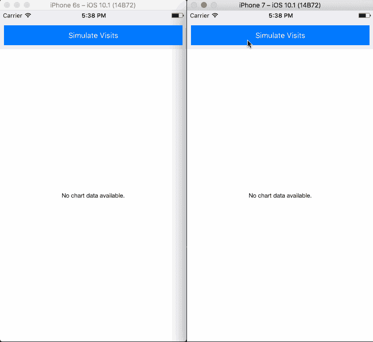
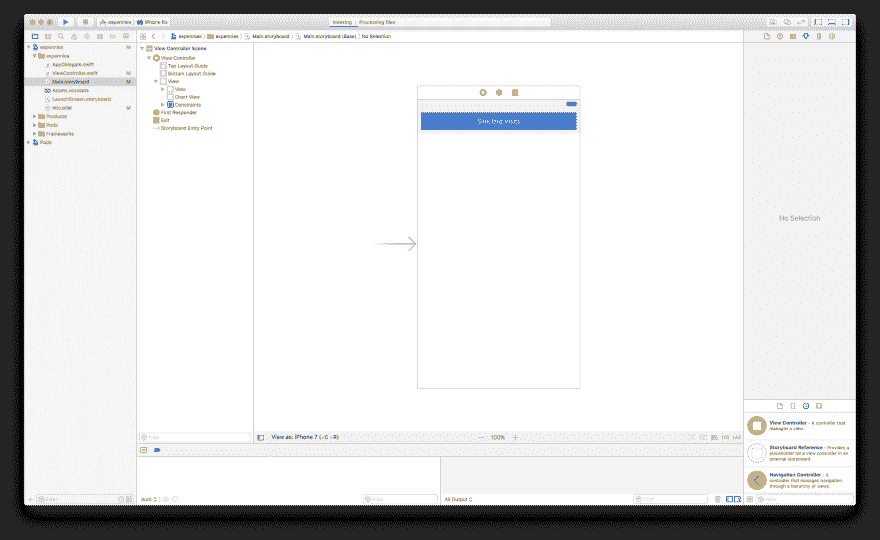
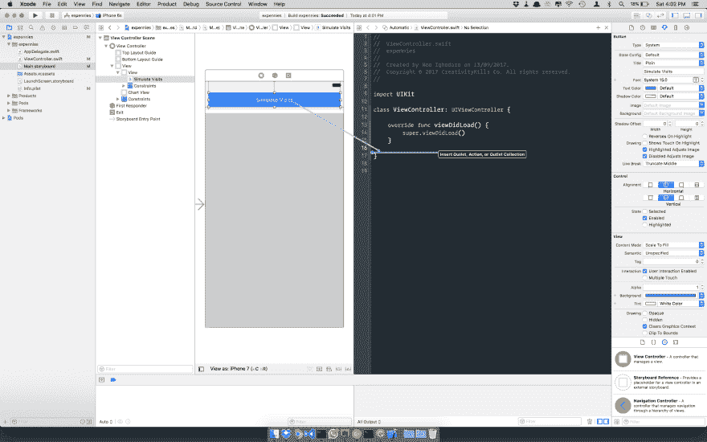
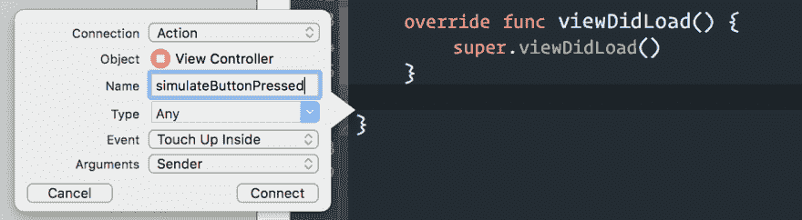
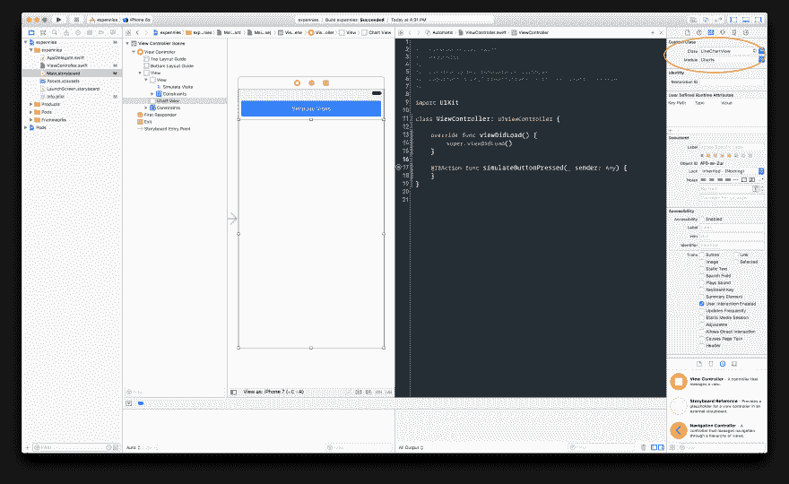
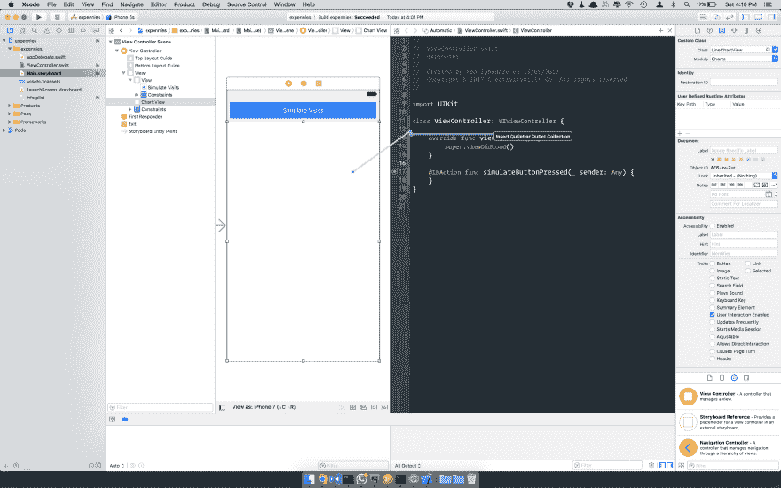
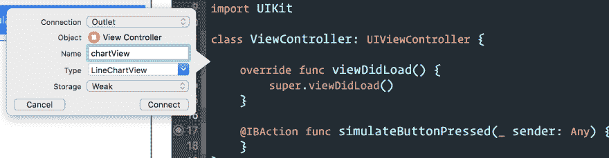
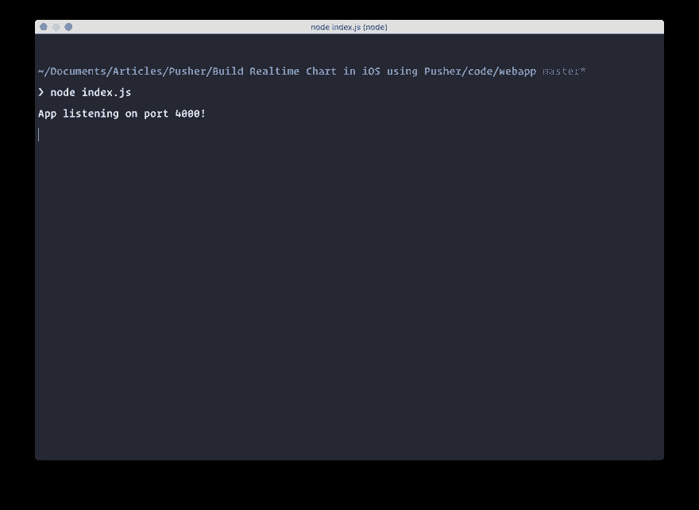
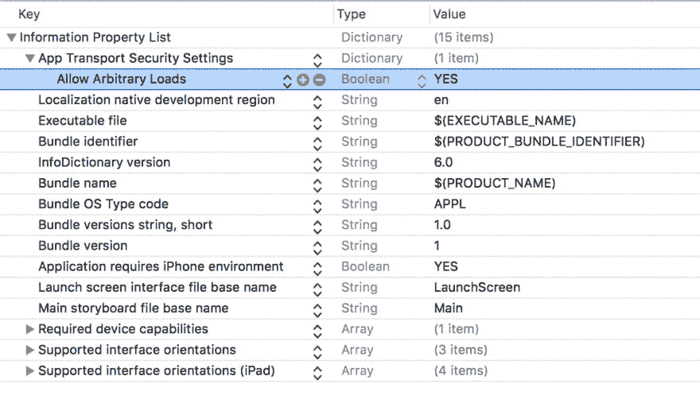

# 如何在 iOS 中构建实时图表

> 原文：<https://dev.to/neo/how-to-build-a-realtime-chart-in-ios--42g5>

如今，收集数据是了解产品如何被感知的关键之一。从用户那里收集一些数据，可以帮助你打造更好的产品，了解你的用户。然而，如果没有可视化的方法，世界上所有的数据都是无用的。

在本文中，我们将探索如何在 iOS 中创建一个简单的实时图表。该图表将接收数据并实时更新到当前登录到您的应用程序的每个人的屏幕上。我们假设这是一个监控有多少访问者在使用一个网站的图表。我们开始吧。

作为背景，下面是我们将要构建的一个示例:

[T2】](https://res.cloudinary.com/practicaldev/image/fetch/s--raR5KmU0--/c_limit%2Cf_auto%2Cfl_progressive%2Cq_66%2Cw_880/https://blog.pusher.com/wp-content/uploads/2017/10/build-realtime-chart-in-ios-using-pusher.gif)

## 在 iOS 中构建实时图表的要求

在我们开始本教程之前，你需要满足以下要求:
–一台 MacBook Pro。安装在您机器上的
–[Xcode](https://developer.apple.com/xcode/)。
—[Swift](https://developer.apple.com/swift/)的基础知识和 Xcode 的使用。
——JavaScript 基础知识(Node.js)。
–[node . js](https://docs.npmjs.com/getting-started/installing-node)和 NPM 安装在你的机器上。
–[安装在您机器上的 Cocoapods](http://www.raywenderlich.com/12139/introduction-to-cocoapods)* * * *。
–一个[推杆](https://pusher.com)应用。

当你具备了所有的条件，我们就可以开始了。

## 准备在 Xcode 中创建实时图表应用程序

在 Mac 上启动 Xcode，创建一个新项目(想叫什么就叫什么)。遵循新建应用程序向导，创建一个新的**单页应用程序**。创建项目后，关闭 Xcode 并启动您的终端应用程序。

在终端中，`cd`指向应用程序的根目录。然后运行命令`pod init`。这将生成一个 **Podfile** 。将 Podfile 的内容更新为以下内容(将`PROJECT_NAME`替换为您的项目名称):

```
 platform :ios, '9.0'
    target 'PROJECT_NAME' do
      use_frameworks!
      pod 'Charts', '~> 3.0.2'
      pod 'PusherSwift', '~> 4.1.0'
      pod 'Alamofire', '~> 4.4.0'
    end 
```

Enter fullscreen mode Exit fullscreen mode

保存 Podfile，然后转到您的终端并运行命令:`pod install`。

运行这个命令将安装我们构建实时 iOS chart 应用程序所需的所有第三方包。

它会安装的第一个包是 [Charts](https://github.com/danielgindi/Charts) ，这是一个在 iOS 上制作精美图表的包。第二个包是 Pusher swift SDK。最后一个包是 [Alamofire](https://github.com/Alamofire/Alamofire) ，一个在 iOS 上进行 HTTP 请求的包。

安装完成后，打开项目根目录下的`**.xcworkspace**`文件。这应该会启动 Xcode。现在我们准备开始创建我们的 iOS 应用程序。

## 在 Xcode 中创建我们的实时图表应用视图

首先，我们将创建实时图表应用程序所需的必要视图。打开 **Main.storyboard** 文件，让我们开始设计视图。

首先，在故事板的视图控制器顶部创建一个边对边的矩形视图。在该视图中，添加一个按钮，并添加标题“模拟访问”。接下来，创建另一个视图，也是一个矩形，从上面第一个视图的末端延伸到屏幕的底部。这个视图将是我们呈现实时图表的地方。

创建完视图后，您应该会看到下图所示的内容。

[T2】](https://res.cloudinary.com/practicaldev/image/fetch/s--dl76Df0n--/c_limit%2Cf_auto%2Cfl_progressive%2Cq_auto%2Cw_880/https://blog.pusher.com/wp-content/uploads/2017/10/build-realtime-chart-in-ios-using-pusher-1.png)

就目前的情况而言，这些意见没有任何作用。让我们将一些功能连接到 iOS 图表应用程序视图。

## 向我们的 iOS 图表应用程序添加基本功能

如前所述，我们的应用程序的视图和按钮没有连接到我们的`ViewController`上，所以让我们来解决这个问题。

在 Xcode 中，当故事板仍然打开时，点击页面右上角的“显示助理编辑器”按钮，将视图分为故事板和代码视图。现在，单击一次您创建的按钮，按住`ctrl`，单击并拖动链接到代码编辑器。然后创建一个`@IBaction`，如下图所示:

[T2】](https://res.cloudinary.com/practicaldev/image/fetch/s--9upsaXJc--/c_limit%2Cf_auto%2Cfl_progressive%2Cq_auto%2Cw_880/https://blog.pusher.com/wp-content/uploads/2017/10/build-realtime-chart-in-ios-using-pusher-2.png)

[T2】](https://res.cloudinary.com/practicaldev/image/fetch/s--fCiZDa_e--/c_limit%2Cf_auto%2Cfl_progressive%2Cq_auto%2Cw_880/https://blog.pusher.com/wp-content/uploads/2017/10/build-realtime-chart-in-ios-using-pusher-3.png)

当链接完成时，您应该会看到代码编辑器中添加了如下内容:

```
 @IBAction func simulateButtonPressed(_ sender: Any) {
    } 
```

Enter fullscreen mode Exit fullscreen mode

太好了！现在您已经创建了第一个链接，我们必须再创建一个到图表视图的链接。

在故事板上，点击视图，在“身份检查”选项卡上，确保视图连接到`LineChartView`，如下图所示。

[T2】](https://res.cloudinary.com/practicaldev/image/fetch/s--u5kAmqH7--/c_limit%2Cf_auto%2Cfl_progressive%2Cq_auto%2Cw_880/https://blog.pusher.com/wp-content/uploads/2017/10/realtime-chart-swift-linechartview.png)

现在视图已经连接到了一个视图类，重复我们之前链接按钮的操作，只是这次我们没有创建一个`@IBAction`而是创建一个`@IBOutlet`。图像如下所示:

[T2】](https://res.cloudinary.com/practicaldev/image/fetch/s--yD7OYrZc--/c_limit%2Cf_auto%2Cfl_progressive%2Cq_auto%2Cw_880/https://blog.pusher.com/wp-content/uploads/2017/10/build-realtime-chart-in-ios-using-pusher-5.png)

[T2】](https://res.cloudinary.com/practicaldev/image/fetch/s--UfyhjzcJ--/c_limit%2Cf_auto%2Cfl_progressive%2Cq_auto%2Cw_880/https://blog.pusher.com/wp-content/uploads/2017/10/build-realtime-chart-in-ios-using-pusher-6.png)

当链接完成时，您应该会看到代码编辑器中添加了如下内容:

```
 @IBOutlet weak var chartView: LineChartView! 
```

Enter fullscreen mode Exit fullscreen mode

最后，在顶部的`ViewController`导入图表包。您可以在`ViewController`中的`import UIKit`下添加下面的代码。

```
 import Charts 
```

Enter fullscreen mode Exit fullscreen mode

现在我们已经将这两个元素链接到了我们的代码中，每次按下**模拟访问**按钮，就会调用**模拟按钮按下**函数。

## 为我们的 iOS 图表应用程序添加实时功能

拼图的最后一块将显示一个图表，并使它在所有查看该图表的设备上实时更新。

为此，我们将采取以下措施:

*   创建一个根据数字更新图表的函数。
*   让我们的请求按钮调用后端，这将依次发送模拟数据给推。
*   创建一个函数来监听来自 Pusher 的事件，当接收到一个事件时，它触发我们前面创建的更新图表函数。

**创建一个触发函数来更新我们的图表**
让我们创建一个函数，根据提供给它的数字来更新我们的图表。打开`ViewController`，在其中的类声明下声明一个类产权。我们将使用此属性来跟踪访问者:

```
 var visitors: [Double] = [] 
```

Enter fullscreen mode Exit fullscreen mode

接下来，我们将添加对图表视图进行实际更新的函数:

```
 private func updateChart() {
        var chartEntry = [ChartDataEntry]()

        for i in 0..<visitors.count {
            let value = ChartDataEntry(x: Double(i), y: visitors[i])
            chartEntry.append(value)
        }

        let line = LineChartDataSet(values: chartEntry, label: "Visitor")
        line.colors = [UIColor.green]

        let data = LineChartData()
        data.addDataSet(line)

        chartView.data = data
        chartView.chartDescription?.text = "Visitors Count"
    } 
```

Enter fullscreen mode Exit fullscreen mode

在上面的代码中，我们声明了用于存储所有图表数据的`chartEntry`。然后我们循环遍历可用的`visitors`，并为它们中的每一个添加一个新的`ChartDataEntry(x: Double(i), y: visitors[i])`，告诉图表 X 和 Y 的位置。

我们设置折线图的显示颜色。我们创建`LineChartData`并添加包含我们的数据点的`line`。最后，我们将数据添加到`chartView`并设置图表视图描述。

让我们的模拟按钮调用一个端点
接下来我们需要做的是让我们的请求按钮触发一个后端，这个后端将依次发送模拟数据给 Pusher。

为此，我们需要再次更新视图控制器。在`ViewController`中导入图表包下的 Alamofire 包:

```
 import Alamofire 
```

Enter fullscreen mode Exit fullscreen mode

现在用下面的代码替换`simulateButtonPressed`函数:

```
 @IBAction func simulateButtonPressed(_ sender: Any) {
        Alamofire.request("http://localhost:4000/simulate", method: .post).validate().responseJSON { (response) in
            switch response.result {
            case .success(_):
                _ = "Successful"
            case .failure(let error):
                print(error)
            }
        }
    } 
```

Enter fullscreen mode Exit fullscreen mode

在下面的代码中，我们使用 Alamofire 向本地 web 服务器 http://localhost:4000/simulate 发送 POST 请求(我们将很快创建这个后端)。在真实的应用程序中，这通常会指向一个真实的 web 服务器。

为了保持教程的简单性，这个端点不接受任何参数。我们也不需要对响应做任何事情。我们只需要在每次按下模拟访问按钮时发送 POST 请求。

**使用 Pusher**
绑定实时功能为了让所有这些工作正常进行，我们将创建一个函数来监听来自 Pusher 的事件，当接收到一个事件时，我们将该值保存到`visitors`中，然后触发我们之前创建的更新图表功能。

为此，打开`ViewController`并导入顶部 Alamofire 包下的`PusherSwift`SDK:

```
 import PusherSwift 
```

Enter fullscreen mode Exit fullscreen mode

接下来，我们将为 Pusher 实例声明一个类属性。我们可以在`visitors`声明行下面做这件事:

```
 var pusher: Pusher! 
```

Enter fullscreen mode Exit fullscreen mode

然后在声明属性之后，我们需要将下面的函数添加到类中，这样它就可以监听事件:

```
 private func listenForChartUpdates() {
        pusher = Pusher(key: "PUSHER_KEY", options: PusherClientOptions(host: .cluster("PUSHER_CLUSTER")))

        let channel = pusher.subscribe("visitorsCount")

        channel.bind(eventName: "addNumber", callback: { (data: Any?) -> Void in
            if let data = data as? [String: AnyObject] {
                let count = data["count"] as! Double
                self.visitors.append(count)
                self.updateChart()
            }
        })

        pusher.connect()
    } 
```

Enter fullscreen mode Exit fullscreen mode

在上面的代码中，我们实例化 Pusher 并传入我们的密钥和集群(您可以从 Pusher 应用程序的仪表板中获得您的密钥和集群)。然后，我们订阅`visitorsChannel`并绑定到该通道上的事件名称`addNumber`。

当事件被触发时，我们触发回调中的逻辑，该逻辑简单地将计数附加到`visitors`中，然后调用`updateChart`函数，该函数实时更新实际的图表。

最后我们调用`pusher.connect()`，它形成了到 Pusher 的连接。

在`viewDidLoad`函数中，只需添加一个对`listenForChartUpdates`方法的调用:

```
 override func viewDidLoad() {
        super.viewDidLoad()

        // ...stuff 

        listenForChartUpdates()
    } 
```

Enter fullscreen mode Exit fullscreen mode

仅此而已！我们已经用 Xcode 创建了我们的应用程序，并准备好进行测试。然而，为了进行测试，我们需要创建一个后端，当按钮被点击时，我们向其发送一个`POST`请求。为了创建这个后端，我们将使用 Node.js。

## 为我们的实时 iOS 图表应用程序创建后端服务

首先，为 web 应用程序创建一个目录，然后在目录中创建一些新文件:

文件: **index.js**

```
 // -------------------------------------------------------
    // Require Node dependencies
    // -------------------------------------------------------

    let Pusher     = require('pusher');
    let express    = require('express');
    let bodyParser = require('body-parser');
    let app        = express();

    // Instantiate Pusher
    let pusher     = new Pusher(require('./config.js'));

    // -------------------------------------------------------
    // Load express middlewares
    // -------------------------------------------------------

    app.use(bodyParser.json());
    app.use(bodyParser.urlencoded({ extended: false }));

    // -------------------------------------------------------
    // Simulate multiple changes to the visitor count value,
    // this way the chart will always update with different
    // values.
    // -------------------------------------------------------

    app.post('/simulate', (req, res, next) => {
      var loopCount = 0;
      let sendToPusher = setInterval(function(){
        let count = Math.floor((Math.random() * (100 - 1)) + 1)
        pusher.trigger('visitorsCount', 'addNumber', {count:count})
        loopCount++;
        if (loopCount === 20) {
          clearInterval(sendToPusher);
        }
      }, 2000);
      res.json({success: 200})
    })

    // Handle index
    app.get('/', (req, res) => {
      res.json("It works!");
    });

    // Handle 404's
    app.use((req, res, next) => {
        let err = new Error('Not Found');
        err.status = 404;
        next(err);
    });

    // -------------------------------------------------------
    // Serve application
    // -------------------------------------------------------

    app.listen(4000, function(){
        console.log('App listening on port 4000!')
    }); 
```

Enter fullscreen mode Exit fullscreen mode

上面的文件是一个用 JavaScript 编写的简单的 Express 应用程序。我们实例化了我们需要的所有包，并使用我们即将创建的配置文件配置 pusher。然后我们创建一个路由`/simulate`，在这个路由中我们触发了`visitorCount`通道中的`addNumber`事件。这是应用程序正在侦听的同一个通道和事件。

为了简单一点，我们使用`setInterval`每隔 2000 毫秒向 Pusher 后端发送一个随机的访问者计数。循环 20 次后，循环停止。这应该足以测试我们的应用程序。

创建下一个文件 **config.js** :

```
 module.exports = {
        appId: 'PUSHER_APP_ID',
        key: 'PUSHER_APP_KEY',
        secret: 'PUSHER_APP_SECRET',
        cluster: 'PUSHER_APP_CLUSTER',
    }; 
```

Enter fullscreen mode Exit fullscreen mode

用您自己的 Pusher 应用程序的凭证替换`PUSHER_APP_*`键。

下一个也是最后一个文件是 **package.json** :

```
 {
      "main": "index.js",
      "dependencies": {
        "body-parser": "^1.16.0",
        "express": "^4.14.1",
        "pusher": "^1.5.1"
      }
    } 
```

Enter fullscreen mode Exit fullscreen mode

在这个文件中，我们简单地声明了依赖关系。

现在打开终端和`cd`到 web 应用目录的根目录，运行下面的命令分别安装 NPM 依赖项和运行应用:

```
 $ npm install
    $ node index.js 
```

Enter fullscreen mode Exit fullscreen mode

当安装完成且应用程序准备就绪时，您应该会看到下面的输出:

[T2】](https://res.cloudinary.com/practicaldev/image/fetch/s--B0OXIu1y--/c_limit%2Cf_auto%2Cfl_progressive%2Cq_auto%2Cw_880/https://blog.pusher.com/wp-content/uploads/2017/10/build-realtime-chart-in-ios-using-pusher-7.png)

## 测试应用程序

一旦您的本地节点 web 服务器开始运行，您将需要进行一些更改，以便您的应用程序可以与本地 web 服务器通信。在`info.plist`文件中，进行以下更改:

[T2】](https://res.cloudinary.com/practicaldev/image/fetch/s--MPghkE-h--/c_limit%2Cf_auto%2Cfl_progressive%2Cq_auto%2Cw_880/https://blog.pusher.com/wp-content/uploads/2017/10/build-realtime-chart-in-ios-using-pusher-8.png)

通过这一更改，您可以构建并运行您的应用程序，它将直接与您的本地 web 应用程序对话。

## 结论

本文向您展示了如何将 Pusher 和 Charts 包结合起来创建一个实时 iOS 图表应用程序。您可以使用该软件包创建许多其他图表类型，但为了简洁起见，我们已经做了最简单的。您可以探索其他图表类型，甚至可以为每个请求传递多个数据点。

如果你有任何问题，反馈或更正，你可以在下面的评论区发表。以上教程的源代码可以在 [GitHub](https://github.com/neoighodaro/Realtime-iOS-Chart) 获得。

这篇文章最初出现在 [Pusher 博客](https://blog.pusher.com/how-to-build-a-realtime-chart-in-ios/)上。