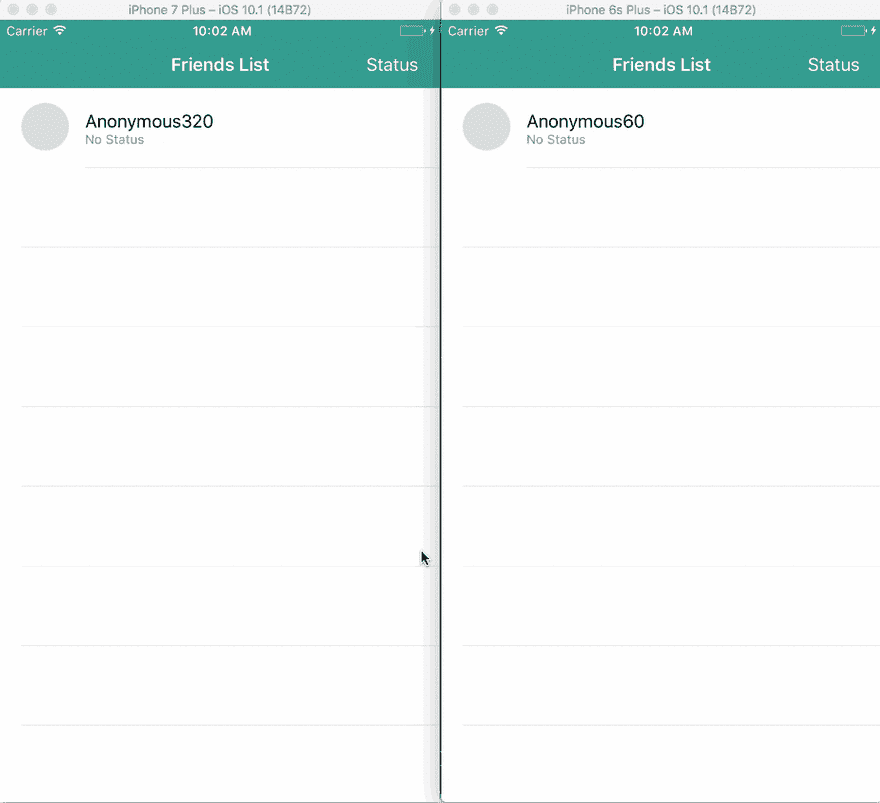
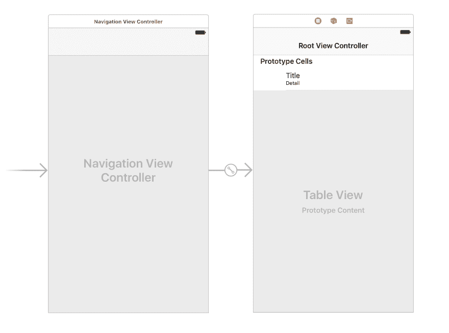
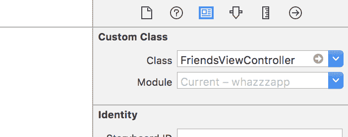
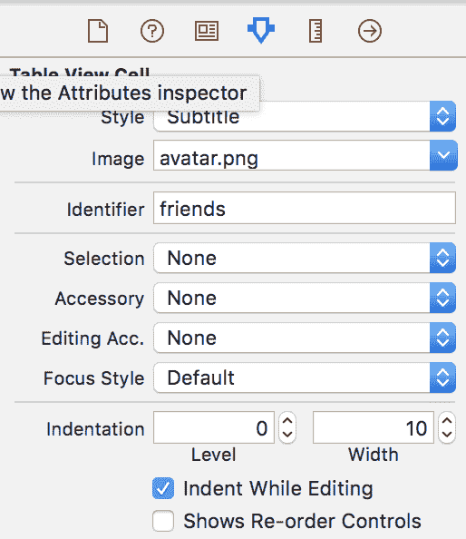

# 如何在 iOS 中建立实时用户状态更新

> 原文：<https://dev.to/neo/how-to-build-a-realtime-users-status-update-in-ios--3304>

在构建聊天应用程序时，经常会看到像朋友列表这样的带有朋友状态的东西。像 WhatsApp 这样的应用程序有这个功能，它非常有用，可以检查你朋友的状态，并知道在那个时候给他们发消息是否明智。

我们将在一个虚构的 iOS 聊天应用程序中构建一个类似的功能。我们将使用 [Pusher](https://pusher.com) 来实现应用程序的实时功能，这样当有人发布新的状态更新时，你可以实时看到它的变化。

这是一个屏幕记录，显示了我们完成后应用程序的外观。

[T2】](https://res.cloudinary.com/practicaldev/image/fetch/s--jgMH7fVa--/c_limit%2Cf_auto%2Cfl_progressive%2Cq_66%2Cw_880/https://blog.pusher.com/wp-content/uploads/2017/10/realtime-status-update-ios-1.gif)

要跟随这篇文章，你必须具备以下要求:
——Swift 3
的一些知识——如何使用 Xcode
的知识——基本的 JavaScript 知识
——[NPM](https://www.npmjs.com/get-npm)和[你机器上安装的 CocoaPods](https://guides.cocoapods.org/using/getting-started.html) 。
–终端(命令行)基础知识
–推送应用程序(您将需要应用程序的 ID、密码、密钥和集群)。[如果您目前没有账户，请创建一个推送账户](https://pusher.com)。

## 准备好我们的项目

首先，我们需要创建 iOS 项目，然后安装一些应用程序正常运行所需的依赖项。让我们开始吧。

**在 Xcode 中设置我们的项目**
在你的机器上启动 Xcode，创建一个新项目。创建一个单独的应用程序项目，并按照向导进行操作，直到到达主故事板。一旦你到达那里，退出 Xcode。

在您的终端中，`cd`到 Xcode 项目目录，然后运行下面的命令:

```
 $ pod init 
```

Enter fullscreen mode Exit fullscreen mode

这将在应用程序的根目录下创建一个`Podfile`。Podfile 是我们定义 Cocoapods 依赖项的地方。在您的文本编辑器中打开，并替换为以下内容:

```
 platform :ios, '8.4'

    target 'project_name' do
      use_frameworks!
      pod 'PusherSwift', '~> 4.0'
      pod 'Alamofire', '~> 4.4'
    end 
```

Enter fullscreen mode Exit fullscreen mode

在上面，我们已经指定了我们希望 CocoaPods 安装到我们的应用程序中的依赖项。不要忘记用*项目名称*替换您的实际项目名称。

现在转到终端并运行命令:

```
 $ pod install 
```

Enter fullscreen mode Exit fullscreen mode

这将安装我们在`Podfile`中指定的所有依赖项和库。太好了！最后，打开项目目录，双击目录中的`.xcworkspace`文件，在 Xcode 中启动您的项目工作区。

## 创建实时 iOS 应用程序的用户界面

现在我们已经在 Xcode 中创建了项目并成功安装了所有的依赖项，接下来我们要做的是创建 iOS 应用程序的用户界面。在 Xcode 中打开`main.storyboard`文件，让我们开始设计 UI。

这是我们希望在本节末尾看到的内容:

[T2】](https://res.cloudinary.com/practicaldev/image/fetch/s--r5R_tzfm--/c_limit%2Cf_auto%2Cfl_progressive%2Cq_auto%2Cw_880/https://blog.pusher.com/wp-content/uploads/2017/10/realtime-status-update-ios-2.png)

在画布中添加一个导航控制器，并使其成为根视图控制器。完成这些后，您需要更新导航控制器附带的`TableViewController`。

首先，使用`ctrl+n`在 Xcode 中创建新类；类名应该是`FriendsViewController`，并且应该扩展`UITableViewController`。然后，在`main.storyboard`文件中，确保让`TableViewController`使用`FriendsViewController`作为它的定制类。

[T2】](https://res.cloudinary.com/practicaldev/image/fetch/s--64dIbpA0--/c_limit%2Cf_auto%2Cfl_progressive%2Cq_auto%2Cw_880/https://blog.pusher.com/wp-content/uploads/2017/10/realtime-status-update-ios-3.png)

**配置原型单元**
现在我们已经创建了表格视图控制器，我们需要配置它的单元来匹配我们想要实现的目标。

点击主故事板文件上的“原型单元”,让属性检查器看起来像下图一样。

> 💡**对于图像** `**avatar.png**` **，您可以将 45×45 像素的图像添加到您的 Xcode 项目中，并将其用作单元格的图像。**

[T2】](https://res.cloudinary.com/practicaldev/image/fetch/s--guocYW9O--/c_limit%2Cf_auto%2Cfl_progressive%2Cq_auto%2Cw_880/https://blog.pusher.com/wp-content/uploads/2017/10/realtime-status-update-ios-4.png)

我们能做的最后一件事(这是完全可选的)是改变应用程序的导航栏颜色。就这么办吧。

打开`AppDelegate`类并在`application(_ application: UIApplication, didFinishLaunchingWithOptions launchOptions: [UIApplicationLaunchOptionsKey: Any]?)`方法中粘贴以下内容:

```
 UINavigationBar.appearance().barTintColor = UIColor(red: 18.0/255.0, green: 140.0/255.0, blue: 126.0/255.0, alpha: 1.0)
    UINavigationBar.appearance().tintColor = UIColor.white
    UINavigationBar.appearance().titleTextAttributes = [NSForegroundColorAttributeName: UIColor.white] 
```

Enter fullscreen mode Exit fullscreen mode

至此，您已经完成了应用程序 UI 的创建，剩下的就是支持它的功能了。让我们现在就这样做。

## 创建实时 iOS 应用程序的功能

对于功能，我们将它分为两部分。第一部分将着重于添加更新状态的功能，第二部分将着重于实时更新。

**创建初始功能:U * * * * pdate****status**
打开`FriendsViewController`进行一些修改。第一个修改是在导航栏的右上角添加一个更新“状态”按钮。

在控制器的`viewDidLoad`方法中，添加下面的代码:

```
 navigationItem.title = "Friends List"
    navigationItem.rightBarButtonItem = UIBarButtonItem(
        title: "Status",
        style: .plain,
        target: self,
        action: #selector(showPopup(_:))
    ) 
```

Enter fullscreen mode Exit fullscreen mode

上面的代码只是在导航栏中设置了控制器的标题，并在导航栏的右侧添加了一个按钮。

如果你注意到了，在`action`参数中，它指向一个方法`showPopup`,所以让我们创建这个方法。将此方法添加到控制器:

```
 public func showPopup(_ sender: Any) {
        let alertController = UIAlertController(
            title: "Update your status",
            message: "What would you like your status to say?",
            preferredStyle: .alert
        )

        alertController.addTextField(configurationHandler: {(_ textField: UITextField) -> Void in
            textField.placeholder = "Status"
        })

        alertController.addAction(UIAlertAction(title: "Update", style: .default, handler: {(_ action: UIAlertAction) -> Void in
            let status = (alertController.textFields?[0].text)! as String
            self.postStatusUpdate(message: status)
        }))

        alertController.addAction(UIAlertAction(title: "Cancel", style: .cancel, handler: nil))

        present(alertController, animated: true, completion: nil)
    } 
```

Enter fullscreen mode Exit fullscreen mode

所以我们在这里做的是，当动作被调用并且`showPopup`方法被调用时，应用程序将显示一个弹出框，要求用户输入他们的状态。

现在，弹出窗口调用一个在我们的应用程序中不存在的方法`postStatusUpdate`。现在让我们创建这个方法。

在视图控制器中，添加下面的方法:

```
 public func postStatusUpdate(message: String) {
        let params: Parameters = ["username": username, "status": message]

        Alamofire.request(FriendsViewController.API_ENDPOINT + "/status", method: .post, parameters: params).validate().responseJSON { response in
            switch response.result {

            case .success:
                _ = "Updated"
            case .failure(let error):
                print(error)
            }
        }
    } 
```

Enter fullscreen mode Exit fullscreen mode

在这个方法中，我们使用`Alamofire`库向端点`FriendsViewController.API_ENDPOINT + "/status` `"`(尚不存在)发出请求。现在，因为我们还没有导入 Alamofire 库，也没有定义`FriendsViewController.API_ENDPOINT`，我们将会得到错误。

在视图控制器的顶部，导入`Alamofire`库:

```
 import 'Alamofire' 
```

Enter fullscreen mode Exit fullscreen mode

同样，在类内部，在类定义之后，添加下面的代码来声明指向远程 HTTP 服务器的`API_ENDPOINT`。

```
 static let API_ENDPOINT = "http://localhost:4000"; 
```

Enter fullscreen mode Exit fullscreen mode

> 💡**我们现在使用的端点是一个本地服务器，它将在本文后面创建。如果您使用远程服务器，您将需要用您的服务器的 URL 替换这个值。**

所以，现在，当你运行应用程序，点击“状态”按钮，它会弹出一个窗口，你可以输入你的更新。但是，因为我们还没有创建一个后端来响应这个调用，所以它将失败并且不做任何事情。我们将在本文的后面讨论这个问题。

**更新默认的表格视图控制器方法**
表格视图控制器默认带有一些方法，我们将快速修改它们以适应我们的应用。

打开视图控制器并更新方法`numberOfSections`。使返回值为 1。这将确保显示第一个也是唯一的部分。

接下来，更新`tableView(tableView: UITableView, numberOfRowsInSection: section)`方法，使返回值`friends.count`。这将确保为`friends`列表中的每个条目创建正确数量的行。

为了让单元格显示每个朋友的详细信息，用下面的代码更新`tableView(tableView:UITableView, cellForRowAt indexPath:IndexPath)`方法的内容:

```
 let cell = tableView.dequeueReusableCell(withIdentifier: "friends", for: indexPath)

    var status   = friends[indexPath.row]["status"]

    if status == "" {
        status = "User has not updated status!"
    }

    cell.detailTextLabel?.textColor = UIColor.gray

    cell.imageView?.image = UIImage(named: "avatar.png")
    cell.textLabel?.text = friends[indexPath.row]["username"]
    cell.detailTextLabel?.text = status

    return cell 
```

Enter fullscreen mode Exit fullscreen mode

上面的代码只是获取当前单元格，并用状态、用户名和图像更新所需的单元格标签(以防您想要添加另一个图像)。

最后，给视图控制器添加一个新方法:

```
 override func tableView(_ tableView: UITableView, heightForRowAt indexPath: IndexPath) -> CGFloat {
        return 75.0
    } 
```

Enter fullscreen mode Exit fullscreen mode

这只会将表格的行高增加到等于 **75.0** 。这将使它更容易容纳细胞的内容。

## 使用 Pusher 向我们的 iOS 应用程序添加实时更新状态

现在，在我们使用 Pusher 添加实时在线状态更新之前，我们想要添加一些伪朋友列表。

我们将使用 Pusher 进行好友列表。我们将通过创建一个不持久的类属性来实现这一点，在这个变量中，我们将存储任何在线用户的详细信息。

**添加伪好友列表**
在视图控制器中，添加一些新属性:

```
 var friends : [[String:String]] = []
    var username : String = ""
    var pusher : Pusher! 
```

Enter fullscreen mode Exit fullscreen mode

属性`friends`将存储所有在线的用户，`username`属性将存储当前用户的随机用户名，`pusher`属性将存储 Pusher 库实例。

现在，在`viewDidLoad`方法中，添加以下代码:

```
 username = "Anonymous" + String(Int(arc4random_uniform(1000)))

    listenForRealtimeEvents()

    // --- Update online presence at intervals --- //
    let date = Date().addingTimeInterval(0)
    let timer = Timer(fireAt: date, interval: 1, target: self, selector: #selector(postOnlinePresence), userInfo: nil, repeats: true)
    RunLoop.main.add(timer, forMode: RunLoopMode.commonModes) 
```

Enter fullscreen mode Exit fullscreen mode

在第 1 行，我们只是给`username`属性分配了一个随机字符串作为用户名。

在第 3 行，我们调用了一个尚不存在的方法`listenForRealtimeEvents`(我们将在后面创建它)。

在第 6–8 行，我们基本上只是添加了一个对`postOnlinePresence`(还不存在)的循环调用。这通电话基本上会每秒更新一次你的在线状态。

现在让我们创建`listenForRealtimeEvents`方法。将以下代码添加到视图控制器中:

```
 private func listenForRealtimeEvents() {
        pusher = Pusher(key: "PUSHER_KEY", options: PusherClientOptions(host: .cluster("PUSHER_CLUSTER")))

        let channel = pusher.subscribe("new_status")
        let _ = channel.bind(eventName: "online", callback: { (data: Any?) -> Void in
            if let data = data as? [String: AnyObject] {
                let username = data["username"] as! String

                let index = self.friends.index(where: { $0["username"] == username })

                if username != self.username && index == nil {
                    self.friends.append(["username": username, "status": "No Status"])
                    self.tableView.reloadData()
                }
            }
        })

        pusher.connect()
    } 
```

Enter fullscreen mode Exit fullscreen mode

在我们刚刚创建的方法中，我们用 Pusher 键和应用程序集群实例化了 Pusher 库。然后我们订阅了一个名为 **new_status** 的推送频道，在那个频道上，我们开始在线收听名为**的事件。**

在回调中，当事件监听器被触发时，我们从事件中获取用户名。然后我们检查在列表`friends`中是否有匹配的用户名。如果没有，我们将它添加到朋友列表中，并重新加载表数据。

因此，总的来说，每当有人上线时，它会将名字添加到好友列表中，并重新加载表格视图。

接下来，我们将创建方法`postOnlinePresence`,该方法将定期发布当前用户的在线状态，以便其他人可以获取。在视图控制器中添加下面的代码:

```
 public func postOnlinePresence() {
        let params: Parameters = ["username": username]

        Alamofire.request(FriendsViewController.API_ENDPOINT + "/online", method: .post, parameters: params).validate().responseJSON { response in
            switch response.result {

            case .success:
                _ = "Online"
            case .failure(let error):
                print(error)
            }
        }
    } 
```

Enter fullscreen mode Exit fullscreen mode

上面的代码只是点击了一个端点，从而将用户标记为在线。

使用 Pusher 向应用程序添加状态更新
我们的 iOS 应用程序的最后一部分是添加更新监听器，这样每当有人更新他们的状态时，更新就会被添加。

为此，打开`listenForRealtimeEvents`方法，并在实例化 pusher 变量后添加以下内容:

```
 let channel = pusher.subscribe("new_status")
    let _ = channel.bind(eventName: "update", callback: { (data: Any?) -> Void in
        if let data = data as? [String: AnyObject] {
            let username = data["username"] as! String

            let status = data["status"] as! String

            let index = self.friends.index(where: { $0["username"] == username })

            if index != nil {
                self.friends[index!]["status"] = status
                self.tableView.reloadData()
            }
        }
    }) 
```

Enter fullscreen mode Exit fullscreen mode

上面的代码为 **new_status** 通道的 **update** 事件创建了一个监听器。当事件被触发时，回调检查用户名是否是好友列表的一部分。如果是，它将更新该项的状态并重新加载表视图数据。

现在，我们已经成功地将实时特性添加到了我们的应用程序中。接下来我们要做的是创建一个后端来帮助我们实际触发推送事件，这些事件可以被我们的 iOS 应用程序获取。

## 为我们的实时 iOS 状态更新应用程序创建 NodeJS 后端

为 web 应用程序创建一个目录，然后创建一些新文件:

```
**index.js**

    // ------------------------------------------------------
    // Import all required packages and files
    // ------------------------------------------------------

    let Pusher     = require('pusher');
    let express    = require('express');
    let app        = express();
    let bodyParser = require('body-parser')

    let pusher     = new Pusher(require('./config.js'));

    // ------------------------------------------------------
    // Set up Express middlewares
    // ------------------------------------------------------

    app.use(bodyParser.json());
    app.use(bodyParser.urlencoded({ extended: false }));

    // ------------------------------------------------------
    // Define routes and logic
    // ------------------------------------------------------

    app.post('/status', (req, res, next) => {
      let payload = {username: req.body.username, status: req.body.status};
      pusher.trigger('new_status', 'update', payload);
      res.json({success: 200});
    });

    app.post('/online', (req, res, next) => {
      let payload = {username: req.body.username};
      pusher.trigger('new_status', 'online', payload);
      res.json({success: 200});
    });

    app.get('/', (req, res) => {
      res.json("It works!");
    });

    // ------------------------------------------------------
    // Catch errors
    // ------------------------------------------------------

    app.use((req, res, next) => {
        let err = new Error('Not Found: ');
        err.status = 404;
        next(err);
    });

    // ------------------------------------------------------
    // Start application
    // ------------------------------------------------------

    app.listen(4000, () => console.log('App listening on port 4000!')); 
```

Enter fullscreen mode Exit fullscreen mode

在这个文件中，我们创建了一个基本的 Express 应用程序。应用程序有两个重要的端点:`POST /online`和`POST /status`。它们都用一个有效载荷触发 Pusher 事件，这个有效载荷将被我们的 iOS 应用程序中的侦听器拾取。

接下来创建 **config.js** 文件:

```
 module.exports = {
        appId: 'PUSHER_ID',
        key: 'PUSHER_KEY',
        secret: 'PUSHER_SECRET',
        cluster: 'PUSHER_CLUSTER',
    }; 
```

Enter fullscreen mode Exit fullscreen mode

这是我们的推动器配置文件。在这里，用 Pusher 仪表板中提供的凭证替换空字符串。

最后，创建一个 **package.json** 文件:

```
 {
      "main": "index.js",
      "dependencies": {
        "body-parser": "^1.16.0",
        "express": "^4.14.1",
        "pusher": "^1.5.1"
      }
    } 
```

Enter fullscreen mode Exit fullscreen mode

该文件包含节点应用程序正常运行所需的所有节点包。

最后，在节点应用程序的目录中，运行下面的命令:

```
 $ npm install && node index.js 
```

Enter fullscreen mode Exit fullscreen mode

第一个命令将安装所有的依赖项，第二个命令将在 node 中启动一个 Express 服务器。当你看到“ ***App 监听端口 4000！”**** *然后你就知道你的后端应用已经准备好了。

## 测试我们的实时状态更新应用程序

一旦您的本地节点 web 服务器开始运行，您将需要进行一些更改，以便您的应用程序可以与本地 web 服务器通信。在`info.plist`文件中，进行以下更改:

[T2】](https://res.cloudinary.com/practicaldev/image/fetch/s--YFgeqAVo--/c_limit%2Cf_auto%2Cfl_progressive%2Cq_auto%2Cw_880/https://blog.pusher.com/wp-content/uploads/2017/10/realtime-status-update-ios-5.png)

通过这一更改，您可以构建并运行您的应用程序，它将直接与您的本地 web 应用程序对话。

[T2】](https://res.cloudinary.com/practicaldev/image/fetch/s--jgMH7fVa--/c_limit%2Cf_auto%2Cfl_progressive%2Cq_66%2Cw_880/https://blog.pusher.com/wp-content/uploads/2017/10/realtime-status-update-ios-1.gif)

## 结论

在这篇文章中，我们已经能够创建一个具有实时用户状态更新的 iOS 应用程序，类似于 WhatsApp 目前所拥有的应用程序。

对文章有问题或反馈吗？请在评论区下面提问。应用程序和节点后端的存储库可以在 [Github](https://github.com/neoighodaro/realtime-ios-status-update) 上获得。

这篇文章最初出现在 [Pusher 博客](https://blog.pusher.com/how-to-build-a-realtime-users-status-update-in-ios/)上。