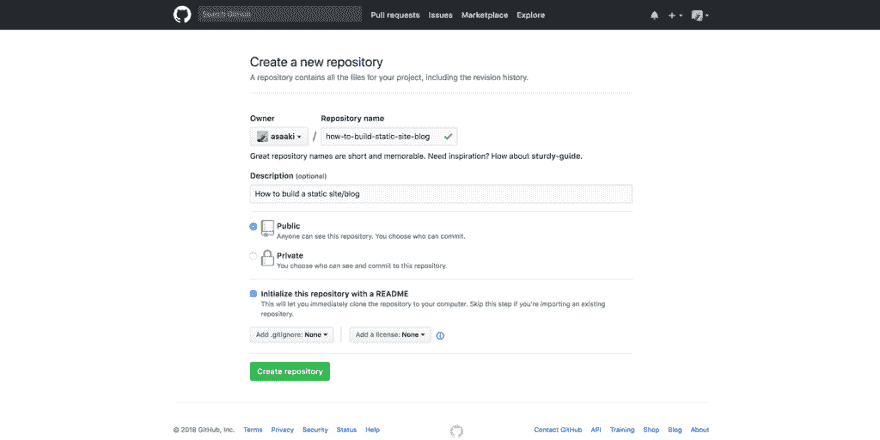
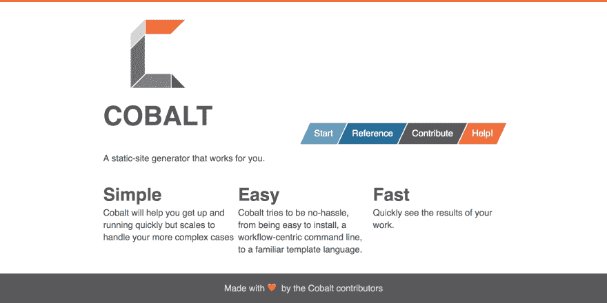
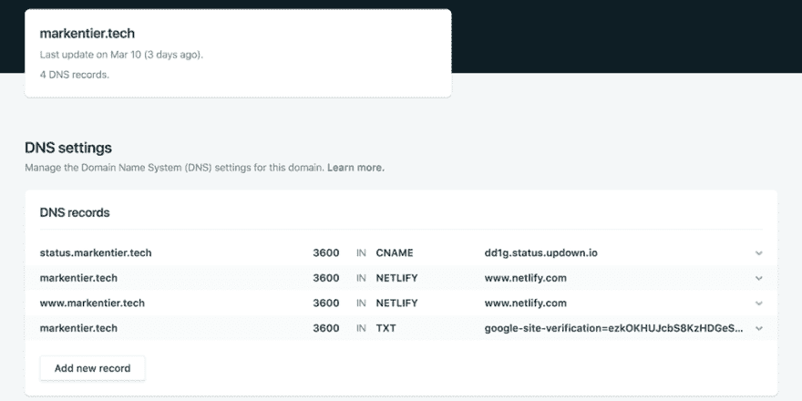
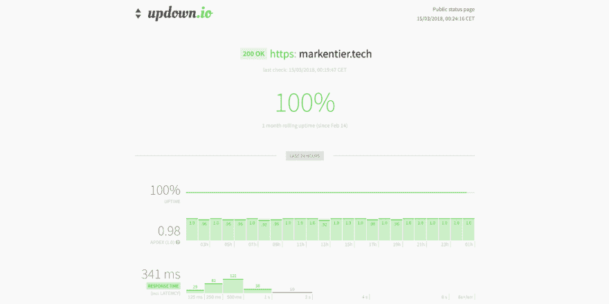

# 如何建立一个静态网站/博客

> 原文：<https://dev.to/asaaki/how-to-build-a-static-siteblog--29lb>

对我之前的帖子[推送、冲洗、重复……](https://markentier.tech/posts/2018/03/push-rinse-repeat/)的评论让我想到，你可能想知道这个博客是如何构建和部署的。

这个网站([如果你在它的规范位置](https://markentier.tech/posts/2018/03/how-to-build-static-site-blog/)阅读这篇博文)是刚刚孵化的。我意识到我用了一些人们可能还不熟悉的东西。

虽然一切仍在进行中，但让它启动和运行的繁重工作已经完成，我想我也许可以给你一些关于它是如何制作的见解。

在本文中，我们将了解如何用 GitHub 资源库引导静态站点或博客，用 cobalt.rs 填充它，在 netlify 上部署，使用自己的域，让它接受 DNS 管理，并通过 Let's Encrypt (https！).还包括了关于通过 updown.io 进行状态监控的最后一点说明。

听起来很刺激？然后继续读。当心长篇阅读，它可能不是你典型的操作指南，它更像是一次旅行。

### 黑暗笼罩了深渊的表面

第一步是要有一个你为什么想建一个网站或博客的理由，但是我假设你已经找到了你的理由，只是迫不及待地想把你的想法公之于众。

因此，特别是精通技术的人喜欢建立或运行自己的东西。一个托管的博客和在你自己的服务器上运行的东西中间可能使用一些托管服务，而不依赖于托管提供商的软件。像 WordPress 这样的工具很酷，我记得它们对初学者很友好，对不太懂技术的人也是如此，但是——不管你的实际背景和知识如何——你可能已经得出结论，你真的想探索拥有更多构建和运行方面的领域。你可能不需要一个完全成熟的软件，甚至可能不需要什么动态特性(使它在抵御黑客攻击时更安全)，或者你只是对它们提供的东西不满意。但从头开始编写自己的 CMS 或博客引擎也是许多开发人员尝试过的，但最终放弃了这个想法，或者用更好的项目取代了这个想法。我一直想开发这样的软件，但是却失去了继续下去的兴趣和动力。静态网站通常很好地服务于我的目的。

### 你的一切都是属于我们的

不管怎样，我迷失在自己的思想中，但你想读的是指南，而不是我的历史和推理。至少我可以把这个留到以后的文章中。

所以，第一件事是:**我想如何存储我的数据(内容和网站内容)以及在哪里存储，我想使用哪个工具来构建和管理？**

如今，GitHub 库似乎是最受欢迎的选择。您可以使用替代服务，甚至是完全不同的版本控制系统。Git 非常受欢迎，当你遇到困难时，你会在那里找到很多帮助。

[T2】](https://res.cloudinary.com/practicaldev/image/fetch/s--6pR906HM--/c_limit%2Cf_auto%2Cfl_progressive%2Cq_auto%2Cw_880/https://markentier.tech/posts/2018/03/how-to_new-github-repo.png)

因为我们想要建立一个静态站点，我们需要一个工具来帮助我们。当然，你可以手工编写和维护所有的东西，但是你会被它弄得筋疲力尽。

### 发电机，发电机，发电机！

所以自然有大量的静态站点生成器存在，因为很多人都有同样的感觉。他们中的许多人开发了应用程序来帮助我们。

我选择了[钴](https://cobalt-org.github.io/)，因为我想更多地学习和使用 Rust。如果你不太喜欢这种冒险，那么下面的工具也可以做到: *Jekyll、Hugo、OctoPress、Gatsby、Middleman……*(查看[https://www.staticgen.com/](https://www.staticgen.com/)获得更完整的可用静态站点生成器列表)。Jekyll 很特别，因为它也受 GitHub Pages 的支持，这是部署静态站点的另一种选择。

[T2】](https://res.cloudinary.com/practicaldev/image/fetch/s--rlYKQlQS--/c_limit%2Cf_auto%2Cfl_progressive%2Cq_auto%2Cw_880/https://markentier.tech/posts/2018/03/how-to_cobalt-org.png)

在你新克隆的、可能仍然非常空的存储库中，你运行类似于`cobalt init`(或者你的工具需要的任何东西)并开始从零碎的部分创建一个网站的繁重工作。你可能已经花了几个小时甚至几天来建设网站，因为布局和设计是一个永无止境的故事。但是还需要写页面和帖子，这也需要一些时间。

### `</head><body>`

当然，你可以从简单开始。它不需要从一开始就像素完美。看看这篇文章，它可能看起来有点粗糙和尖锐(取决于你什么时候会发现这篇文章)。

无论如何，让我们假设你已经学习了一些关于网页设计和写作的课程。因此，不要忘记将您的更改提交到您的 GitHub 存储库中。经常做这件事。您的计算机现在可能存储了所有内容，但是从长远来看它并不可靠，而且您也不想部署您的计算机。构建家庭服务器是一个完全不同的故事。

所以，你建，写，推。现在我们来看看 2018 的妙处:让它自动发布你的站点，并将其公之于众！

### 趁热发布吧

我发现 [netlify](https://www.netlify.com/) 只是因为我们在工作中使用并支持它([心满意足](https://www.contentful.com/))，通过谷歌搜索这篇文章，我找到了一些资源，如果你对它感兴趣的话:

*   [https://www . gatsbyjs . org/blog/2017-12-06-Gatsby-plus-content ful-plus-netlify/](https://www.gatsbyjs.org/blog/2017-12-06-gatsby-plus-contentful-plus-netlify/)
*   https://dev . to/milkstarz/contentful-and-netlify-the-dynamic-duo-of-static-site-management-55i
*   [https://www.smcculloch.com/code/netlify-contentful-jamstack](https://www.smcculloch.com/code/netlify-contentful-jamstack)
*   [https://www . netlify . com/blog/2017/07/06/content ful-an-API-first-CMS/](https://www.netlify.com/blog/2017/07/06/contentful-an-api-first-cms/)

因为我不是从一个有内容支持的方法开始，所以我不会深入研究它。我现在把广告留给我们的传道者。:-)

最初我真的认为 GitHub 页面已经可以了，但 netlify 附带了一些我不想错过的电池，最大的一个是基于 SSL/TLS 证书的[让我们加密](https://letsencrypt.org/)，这样我就可以一直获得`https`，而不必考虑将来的更新。如果你不仅有自己的域名，而且还可以这样配置，让 netlify 管理你的 DNS 设置，这样做效果最好(我认为这是为了更好地管理子域和加强它们之间的 https 也许可以在你的 DNS 提供商那里完成，但是，嘿，让我们试一试，看看 netlify 如何处理它。

[T2】](https://res.cloudinary.com/practicaldev/image/fetch/s--ogcXNthZ--/c_limit%2Cf_auto%2Cfl_progressive%2Cq_auto%2Cw_880/https://markentier.tech/posts/2018/03/how-to_netlify-dns.png)

另一个很酷的特性是，您可以使用 GitHub 的 pull 请求(以及一般的分支)来获得预览部署。因此，您不仅可以在本地机器上检查您的更改，还可以让其他人看到事情将会是什么样子(这对团队和协作来说非常好)。事实上，我在这篇博文中使用了这个，所以我可以测试这个机会。另一个小小的好处是，你可以使用在线验证器(像 HTML 的[https://validator.w3.org/nu/](https://validator.w3.org/nu/))并在问题进入你的生产网站之前解决它们。听起来很酷，他？

嘿，网络生活的人们，当你偶然读到这封信时，你可以给我的贝宝账户捐一点钱，作为我的广告费用。

即使没有领域的东西，设置 netlify 也很容易。将它指向您的存储库，并可能定义应该运行什么(支持的)工具。由于`cobalt`还没有被广泛使用，我已经把我生成的站点和 repo 一起发布了，所以我只需要告诉 netlify 使用哪个文件夹。如果你采用全手工方式，手工制作你的页面，情况也是如此。

Netlify 提供了更多的东西，我还没有使用。你应该自己去发现它们的特征。对于有客户的站点，以及您试图将他们拖到 CTA(行动号召)的站点，分割测试可能会很有意思。如果您想获得反馈或收集其他数据，表单处理可能很好。

### 喂，作者，你要去哪里？

抱歉。您想知道用 netlify 部署您的站点有多困难。

我不得不让你失望了。一旦你设置了你的回购，分行和可选配置，你就差不多完成了。您可以手动触发部署，也可以将更改推送到之前配置的分支。您等待几秒钟(第一次部署可能需要稍微长一点的时间)，然后检查您的站点是否启动并运行。

我是认真的，它是如此简单，以至于任何操作方法都比他们界面中的逐步指导要复杂和冗长。试试看。

如果你真的卡住了，那么他们的帮助页面应该做剩下的事情。我想使用和尝试的所有东西都在 netlify 的文档中提供。最后，部署一个静态站点应该没那么神奇。

### 信任好，控制好

我知道没有完美的 100%正常运行时间。通常没问题。最好通知你一下。当然是独立的。虽然你可以使用 pingdom 等知名服务，但我使用的是 [updown.io](https://updown.io/) ，这不是免费的，但通过首次注册，你将获得足够的积分来长期监控一个网站。如果你觉得真的不值得，换一个正常运行时间监控方案。

我喜欢 updown 的一点是，他们提供了一个简单的状态页面，你可以通过你控制的子域来展示。对于这篇博客，你可以在[https://status.markentier.tech/](https://status.markentier.tech/)下查看:

[T2】](https://res.cloudinary.com/practicaldev/image/fetch/s--MRsTNAP---/c_limit%2Cf_auto%2Cfl_progressive%2Cq_auto%2Cw_880/https://markentier.tech/posts/2018/03/how-to_updown-monitoring.png)

这就是我今天的全部内容。

希望这篇文章对你们任何人都有用。如果你想给出反馈，有问题或建议，你通常可以在 Twitter 上找到我:[https://twitter.com/asaaki](https://twitter.com/asaaki)—再见！👋🏽

* * *

*最初发表于 2018-03-15[marken tier . tech](https://markentier.tech)的[如何建立一个静态网站/博客](https://markentier.tech/posts/2018/03/how-to-build-static-site-blog/)。*