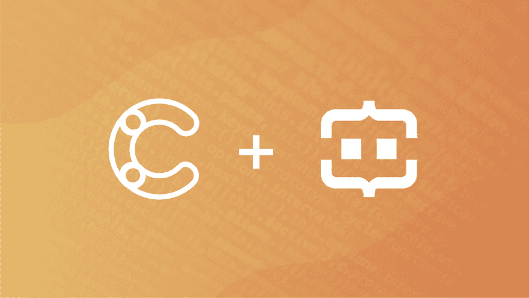
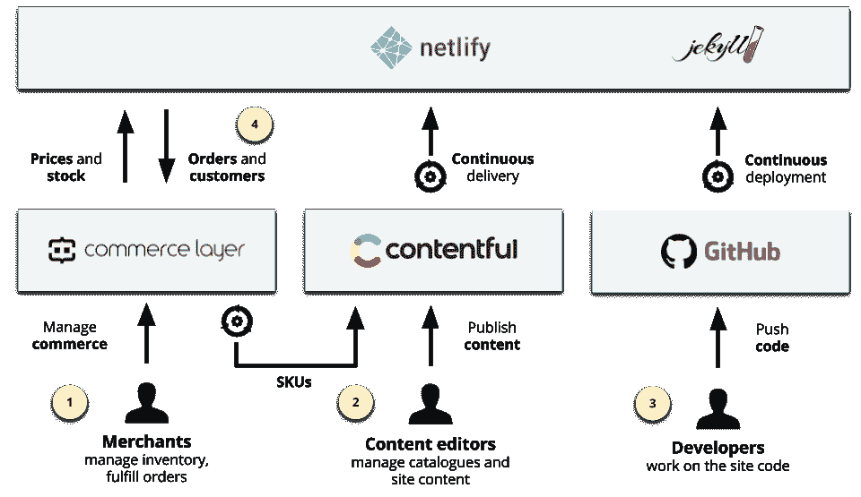
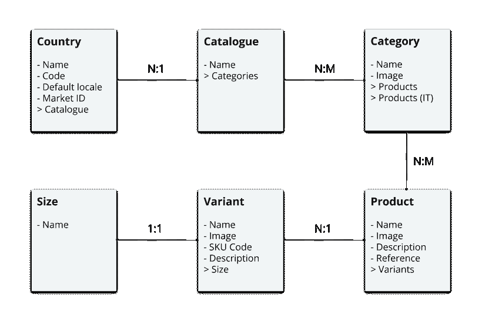
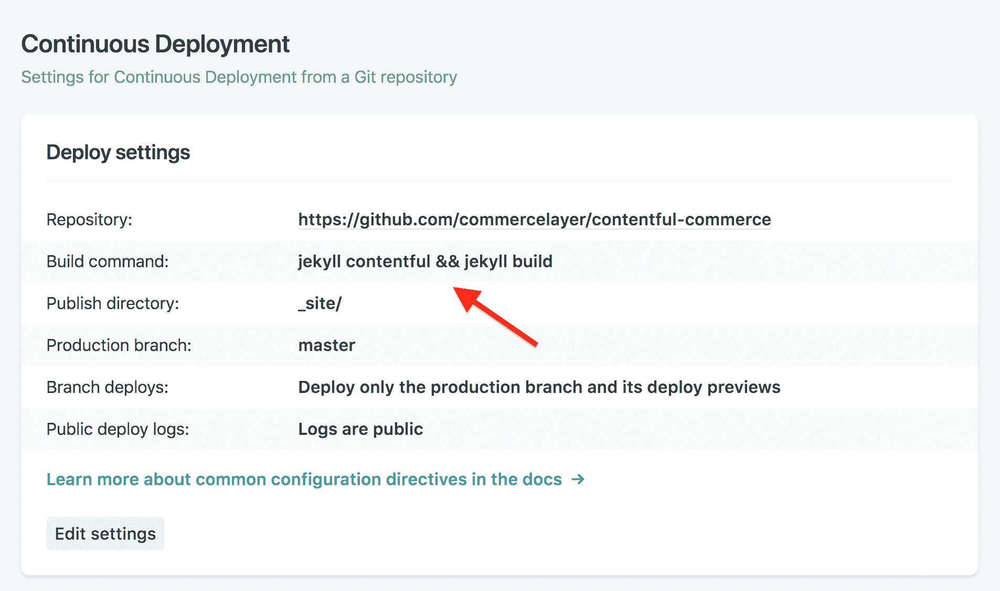
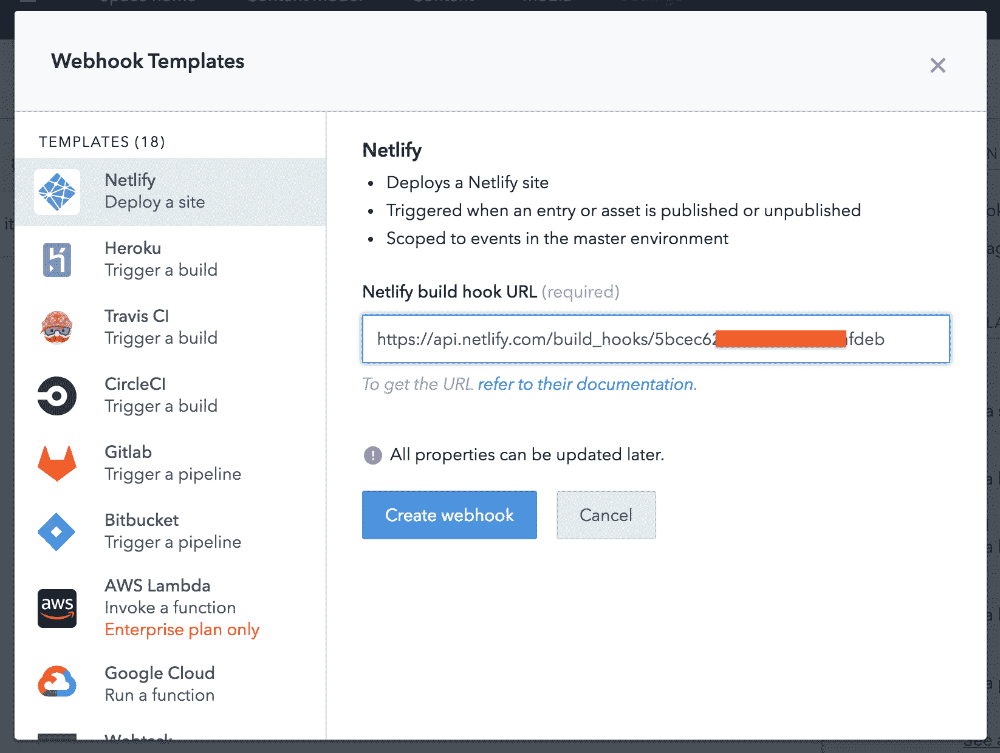
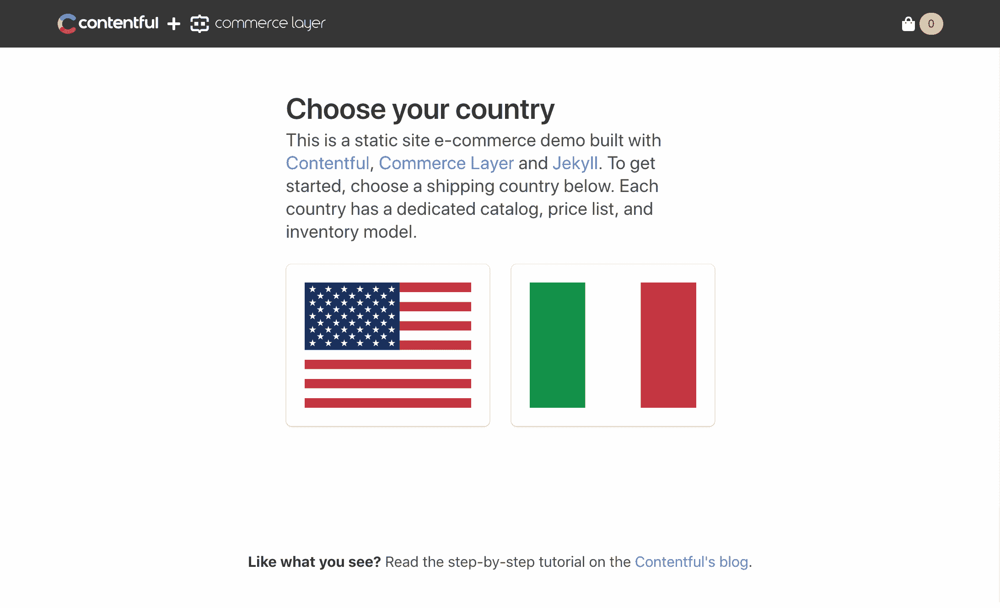
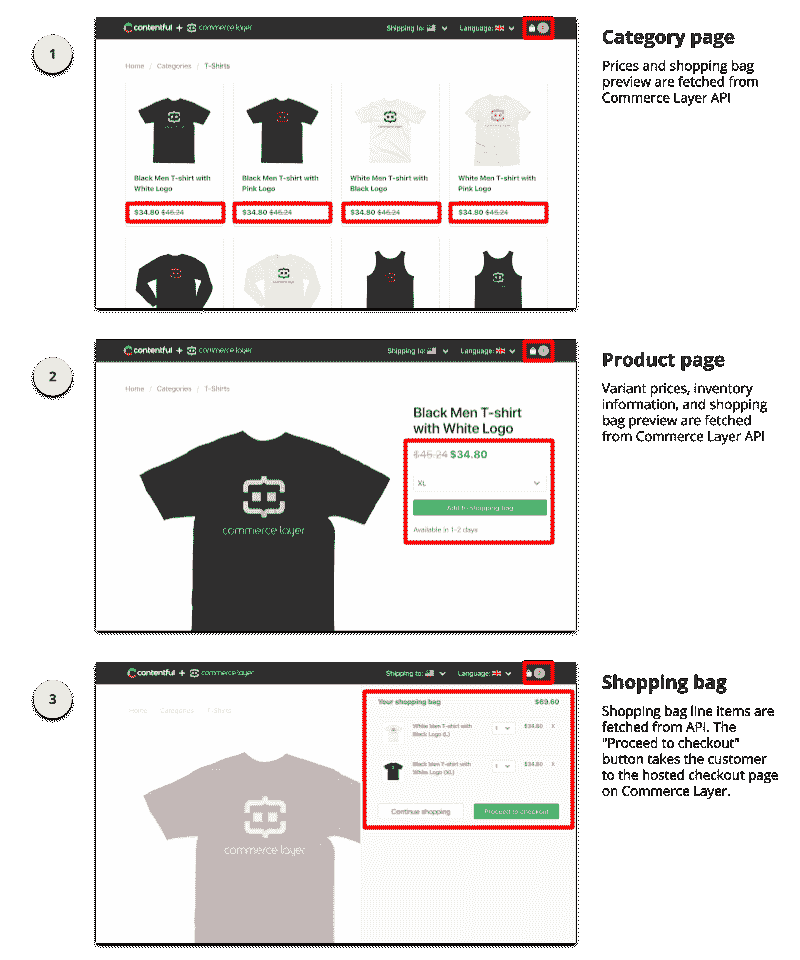
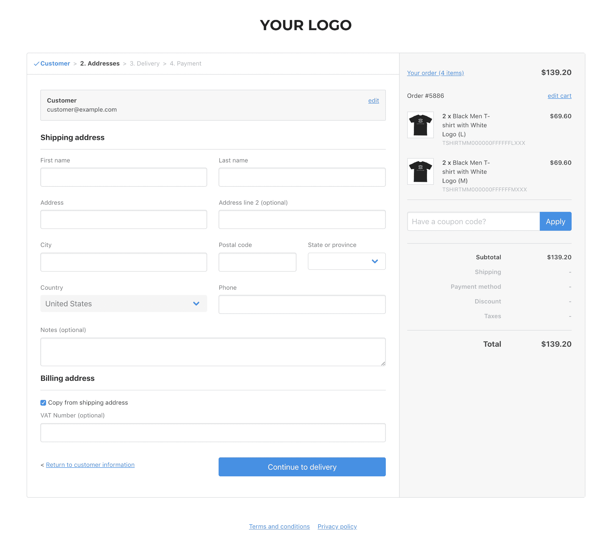

# 如何用 Jekyll、Contentful 和 commerce 层构建一个电子商务静态站点

> 原文：<https://dev.to/contentful_blog/how-to-build-an-ecommerce-static-site-with-jekyll-contentful-and-commerce-layer-3c9>

[T2】](https://res.cloudinary.com/practicaldev/image/fetch/s--rW3_ZSXb--/c_limit%2Cf_auto%2Cfl_progressive%2Cq_auto%2Cw_880/https://images.ctfassets.net/fo9twyrwpveg/2djFApVtJu0Ew04oeui0io/d33c6f485351320ba208ad1488caed70/20181106_Commerce_layer-01.png)

有大量的指南展示了如何为基本的电子商务商店使用静态站点生成器(SSG)——其中大多数使用 [Snipcart](https://www.contentful.com/blog/2016/02/10/snipcart-middleman-contentful/?utm_campaign=static-site-jekyll-contentful-commerce-layer&utm_medium=referral&utm_source=devto&utm_content=static-site-jekyll-contentful-commerce-layer&utm_term=) 将购物车功能添加到简单的产品目录中。

问题是:静态网站也是企业级电子商务的好选择吗？

我们肯定是这样认为的，本教程旨在证明这一点。

## 关于本教程

通过阅读本指南，您将学习如何构建一个具有企业级功能的静态电子商务网站。最终的[演示网站](https://contentful-commerce.netlify.com/)将是一个多国、多语言的在线商店，具有以下特征:

*   每个国家都有自己的产品目录，包括定制产品选择和分类
*   每个国家都将有自己的本币价格表
*   每个国家都有自己的库存从多个仓库发货

我们将把重点放在网站架构和开发工作流程上，而不是深入技术细节。在了解大背景之后，我们建议您探索源代码，并遵循 [GitHub](https://github.com/commercelayer/contentful-commerce) 上提供的分步指南。

## 工具

为了构建我们的演示站点，我们选择了一些最好的工具，每个工具对应一个站点架构:

*   化身为 SSG 的哲基尔
*   [内容丰富的](https://www.contentful.com/?utm_campaign=static-site-jekyll-contentful-commerce-layer&utm_medium=referral&utm_source=devto&utm_content=static-site-jekyll-contentful-commerce-layer&utm_term=)管理内容
*   [商务层](https://commercelayer.io/)作为电子商务平台
*   [GitHub](https://github.com/) 用于代码版本控制
*   [用于部署和内容交付的 Netlify](https://www.netlify.com/)

值得一提的是，我们将用 Contentful 管理所有的内容，包括产品信息、类别和目录。与传统平台不同，商业层是一个纯粹的事务引擎，将内容管理留给 CMS。这种方法让创意人员和内容编辑设计任何客户体验，而不会将他们局限于任何网站结构或模板系统。

## 架构和工作流程

下图概述了这些工具如何在整体架构中相互配合。如您所见，每个工具都专用于管道的特定步骤，为内容编辑和发布工作流做出贡献。

{:img }
[T3】](//images.ctfassets.net/fo9twyrwpveg/7wyKYa2crCCCUemOY6sMgY/c0f1164469d6846c880ae45e99af32a6/image_0.png)

让我们来看看图表的每一步:

1.  商人在商业层提供产品。SKUs 正在销售的商品——被导入 Contentful 以丰富内容。价格和股票信息不会被导入。
2.  内容编辑人员获得可用 SKU 的列表，并在 Contentful 中创建产品。他们的工作也是将产品分配给类别，将类别分配给目录，将目录分配给国家。Netlify 上的 Jekyll 站点内置了已发布的内容。
3.  开发人员负责网站结构、布局和客户端功能。代码构建在静态站点中，并部署到 Netlify。在任何 DOM 元素上使用 *data-sku-code* 数据属性，每个产品变体都标有相关的 SKU 代码。这种标记允许客户端代码与商业层 API 实时交互。每次代码发生变化，开发者都会将代码推送到 Github 进行版本控制和持续部署。
4.  客户端代码获取每个可用 SKU 的价格和库存。它还向页面添加购物车功能，并向商业层发送订单。商人通过 OMS 完成订单。新创建的 SKU 被发送到 Contentful 进行内容充实，以满足相同的工作流程。

## 内容模型

工作流程的第二步是内容编辑在 Contentful 中管理产品目录。这是决定网站如何运作的关键步骤。下图概述了我们为支持多国家、多语言结构而设计的内容模型:

{:img }
[T3】](//images.ctfassets.net/fo9twyrwpveg/1kmova7aFEcY0ciqccKi2Y/83875f4d6b9f0c779203ec106d830c12/image_1.png)

让我们描述一下每个模型、它们的角色和关系:

*   国家有一个关联的目录，并且同一个目录可以关联到多个国家。市场 ID 属性决定了该国家/地区可用的价目表、库存模型、支付方式、运输方式和促销，如商业层中所定义的。
*   目录是分类列表。这意味着每个国家都可以有自己的自定义分类类别。
*   类别可以有一个或多个国家的产品列表。每个列表都有自己的排序，这意味着同一类别可以为每个国家定制产品销售。如果内容编辑者没有为给定的国家定义任何特定的列表，将使用默认的列表。
*   产品可以有一个或多个变体。所有变体共有的所有内容都可以在产品级别定义。
*   变型是正在销售的项目。SKU 代码属性将它们链接到商业层中定义的 SKU，并使变体可购物。在我们的用例中，变体可以有一个大小。

## 连续交货

我们的静态网站电子商务由三种类型的数据组成，它们需要随着变化而更新:代码、内容和商务。

**当代码变更**时，开发者将变更推送到 Github，触发 Netlify 上的新构建。build 命令从 Contentful ( `jekyll contentful`)获取所有发布的内容，并构建静态站点(`jekyll build`)。

{:img }
[T3】](//images.ctfassets.net/fo9twyrwpveg/2CyRtcsFjekaMYYEMcsKkC/9e2c599dd9f1f63cd852834e1aa11402/image_2.png)

**当内容发生变化**时，内容编辑点击 Contentful 上的发布按钮。为了触发每个发布的新构建，我们需要在 Netlify 上创建一个构建挂钩...

{:img }
[T3】](//images.ctfassets.net/fo9twyrwpveg/6AiWsiI0ogUKGeIG8QQsEo/bde3563a6c0b2a21763eb1a34bbf4c54/image_3.png)

...并将其链接到 Contentful 上的 publish webhook:

{:img }
[T3】](//images.ctfassets.net/fo9twyrwpveg/4Ro8Wdbbzy0kaKu6SW4Yoc/ad2d0db739cf47b4846b45b308948b75/image_4.png)

**当商务发生变化**时，我们不需要触发任何新的构建，因为价格和库存是从静态网站 JavaScript 动态获取的。

## 了解动态和静态数据的混合

此时，我们拥有的是一个静态站点，其中包含基于 Contentful 中存储的内容的产品信息。为了使这个网站成为一个真正的商店，我们引入了商业层 JavaScript 库，它用商业数据丰富了 HTML。

当客户进入站点并选择送货国家时，这个包含的 JavaScript 库获得一个 OAuth2 访问令牌，将相关的市场 ID 放入请求范围。**所有后续请求的范围都是该市场**。

{:img }
[T3】](//images.ctfassets.net/fo9twyrwpveg/2KzMdAHauAQkaKYay0mWiO/6ff50dfa12cd168ca67206c5e863bba8/image_5.png)

范围内的市场决定了由商业层内的商家定义的正确的价目表、库存模型、促销、支付和运输方法。作为开发人员，您只需要使用正确的访问令牌来获取特定国家的商务数据，并让客户无误地下订单。

作为一个静态网站，所有页面都是由 Netlify CDN 提供的普通 HTML 文件。唯一的动态信息由商业层 API 提供，如下图(红框)所示，用于每个相关页面。

{:img }
[T3】](//images.ctfassets.net/fo9twyrwpveg/4qgp7K3aiscmUUaKa8u4ae/ea8763b37c1ee7cbdadf62b09de5df30/image_6.png)

如您所见，并非所有页面都需要来自商业层的相同类型的数据:

1.  对于每种产品，类别页面获取第一个变体的价格
2.  产品页面获取所选的变型价格和可用性消息
3.  购物袋是根据当前订单行项目动态构建的
4.  购物袋预览总是被填充，并且“继续结帐”按钮被链接到当前订单结帐 URL，这是订单 API 响应的一部分。

考虑到价格通常不会经常变化——除非您有一些适当的自适应定价机制——我们还可以将价格作为 YAML 文件导入 Jekyll，并利用 Commerce Layer webhooks 系统在每次价格变化时触发新的部署。

这将通过减少客户端对商业层 API 的请求数量来进一步提高网站速度。像类别概述页面一样，页面可以几乎完全是静态的(除了购物袋预览)，因为我们不需要动态获取价格。

## 下单

当顾客进行结帐时，他们被重定向到商业层托管的结帐应用程序，在那里他们可以添加所有需要的信息并下订单。

{:img }
[T3】](//images.ctfassets.net/fo9twyrwpveg/47fnE4U4esAcu8qkcu6skq/94984bd99b855bd0adc68cc78fb8e3a1/image_7.png)

这是缩短上市时间并在内容目录准备就绪后立即开始销售的最简单的解决方案。也就是说，Commerce Layer 还提供 API 来在您自己的站点上创建定制的体验。请记住，这需要我们向静态站点添加一些服务器端组件，至少要管理认证并安全地存储它的`client_secret`。

## 总结

静态网站是数据库驱动网站的一个很好的替代品。它们快速、可扩展、安全且经济高效。所有惊人的功能，可以让你的电子商务大放异彩。

在本文中，我们描述了如何结合一些最好的工具来构建静态电子商务的完美堆栈。代码、内容和商业之间关注点的分离是非常清楚的。开发者、内容编辑和商家的工作配合得非常完美。

从特性的角度来看，我们只是触及了我们能做的事情的表面。有很多很棒的服务完全适合我们的图表，使我们的静态站点更加动态。

### 下一步——通过更多服务改进功能

除了完全品牌化的结账体验，我们的静态网站电子商务还可以增加以下功能:

1.  使用类似于 [Algolia](https://www.algolia.com/) 的工具进行全文搜索和过滤
2.  客户帐户，通过商业层客户 API 访问他们的订单历史、地址簿和钱包(文件中的信用卡)。
3.  最后但同样重要的是，更好的内容。尽管我们的演示侧重于发布产品目录，但我们坚信商业应该由内容驱动。像 Commerce Layer 这样的平台提供了您自信销售产品所需的安全性、性能和灵活性。但这还不够。内容必须是创造性的，情绪化的，鼓舞人心的。通过使用 Contentful，我们可以丰富我们的内容模型并构建独特的客户之旅。随着我们的事务引擎的分类，我们可以专注于将我们的内容体验提升到一个全新的水平。