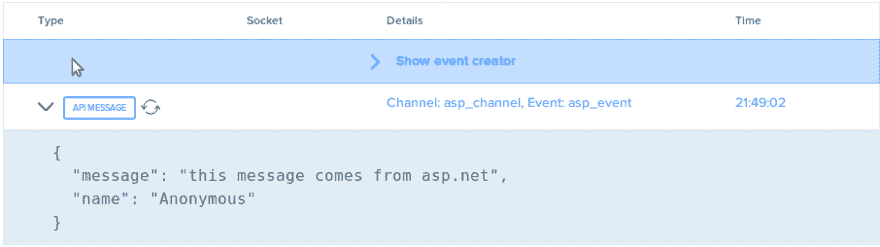
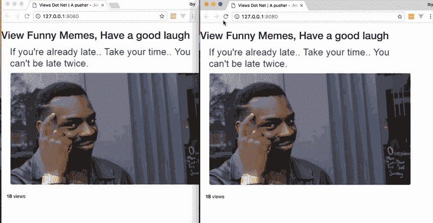

# 如何用 NET 和 Pusher 建立在线实时计数器

> 原文：<https://dev.to/neo/how-to-build-an-online-realtime-counter-using-net-and-pusher-14dh>

网站和应用程序的常见做法是让查看者知道有多少其他人与相同的内容进行了交互，例如[Y](https://www.youtube.com/watch?v=Qoti7G-tjN8)[ou](https://www.youtube.com/watch?v=Qoti7G-tjN8)[T](https://www.youtube.com/watch?v=Qoti7G-tjN8)T6】ube 视频。显示这些信息的做法强调了资源的相关性，并吸引了更多的注意力。

在本教程中，我们将通过显示单页网站的访问量来模拟这种做法。我们将使用 C 夏普，简称 C#作为我们的服务器端语言与 ASP.NET MVC 来建立我们的网页和 Pusher 提供实时更新的网页访问。

在中构建实时计数器的要求。NET 有:
–c#
入门知识–ASP.NET MVC
–JavaScript 和 jQuery

我们开始吧！

## 为我们的实时计数器构建前端。网

首先，让我们启动 Visual Studio
在本教程中，我们将使用 Visual Studio。这是一个使 ASP.NET 开发更加容易和快速的 IDE。Visual Studio 2017 是免费的，可用于普遍使用的操作系统。你可以在这里找到安装细节[。](https://www.visualstudio.com/)

**创建我们的新项目**
我们将通过单击 Visual Studio 仪表板上的**新项目**来启动一个新项目。按照 GUI 提示(按此顺序),我们:

*   将 C#设置为要使用的语言
*   选择 ASP.NET MVC 项目作为模板
*   包含一个单元测试项目(这是可选的，可以不勾选)
*   填写项目名称，例如 Notif(任何名称都可以)
*   填写解决方案名称，即应用程序名称(任何名称都可以)
*   选择版本控制选项，将 git 包含到项目中

然后点击**创建**。

这个项目是用默认的`HomeController.cs`创建的。这是 HomeController 类文件。对于本教程来说，作为一个单页网站，这个控制器类就足够了。

> 💡ASP.NET MVC 路由遵循/{ControllerName}/{ActionName}的模式，即假设我们的 **HomeController.cs** 有一个名为 **Index** 的方法，那么路由将是【viewdotnet.com/Home/Index】的**。ASP.NET MVC 提供 **Home** 作为默认的控制器名，提供 **Index** 作为默认的动作名，这样路由“ **/** ”即**viewdotnet.com/**映射到 Home 控制器中的 Index 方法。**

 **在我们的`HomeController.cs`中，我们将有

```
 public ActionResult Index()
            {
                var mvcName = typeof(Controller).Assembly.GetName();
                var isMono = Type.GetType("Mono.Runtime") != null;

                ViewData["Version"] = mvcName.Version.Major + "." + mvcName.Version.Minor;
                ViewData["Runtime"] = isMono ? "Mono" : ".NET";

                return View();
            } 
```

**ActionResult** 是方法的返回类型，指定它将以呈现视图、提供流文件等形式返回一个动作。 **ViewData** 用于将数据从方法传递到将要呈现的 HTML 文件(我们的视图文件)。 **View()** 创建一个我们返回的视图响应。**注意** `**Mono**` **只在 Mac OS 机器上可用。**

> 💡在 ASP.NET MVC 中，由控制器类呈现的视图(html 文件)必须存在于视图文件夹中，并且要么在共享文件夹下，要么在带有控制器名称的文件夹下。即对于 HomeController 视图，必须在`Views/Home/*` `.cshtml`或`Views/Shared/*` `.cshtml`中。
> 
> 同样，当视图功能中未指定视图时，默认为`index.cshtml`；这些视图扩展了共享文件夹中的`_Layout.cshtml`。

**创建单个网页**

为了给我们的访问者提供一个快速简单的网页，我们将使用[B](https://getbootstrap.com)T2。

```
 //_Layout.cshtml file

    <html>
    <head>
        @ViewBag.Title
            <link rel="stylesheet" href="https://maxcdn.bootstrapcdn.com/bootstrap/3.3.7/css/bootstrap.min.css">
    </head>
    <body>
        @RenderBody()
        <script src="https://cdnjs.cloudflare.com/ajax/libs/jquery/3.2.1/jquery.min.js"> </script>
        <script src="https://maxcdn.bootstrapcdn.com/bootstrap/3.3.7/js/bootstrap.min.js"></script>
    </body>
    </html> 
```

我们已经使用 cdn 来包含引导 CSS 和 JS 文件以及 jQuery JS 文件(引导 JS 需要它)。

> **@ViewBag** 是将数据从控制器
> **传递到视图文件的另一种方式，@RenderBody** 是我们的实际视图`index.cshtml`将被插入到这个基础视图
> 的地方

```
 // index.cshtml file

    <div class="container">
        <div class="row">
            <h2>View Funny Memes, Have a good laugh</h2>
            <div class="col-md-8">
                
            </div>        
        </div>
    </div> 
```

我们的页面有一个标题和一个大图片(非常小的东西)

## 跟踪视图

现在我们将编写代码来显示页面的访问者数量。我们需要我们的代码:

*   承认一次访问
*   存储到目前为止的访问次数(每次有人访问时增加到这个存储值中)
*   将数据(访问者数量)传递给我们的视图进行显示

在我们的`HomeController.cs`中，我们将添加代码来检索到目前为止的访问量，增加它并将其传递给视图。为了让事情变得简单明了，我们将使用文件存储作为我们的存储(例如，读取和写入一个文件的访问次数，比如 visitors.txt)。

```
 //HomeController.cs
    ...
    using System.IO;

    namespace notif.Controllers
    {
        public class HomeController : Controller
        {
            public ActionResult Index()
            {
                ViewBag.Title = "Views Dot Net | A pusher - .Net Tutorial";

                var visitors = 0;

                if (System.IO.File.Exists("visitors.txt")) {
                    string noOfVisitors = System.IO.File.ReadAllText("visitors.txt");
                    visitors = Int32.Parse(noOfVisitors);
                }

                ++visitors;

                var visit_text = (visitors == 1) ? " view" : " views";
                System.IO.File.WriteAllText("visitors.txt", visitors.ToString());

                ViewData["visitors"] = visitors;
                ViewData["visitors_txt"] = visit_text;

                return View();
            }
    ... 
```

我们创建一个**访问者**变量，并将其初始化为 0。然后我们检查`visitors.txt`文件是否存在，如果存在，那么我们在过去被访问过，我们将内容读入**访问者**变量。接下来，我们将 **visitors** 的值增加 1(我们当前服务的访问者),并将新值保存回我们的文件中。

> 💡为了检查一个文件是否存在，读取和写入它，我们将使用 file 类(可从 ASP.NET 获得),它是**系统的一个成员。IO** 命名空间，所以我们在类文件的顶部添加了`using System.IO;`

既然我们在变量中有了访问者的数量，我们将使用 **ViewData** 把它传递给我们的视图。我们还根据 visitors 变量的值添加了一些支持文本，以提高可读性。在我们的视图文件中，我们将添加一些标记来显示我们传递的访问者值和文本。

```
 //index.cshtml

    <div class="container">
        <div class="row">
            <h2>View Funny Memes, Have a good laugh</h2>
            <div class="col-md-8">
                
            </div>        
        </div>
        <br>
        <div class="row">
            <div class="col-md-12">
                <div class="pull-left">
                    <p> <b id="noOfVisitors">@ViewData["visitors"]</b> <span id="visitorsText"> @ViewData["visitors_txt"] </span> </p>
                </div>
            </div>
        </div>
    </div> 
```

现在我们的页面看起来像这样:

[T2】](https://res.cloudinary.com/practicaldev/image/fetch/s--17dkRWWw--/c_limit%2Cf_auto%2Cfl_progressive%2Cq_auto%2Cw_880/https://blog.pusher.com/wp-content/uploads/2017/09/build-online-real-time-counter-net-pusher-debug.png)

## **用推送器给我们的视图计数器添加实时更新**

当用户查看我们的页面时，我们希望他们知道更多的人何时访问页面，方法是在不需要刷新页面的情况下增加查看次数。为此，我们将使用 Pusher。

首先，让我们前往 pusher [仪表板](https://dashboard.pusher.com/)并创建一个应用程序。如果你没有帐号，你可以[免费注册](https://pusher.com/signup?plan=sandbox)。用要求的信息填写创建应用程序表单。

为了使我们的应用程序实时，我们将让每次访问通过服务器端(即后端)的 Pusher 触发一个事件，并让 Pusher 在客户端监听和响应该事件(即使用 JavaScript 查看)。

**服务器端触发事件**

在我们的`HomeController.cs`中，每次使用 Pusher 进行新的访问时，我们将在一个我们称为`general`的频道上触发一个`newVisit`事件，该事件将广播当前的访问次数。

为此，我们将通过 NuGet 安装 Pusher，nu get 是 ASP.NET 的一个包装管理器。

*   在我们的解决方案中右键单击`*Packages*`文件夹
*   选择`Add Packages`和；
*   搜索和选择`Pusher Server`

接下来，我们将使用初始化控制器中的 Pusher，并触发我们的`newVisit`事件。

```
 //HomeController.cs

    ...
    using PusherServer;

    public ActionResult Index()
    {
        ViewBag.Title = "Views Dot Net | A pusher - .Net Tutorial";
        var visitors = 0;

        if (System.IO.File.Exists("visitors.txt")) {
            string noOfVisitors = System.IO.File.ReadAllText("visitors.txt");
            visitors = Int32.Parse(noOfVisitors);
        }

        ++visitors;
        var visit_text = (visitors == 1) ? " view" : " views";

        System.IO.File.WriteAllText("visitors.txt", visitors.ToString());

        var options = new PusherOptions();
        options.Cluster = "PUSHER_APP_CLUSTER";

        var pusher = new Pusher(
        "PUSHER_APP_ID",
        "PUSHER_APP_KEY",
        "PUSHER_APP_SECRET", options);

        pusher.TriggerAsync(
        "general",
        "newVisit",
        new { visits = visitors.ToString(), message = visit_text });

        ViewData["visitors"] = visitors;
        ViewData["visitors_txt"] = visit_text;

        return View();
    } 
```

> 💡安装完`PusherServer`包后，我们通过在类定义的顶部添加`using PusherServer`在控制器中使用它。

在使用我们的 **PUSHER_APP_ID** 、 **PUSHER_APP_KEY、*** * * * * * PUSHER _ APP _ SECRET 和 PUSHER_APP_CLUSTER*** *(确保用您的仪表板中的实际值替换这些值)初始化 Pusher 之后，*我们将通过`general`通道广播一个对象，该对象由**访问者数量**和**访问者支持文本**以及我们在`newVisit`事件上的 Pusher 实例组成。

**在我们的客户端监听事件**

为了对我们的`newVisit`事件及其相应的数据做出反应，我们将使用 JavaScript 和 JQuery 进行 DOM 操作来显示事件数据。

```
 //_Layout.cshtml

    ...
    <script src="https://js.pusher.com/4.0/pusher.min.js"></script>
            <script>

                // Enable pusher logging - don't include this in production
                Pusher.logToConsole = true;

                var pusher = new Pusher('PUSHER_APP_KEY', {
                    cluster:'PUSHER_APP_CLUSTER'
                });

                var channel = pusher.subscribe('general');

                channel.bind('newVisit', function(data) {

                  var visits = data.visits;
                  var message = data.message;
                  $('#noOfVisitors').text( visits );
                  $('#visitorsText').text( message );
                });
            </script>
    </body>
    </html> 
```

在上面的代码中，我们:

*   通过 CDN 将 pusher 库添加到我们的视图中，
*   初始化 Pusher 通过我们的 PUSHER_APP_KEY，
*   订阅`general`频道
*   将通道绑定到`newVisit`事件，同时在绑定上附加一个回调函数。

在我们的回调函数中，我们检索**访问**和**消息**数据，然后使用 jQuery 将其传递到我们的标记中。

现在，我们通过单击 IDE 左上角的 play 按钮来运行我们的应用程序，这是我们生成的网页的一瞥。

[T2】](https://res.cloudinary.com/practicaldev/image/fetch/s--JkCcOzJv--/c_limit%2Cf_auto%2Cfl_progressive%2Cq_66%2Cw_880/https://blog.pusher.com/wp-content/uploads/2017/09/build-online-realtime-counter-net-pusher-example.gif)

## 结论

在本教程中，我们已经介绍了用 C#中的 ASP.NET MVC 构建一个单独的网页，以及如何用 C#和 JavaScript 中的 Pusher 在我们的网页中实现实时功能。

这篇教程的全部代码可以在 [Git](https://github.com/neoighodaro/ViewDotNet) [H](https://github.com/neoighodaro/ViewDotNet) [ub](https://github.com/neoighodaro/ViewDotNet) 上找到。有更多的功能，我们可以实现使用 ASP.NET 和推一起，随时扩展您的网页的功能。如果您对使用 Pusher 的应用程序有任何问题或很酷的想法，尤其是 ASP.NET 应用程序，请在评论区告诉我们！

这篇文章最初出现在 [Pusher 博客](https://blog.pusher.com/build-online-realtime-counter-net-pusher/)上。**