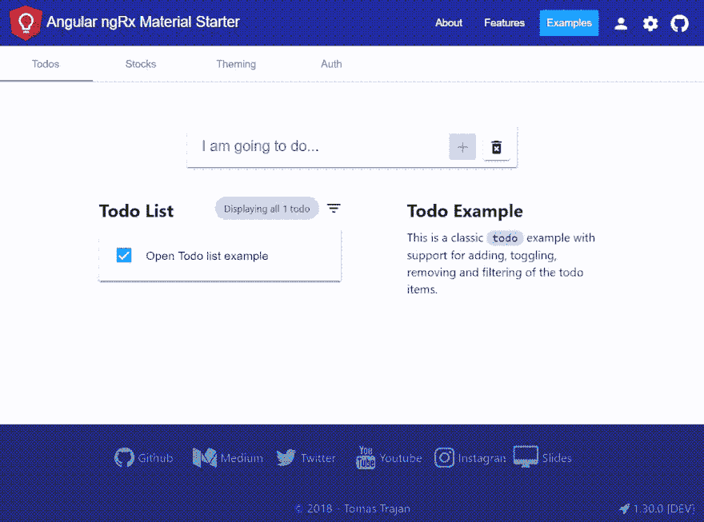

# 如何使用 Bootstrap 4 和 Angular 6 构建响应式布局📐

> 原文：<https://dev.to/angular/how-to-build-responsive-layouts-with-bootstrap-4-and-angular-6--3e98>

# 每个 web 应用程序都被认为是响应迅速的。

是的，即使是复杂的企业应用程序也充斥着大量的数据表格和图表。即使不是最合适的，每种类型的内容都应该可以从任何类型的设备上访问…

> 响应式网页设计(RWD)是一种网页设计方法，使网页在各种设备和窗口或屏幕尺寸上都能很好地呈现——维基百科

或者对于更视觉化的人来说…

[T2】](https://res.cloudinary.com/practicaldev/image/fetch/s--FlrzR75e--/c_limit%2Cf_auto%2Cfl_progressive%2Cq_66%2Cw_880/https://thepracticaldev.s3.amazonaws.com/i/l86gtvuiqkerbo7qza3l.gif)

[阅读更多...](https://medium.com/@tomastrajan/how-to-build-responsive-layouts-with-bootstrap-4-and-angular-6-cfbb108d797b)