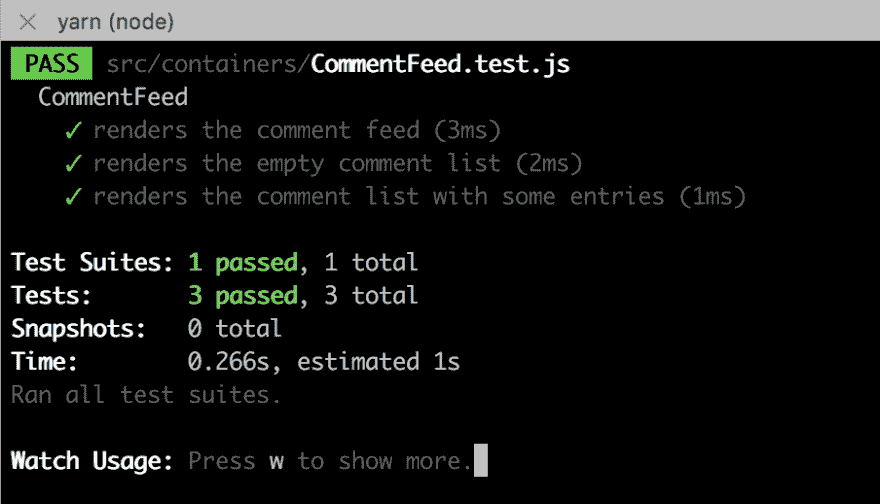
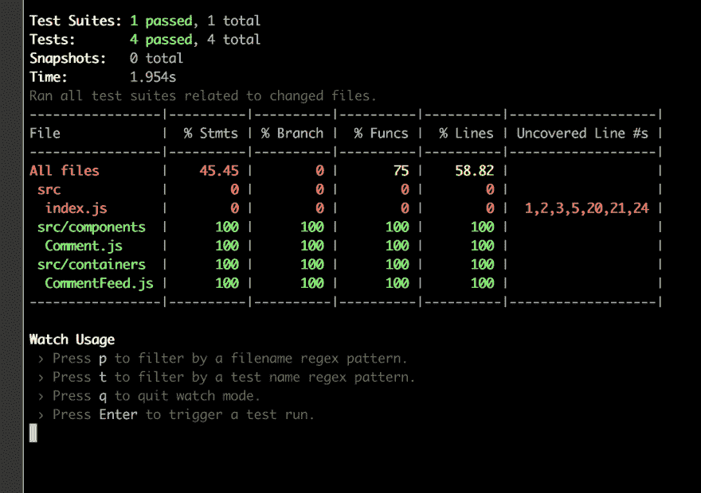

# 如何使用 Jest 的 React 测试库，用 TDD 构建健壮的 React 应用程序

> 原文：<https://dev.to/iwilsonq/how-to-build-sturdy-react-apps-with-tdd-using-jest-the-react-testing-library-52cn>

# 用 TDD 和 React 测试库构建 React 应用

[T2】](https://res.cloudinary.com/practicaldev/image/fetch/s--kCFU8ZdR--/c_limit%2Cf_auto%2Cfl_progressive%2Cq_auto%2Cw_880/https://cdn-images-1.medium.com/max/1600/0%2AT8onsKEr4xcSyyQR.)

“沙滩上并排的几个菠萝。”由菠萝供应公司在 Unsplash

当我开始学习 React 时，有一件事让我很纠结，那就是用一种既有用又直观的方式测试我的 web 应用。我基本上是用 Enzyme with Jest 来浅层渲染一个组件，每次我想测试它的时候，绝对是滥用了快照功能。

至少我实际上写了一个测试，对吗？

你可能在某个地方听说过，编写单元和集成测试会提高你编写的软件的质量。另一方面，糟糕的测试会滋生虚假的自信。

最近，我和 [@kentcdodds](https://dev.to/kentcdodds) 一起参加了一个研讨会，他教我们如何为 React 应用程序正确地编写集成测试。他还欺骗我们使用他的新测试库，支持它强调以用户会遇到的同样方式测试应用程序。

在本帖中，我们将创建一个用 React 构建的评论提要。

# 入门

我们将从运行`create-react-app`并安装依赖项开始。我的假设是，如果你足够聪明，阅读了一篇关于测试应用程序的文章，你可能已经熟悉了安装和启动 javascript 项目。这里我将使用`yarn`而不是`npm`。

```
create-react-app comment-feed
cd comment-feed
yarn 
```

Enter fullscreen mode Exit fullscreen mode

按照现在的情况，我们可以删除除 index.js 之外的所有文件。然后，在`src`文件夹中，创建一个名为`components`的新文件夹和一个名为`containers`的文件夹。

对于测试实用程序，我将使用 Kent C Dodds 的 [react-testing-library](https://github.com/kentcdodds/react-testing-library) 构建这个应用程序。这是一个轻量级的测试工具，它鼓励开发人员用使用它的相同方式测试他们的应用程序。

像 Enzyme 一样，它导出一个渲染函数，但是这个渲染函数总是对你的组件进行完全挂载。它导出帮助器方法，允许您通过标签或文本甚至测试 id 来定位元素。Enzyme 通过它的`mount` API 也做到了这一点，但是它创建的抽象实际上提供了更多的选项，其中许多选项允许您不用测试实现细节。

我们不想再那样做了。我们希望呈现一个组件，并查看当我们单击或更改某些内容时是否会发生正确的事情。就是这样！不再直接检查道具或状态或职业名称。

让我们安装它们并开始工作。

```
yarn add react-testing-library 
```

Enter fullscreen mode Exit fullscreen mode

# 用 TDD 构建评论提要

让我们以 TDD 方式完成第一个组件。启动您的测试跑步者。

```
yarn test --watch 
```

Enter fullscreen mode Exit fullscreen mode

在`containers`文件夹中，我们将添加一个名为 CommentFeed.js 的文件。在它旁边，添加一个名为 CommentFeed.test.js 的文件。对于第一个测试，让我们验证用户可以创建评论。太快了？好的，因为我们还没有任何代码，我们将从一个较小的测试开始。让我们检查一下是否可以呈现提要。

```
// containers/CommentFeed.test.js
import { render } from 'react-testing-library'
import CommentFeed from './CommentFeed'

describe('CommentFeed', () => {
  it('renders the CommentFeed', () => {
    const { queryByText } = render(<CommentFeed />)
    const header = queryByText('Comment Feed')
    expect(header.innerHTML).toBe('Comment Feed')
  })
}) 
```

Enter fullscreen mode Exit fullscreen mode

## react-testing-library 的一些注释

首先，让我们注意这里的渲染函数。这非常类似于`react-dom`在 DOM 上呈现组件的方式，但是它返回一个对象，我们可以通过析构该对象来获得一些简洁的测试助手。在这种情况下，我们得到了`queryByText`，给定一些我们期望在 DOM 上看到的文本，它将返回那个 HTML 元素。

[React 测试库文档](https://github.com/kentcdodds/react-testing-library#faq)有一个层次结构，可以帮助您决定使用哪个查询或 get 方法。通常，顺序是这样的:

*   getByLabelText(表单输入)
*   getByPlaceholderText(仅当您的输入没有无标签可访问时！)
*   getByText(按钮和标题)
*   getbyalettaxt _images)
*   getByTestId(用于动态文本或您想要测试的其他奇怪元素)

每一个都有一个相关的`queryByFoo`来做同样的事情，除了当它没有找到一个元素时不会让你的测试失败。如果你只是在测试一个元素的**存在性**，就使用这些。

如果这些都没有得到您想要的结果，`render`方法还返回映射到`container`属性的 DOM 元素，因此您可以像`container.querySelector('body #root')`一样使用它。

## 第一个实现代码

现在，实现看起来相当简单，我们只需要确保“评论提要”在组件中。

```
import React, { Component } from 'react'

export default class CommentFeed extends Component {
  render() {
    const { header } = this.props
    return (
      <div>
        <h2>{header}/h2>
      </div>
    )
  }
} 
```

Enter fullscreen mode Exit fullscreen mode

情况可能会更糟，我的意思是，我也打算用样式组件来完成整篇文章。幸运的是，测试不太关心样式，所以我们可以专注于我们的应用程序逻辑。下一个测试将验证我们是否可以呈现注释。但是我们甚至没有任何注释，所以让我们也加入那个组件。

不过在测试之后。我还将创建一个 props 对象来存储我们可能在这些测试中重用的数据。

```
// containers/CommentFeed.test.js
import { render } from 'react-testing-library'
import CommentFeed from './CommentFeed'

describe('CommentFeed', () => {
  const props = { header: 'Comment Feed', comments: [] }

  it('renders the CommentFeed', () => {
    const { queryByText } = render(<CommentFeed {...props} />)
    const header = queryByText(props.header)
    expect(header.innerHTML).toBe(props.header)
  })

  it('renders the comment list', () => {
    const { container } = render(<CommentFeed {...props} />)
    const commentNodes = container.querySelectorAll('.Comment')
    expect(commentNodes.length).toBe(props.comments.length)
  })
}) 
```

Enter fullscreen mode Exit fullscreen mode

在这种情况下，我检查评论的数量是否等于输入 CommentFeed 的数量。这很琐碎，但是测试的失败给了我们创建 Comment.js 文件的机会。

```
import React from 'react'

const Comment = props => {
  return (
    <div className="Comment">
      <h4>{props.author}</h4>
      <p>{props.text}</p>
    </div>
  )
}

export default Comment 
```

Enter fullscreen mode Exit fullscreen mode

这绿灯点亮了我们的测试套件，因此可以放心地继续进行。向 TDD 致敬，我们的救世主。当然，当我们给它一个空数组时，它就工作了。但是如果我们真的给它一些东西呢？

```
describe('CommentFeed', () => {
  /* ... */

  it('renders the comment list with some entries', () => {
    let comments = [
      {
        author: 'Ian Wilson',
        text: 'A boats a boat but a mystery box could be anything.',
      },
      {
        author: 'Max Powers Jr',
        text: 'Krypton sucks.',
      },
    ]
    props = { header: 'Comment Feed', comments }
    const { container } = render(<CommentFeed {...props} />)
    const commentNodes = container.querySelectorAll('.Comment')
    expect(commentNodes.length).toBe(props.comments.length)
  })
}) 
```

Enter fullscreen mode Exit fullscreen mode

我们现在必须更新我们的实现来真正渲染东西。简单到知道我们要去哪里，对吧？

```
import React, { Component } from 'react'
import Comment from '../components/Comment'

export default class CommentFeed extends Component {
  renderComments() {
    return this.props.comments.map((comment, i) => (
      <Comment key={i} {...comment} />
    ))
  }

  render() {
    const { header } = this.props
    return (
      <div className="CommentFeed">
        <h2>{header}</h2>
        <div className="comment-list">{this.renderComments()}</div>
      </div>
    )
  }
} 
```

Enter fullscreen mode Exit fullscreen mode

看啊，我们的测试又一次通过了。这是它美丽的一张清晰的照片。

[T2】](https://res.cloudinary.com/practicaldev/image/fetch/s--eGQgK_kW--/c_limit%2Cf_auto%2Cfl_progressive%2Cq_auto%2Cw_880/https://thepracticaldev.s3.amazonaws.com/i/xzgl6tbhpjwex1bv0ito.png)

注意到我从来没有说过我们应该用`yarn start`启动我们的程序吗？我们将暂时保持这种状态。关键是，你必须用意念去感受代码。

造型只是外表而已；重要的是内在。；)

不过，万一你想启动这个应用程序，请将 index.js 更新为以下内容:

```
import React from 'react'
import ReactDOM from 'react-dom'
import CommentFeed from './containers/CommentFeed'

const comments = [
  {
    author: 'Ian Wilson',
    text: 'A boats a boat but a mystery box could be anything.',
  },
  {
    author: 'Max Powers Jr',
    text: 'Krypton sucks.',
  },
  {
    author: 'Kent Beck',
    text: 'Red, Green, Refactor.',
  },
]

ReactDOM.render(
  <CommentFeed comments={comments} />,
  document.getElementById('root')
) 
```

Enter fullscreen mode Exit fullscreen mode

# 添加评论表单

这是事情开始变得更有趣的地方。这就是我们从昏昏欲睡地检查 DOM 节点的存在，到实际使用它并验证行为的地方。所有其他的东西都是热身。

让我们从描述我想从这个表单中得到什么开始。它应该:

*   包含作者的文本输入
*   包含注释本身的文本输入
*   有一个提交按钮
*   最终调用 API 或任何处理创建和存储注释的服务。

我们可以在一次集成测试中完成这个列表。对于之前的测试案例，我们进行得相当慢，但是现在我们将加快速度，尝试一下子就搞定它。

注意我们的测试套件是如何开发的？我们从在他们自己的测试用例中硬编码道具到为他们创建工厂。

## 安排、行动、断言

```
import React from 'react'
import { render, Simulate } from 'react-testing-library'
import CommentFeed from './CommentFeed'

// props factory to help us arrange tests for this component
const createProps = props => ({
  header: 'Comment Feed',
  comments: [
    {
      author: 'Ian Wilson',
      text: 'A boats a boat but a mystery box could be anything.',
    },
    {
      author: 'Max Powers Jr',
      text: 'Krypton sucks.',
    },
  ],
  createComment: jest.fn(),
  ...props,
})

describe('CommentFeed', () => {
  /* ... */

  it('allows the user to add a comment', () => {
    // Arrange - create props and locate elements
    const newComment = { author: 'Socrates', text: 'Why?' }
    let props = createProps()
    const { container, getByLabelText } = render(<CommentFeed {...props} />) 
    const authorNode = getByLabelText('Author')
    const textNode = getByLabelText('Comment')
    const formNode = container.querySelector('form')

    // Act - simulate changes to elements
    authorNode.value = newComment.author
    textNode.value = newComment.text

    Simulate.change(authorNode)
    Simulate.change(textNode)

    Simulate.submit(formNode)

    // Assert - check whether the desired functions were called
    expect(props.createComment).toHaveBeenCalledTimes(1)
    expect(props.createComment).toHaveBeenCalledWith(newComment)
  })
}) 
```

Enter fullscreen mode Exit fullscreen mode

这个测试可以分为三个部分:安排、行动和断言。关于代码有一些假设，比如我们标签的命名或者我们将有一个`createComment`道具的事实。

当寻找输入时，我们希望通过它们的标签找到它们，这在我们构建应用程序时优先考虑可访问性。获取表单最简单的方法是使用`container.querySelector`。

接下来，我们必须给输入分配新的值，并模拟变化以更新它们的状态。这一步可能感觉有点奇怪，因为通常我们一次输入一个字符，为每个新字符更新组件状态。这更像是复制/粘贴的行为，从空字符串到‘苏格拉底’。

提交表单后，我们可以断言调用了哪些道具，使用了哪些参数。我们还可以利用这个时机来验证表单输入是否被清除。

很吓人吗？别害怕，我的孩子，走这边。首先将表单添加到呈现函数中。

```
render() {
        const { header } = this.props
        return (
            <div className="CommentFeed">
                <h2>{header}</h2> 
                <form
                    className="comment-form"
                    onSubmit={this.handleSubmit}
                >
                    <label htmlFor="author">
                        Author
                        <input
                            id="author"
                            type="text"
                            onChange={this.handleChange}
                        />
                    </label>
                    <label htmlFor="text">
                        Comment
                        <input
                            id="text"
                            type="text"
                            onChange={this.handleChange}
                        />
                    </label> 
          <button type="submit">Submit Comment</button>
                </form> 
                <div className="comment-list">
                    {this.renderComments()}
                </div>
            </div>
        )
    } 
```

Enter fullscreen mode Exit fullscreen mode

我可以将这个表单分解成它自己的独立组件，但是现在我不会这样做。相反，我会把它添加到我放在办公桌旁的“重构愿望清单”中。这就是 TDD 的方式。当某些东西看起来可以重构时，记下它并继续前进。只有当一个抽象的存在对你有益，并且你觉得没有必要时，才进行重构。

还记得我们通过创建`createProps`工厂来重构测试套件吗？就这样。我们也可以重构测试。

现在，让我们添加`handleChange`和`handleSubmit`类方法。当我们更改输入或提交表单时，这些就会被触发。我还会初始化我们的状态。

```
export default class CommentFeed extends Component {
  state = {
    author: '',
    text: '',
  }

  handleSubmit = event => {
    event.preventDefault()
    const { author, text } = this.state
    this.props.createComment({ author, text })
  }

  handleChange = event => {
    this.setState({ [event.target.id]: event.target.value })
  }

  /* ... */
} 
```

Enter fullscreen mode Exit fullscreen mode

这就做到了。我们的测试通过了，我们有了一个类似真实应用的东西。我们的报道怎么样？

[T2】](https://res.cloudinary.com/practicaldev/image/fetch/s--kgOcaZfX--/c_limit%2Cf_auto%2Cfl_progressive%2Cq_auto%2Cw_880/https://thepracticaldev.s3.amazonaws.com/i/8sbqtob66ioppm0f8tkc.png)

不错，如果我们忽略 index.js 中的所有设置，我们就有了一个关于执行行的完整的 web 应用程序。

当然，可能还有其他我们想要测试的情况，以便验证应用程序是否如我们预期的那样工作。当你的老板和其他同事谈话时，这个覆盖率只是他们可以吹嘘的东西。

# 喜欢评论

不如我们看看我们能不能喜欢评论？这可能是在我们的应用程序中建立一些身份验证概念的好时机。但是我们还不会跳得太远。让我们首先更新我们的道具工厂，为我们生成的评论添加一个带有 id 的`auth`字段。

```
const createProps = props => ({
  auth: {
    name: 'Ian Wilson',
  },
  comments: [
    {
      id: 'comment-0',
      author: 'Ian Wilson',
      text: 'A boats a boat but a mystery box could be anything.',
    },
    {
      id: 'comment-1',
      author: 'Max Powers Jr',
      text: 'Krypton sucks.',
    },
  ],
  /*...*/
}) 
```

Enter fullscreen mode Exit fullscreen mode

“通过身份验证”的用户将通过应用程序传递他们的 auth 属性，任何与他们是否通过身份验证相关的操作都将被记录下来。

在许多应用程序中，该属性可能包含向服务器发出请求时发送的某种访问令牌或 cookie。在客户端，此属性的存在让应用程序知道他们可以让用户查看他们的配置文件或其他受保护的路由。

然而，在这个测试示例中，我们不会过多地摆弄身份验证。想象这样一个场景:当你进入一个聊天室，你给出你的网名。从那时起，你负责使用这个用户名的每个评论，不管还有谁用这个用户名登录。

虽然这不是一个很好的解决方案，即使在这个虚构的例子中，我们也只关心测试 CommentFeed 组件的行为是否正常。我们不关心用户如何登录。

换句话说，我们可能有一个完全不同的登录组件来处理特定用户的身份验证，从而让他们经历火与怒的考验，以便获得全能的`auth`属性，让他们在我们的应用程序中肆虐。

来“赞”一个评论吧。添加下一个测试用例，然后更新道具工厂以包含`likeComment`。

```
const createProps = props => ({
  createComment: jest.fn(),
    likeComment: jest.fn(),
  ..props
})

describe('CommentFeed', () => {
  /* ... */

  it('allows the user to like a comment', () => {
    let props = createProps()
    let id = props.comments[1].id
    const { getByTestId } = render(<CommentFeed {...props} />) 
    const likeNode = getByTestId(id)
    Simulate.click(likeNode)

    expect(props.likeComment).toHaveBeenCalledTimes(1)
    expect(props.likeComment).toHaveBeenCalledWith(id, props.auth.name)
  })
}) 
```

Enter fullscreen mode Exit fullscreen mode

现在为了实现，我们将首先更新 Comment 组件，使其具有 like 按钮和`data-testid`属性，这样我们就可以找到它。

```
const Comment = props => {
  return (
    <div className="Comment">
      <h4>{props.author}</h4>
      <p>{props.text}</p>
      <button
        data-testid={props.id}
        onClick={() => props.onLike(props.id, props.author)}
      >
        Like
      </button>
    </div>
  )
} 
```

Enter fullscreen mode Exit fullscreen mode

我将测试 id 直接放在按钮上，这样我们就可以立即模拟点击，而不必嵌套查询选择器。我还为按钮附加了一个`onClick`处理程序，以便它调用传递给它的`onLike`函数。

现在我们只是将这个类方法添加到我们的注释提要:

```
handleLike = (id, author) => {
  this.props.likeComment(id, author)
} 
```

Enter fullscreen mode Exit fullscreen mode

你可能想知道为什么我们不直接把`likeComment`属性传递给评论组件，为什么我们要把它变成一个类属性？在这种情况下，因为它非常简单，所以我们不必构建这种抽象。将来，我们可能会决定添加其他的`onClick`处理器，比如处理分析事件。

能够在这个容器组件的`handleLike`方法中捆绑多个不同的函数调用有其优势。如果我们愿意的话，我们也可以在一个成功的“赞”之后使用这个方法来更新组件的状态。

# 不喜欢的评论

此时，我们已经对呈现、创建和喜欢评论进行了工作测试。当然，我们还没有实现真正做到这一点的逻辑——我们没有更新存储或写入数据库。

您可能还注意到，我们测试的逻辑很脆弱，不太适用于真实世界的评论提要。例如，如果我们试图喜欢一个我们已经喜欢的评论会怎么样？它会无限增加喜欢数，还是不喜欢它？

我将把扩展组件的功能留给您的想象，但是编写一个新的测试用例将是一个良好的开端。这里有一个建立在我们想要实现不喜欢我们已经喜欢的评论的假设之上的例子:

```
const createProps = props => ({
  header: 'Comment Feed',
  comments: [
    {
      id: 'comment-0',
      author: 'Ian Wilson',
      text: 'A boats a boat but a mystery box could be anything.',
      likes: ['user-0'],
    },
    {
      id: 'comment-1',
      author: 'Max Powers Jr',
      text: 'Krypton sucks.',
      likes: [],
    },
  ],
  auth: {
    id: 'user-0',
    name: 'Ian Wilson',
  },
  createComment: jest.fn(),
  likeComment: jest.fn(),
  unlikeComment: jest.fn(),
  ...props,
})

describe('CommentFeed', () => {
  /* ... */

  it('allows the user to unlike a comment', () => {
    let props = createProps()
    let id = props.comments[0].id
    const { getByTestId } = render(<CommentFeed {...props} />) 
    const likeNode = getByTestId(id)
    Simulate.click(likeNode)

    expect(props.unlikeComment).toHaveBeenCalledTimes(1)
    expect(props.unlikeComment).toHaveBeenCalledWith(id, props.auth)
  })
}) 
```

Enter fullscreen mode Exit fullscreen mode

请注意，我们正在构建的评论提要允许我喜欢自己的评论。谁会这么做？

我用一些逻辑更新了评论组件，以确定当前用户是否喜欢这个评论。

```
const Comment = props => {
  const isLiked = props.likes.includes(props.currentUser.id)
  const onClick = isLiked
    ? () => props.onDislike(props.id)
    : () => props.onLike(props.id)
  return (
    <div className="Comment">
      <h4>{props.author}</h4>
      <p>{props.text}</p> 
      <button data-testid={props.id} onClick={onClick}>
        {isLiked ? 'Unlike' : 'Like'}
      </button>
    </div>
  )
} 
```

Enter fullscreen mode Exit fullscreen mode

我做了一点小手脚，之前我们把`author`传递给`onLike`函数，我改成了`currentUser`，这是传递给评论组件的`auth`属性。我意识到这一点是因为我正在努力地编写测试——如果我只是碰巧编写了代码，我可能会忽略这一点，直到我的一个同事斥责我的无知！

但是这里没有无知，只有测试和随后的代码。请确保更新 CommentFeed，以便它能够传递 auth 属性。对于`onClick`处理程序，我们实际上可以省略 auth 属性的传递，因为我们可以从父类的`handleLike`和`handleDislike`方法中的 auth 属性中派生出来。

```
handleLike = id => {
        this.props.likeComment(id, this.props.auth)
    }

handleDislike = id => {
  this.props.dislikeComment(id, this.props.auth)
}

renderComments() {
  return this.props.comments.map((comment, i) => (
    <Comment
      key={i}
      {...comment}
      currentUser={this.props.auth}
      onDislike={this.handleDislike}
      onLike={this.handleLike}
    />
  ))
} 
```

Enter fullscreen mode Exit fullscreen mode

# 包装完毕

希望你的测试套件看起来像一棵没有点亮的圣诞树。

我们可以选择这么多不同的路线，这可能会有点让人不知所措。每当你有了一个想法，就把它写下来，写在纸上或新的测试块上。

例如，假设您实际上想在一个类方法中实现`handleLike`和`handleDislike`，但是您现在有其他优先事项。您可以通过在测试用例中记录这样的内容来做到这一点:

```
it('combines like and dislike methods', () => {}) 
```

Enter fullscreen mode Exit fullscreen mode

这并不意味着您需要编写一个全新的测试，您也可以更新前面的两个案例。但是重点是，您可以将您的测试运行程序作为您的应用程序的一个更迫切的“待办事项”列表。

## 有用链接

有一些很棒的内容是关于测试的。

*   Kent C Dodds 的“[介绍 React 测试库](https://blog.kentcdodds.com/introducing-the-react-testing-library-e3a274307e65)”。理解这个测试库背后的哲学是一个好主意。
*   Kostis Kapelonis 的“[软件测试反模式](http://blog.codepipes.com/testing/software-testing-antipatterns.html)”。一篇非常深入的文章，讨论了单元和集成测试。也不怎么做该做的事。
*   Kent Beck 的“通过示例进行测试驱动的开发”。这是一本讨论 TDD 模式的实体书。它不太长，写得很有对话性，很容易消化。

我希望那能帮你度过一段时间。

好奇更多帖子或者妙语连珠？在[媒体](https://medium.com/@iwilsonq)、 [Github](https://github.com/iwilsonq) 和 [Twitter](https://twitter.com/iwilsonq) 上关注我吧！

*最初发表于[medium.freecodecamp.org](https://medium.freecodecamp.org/how-to-build-sturdy-react-apps-with-tdd-and-the-react-testing-library-47ad3c5c8e47)T3】*