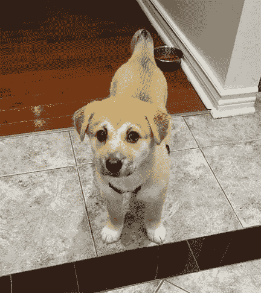
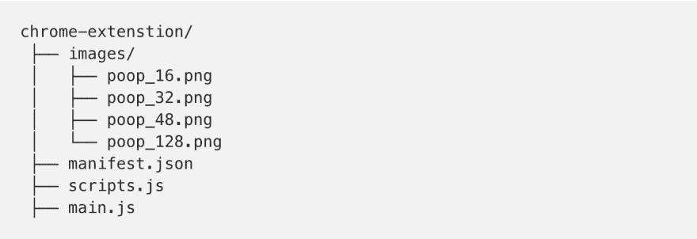
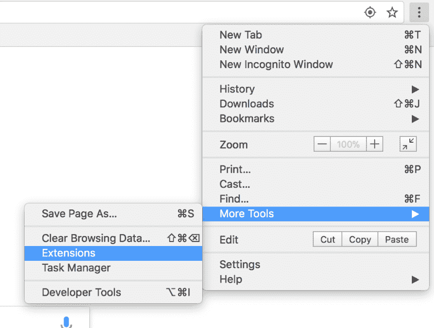
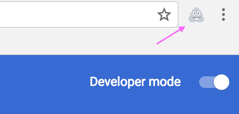
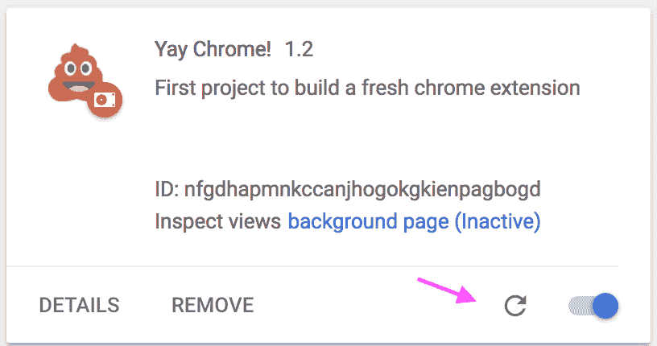
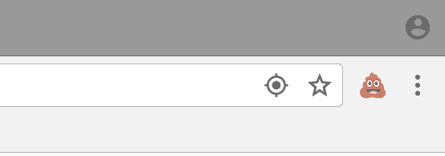

# 如何构建你的第一个 Chrome 扩展

> 原文：<https://dev.to/himashi99/how-to-build-your-first-chrome-extension-19lb>

### 改变网络，一次一张小狗图片

[T2】](https://res.cloudinary.com/practicaldev/image/fetch/s--5ikRuKtv--/c_limit%2Cf_auto%2Cfl_progressive%2Cq_auto%2Cw_880/https://thepracticaldev.s3.amazonaws.com/i/c8q64tgpqsalyen1tpv2.jpg)

让我们来谈谈浏览器扩展，或者更具体地说，如何构建你的第一个 Chrome 扩展。几周前我去了一个班级，在那里我们用几行代码创建了这个非常愚蠢的扩展，玩得很开心。我想我会分享它，所以你们都可以尝试一下，甚至可以扩展一下。

### 什么是浏览器扩展

在我们开始之前，让我们回顾一下什么是浏览器扩展。浏览器扩展实际上只是为浏览器提供一些额外功能的小段代码。你可能正在使用一些软件，比如广告拦截器或者密码管理器。谷歌有一大堆非常有用和有趣的 Chrome 扩展，这些扩展是人们为了增强网络浏览体验而开发的。

[https://chrome.google.com/webstore/category/extensions](https://chrome.google.com/webstore/category/extensions)

今天，我们将创建一个针对网页上所有图片的扩展，并用小狗图片替换它们！

### 文件夹结构

要开始使用:

在本地克隆以下 repo 以获取启动文件:[https://github.com/himashi99/chrome-extension](https://github.com/himashi99/chrome-extension)

[T2】](https://res.cloudinary.com/practicaldev/image/fetch/s--gTIEEWQB--/c_limit%2Cf_auto%2Cfl_progressive%2Cq_auto%2Cw_880/https://thepracticaldev.s3.amazonaws.com/i/yybn2q6i6wcnm0ahtx0c.png)

1.  你的文件夹结构应该类似上面。

2.  我已经把“便便”表情包含在图片文件夹里了，不过你可以随意使用 3。你喜欢的任何图像图标。

3.  清单文件是一个 JSON 文件，描述了我们对 Chrome 的扩展。它是我们指定关于扩展的重要信息的地方，比如它需要的权限或者它使用的图标。

4.  在您的“manifest.json”文件中包含以下代码。

```
{   
    "name": "Yay Chrome!", 
    "version": "1.2", 
    "description": "First project to build a fresh chrome  extension", 
    "manifest_version": 2,
"permissions": ["activeTab", "declarativeContent"],
"icons": {
      "16": "images/poop_16.png",
      "32": "images/poop_32.png",
      "48": "images/poop_48.png",
      "128": "images/poop_128.png"
    },
"page_action": { 
      "default_icon": {
        "16": "images/poop_16.png",
        "32": "images/poop_32.png",
        "48": "images/poop_48.png",
        "128": "images/poop_128.png"
      }
    },
"background": {
      "scripts": ["scripts.js"],
      "persistent": false
    }
} 
```

Enter fullscreen mode Exit fullscreen mode

让我们分解一下上面的代码:

我们需要给我们的扩展命名、版本号和简短描述。

当前的 manifest_versions 是 2，因此保持不变。

*“活动选项卡”权限允许访问用户所在的当前选项卡。“declarativeContent”权限允许扩展在标签改变或访问新网页时知道。*

我们导入不同尺寸的图像图标，因此我们的扩展可以响应不同的屏幕尺寸。

*“页面操作”将图标放在 Chrome 工具栏中，代表可以在当前网页上执行的操作，即按钮是可点击的。*

在最后的代码块中，后台脚本在需要时被加载，监听和管理事件。Persistent 设置为“false ”,以便后台脚本在完成其操作后被卸载。

在这种情况下，清单文件指示应该加载“scripts.js”文件。我们将很快回到“scripts.js”和“main.js”文件。

### Chrome 设置

打开 Chrome，进入扩展管理器

[](https://res.cloudinary.com/practicaldev/image/fetch/s--13x1MLc---/c_limit%2Cf_auto%2Cfl_progressive%2Cq_auto%2Cw_880/https://thepracticaldev.s3.amazonaws.com/i/gbqghutrod2kpsnrlpwr.png)T3】

我们需要让 Chrome 知道我们是厉害的开发者，所以让我们打开右上角的“开发者模式”。这将允许我们加载自己的扩展。

[](https://res.cloudinary.com/practicaldev/image/fetch/s--_6QoCve6--/c_limit%2Cf_auto%2Cfl_progressive%2Cq_auto%2Cw_880/https://thepracticaldev.s3.amazonaws.com/i/75kouk073kpdou8r6ia9.png)T3】

点击“加载解压”并选择你的“铬-扩展”文件夹。

[](https://res.cloudinary.com/practicaldev/image/fetch/s--Is8TaApp--/c_limit%2Cf_auto%2Cfl_progressive%2Cq_auto%2Cw_880/https://thepracticaldev.s3.amazonaws.com/i/xo881688wmpo5e0wblvq.png)T3】

好吧！我们现在已经加载了我们的扩展。你应该在扩展管理器中看到扩展，在谷歌浏览器工具栏中看到图标。图标将变灰且不活动。

[](https://res.cloudinary.com/practicaldev/image/fetch/s--0K_EZD-i--/c_limit%2Cf_auto%2Cfl_progressive%2Cq_auto%2Cw_880/https://thepracticaldev.s3.amazonaws.com/i/n2oywd6iukv8q24cxf3i.png)T3】

如果此时对 JSON 文件做了任何更改，可以点击扩展上的刷新按钮。

[](https://res.cloudinary.com/practicaldev/image/fetch/s--2juIY80a--/c_limit%2Cf_auto%2Cfl_progressive%2Cq_auto%2Cw_880/https://thepracticaldev.s3.amazonaws.com/i/hwm0z41wcw77r9jsds3i.png)T3】

### scripts.js 文件

是时候激活图标了，为此，我们需要将按钮链接到我们的“scripts.js”文件。

1.  在“scripts.js”文件中包含以下代码块。

```
chrome.declarativeContent.onPageChanged.removeRules(undefined, function() {
   chrome.declarativeContent.onPageChanged.addRules([{
     conditions: [new chrome.declarativeContent.PageStateMatcher({
       pageUrl: {schemes: ['https', 'http']},
     })
     ],
         actions: [new chrome.declarativeContent.ShowPageAction()]
   }]);
 });

chrome.pageAction.onClicked.addListener(function() {
   chrome.tabs.query({active: true, currentWindow: true}, function(tabs) {
     chrome.tabs.executeScript(
       tabs[0].id, 
       {file: 'main.js'}
     );
   });
 }); 
```

Enter fullscreen mode Exit fullscreen mode

让我们分解一下上面的代码:

**第一个代码块:**

回到清单文件，还记得我们为 activeTab 和 declarativeContent 指定了权限吗？这让我们可以使用 Chrome API(“Chrome . declarative content”)，然后允许我们的扩展根据网页的内容采取行动，而无需请求主机许可来读取网页内容。

我们还在清单文件中定义了“pageAction”作为 Chrome 工具栏中的扩展图标。

*声明式 API 进一步允许在“onPageChanged”事件上设置规则，然后当满足“PageStateMatcher”下的条件时采取行动。*

“PageStateMatcher”仅在满足列出的条件时匹配网页。在这种情况下，规则将显示任何 http 或 https 网页的页面操作。

*“remove rules”被调用来清除所有先前定义的在安装扩展时添加的规则，因此可以定义一组新的规则(“addRules”)。*

**第二个代码块:**

*当点击 pageAction(我们在清单文件中创建的扩展图标)时，我们会添加一个监听器，即不要运行脚本。*

下一行指的是我们在清单文件中声明的“活动标签”权限。Chrome 查询当前打开的窗口，并确定活动标签。一旦确定了活动选项卡，它就运行带有参数“tabs”的功能。

最后一段代码告诉 Chrome 转到活动选项卡，这是我们在前一行中隔离的，并执行一个脚本，在本例中是“main.js”文件。

1.  保存文件并刷新扩展名。

2.  打开一个新标签，你应该看到你的图标现在是活跃的，不再是灰色的。

[T2】](https://res.cloudinary.com/practicaldev/image/fetch/s--Q8F6V_RV--/c_limit%2Cf_auto%2Cfl_progressive%2Cq_auto%2Cw_880/https://thepracticaldev.s3.amazonaws.com/i/xn8et6kqev43hnpdj2g4.png)

我们终于完成了所有的设置工作，可以开始有趣的部分了！

### 图像占位符服务

我们需要为我们的扩展找到一些替换图像。有几个网站是这样做的，并且有不同大小的图片。我要用小狗的那个，[https://placedog.net/](https://placedog.net/)但是还有很多，所以选你最喜欢的吧！

[https://placekitten.com/](https://placekitten.com/)

[https://placebear.com/](https://placebear.com/)

### main.js 文件

我们现在要写我们的脚本，这样当我们点击我们的扩展时，我们可以用我们可爱的小狗照片替换图像。

1.  在 main.js 文件中包含以下代码

```
var allImages = document.getElementsByTagName('img');

for (var i = 0; i < allImages.length; i++) {
  allImages[i].addEventListener('mouseover', function() {

    var thisImageHeight = this.clientHeight;
    var thisImageWidth = this.clientWidth;

  this.setAttribute('src', 'https://placedog.net/' + thisImageHeight + '/' + thisImageWidth)
  })
} 
```

Enter fullscreen mode Exit fullscreen mode

让我们分解一下上面的代码:

我们希望给定网页上的所有图片都有针对性。由于这些图像元素都有一个“img”标签，我们用 document . get elements by tagname(' img ')获取它们，并将其赋给变量“allImages”。

我们现在可以使用一个“for 循环”来循环每个图像并添加一个事件监听器。在这种情况下，我们等待用户将鼠标移到图像上。

我们的新图像的宽度和高度应该与被替换的图像相等。我们将这个原始图像的高度和宽度分配给不同的变量:thisImageHeight 和 thisImageWidth。

我们现在可以使用 setAttribute 特性来改变 src 元素的属性。记住“this”指的是鼠标经过的图像。我们还将使用上一行中的变量包括图像的高度和宽度。

### 你做到了！

好的，保存你的文件并刷新你的扩展名。打开一个网页(有很多图片),试试你有趣的新 Chrome 扩展！