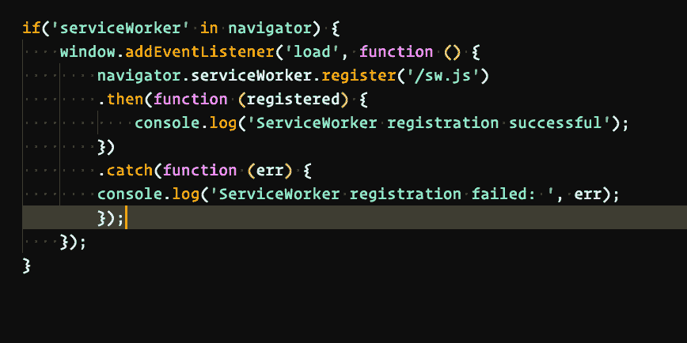
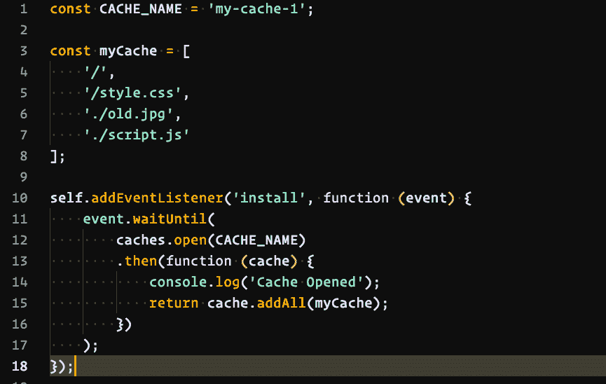
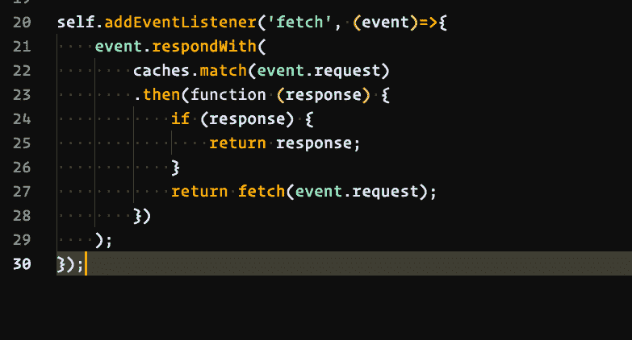
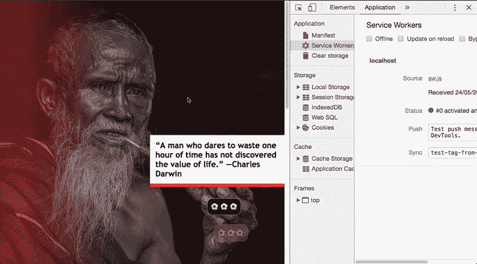

# 如何建立你的第一个离线网页

> 原文：<https://dev.to/sait/how-to-build-your-first-offline-webpage-3l6o>

今天，在服务人员的帮助下，我们正在创建我们的第一个离线网页。

# 什么是服务工作者？

服务人员可以在我们的浏览器中运行后台，无需用户交互。他们在自己的线程上工作，甚至在浏览器关闭/网站关闭时也能工作。

服务工作者只在安全的站点上运行，比如(https ),在开发时它将在本地主机上工作。

今天，我们使用服务人员来构建我们的离线网页。

首先，我们需要检查服务人员在浏览器中是否可用。

这是我们的 script.js 文件代码。

[T2】](https://res.cloudinary.com/practicaldev/image/fetch/s--VY-nt32Q--/c_limit%2Cf_auto%2Cfl_progressive%2Cq_auto%2Cw_880/https://thepracticaldev.s3.amazonaws.com/i/x0z218xrx7jk01iu6yl4.png)

如果导航中有服务人员，上面的代码会做什么

如果是，则在块内运行这些代码。

我们需要创建空的 sw.js 文件，并且需要在 register 方法中指定 sw.js 文件的路径。

Register 方法给了我们一个承诺，如果成功注册了
，那么我们就可以开始了，否则在注册过程中会出现一些问题。

## 现在我们在 Sw.js 文件中

它们是服务人员提供给我们的不同生命周期事件
,即安装、激活、获取？

首先，我们需要安装服务工作器，为此我们需要编写一些代码。

# 安装事件

```
self.addEventListener('install',function(){

}) 
```

Enter fullscreen mode Exit fullscreen mode

它看起来像这些

在安装时，我们需要打开缓存，并将静态资产放入缓存中。

[T2】](https://res.cloudinary.com/practicaldev/image/fetch/s--btgHbwWh--/c_limit%2Cf_auto%2Cfl_progressive%2Cq_auto%2Cw_880/https://thepracticaldev.s3.amazonaws.com/i/6xjugryg1213exjge75h.png)

event.waitUntil()接受承诺，以便等待承诺
解决。比如请等待，直到资产被放入缓存。

我将跳过激活事件，我们已经在**‘my-cache-1’**的缓存名称中缓存了静态资产。

现在我们想访问缓存并使用缓存中的资产，而不是发送网络请求。

# 获取事件

[T2】](https://res.cloudinary.com/practicaldev/image/fetch/s--x_BKTwEj--/c_limit%2Cf_auto%2Cfl_progressive%2Cq_auto%2Cw_880/https://thepracticaldev.s3.amazonaws.com/i/owdgnfd2ue1o6ch97k7b.png)

它首先检查请求的文件是否在缓存中，如果是，使用它或发送网络请求。

哇，我们成功地完成了我们简单的离线网页

[T2】](https://res.cloudinary.com/practicaldev/image/fetch/s--J6cBWQ_H--/c_limit%2Cf_auto%2Cfl_progressive%2Cq_66%2Cw_880/https://thepracticaldev.s3.amazonaws.com/i/u98l3a6umh6xfvzrw4zx.gif)

这些是我们的最终输出，你自己试试，如果你有任何疑问，请随时询问。

快乐编码...

**资源**

*   [缓存 Api](https://developer.mozilla.org/en-US/docs/Web/API/Cache)

*   [关于服务人员的更多信息](https://developer.mozilla.org/en-US/docs/Web/API/Service_Worker_API)