# 如何使用 Android Things 构建自己的安全系统

> 原文：<https://dev.to/wiaio/how-to-build-your-own-security-system-using-android-things-3n0m>

[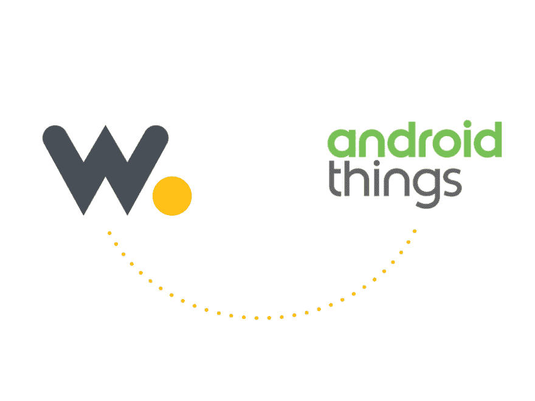T2】](https://res.cloudinary.com/practicaldev/image/fetch/s--XCQ8_9WO--/c_limit%2Cf_auto%2Cfl_progressive%2Cq_auto%2Cw_880/https://s3-eu-west-1.amazonaws.com/wia-flarum-bucket/2018-08-03/1533309078-317025-blog-06.png)

在本教程中，我们将使用 Android Things 向 Wia 发送一个事件。

# 组件

*   树莓 Pi(我们使用的是树莓 Pi 3 型号 B)
*   PIR 传感器
*   usb 电缆
*   跳线

你还需要 Android Studio 和一个 Wia 帐户。[你可以在这里下载最新版本的 Android Studio](https://developer.android.com/studio/)。

Wia 是一个云平台，支持您的物联网设备。[您可以在这里注册或登录](https://dashboard.wia.io/login)。

# 入门

首先，我们需要在树莓派上安装安卓系统。[点击此处](https://partner.android.com/things/console/u/0/#/)进入 Android Things 控制台，使用谷歌账户登录。

创建一个产品，选择**覆盆子酱**作为 **SOM** ，给它起你喜欢的名字，然后保存。

[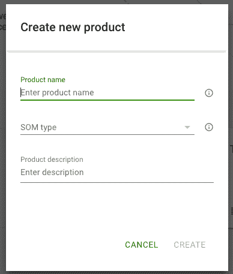T2】](https://res.cloudinary.com/practicaldev/image/fetch/s--CtLtsUOC--/c_limit%2Cf_auto%2Cfl_progressive%2Cq_auto%2Cw_880/https://s3-eu-west-1.amazonaws.com/wia-flarum-bucket/2018-08-01/1533131995-548060-screen-shot-2018-08-01-at-25933-pm.png)

您将被带到此页面。点击您的模型:

[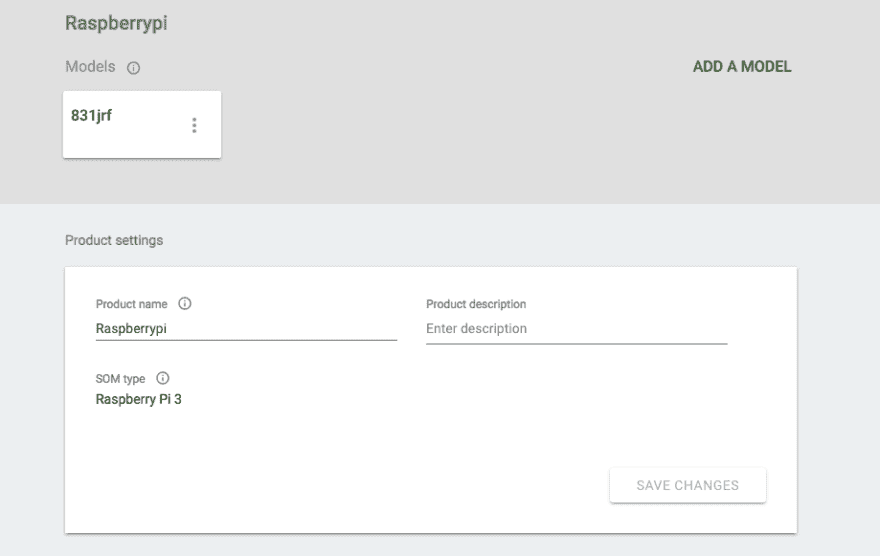T2】](https://res.cloudinary.com/practicaldev/image/fetch/s--c9Pvs1mj--/c_limit%2Cf_auto%2Cfl_progressive%2Cq_auto%2Cw_880/https://s3-eu-west-1.amazonaws.com/wia-flarum-bucket/2018-08-01/1533132122-102564-screen-shot-2018-08-01-at-30010-pm.png)

点击**新建**并从下拉菜单中选择**从头开始**。

命名您的构建。在每一步点击**下一步**，保留所有默认设置。然后点击**创建构建**。

您的构建现在可以下载了。下载文件，选择**制作**。

[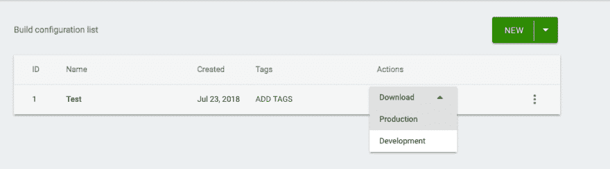T2】](https://res.cloudinary.com/practicaldev/image/fetch/s--6ZoWDk3C--/c_limit%2Cf_auto%2Cfl_progressive%2Cq_auto%2Cw_880/https://s3-eu-west-1.amazonaws.com/wia-flarum-bucket/2018-08-01/1533132100-517306-screen-shot-2018-08-01-at-30103-pm.png)

文件下载完成后，解压。该文件需要一些时间来展开。你会得到一个**。img** 文件。

[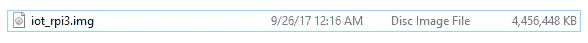T2】](https://res.cloudinary.com/practicaldev/image/fetch/s--UfYZAK1_--/c_limit%2Cf_auto%2Cfl_progressive%2Cq_auto%2Cw_880/https://s3-eu-west-1.amazonaws.com/wia-flarum-bucket/2018-08-01/1533132176-964916-screen-shot-2018-08-01-at-30241-pm.png)

# 刻录 SD 卡

接下来，将图像刻录到 SD 卡。我们用蚀刻机来做这个。你可以在这里下载 Etcher。

将 SD 卡插入你的电脑并打开蚀刻机。选择我们刚刚下载的图片，选择 SD 卡，然后点击**闪**。然后，从电脑中取出 SD 卡，插入树莓 pi。

[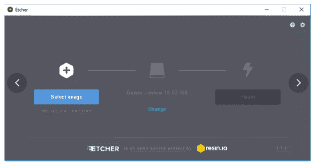T2】](https://res.cloudinary.com/practicaldev/image/fetch/s--QlpFBiwt--/c_limit%2Cf_auto%2Cfl_progressive%2Cq_auto%2Cw_880/https://s3-eu-west-1.amazonaws.com/wia-flarum-bucket/2018-08-01/1533132222-990367-screen-shot-2018-08-01-at-30326-pm.png)

将 raspberry pi 连接到以太网电缆，并使用 USB 将 raspberry pi 连接到 5V 电源。使用 HDMI 将 raspberry pi 连接到显示器，并获取 **IP 地址。**您稍后将需要该 IP 地址。

# 布线硬件

[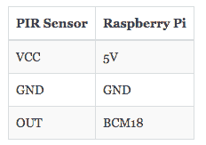T2】](https://res.cloudinary.com/practicaldev/image/fetch/s--W4jOK4UB--/c_limit%2Cf_auto%2Cfl_progressive%2Cq_auto%2Cw_880/https://s3-eu-west-1.amazonaws.com/wia-flarum-bucket/2018-08-01/1533134177-53230-screen-shot-2018-08-01-at-33529-pm.png)

使用此图帮助您连接硬件:

[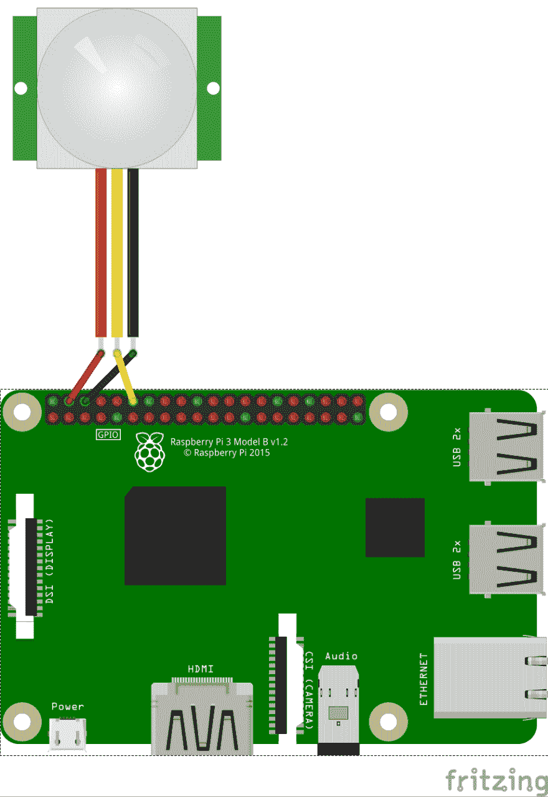T2】](https://res.cloudinary.com/practicaldev/image/fetch/s--059m46C4--/c_limit%2Cf_auto%2Cfl_progressive%2Cq_auto%2Cw_880/https://s3-eu-west-1.amazonaws.com/wia-flarum-bucket/2018-08-01/1533132310-633379-download.png)

将 USB 连接到 raspberry pi 和您的电脑。将 HDMI 电缆连接到显示器和 raspberry pi。

# 在 Wia 中设置您的共享空间

如果您还没有 Wia 帐户，[您可以在这里注册，这是免费的](https://dashboard.wia.io/login)。

在 Wia 仪表板中，点击`Create a New Space`。在左侧工具条中，导航到`Devices`并点击`Add Device`。我们用的是 Raspberry Pi 3 型号 b。你可以给你的设备起任何你喜欢的名字。

[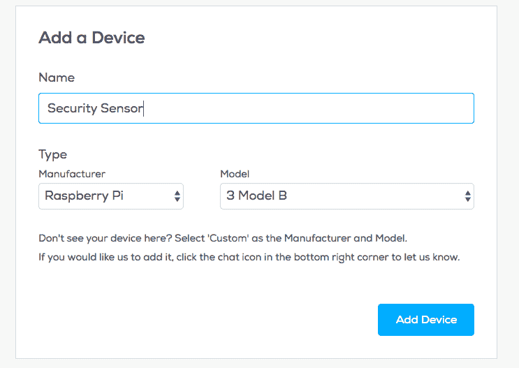T2】](https://res.cloudinary.com/practicaldev/image/fetch/s--Z7zIYO4p--/c_limit%2Cf_auto%2Cfl_progressive%2Cq_auto%2Cw_880/https://s3-eu-west-1.amazonaws.com/wia-flarum-bucket/2018-08-01/1533132397-627866-screen-shot-2018-08-01-at-30609-pm.png)

添加设备后，导航至`Configuration`选项卡。在这里你可以找到你的设备的秘密密钥，它以`d_sk`开始。你以后会需要这把钥匙。

[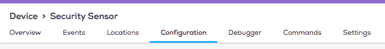T2】](https://res.cloudinary.com/practicaldev/image/fetch/s--ynNrG6K5--/c_limit%2Cf_auto%2Cfl_progressive%2Cq_auto%2Cw_880/https://s3-eu-west-1.amazonaws.com/wia-flarum-bucket/2018-08-01/1533132433-657688-screen-shot-2018-08-01-at-30656-pm.png)

# 发展

打开 Android Studio，开始一个新项目。填写必填字段:

[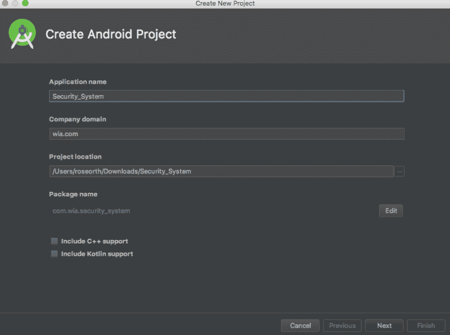T2】](https://res.cloudinary.com/practicaldev/image/fetch/s--vN2qk2ph--/c_limit%2Cf_auto%2Cfl_progressive%2Cq_auto%2Cw_880/https://s3-eu-west-1.amazonaws.com/wia-flarum-bucket/2018-08-01/1533132537-600290-screen-shot-2018-08-01-at-30837-pm.png)

单击下一步。对于目标设备，仅选择 **Android 事物**

[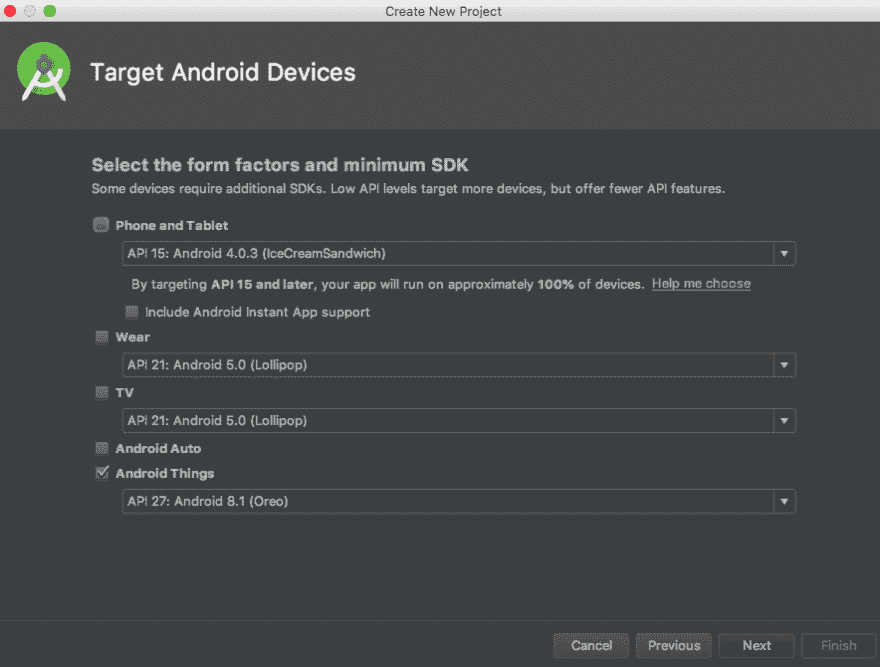T2】](https://res.cloudinary.com/practicaldev/image/fetch/s--IXuAohB8--/c_limit%2Cf_auto%2Cfl_progressive%2Cq_auto%2Cw_880/https://s3-eu-west-1.amazonaws.com/wia-flarum-bucket/2018-08-01/1533132621-852102-screen-shot-2018-08-01-at-30923-pm.png)

单击下一步。选择**空活动**
[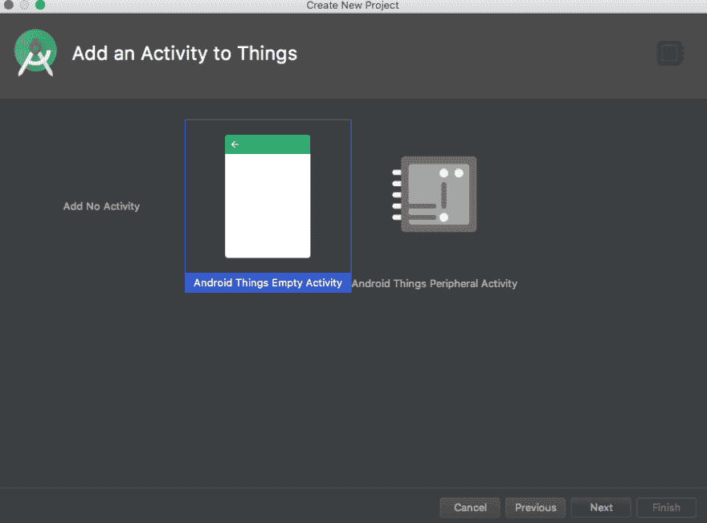](https://res.cloudinary.com/practicaldev/image/fetch/s--s_R-k1E---/c_limit%2Cf_auto%2Cfl_progressive%2Cq_auto%2Cw_880/https://s3-eu-west-1.amazonaws.com/wia-flarum-bucket/2018-08-01/1533132671-628979-screen-shot-2018-08-01-at-31037-pm.png)

单击下一步，然后单击完成。

在左侧栏中，单击`Gradle Scripts > build.gradle (Module: app)`，并在 dependencies 中输入这行代码:

`implementation 'io.wia:wia-android-sdk:0.3.1'`

您的屏幕应该是这样的:

[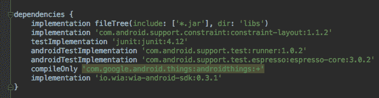T2】](https://res.cloudinary.com/practicaldev/image/fetch/s--lDg0FI74--/c_limit%2Cf_auto%2Cfl_progressive%2Cq_auto%2Cw_880/https://s3-eu-west-1.amazonaws.com/wia-flarum-bucket/2018-08-01/1533132806-636386-screen-shot-2018-08-01-at-31308-pm.png)

现在，是时候把树莓派和我们的项目联系起来了。对于这一步，您需要知道树莓 pi 的 IP 地址。在终端中，运行以下命令:

`adb connect Your-Raspberry-Pi-IP-address)`

打开 Android Studio。将这段代码复制并粘贴到 MainActivity.java:

```
 import android.app.Activity;
import android.os.Bundle;

import android.util.Log;

import com.google.android.things.pio.Gpio;
import com.google.android.things.pio.PeripheralManager;

import io.reactivex.Observable;
import io.reactivex.android.schedulers.AndroidSchedulers;
import io.reactivex.schedulers.Schedulers;
import io.wia.Wia;

import io.wia.WiaEvent;

public class MainActivity extends Activity implements MotionsSensor.Listener {

    private static final String GPIO_PIN = "BCM18";
    private PirMotionSensor motionSensor;
    private static final String TAG = "TEST";
    private Gpio mGpio;

    @Override
    protected void onCreate(Bundle savedInstanceState) {
        super.onCreate(savedInstanceState);
        PeripheralManager pms = PeripheralManager.getInstance();
        try {
            mGpio = pms.openGpio(GPIO_PIN);
            motionSensor = new PirMotionSensor(mGpio, this);
            motionSensor.startup();
        } catch (Exception ex) {
            Log.d(TAG, "failing", ex);
        }
        Log.d(TAG, "IN ON CREATE FUNCTION.");

        Wia.initialize(new Wia.Configuration.Builder(this.getApplicationContext())
                .server("https://api.wia.io/v1")
                .build()
        );
        //replace this with your own device secret key 
        Wia.accessToken("your-device-secret-key");

    }

    @Override
    public void onMovement() {
        Log.d(TAG, "in onMovement");
        Log.d(TAG, "MOVEMENT DETECTED");
        Observable<WiaEvent> result = Wia.createEvent("motion");
        result.subscribeOn(Schedulers.io())
                .observeOn(AndroidSchedulers.mainThread())
                .subscribe(response -> {
                    Log.d(TAG, "In onMovement function");
                }, error -> {
                    Log.d(TAG, "ERROR IN MOVEMENT EVENT");
                });
    } 
```

Enter fullscreen mode Exit fullscreen mode

在代码中，在 Android Studio 的第 45 行找到这一行:

```
//replace this with your own device secret key 
        Wia.accessToken("your-device-secret-key"); 
```

Enter fullscreen mode Exit fullscreen mode

将`"your-device-secret-key"`更改为您自己的设备密钥。这可以在您所在空间的 Wia 仪表盘>设备>配置中找到。关键是从`d_sk`开始。

在左侧菜单中，导航至`App > Java`并右击包名。选择`New > New Java Class`，命名为`PirMotionSensor`。

[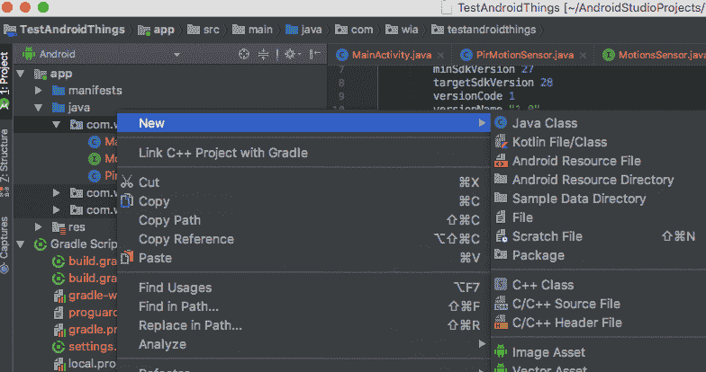T2】](https://res.cloudinary.com/practicaldev/image/fetch/s--FvfWhmIF--/c_limit%2Cf_auto%2Cfl_progressive%2Cq_auto%2Cw_880/https://s3-eu-west-1.amazonaws.com/wia-flarum-bucket/2018-08-01/1533133032-750953-screen-shot-2018-08-01-at-31653-pm.png)

然后，将这段代码复制并粘贴到类`PirMotionSensor` :
中

```
 import android.util.Log;

import com.google.android.things.pio.Gpio;
import com.google.android.things.pio.GpioCallback;

import java.io.IOException;

public class PirMotionSensor implements MotionsSensor {
    private final Gpio bus;
    private final MotionsSensor.Listener listener;

    PirMotionSensor(Gpio bus, Listener listener) {
        this.bus = bus;
        this.listener = listener;
    }

    @Override
    public void startup() {
        try {
            bus.setDirection(Gpio.DIRECTION_IN);
            bus.setActiveType(Gpio.ACTIVE_HIGH);
            bus.setEdgeTriggerType(Gpio.EDGE_FALLING);
        } catch (IOException e) {
            throw new IllegalStateException("Sensor can't start", e);
        }
        try {
            bus.registerGpioCallback(callback);
        } catch (IOException e) {
            throw new IllegalStateException("Sensor can't register callback", e);
        }
    }

    private final GpioCallback callback = new GpioCallback() {
        @Override
        public boolean onGpioEdge(Gpio gpio) {
            listener.onMovement();
            return true; // True to continue listening
        }
    };

    @Override
    public void shutdown() {
        bus.unregisterGpioCallback(callback);
        try {
            bus.close();
        } catch (IOException e) {
            Log.e("TEST", "Failed to shut down. You might get errors next time you try to start.", e);
        }
    }

} 
```

Enter fullscreen mode Exit fullscreen mode

在左侧菜单中，再次导航至`App > Java`并右击包名。选择`New > New Java Class`。在弹出的屏幕中，将字段`Kind`从`Class`改为`Interface`。命名接口`MotionsSensor`。

[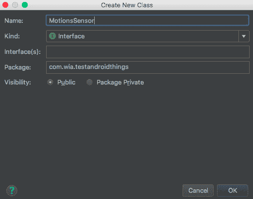T2】](https://res.cloudinary.com/practicaldev/image/fetch/s--zWXUY5-M--/c_limit%2Cf_auto%2Cfl_progressive%2Cq_auto%2Cw_880/https://s3-eu-west-1.amazonaws.com/wia-flarum-bucket/2018-08-01/1533133111-288389-screen-shot-2018-08-01-at-31817-pm.png)

然后，将这段代码复制粘贴到界面:

```
public interface MotionsSensor {
    void startup();

    void shutdown();

    interface Listener {
        void onMovement();
    }
} 
```

Enter fullscreen mode Exit fullscreen mode

点击运行，在下一个屏幕中选择`Google_Iot_rpi3`作为设备。

返回到 [Wia 仪表板](https://dashboard.wia.io/login)。在调试器标签中，您可以看到您的事件实时出现！每次检测到运动时，都会将事件发送到 Wia。

为了更进一步，您可以使用 [Wia 平台](https://dashboard.wia.io/login)在检测到运动时向您发送通知。

# 威亚流

在左侧栏中，导航到`Flows`并添加一个新流。随便你给它起什么名字。从`Trigger`选项卡中，拖动一个`Create Event`节点。将该节点命名为`motion`并选择您的设备。

接下来，在`Logic`选项卡中，拖动一个`run-function`节点。将此代码复制并粘贴到框中:

```
if (input.body.name == "motion") { 
  output.body.data = "motion detected"; 
}
else {
  output.body.data = "no motion"; 
} 
```

Enter fullscreen mode Exit fullscreen mode

通过拖动橙色点来连接节点。

[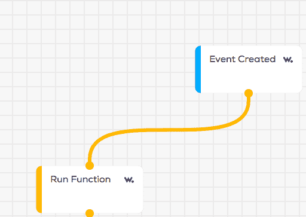T2】](https://res.cloudinary.com/practicaldev/image/fetch/s--e88tkFE6--/c_limit%2Cf_auto%2Cfl_progressive%2Cq_auto%2Cw_880/https://s3-eu-west-1.amazonaws.com/wia-flarum-bucket/2018-08-01/1533133364-116441-screen-shot-2018-08-01-at-32226-pm.png)

然后，在`Action`选项卡中，拖动一个`Notification`节点。输入“检测到运动！”作为信息。当检测到运动时，该流将向 Wia 移动应用发送通知。

[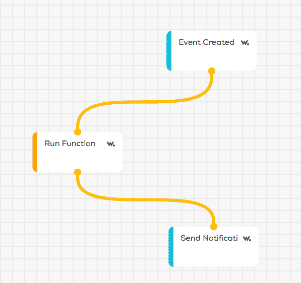T2】](https://res.cloudinary.com/practicaldev/image/fetch/s--jYd0I9iw--/c_limit%2Cf_auto%2Cfl_progressive%2Cq_auto%2Cw_880/https://s3-eu-west-1.amazonaws.com/wia-flarum-bucket/2018-08-01/1533133387-403898-screen-shot-2018-08-01-at-32255-pm.png)

#### PIR 传感器灵敏度测量

PIR 传感器允许您更改延迟时间和灵敏度级别。

PIR 传感器是一种数字设备。这意味着它读取两个值:高和低。当传感器检测到移动时，读数为高。否则，读数为低。

延迟设置决定了 PIR 传感器检测到运动后多长时间读取高电平。灵敏度传感器决定了 PIR 传感器记录运动的接近程度。该传感器设置为较低的接近度时会更精确。您可以使用橙色面板控制这些设置，这些面板位于您用来连接设备的针脚正对面。