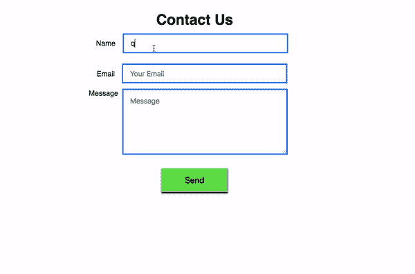
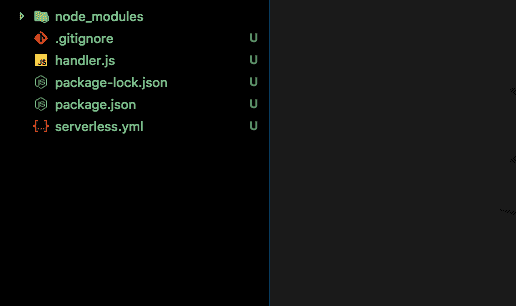

# 如何构建自己的无服务器联系人表单

> 原文：<https://dev.to/sait/how-to-build-your-own-serverless-contact-form---3mkn>

静态网站是使用 Html、CSS 和 JavaScript 开发的。你不需要设置任何数据库或服务器。GitHub，Netlify 为我们提供免费的静态网站托管服务，方法是在网站上添加一个联系表单，即使没有用户访问你的网站，你也需要为服务器付费。通过使用无服务器 Aws 只有当有人点击你的网页时才收费，如果没有流量就意味着不收费。

#### 在本文中，您将了解如何使用 SES(简单电子邮件服务)、Aws Lambda 和无服务器框架构建无服务器联系人表单。

[T2】](https://res.cloudinary.com/practicaldev/image/fetch/s---wdzajMn--/c_limit%2Cf_auto%2Cfl_progressive%2Cq_66%2Cw_880/https://thepracticaldev.s3.amazonaws.com/i/23yriddx3cajprkhuk95.gif)

# 什么是需求？

1.  [Aws 账户](https://aws.amazon.com/free/)
2.  Nodejs
3.  无服务器框架 cli。
4.  [DashBird 账户](https://dashbird.io/)

让我们构建一个无服务器的联系表单

[T2】](https://res.cloudinary.com/practicaldev/image/fetch/s---5pqMbuf--/c_limit%2Cf_auto%2Cfl_progressive%2Cq_auto%2Cw_880/https://thepracticaldev.s3.amazonaws.com/i/sz4vykzhxho5d026dy8w.png)

### 首先我们需要安装无服务器框架 cli。

打开您的终端并运行以下命令。

```
npm install -g serverless

sls login // SLS is a shortcut of serverless 
```

Enter fullscreen mode Exit fullscreen mode

[T2】](https://res.cloudinary.com/practicaldev/image/fetch/s--FyGfA6Hb--/c_limit%2Cf_auto%2Cfl_progressive%2Cq_auto%2Cw_880/https://thepracticaldev.s3.amazonaws.com/i/tgjftjzfdzahedv83dca.png)

### SLS 登录后，需要用无服务器框架配置自己的 Aws 凭证。

**[获取 Aws 凭证](https://www.youtube.com/watch?v=tgb_MRVylWw)**

[T2】](https://res.cloudinary.com/practicaldev/image/fetch/s--dNW_opEB--/c_limit%2Cf_auto%2Cfl_progressive%2Cq_auto%2Cw_880/https://thepracticaldev.s3.amazonaws.com/i/nww9ss77kdrkqu3fmuw9.png)

### 在你的 Pc 上新建一个目录。

```
mkdir contactform
cd contactfrom 
```

Enter fullscreen mode Exit fullscreen mode

[T2】](https://res.cloudinary.com/practicaldev/image/fetch/s--F2Zm8x8I--/c_limit%2Cf_auto%2Cfl_progressive%2Cq_auto%2Cw_880/https://thepracticaldev.s3.amazonaws.com/i/l9mfxw87p5u90zmjqrdf.png)

### 无服务器为我们提供了不同类型的模板，但是我们使用 nodejs 作为我们的后端，所以我们正在创建 Nodejs 模板。

```
serverless create --template aws-nodejs 
```

Enter fullscreen mode Exit fullscreen mode

上面的命令生成了样板文件。

[T2】](https://res.cloudinary.com/practicaldev/image/fetch/s--kT8UjiBA--/c_limit%2Cf_auto%2Cfl_progressive%2Cq_auto%2Cw_880/https://thepracticaldev.s3.amazonaws.com/i/a5k7f82n0g7wkl9p212c.png)

### 现在我们需要初始化 Package.json 文件，安装一些依赖项。

```
npm init -y // generates package.json file

npm i -s body-parser cors express serverless-http aws-sdk 
```

Enter fullscreen mode Exit fullscreen mode

现在在你最喜欢的代码编辑器中打开联系人表格文件夹。

[T2】](https://res.cloudinary.com/practicaldev/image/fetch/s--D6o_jXbP--/c_limit%2Cf_auto%2Cfl_progressive%2Cq_auto%2Cw_880/https://thepracticaldev.s3.amazonaws.com/i/i9kwuzdx548wm3g2jm9h.png)

# 导航到 handler.js 文件

清除 handler.js 中的所有内容，因为我们正在从头开始编写它。