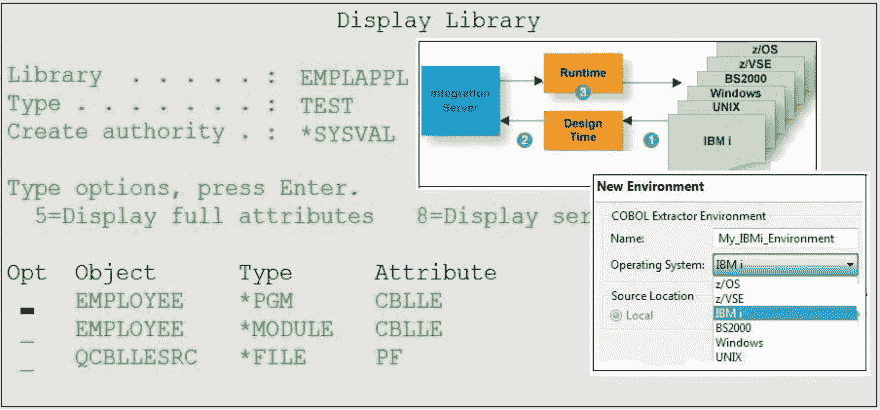
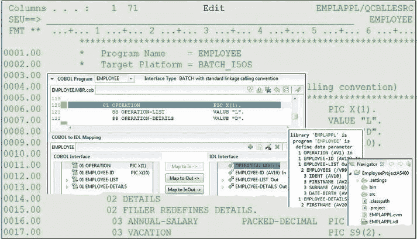
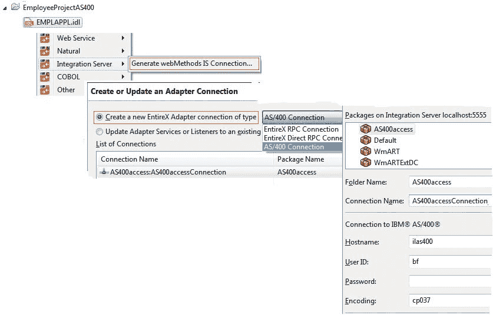
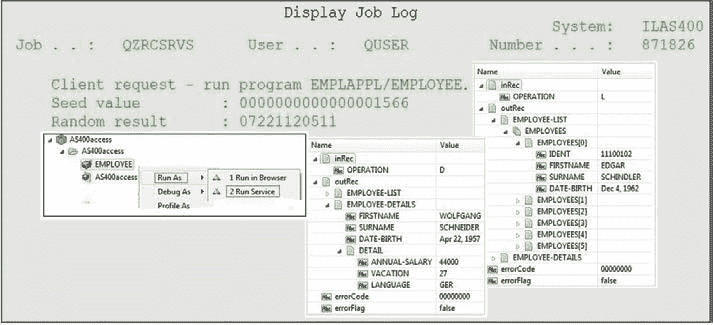
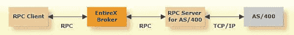

# 如何从集成服务器调用 IBM i (AS/400)上的 COBOL

> 原文：<https://dev.to/techcommunity/how-to-call-cobol-on-ibm-i-as-400-from-integration-server-42i5>

# webMethods EntireX

使用 EntireX 从 webMethods Integration Server 调用 COBOL 很容易。阅读 EntireX 如何帮助您快速获得结果，即使没有特定的 COBOL 知识。

*由 Adabas & Natural 公司产品管理总监 Juergen Lind 和软件公司高级首席软件专家 Bernhard Fricke*

| 2018 年第三期 | [ 下载 PDFT4】](http://bit.ly/2L8O13F) |
| --- | --- |

## 场景

多年来，您一直使用 AS/400 (System i)机器来运行您的业务关键型和任务关键型应用程序。

如今，我们需要应对新的市场。用新技术开发的新应用程序需要能够使用您现有的运行在 AS/400 上的 COBOL 应用程序，而不是在多年来对这些核心业务应用程序投入大量投资后，不得不以高昂的成本重新开发它们。

您需要将各种 COBOL 应用程序连接到 webMethods Integration Server (IS)。

## 动手示例

AS/400 上的 COBOL 服务器雇员(图 1)需要从 IS 调用。使用 EntireX，您可以分三个阶段开发场景:1 提取 2 生成 3 测试

 

**图 1:**IBM I(AS/400 操作系统)的 AS/400 和 COBOL 环境上的 COBOL 服务器员工

开始提取之前，需要做好以下准备工作:

*   在 Software AG Designer 中创建项目。
*   在我们的例子中，COBOL 服务器雇员的源是 AS/400 的库 EMPLAPPL 中的文件 QCBLLESRC 的成员(图 1)。因此，您从 AS/400 下载(例如，通过 FTP)COBOL 源代码到 Software AG Designer 项目中。
*   对于提取，定义一个 IBM i 的 COBOL 环境(AS/400 操作系统):参见 Preferences Software AG > EntireX > COBOL > IDL Extractor for COBOL；按下按钮 Insert 并选择 IBM i 作为操作系统。
*   确保你处于软件 AG 设计者的整体视角中。

## 提取 COBOL 服务器子程序的接口

COBOL 提取通常使用 EntireX 完成。没有 AS/400 细节需要考虑。

 

**图 2:** 提取 AS/400 COBOL 服务器雇员

EntireX COBOL 提取的全套特性是可用的，因为它适用于其他 COBOL 环境(例如，z/OS、z/VSE、BS2000)。

## 快速路径提取

如果您需要快速的结果，请使用快速路径提取，如文章“如何从 webMethods Integration Server 调用 COBOL”(参见相关文章下的(2))中所述。快速路径提取自动包括**地图的发生依赖；**即可变大小表或 IDL 无界数组的 COBOL 术语，通常缩写为 ODO。

## 界面整形

使用接口整形来产生小的和现代化的 IS 服务，而不是一个大的 IS 服务。在不改变 COBOL 服务器本身的情况下，接口整形允许您:

*   **映射到多个 IDL 接口:**您的 COBOL 服务器实现了多个由操作或函数代码参数控制的函数。有了这个特性，您可以将每个 COBOL 函数映射到一个单独的、小而方便的 is 服务。您可以指定有意义的长 IS 服务名，而不是受限于 AS/400 的 10 个字符限制。参考前一篇技术文章:“如何从 webMethods Integration Server 构建对 COBOL 的调用——现代方式”(参见相关文章下的(1 ))了解更多信息。
*   **映射到 in，out，****inout*** * *:定义 IS 服务的输入/输出签名。
*   **选择重定义路径:**重定义的参数或其重定义之一可作为 is 字段。
*   **抑制不需要的 COBOL 数据项:**COBOL 参数在 IS 服务中不作为 IS 字段存在。
*   **将 COBOL 数据项设置为常量:**COBOL 参数在 IS 服务中不作为 IS 字段存在。常量值由 EntireX 运行时在内部提供。

使用*抑制*和*设置常量*保持对相关数据项的关注，保持客户端界面的整洁。它还可以提高性能。

更多信息请参考 EntireX 文档:

Software AG IDL Extractor for COBOL>COBOL Mapping Editor>IDL Extraction per Interface Type>(接口类型)标准链接>Mapping Editor IDL Interface Mapping Functions。

## 生成 IS 服务和 IS 连接

您以通常的方式生成连接和集成服务器服务:使用软件 AG IDL 的上下文菜单并调用*集成服务器>生成 webMethods IS 连接...*

 

**图 3:** 生成 IS 服务和连接

当然，您必须选择类型 AS/400 Connection(见图 3)，然后指定目标包、文件夹、连接名和主机名。

## 测试是服务于 AS/400 上的 COBOL 服务器

对于测试，使用服务开发视角，就像您对其他 IS 服务测试一样。在生成的 IS 服务的上下文菜单中，选择运行方式>运行服务...

 

**图 4:** 从 IS 调用 AS/400 COBOL 服务器

## 休息启用

对于 EntireX 10.3 (GA: 2018Oct)，IS 服务生成向导将允许同时在 IS 上生成 REST 资源。这将为进一步的 API 管理打开所有后端服务。

## RPC 服务器为 AS/400

要从 webMethods IS 以外的环境访问 AS/400 服务器，请使用 AS/400 的 RPC 服务器。AS/400 的典型架构由 RPC 客户端、EntireX 代理和 RPC 服务器组成。AS/400 的 RPC 服务器一端作为 RPC 服务器，另一端作为客户端调用 AS/400 服务器程序。

 

**图 5:** 从 webMethods 以外的环境访问 AS/400 服务器的架构图为

## 总结

正如所展示的，开发一个在 AS/400 上调用 COBOL 的场景是非常容易的。从设计阶段到运行时，你可以依靠 EntireX 为你做所有的工作。特定于 COBOL 的数据类型被自动映射到合适的 IS 数据类型。

要了解更多信息，请阅读 webMethods EntireX 文档中的[常见集成场景](https://documentation.softwareag.com/webmethods/wmsuites/wmsuite9-9/EntireX/9-9_EntireX/scenarios/overview.htm)。

## 相关文章

"[如何从 webMethods Integration Server-the modern way](http://techcommunity.softwareag.com/techniques-blog/-/blogs/how-to-shape-a-call-to-cobol-from-webmethods-integration-server-the-modern-way)"技巧，2018 年 1 月(第 1 期)

" [如何从 webMethods Integration Server 调用 COBOL](http://techcommunity.softwareag.com/techniques-blog/-/blogs/webmethods-entir-2)，"

技巧，2017 年 4 月(第 2 期)

" [如何从 COBOL-大型机出站调用 web methods Integration Server，](http://techcommunity.softwareag.com/techniques-blog/-/blogs/how-to-call-webmethods-integration-server-from-cobol-mainframe-outbound)技巧，2016 年 4 月(第 4 期)

**AS/400**–中端硬件；又称 iSeries，iSeries i5 系统一

**IDL**–接口描述语言

**接口形成**–高级提取形成对 COBOL 的调用；也称为用户定义映射，产生 IDL 和 CVM(客户端服务器映射)文件

**是**–web methods 集成服务器

**根据表**发生–可变长度的 COBOL 数组

**OS/400**–中端操作系统；也称为 i5/OS，IBM i

**重定义**–不同数据项描述的相同存储区

REST–表述性状态转移:一种允许描述万维网结构和行为的范例