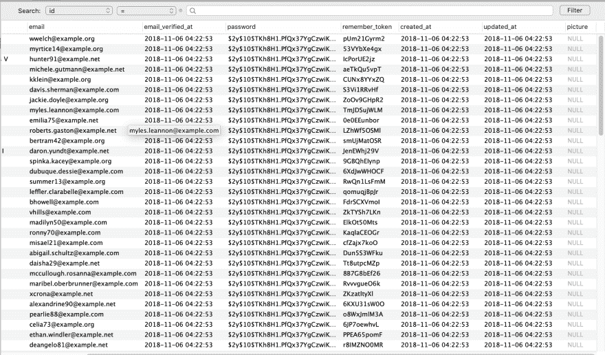

# 如何通过迁移改变表结构而不丢失数据

> 原文：<https://dev.to/nromero125/how-to-change-tables-structures-with-migration-without-losing-your-data-in-laravel-26fc>

这是我一直问自己的问题。“如何在不直接访问数据库或回滚迁移的情况下向表中添加新列？”

Laravel 不像 Django 或 Entity Framework 那样通过模型自动生成迁移，但是我们需要手动完成。

假设您有一个生产中的应用程序，您需要向用户表中添加一个新列。您可以创建一个新的迁移来更新现有的表，而不是回滚您的迁移(这会导致数据丢失)。

**我们走吧**

我们已经完成了用户表的初始迁移，我们希望添加一个名为 picture 的列:
[](https://res.cloudinary.com/practicaldev/image/fetch/s--HYiH68UM--/c_limit%2Cf_auto%2Cfl_progressive%2Cq_auto%2Cw_880/https://thepracticaldev.s3.amazonaws.com/i/6qnv814kos5xcq5t553p.png)

我们执行以下命令:

```
$ php artisan make:migration add_picture_column_to_user_table --table=users 
```

这个命令将创建一个新的迁移文件，我们将在其中添加新的列。
[T3】](https://res.cloudinary.com/practicaldev/image/fetch/s--YRzJ1VsK--/c_limit%2Cf_auto%2Cfl_progressive%2Cq_auto%2Cw_880/https://thepracticaldev.s3.amazonaws.com/i/zt85j1lvcmmjxuyp1x1t.png)

然后使用`php artisan migrate`运行迁移，就这样。您将在 users 表中拥有这个新列，而不会丢失以前存储的数据。

[T2】](https://res.cloudinary.com/practicaldev/image/fetch/s--b2MQyOis--/c_limit%2Cf_auto%2Cfl_progressive%2Cq_auto%2Cw_880/https://thepracticaldev.s3.amazonaws.com/i/zk73c16wh2s9i63uwvf0.png)