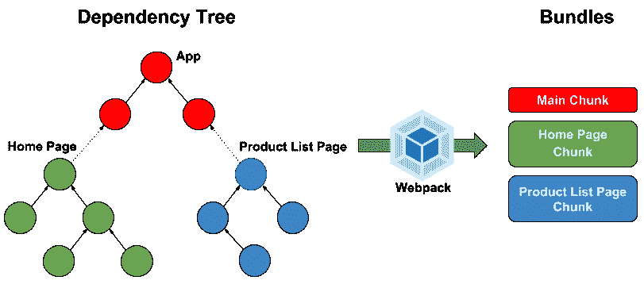

# 如何编码拆分 Redux store 以进一步提高应用程序的性能

> 原文：<https://dev.to/websavi/how-to-code-split-redux-store-to-further-improve-your-apps-performance-4gg9>

如今，为了在用户访问我们的网站时实现最佳的应用加载时间，我们对网络上传输的每一个字节的代码都提出了质疑。

假设一个用户正在访问一个电子商务网站的主页(react & redux)。为了获得最佳的交互时间，javascript 包应该只包含渲染主页上方部分所需的 UI 组件。在访问这些页面之前，我们不应该加载产品列表或结帐的代码。

为此，您可以:

1.  延迟加载路由——每个路由的 UI 组件都包含在按需绑定包中。
2.  延迟加载页面下方的组件。

**减速器呢？**
与组件不同，主包包含所有的缩减器，而不仅仅是 homepage 需要的那些。我们不能这么做的原因是-

1.  最佳实践是保持 redux 状态树平坦 reducers 之间没有父子关系来创建代码分割点。
2.  组件和缩减器的模块依赖树不同。因此，商店的依赖关系树包含应用程序的所有 reducers，即使存储的数据由主组件或按需组件使用。
3.  关于组件中使用哪些数据的知识是业务逻辑，或者至少是不可静态分析的- `mapStateToProps`是运行时功能。
4.  Redux store API 不支持开箱即用的代码分割，在创建存储之前，所有的 Reducer 都需要成为 rootReducer 的一部分。但是等等，在开发期间，每当我更新我的 reducer 代码，我的存储就会通过 **webpack 的热模块替换**得到更新。这是怎么回事？是的，为此我们重新创建 rootReducer 并使用 **store.replaceReducer API** 。这不像切换单个减速器或添加新减速器那样简单。

有没有遇到什么不熟悉的概念？请参考下面的链接和描述，以获得对 redux、模块和 webpack 的基本了解。

*   redux——一个管理应用状态的简单库，[核心概念](https://redux.js.org/introduction/coreconcepts)，[和 react](https://redux.js.org/basics/usagewithreact) 。
*   模块- [介绍](https://medium.com/@kimberleycook/intro-to-webpack-1d035a47028d)、 [es6 模块](https://www.sitepoint.com/understanding-es6-modules/)、[动态导入](https://www.sitepoint.com/understanding-es6-modules/)
*   依赖树——如果`moduleB`在`moduleA`中被导入，那么`moduleB`是`moduleA`的依赖，如果`moduleC`在`moduleB`中被导入，那么结果依赖树是- `moduleA -> moduleB -> moduleC`。像 webpack 这样的捆绑器遍历这个依赖树来捆绑代码库。
*   代码分割——当父模块使用动态导入来导入子模块时，webpack 将子模块及其依赖项捆绑在一个不同的构建文件中，该文件将在运行时运行导入调用时由客户端加载。Webpack 遍历代码库中的模块，并生成要由浏览器加载的包。

现在你已经熟悉了上面的概念，让我们开始吧。

我们来看一个 react-redux app -

的典型结构

```
// rootReducer.js
export default combineReducers({
  home: homeReducer,
  productList: productListReducer
});

// store.js
export default createStore(rootReducer/* , initialState, enhancer */);

// Root.js
import store from './store';
import AppContainer from './AppContainer';

export default function Root() {
  return (
    <Provider store={store}>
      <AppContainer />
    </Provider>
  );
} 
```

Enter fullscreen mode Exit fullscreen mode

首先创建 rootReducer 和 redux 存储，然后将存储导入到根组件中。这导致了如下所示的依赖关系树

```
RootComponent.js
|_store.js
| |_rootReducer.js
|   |_homeReducer.js
|   |_productListReducer.js
|_AppContainer.js
  |_App.js
  |_HomePageContainer.js
  | |_HomePage.js
  |_ProductListPageContainer.js
    |_ProductListPage.js 
```

Enter fullscreen mode Exit fullscreen mode

**我们的目标是合并 store 和 AppContainer -**
的依赖树，以便当一个组件被代码分割时，webpack 将这个组件和相应的缩减器捆绑在按需块中。让我们看看期望的依赖树可能是什么样子-

```
RootComponent.js
|_AppContainer.js
  |_App.js
  |_HomePageContainer.js
  | |_HomePage.js
  | |_homeReducer.js
  |_ProductListPageContainer.js
    |_ProductListPage.js
    |_productListReducer.js 
```

Enter fullscreen mode Exit fullscreen mode

如果你观察的话。您会注意到依赖关系树中没有存储！

在上面的依存关系树中

1.  比方说`ProductListPageContainer`是在`AppContainer`中动态导入的。Webpack 现在在按需块中而不是在主块中构建`productListReducer`。
2.  现在，每个减压器都被导入并注册到商店的一个容器中。

*有意思！现在容器不仅绑定了数据&动作，还绑定了还原器。*

现在让我们来看看如何实现这一点！

Redux store 期望 a `rootReducer`作为`createStore`的第一个参数。有了这个限制，我们需要两样东西-

*   在创建`rootReducer`之前使容器绑定还原器
*   一个更高层次的实体，它可以保存所有在`rootReducer`中出现的缩减器的定义，然后将它们打包成一个。

假设我们有一个名为 ***storeManager*** 的高阶实体，它提供了以下 API

*   sm.registerReducers()
*   sm.createStore()
*   sm.refreshStore()

下面是重构后的代码&带有`storeManager` -
的依赖树

```
// HomePageContainer.js
import storeManager from 'react-store-manager';
import homeReducer from './homeReducer';

storeManager.registerReducers({ home: homeReducer });

export default connect(/* mapStateToProps, mapDispatchToProps */)(HomePage);

// ProductListPageContainer.js
import storeManager from 'react-store-manager';
import productListReducer from './productListReducer';

storeManager.registerReducers({ productList: productListReducer });

export default connect(/* mapStateToProps, mapDispatchToProps */)(ProductListPage);

// AppContainer.js
import storeManager from 'react-store-manager';

const HomeRoute = Loadable({
  loader: import('./HomePageContainer'),
  loading: () => <div>Loading...</div>
});

const ProductListRoute = Loadable({
  loader: import('./ProductListPageContainer'),
  loading: () => <div>Loading...</div>
});

function AppContainer({login}) {
  return (
    <App login={login}>
      <Switch>
        <Route exact path="/" component={HomeRoute} />
        <Route exact path="/products" component={ProductListRoute} />
      </Switch>
    </App>
  );
}

export default connect(/* mapStateToProps, mapDispatchToProps */)(AppContainer);

// Root.js
import storeManager from 'react-store-manager';
import AppContainer from './AppContainer';

export default function Root() {
  return (
    <Provider store={storeManager.createStore(/* initialState, enhancer */)}>
      <AppContainer />
    </Provider>
  );
} 
```

Enter fullscreen mode Exit fullscreen mode

当 RootComponent 被挂载时，Reducers 被注册，Store 被创建。现在已经有了期望的依赖树

```
RootComponent.js
|_AppContainer.js
  |_App.js
  |_HomePageContainer.js
  | |_HomePage.js
  | |_homeReducer.js
  |_ProductListPageContainer.js
    |_ProductListPage.js
    |_productListReducer.js 
```

Enter fullscreen mode Exit fullscreen mode

现在，如果使用动态导入按需加载`ProductListPageContainer`，那么`productListReducer`也被移动到按需块中。

万岁！任务完成了？…差不多了

问题是，当按需块被加载时，按需块中存在的
`sm.registerReducers()`调用在 storeManager 上注册 redux，但不使用包含新注册的 redux 的新`rootReducer`来刷新 redux 存储。所以要更新商店的 rootReducer，我们需要使用 **redux 的 store.replaceReducer API** 。

所以当一个父对象(`AppContainer.js`)动态加载一个子对象(`ProductListPageContainer.js`)时，它只需要做一个`sm.refreshStore()`调用。因此，在`ProductListPageContainer`可以开始访问数据或触发动作之前，该存储具有`productListReducer`数据点`productList`。

```
// AppContainer.js
import {withRefreshedStore} from 'react-store-manager';

const HomeRoute = Loadable({
  loader: withRefreshedStore(import('./HomePageContainer')),
  loading: () => <div>Loading...</div>
});

const ProductListRoute = Loadable({
  loader: withRefreshedStore(import('./ProductListPageContainer')),
  loading: () => <div>Loading...</div>
});

function AppContainer({login}) {
  return (
    <App login={login}>
      <Switch>
        <Route exact path="/" component={HomeRoute} />
        <Route exact path="/products" component={ProductListRoute} />
      </Switch>
    </App>
  );
} 
```

Enter fullscreen mode Exit fullscreen mode

我们看到了`storeManager`如何帮助我们实现目标。让我们来实现它-

```
import { createStore, combineReducers } from 'redux';

const reduceReducers = (reducers) => (state, action) =>
  reducers.reduce((result, reducer) => (
    reducer(result, action)
  ), state);

export const storeManager = {
  store: null,
  reducerMap: {},
  registerReducers(reducerMap) {
    Object.entries(reducerMap).forEach(([name, reducer]) => {
      if (!this.reducerMap[name]) this.reducerMap[name] = [];

      this.reducerMap[name].push(reducer);
    });
  },
  createRootReducer() {
    return (
      combineReducers(Object.keys(this.reducerMap).reduce((result, key) => Object.assign(result, {
        [key]: reduceReducers(this.reducerMap[key]),
      }), {}))
    );
  },
  createStore(...args) {
    this.store = createStore(this.createRootReducer(), ...args);

    return this.store;
  },
  refreshStore() {
    this.store.replaceReducer(this.createRootReducer());
  },
};

export const withRefreshedStore = (importPromise) => (
  importPromise
    .then((module) => {
      storeManager.refreshStore();
      return module;
    },
    (error) => {
      throw error;
    })
);

export default storeManager; 
```

Enter fullscreen mode Exit fullscreen mode

您可以将上面的代码片段用作代码库中的模块，或者使用下面列出的 npm 包-

## /[冗余店长](https://github.com/sagiavinash/redux-store-manager)

### 使用 redux-store-manager 声明性地对 redux 存储进行代码分割，并使容器拥有整个 redux 流

<article class="markdown-body entry-content container-lg" itemprop="text">

# redux 商店经理

使用 redux-store-manager 声明性地对 redux 存储进行代码分割，并使容器拥有整个 redux 流

## 装置

```
yarn add redux-store-manager
```

Enter fullscreen mode Exit fullscreen mode

## 问题

1.  传统上，rootReducer 是使用 combineReducers 手动创建的，这使得基于消耗其数据的小部件的加载方式(无论它们是在主捆绑包中还是在按需捆绑包中)的代码分割 Reducer 变得很困难。
2.  Bundler 不能树抖动或死代码消除 rootReducer 以不包括其数据不被任何容器组件消费的 Reducer

## 解决办法

1.  让将要使用缩减器存储的数据并触发动作的容器负责向存储区添加一个缩减器。这使得容器通过链接拥有整个 redux 流
    *   **动作**通过 **mapDispatchToProps** 作为组件道具
    *   **Reducer** 负责通过**store manager . register reduers**更新数据
    *   **数据**通过 **mapStateToProps** 作为组件道具
2.  使用 redux store 的 replaceReducer API，无论在按需块加载时注册了什么 Reducer，都会刷新存储…

</article>

[View on GitHub](https://github.com/sagiavinash/redux-store-manager)

向尚未开发的构建优化领域问好:)

喜欢这个概念？-请分享文章并启动 git repo:)