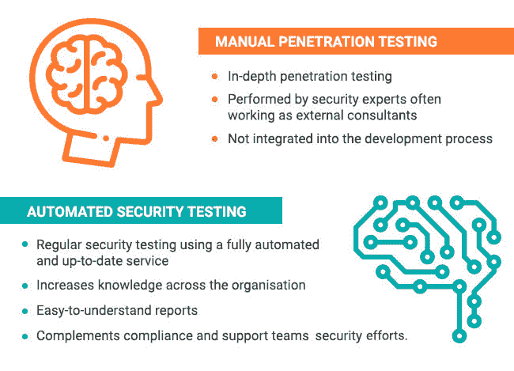

# 如何将 Pentest 与自动化相结合以提高安全性

> 原文：<https://dev.to/adrielaraujoar/how-to-combine-pentest-with-automation-to-improve-your-security-4pkc>

如果你最近几年参与了软件开发，那么你应该知道术语“渗透测试”。

渗透测试(或 pentest)一如既往地流行。我不断发现一些组织在 pentest 上花了很多钱作为他们的主要安全手段，在生产过程中定期测试，但他们仍然不断受到黑客攻击。

新的数字技术和现代计算机平台使组织能够快速交付新产品和服务，创建灵活的业务模式和收入流，并提高运营效率。

然而，更快地部署变更是一把双刃剑。考虑一下当变更包含错误或者安全问题时会发生什么？如果没有适当的系统来防止有缺陷的变更被发布，我们也有让我们的系统更快崩溃的风险。

在这个充满挑战的软件环境中，企业需要一种新的方法:年度审计已经不够了。在本文中，我们解释了如何将手动渗透测试与自动化安全测试相结合来提高安全性。

## 现代应用的新技术

将手动渗透测试和自动安全测试结合起来，可以得到一种全面有效的安全方法。虽然它们不同，但并不相互排斥。

深入的手动测试清除了复杂的攻击媒介。然而，每天推送的代码量带来了挑战，因为安全团队越来越难以跟踪最新的威胁。在自动化工具的帮助下，可以在新代码投入生产之前发现问题。

## 结合年度渗透测试和自动化安全测试有什么好处？

通过使用自动化工具，开发人员可以在整个开发周期中识别和解决安全问题。因此，当您的开发团队在实现产品更新之前解决安全问题时，pentesters 将专注于复杂的向量，优化时间和成本。

[T2】](https://res.cloudinary.com/practicaldev/image/fetch/s--mk2eXayp--/c_limit%2Cf_auto%2Cfl_progressive%2Cq_auto%2Cw_880/https://blog.hackmetrix.com/wp-content/uploads/2018/08/penetration_testing_vs_automated_security_testing.jpg)

## 如何自动化您的安全测试？

如果您的团队中有一位专家，或者您在 sprint 中有一些空闲时间，您可以集成内部和开源工具，如 Nessus、Acunetix、Vega、OpenVas 等。提高平台的安全性。

这些工具对计算机安全有不同的方法，公司经常使用几种解决方案从各个角度测试它们的安全性。

首先，您必须创建通过 API 与每个工具通信的脚本。然后，您可以自动扫描和报告；您可以通过 Jenkins、Cron Jobs 或在持续集成的管道中集成 Webhook 回调来实现这一点。

这个过程非常耗时，需要分析每个解决方案并开发新的脚本来适应每个工具。集成多种工具是一项挑战，也是一项持续的工作。

作为一个可能集成的例子，[您可以使用 Python 开发的代码](https://raw.githubusercontent.com/hhvn/openvasrun/master/openvasrun.py)通过 OpenVAS 执行漏洞扫描。

大多数商业工具的许可费用昂贵，并且通常依赖于内部服务器，因此没有解决方案可以让中小型公司和开发人员以较低的成本获得高质量的结果。这些技术中的大部分是在开发周期中敏捷方法兴起之前开发的，因此项目交付时间经常受到影响，或者公司面临交付项目然后稍后构建安全性的困境(这通常没有完成)。

## 旁白:Hackmetrix

Hackmetrix 执行全自动测试，以识别您的 web 应用程序上的安全问题。我们集成了市场上最好的工具，包括开源工具和我们团队开发的工具，在传统工具不足的地方取得了成功。

开发人员通常有大量积压的事情要做，并且由于时间有限，安全测试经常被遗漏。对于任何一个开发人员来说，在跟上最新漏洞的同时手动测试他们的代码也几乎是不可能的。通过使用自动化工具，Hackmetrix 有助于在每个新版本发布之前发现安全问题，并将其作为开发人员正常工作流程的一部分。

最棒的是:你可以免费开始。

## 结论

使用本文中介绍的工具，您可以将自动化安全测试应用到更加复杂的项目中。你甚至可以尝试类似于这里使用的工具，比如不同的扫描仪，或者新的库。

我很期待看到你的作品。干杯！

声明:我是 Hackmetrix 的 CEO，但是，请随意投稿！:)