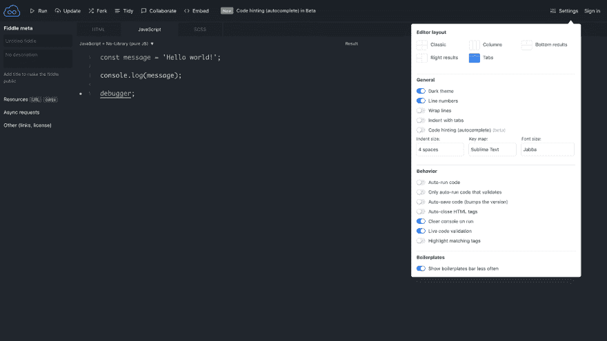
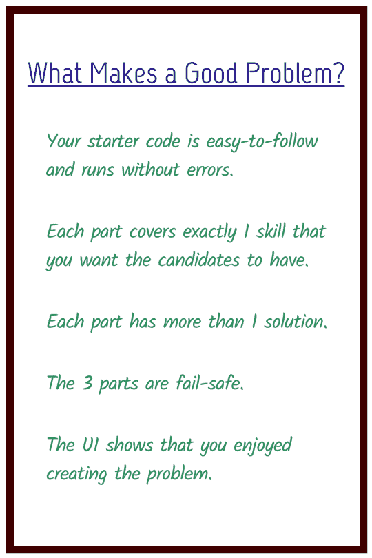
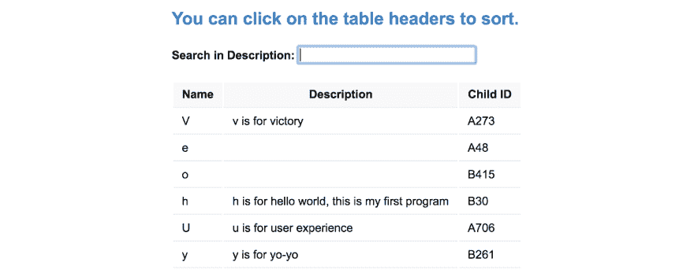
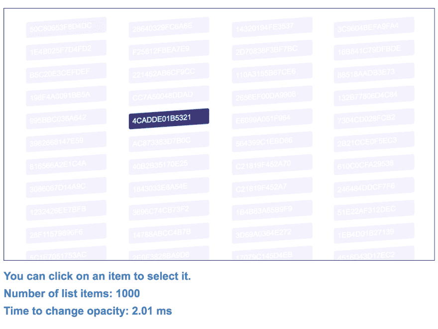
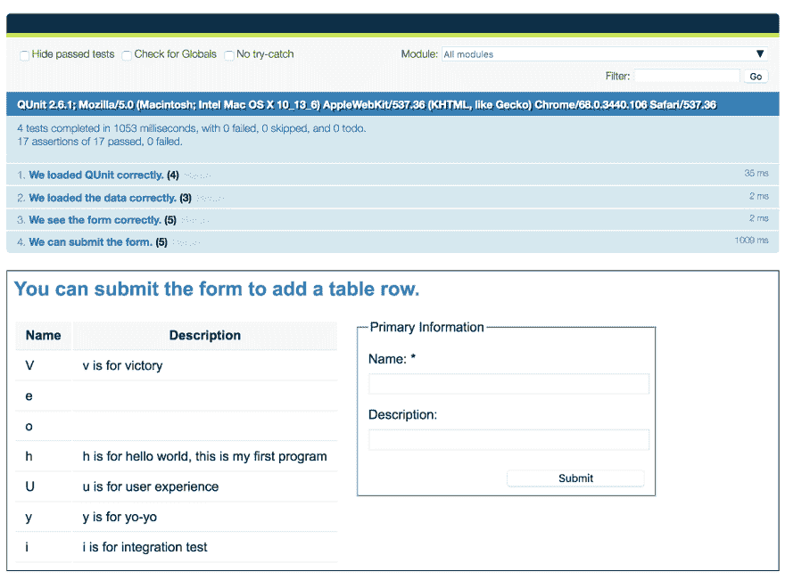

# 如何进行现场代码面试(有 3 个完整的问题)

> 原文：<https://dev.to/ijlee2/how-to-conduct-a-live-code-interview-with-3-full-problems-2h4n>

*原贴于[crunching numbers . live](https://crunchingnumbers.live/2018/09/08/how-to-conduct-a-live-code-interview/)T3】*

上个月，我第一次帮助招聘开发人员。用我在研究生院的教学技巧和演讲会的人际交往技巧来测试候选人的技术和软技能是很有趣的。我想候选人和我一起面试也很愉快。

我相信**现场编码**，如果我们做得好，是测试候选人的技术和软技能的一个很好的方式，并且让候选人看看我们是否是他们想要一起工作和学习的人。不幸的是，首先很难找到做现场代码访谈和写好问题的教程。更难发现实际问题，因为它们被保密以备将来使用。

在这篇文章中，我将根据我的教学经验，说明如何设置一个现场代码面试，以及如何写出好的问题。我将揭示我在面试中用过的 3 个问题——是的，下次我必须提出新的问题——并分析为什么每个问题都是好问题。

## 1。设置

我推荐使用 [JSFiddle](https://jsfiddle.net) 和 [Google Hangouts](https://hangouts.google.com/) 进行现场代码面试。JSFiddle 只允许您编写 1 个 HTML、1 个 JavaScript 和 1 个 CSS 文件，这迫使您限制问题的范围。它还允许您编写 Sass 和导入库。Hangouts 使**屏幕共享**变得简单。屏幕共享很棒，因为我可以在候选人的屏幕上查看控制台消息，并帮助他们调试代码。

<figure>

[T2】](https://res.cloudinary.com/practicaldev/image/fetch/s--MqT34FJg--/c_limit%2Cf_auto%2Cfl_progressive%2Cq_auto%2Cw_880/https://crunchingnumbersdotlive.files.wordpress.com/2018/09/google_hangouts.png)

<figcaption>Google Hangouts makes screen sharing simple.</figcaption>

</figure>

在我开始面试之前，我给我的候选人一个 [Hello World 项目](https://jsfiddle.net/rdjc1a6u/)并帮助他们浏览页面。我指引他们去**设置**，并推荐**标签**布局，这是一个提供大量空间的两栏布局。

<figure>

[T2】](https://res.cloudinary.com/practicaldev/image/fetch/s--K_8ZQ0U7--/c_limit%2Cf_auto%2Cfl_progressive%2Cq_auto%2Cw_880/https://crunchingnumbersdotlive.files.wordpress.com/2018/09/hello_world_project.png)

<figcaption>Help the candidate see that they can use **console.log** and **debugger** to solve problems.</figcaption>

</figure>

我还向候选人解释，正如 JavaScript 所示，他们可以使用 **console.log** 和**调试器**来解决问题，就像他们在正常情况下一样。我提醒候选人，欢迎他们使用谷歌，或者问我用什么方法(如果他们能凭记忆回忆，那就更好了)。最后，他们应该大声说出他们的想法，这样我就可以帮助他们，更好地评估他们的技能。

设置完成后，我制定了 1 小时面试的格式，并得到了候选人的认可:

> *   *In the first 5-10 minutes, I will ask you some questions about yourself.*
> *   *Next, I have 3 coding questions. Ideally, each problem takes 15-20 minutes to solve.*
> *   *Finally, you can ask me questions in the last 5-10 minutes.*
> *   *What do you think?*

这有助于应聘者为面试设定正确的期望和目标。我实际上是通过揭示有 3 个问题来创造一个诡计，因为我知道大多数候选人只会完成 1 或 2 个。我想了解候选人如何处理*为什么*他们超时了。

我不会通过透露我问的问题来涵盖人际关系问题。简而言之，我鼓励你设计一套适用于所有候选人的问题，并根据个人背景量身定制问题。我觉得人际关系题的目标应该是帮助考生放松，练习和我们说话。

是时候进行现场编码了！我们来看看如何写好题。

## 2。什么是好问题？

1 小时的面试，我推荐写 **3 个现实生活中的问题，每个问题 3 个部分**。现实生活中，我指的是你在工作中遇到的事情，候选人也会遇到。

对我来说，一个好问题满足这 5 个条件。如果你的问题不符合所有 5 条，试着再写一遍。

<figure>

[T2】](https://res.cloudinary.com/practicaldev/image/fetch/s--T5yHqtc1--/c_limit%2Cf_auto%2Cfl_progressive%2Cq_auto%2Cw_880/https://crunchingnumbersdotlive.files.wordpress.com/2018/09/what_makes_a_good_problem2.png%3Fw%3D540%26h%3D810)

<figcaption>If your problem does not meet these 5 conditions, try again.</figcaption>

</figure>

### a .你的入门代码简单易懂，运行无误。

通过编写一个干净、简单、运行无误的起始代码，我们帮助所有候选人从同一个地方开始。候选人后来引入的任何特征或错误都可以完全归咎于他们。

编写入门代码并不容易，需要实践。根据经验，使用清晰的名称，添加注释，以自然的方式介绍这三个部分，并指出候选人应该在哪里编写代码。

我建议您将起始代码交给同事来测试问题，并使用实时反馈进行迭代。(之后一定要给他们买啤酒或者咖啡！)

### b .每部分恰好涵盖 1 项你希望考生具备的技能。

如果我们期望我们的候选人知道如何做每一件事，那我们就是不讲道理。如果每个部分涵盖 1 项技能，大多数开发人员将完成两个问题，我们最多可以测试一个候选人的 6 项技能。这迫使我们思考什么样的技能对求职者在工作中取得成功真正重要。

### c .每个零件有 1 个以上的解。

我们的方式不应该是解决问题的唯一方式。鼓励候选人追求他们的解决方案。他们的解决方案的类型、简洁性和可读性将反映候选人的编码经验。

### d .这 3 个部分都是自动防故障的。

每一部分都是一座孤岛，自成一体。如果一个考生有一部分失败了，也没关系；他们还能解决另外两个，证明自己的技术。

理想情况下，这三个部分是独立的(即可以以任何顺序求解)，但这并不总是可行的。如果候选人在第一部分失败，而第二部分依赖于它，我们帮助他们完成第一部分，以便候选人可以进行第二部分。

### e .用户界面显示你喜欢创造问题。

面试压力很大。开发一个 UI，表明我们对问题进行了仔细的思考，因为我们关心学习候选人的技能(软技能和技术技能)。这样做，我们可以帮助候选人放松，并发挥他们的最佳水平。

## 3。面试时

在候选人开始提问之前，我会确保解释其目的和应用。我给他们几分钟时间看启动代码并问我问题。当候选人试图解决问题时，我会静静地观察并记下他们在什么时候尝试了什么。

如果代码有错误，我不会马上打断，而是给候选人时间来运行代码，看看它的效果。然而，对于随后出现的错误，我会尽早解释如何纠正它们，以便候选人有更多的时间来解决实际问题。

最后，如果候选人很难解决某个问题，我会一步一步地帮助他们推理，并自始至终给予支持。重复一下，现场代码面试的目标之一是帮助候选人了解和我一起工作是什么感觉，并向我学习。

## 4。例子

让我们来看看我制造的问题。在所有 3 个问题中，我为我的候选人完成了 HTML 和 CSS，这样他们就可以专注于 JavaScript。此外，您会注意到我在起始代码中使用了原生 JavaScript 方法。

我有两个原因。(1)我的团队使用的是 [Ember](https://emberjs.com/) ，这是一个大多数候选人以前没有使用过的框架，他们将在最初的几个月里通过复制粘贴来学习。我希望看到，当候选人看到一个不熟悉的本地方法时，他们会使用我的代码来提出一个新的方法。(2)由于本地方法对所有框架都是通用的，所以我不会让不了解特定框架的候选人处于不利地位。

### a .搜索和排序数据

[T2】](https://res.cloudinary.com/practicaldev/image/fetch/s--LeSZxRcG--/c_limit%2Cf_auto%2Cfl_progressive%2Cq_auto%2Cw_880/https://crunchingnumbersdotlive.files.wordpress.com/2018/09/search_and_sort1.png)

> 起始代码:
> 
> *   [小提琴](https://jsfiddle.net/xos8g1zm/)
> *   [CodePen](https://codepen.io/anon/pen/JaMvgx) (手机友好型)
> 
> 涵盖的技能:
> 
> *   第 1 部分:读取嵌套对象的数组
> *   第 2 部分:滤波器阵列
> *   第 3 部分:排序数组

我非常喜欢这个问题，因为它展示了我公司的应用程序的基本功能(我们经常处理数据)。我希望我的候选人具备阅读、搜索和整理数据的技能。

当数据总是存在时，我的起始代码处理简单的情况。当数据有时缺失时，我喜欢挑战我的候选人处理现实生活中的案例。我让他们在第 1 部分的早期遇到第一个错误——如果他们只是简单地复制并粘贴我的代码，他们会在表格中看到“未定义”——这样他们在第 2 部分和第 3 部分会更加小心。

候选人能否完成第 2 部分和第 3 部分(搜索和排序数据)取决于完成第 1 部分(读取数据)。如果候选人没有通过第一部分，我会确保帮助他们完成第一部分，以便他们能够完成第二和第三部分。当我帮助他们时，候选人可以看到我的指导技巧。

对于排序，我让候选人选择一个选项，这样他们会觉得对他们的面试有一些控制。如果候选人通过了，我喜欢给他们额外的问题:*你会如何修改你的代码来允许降序排序？允许用户在升序和降序之间切换？为了节省时间，我要求他们简单描述他们的答案，而不是实施。*

### b .优化渲染

[T2】](https://res.cloudinary.com/practicaldev/image/fetch/s--UqDhITWF--/c_limit%2Cf_auto%2Cfl_progressive%2Cq_auto%2Cw_880/https://crunchingnumbersdotlive.files.wordpress.com/2018/09/optimize_render.png)

> 起始代码:
> 
> *   [小提琴](https://jsfiddle.net/rjbpd05k/)
> *   [CodePen](https://codepen.io/anon/pen/KxZeKy) (手机友好型)
> 
> 涵盖的技能:
> 
> *   第 1 部分:当前代码
> *   第 2 部分:重构代码
> *   第 3 部分:理解 Big-O 符号

我写这个问题的灵感来自于我在工作中使用 D3 时遇到的性能问题。当我在 D3 中绘制数千个元素时，添加和移除高光(改变不透明度)会导致帧速率显著下降。我想到了一个巧妙的技巧，我还没有在其他地方看到过。

这一次，我的起始代码没有注释。我向我的候选人解释，在第 1 部分中，我将测试他们阅读别人的代码并向我解释的能力。我对学习他们在代码评审中的表达技巧很感兴趣。

在第 2 部分中，我将候选对象指向 **highlightListItem** 和 **resetHighlights** 方法，并解释计算 **t0** 、 **t1** 和 **timeElapsed** 以及设置 **innerHTML** 的代码已经重复。他们会如何重构这两个方法？

在第 3 部分中，我请他们告诉我 **highlightListItem** 的 Big-O 符号。如果他们不熟悉 Big-O——没关系——我会用他们屏幕上的可用内容来解释它的意思(回想一下故障安全)。*随着列表项数量的增长，改变不透明度的时间会如何增长？*我鼓励考生通过将第一行的数字从 1000 改为 2000、4000 和 8000 来探究这种关系。

我接着问:*你觉得有没有可能让****highlight listitem****成为一个常数时间算法？即无论列表项有多少，改变不透明度的时间不变？*在这里，比起给出正确的解决方案，我更好奇他们的讨论和推理能力。

### c. QUnit 测试

[T2】](https://res.cloudinary.com/practicaldev/image/fetch/s--ogPNyl2T--/c_limit%2Cf_auto%2Cfl_progressive%2Cq_auto%2Cw_880/https://crunchingnumbersdotlive.files.wordpress.com/2018/09/qunit_test1.png)

> 起始代码:
> 
> *   [小提琴](https://jsfiddle.net/rk4zhnjm/)
> *   [CodePen](https://codepen.io/anon/pen/YOYvPz) (手机友好型)
> 
> 涵盖的技能:
> 
> *   第 1 部分:查找数组长度
> *   第 2 部分:使用控制台
> *   第 3 部分:理解异步性

作为一名数学家出身的开发人员，我喜欢编写测试。我为 Ember 将测试视为一等公民，甚至将它们写在他们的教程中而倍感自豪。我不知道还有其他框架能做到这一点。

也就是说，第三个也是最后一个问题并不是真正测试候选人编写测试的能力。相反，我想检查他们是否可以使用 Console 来理解代码中发生了什么，并从 DOM 中获取信息。我还想检查候选人是否理解异步性，这是他们在从后端获取数据并将其发送回后端时经常会遇到的问题。

## 5。现在怎么办？

对于所有开发人员(面试官和候选人)，我希望我已经向您展示了如何进行现场代码面试，以及这样做的好处。我鼓励你尝试 3 个问题(请点击**叉**创建一个副本),并根据你在工作中所做的写下你自己的问题。别忘了分享它们来帮助别人进行现场代码面试！