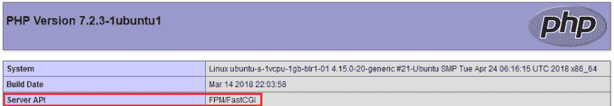
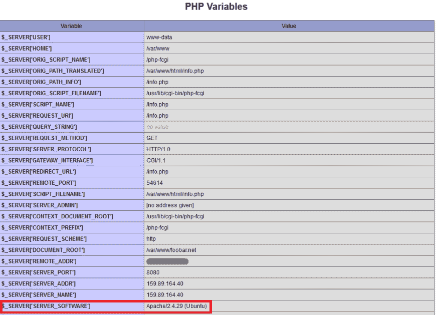
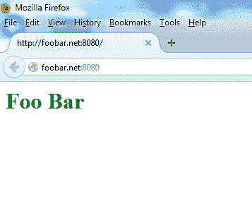
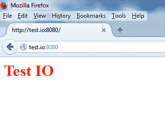
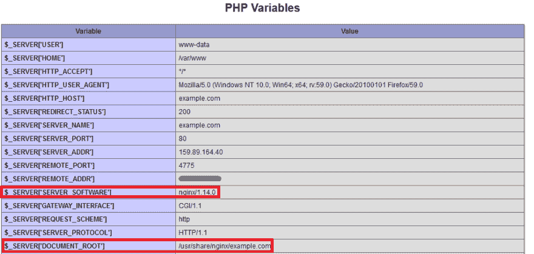
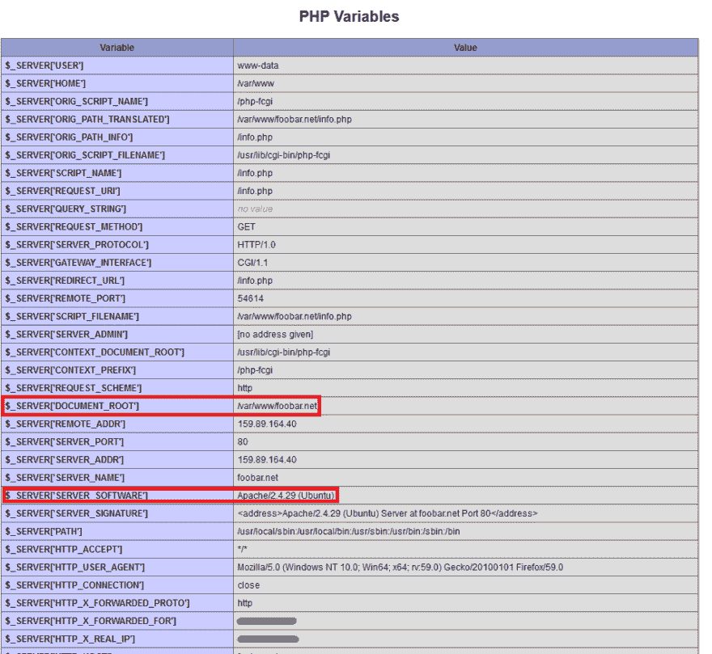
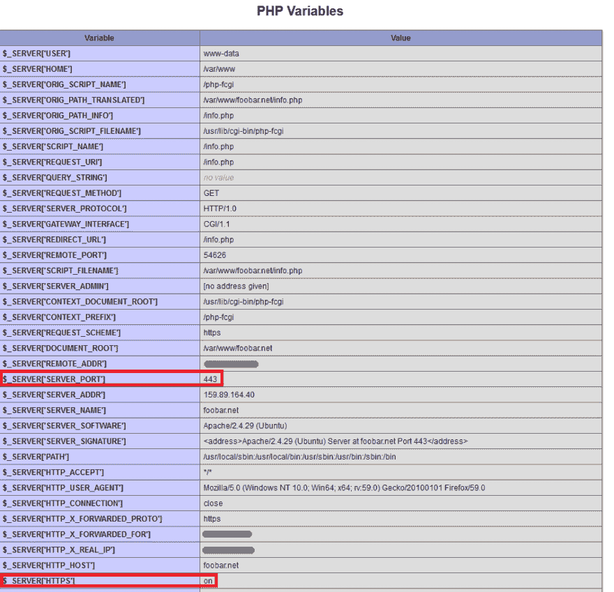

# 如何在一台 Ubuntu 18.04 服务器上将 Nginx 配置为 Apache 的 Web 服务器和反向代理

> 原文：<https://dev.to/digitalocean/how-to-configure-nginx-as-a-web-server-and-reverse-proxy-for-apache-on-one-ubuntu-1804-server-2eib>

*作者杰辛 A*

作者选择了[电子前沿基金会](https://www.brightfunds.org/organizations/electronic-frontier-foundation-inc)接受捐赠，作为[为捐赠而写](https://www.digitalocean.com/write-for-donations/?utm_source=devto&utm_medium=display&utm_campaign=Devto_2018_Brand)计划的一部分。

### 简介

Apache 和 Nginx 是 PHP 经常使用的两种流行的开源 web 服务器。当托管多个具有不同要求的网站时，在同一虚拟机上运行这两个应用程序会很有用。在一个系统上运行两个 web 服务器的一般解决方案是使用多个 IP 地址或不同的端口号。

既有 IPv4 地址又有 IPv6 地址的服务器可以被配置为在一种协议上服务 Apache 站点，在另一种协议上服务 Nginx 站点，但是这在当前是不实际的，因为 IPv6 还没有被 ISP 广泛采用。为第二台 web 服务器使用不同的端口号，如`81`或`8080`是另一种解决方案，但是使用端口号共享 URL(如`http://example.com:81`)并不总是合理或理想的。

在本教程中，您将把 Nginx 配置为 web 服务器和 Apache 的反向代理——所有这些都在一台服务器上。

根据 web 应用程序的不同，可能需要更改代码来保持 Apache 反向代理感知，尤其是在配置了 SSL 站点的情况下。为了避免这种情况，您将安装一个名为`mod_rpaf`的 Apache 模块，该模块重写了某些环境变量，因此看起来 Apache 是直接处理来自 web 客户端的请求。

我们将在一台服务器上托管四个域名。Nginx 将服务两个:`example.com`(默认虚拟主机)和`sample.org`。剩下的两架`foobar.net`和`test.io`，将由阿帕奇提供服务。我们还将配置 Apache 来使用 PHP-FPM 服务 PHP 应用程序，这提供了比`mod_php`更好的性能。

## 先决条件

要完成本教程，您需要以下内容:

*   按照 Ubuntu 18.04 的[初始服务器设置配置一个新的 Ubuntu 18.04 服务器，使用 sudo 非根用户和防火墙。](https://dev.to/maestromac/initial-server-setup-with-ubuntu-1804-45if-temp-slug-1879821)
*   四个完全合格的域名配置为指向您的服务器的 IP 地址。参见[如何使用 DigitalOcean](https://www.digitalocean.com/community/tutorials/how-to-set-up-a-host-name-with-digitalocean?utm_source=devto&utm_medium=display&utm_campaign=Devto_2018_Brand) 设置主机名的第 3 步，了解如何设置主机名的示例。如果你在其他地方托管你的域名，你应该在那里创建适当的 A 记录。

## 步骤 1 —安装 Apache 和 PHP-FPM

让我们从安装 Apache 和 PHP-FPM 开始。

除了 Apache 和 PHP-FPM，我们还将安装 PHP FastCGI Apache 模块`libapache2-mod-fastcgi`，以支持 FastCGI web 应用程序。

首先，更新您的软件包列表，以确保您拥有最新的软件包。

```
sudo apt update 
```

Enter fullscreen mode Exit fullscreen mode

接下来，安装 Apache 和 PHP-FPM 包:

```
sudo apt install apache2 php-fpm 
```

Enter fullscreen mode Exit fullscreen mode

Ubuntu 的资源库中没有 FastCGI Apache 模块，所以可以从[kernel.org](https://kernel.org)下载并使用`dpkg`命令安装。

```
 wget https://mirrors.edge.kernel.org/ubuntu/pool/multiverse/liba/libapache-mod-fastcgi/libapache2-mod-fastcgi_2.4.7~0910052141-1.2_amd64.deb

sudo dpkg -i libapache2-mod-fastcgi_2.4.7~0910052141-1.2_amd64.deb 
```

Enter fullscreen mode Exit fullscreen mode

接下来，让我们将 Apache 的默认配置改为使用 PHP-FPM。

## 步骤 2 —配置 Apache 和 PHP-FPM

在这一步中，我们将把 Apache 的端口号改为`8080`，并使用`mod_fastcgi`模块将其配置为与 PHP-FPM 协同工作。重命名 Apache 的`ports.conf`配置文件:

```
sudo mv /etc/apache2/ports.conf /etc/apache2/ports.conf.default 
```

Enter fullscreen mode Exit fullscreen mode

创建一个新的`ports.conf`文件，端口设置为`8080` :

```
echo "Listen 8080" | sudo tee /etc/apache2/ports.conf 
```

Enter fullscreen mode Exit fullscreen mode

**注意:**在配置反向代理时，Web 服务器通常被设置为监听`127.0.0.1:8080`，但是这样做会将 PHP 的环境变量 **SERVER_ADDR** 的值设置为环回 IP 地址，而不是服务器的公共 IP。我们的目标是以这样一种方式设置 Apache，使它的网站看不到它前面的反向代理。因此，我们将配置它监听所有 IP 地址上的`8080`。

接下来，我们将为 Apache 创建一个虚拟主机文件。该文件中的`<VirtualHost>`指令将被设置为仅服务于端口`8080`上的站点。

禁用默认虚拟主机:

```
sudo a2dissite 000-default 
```

Enter fullscreen mode Exit fullscreen mode

然后创建一个新的虚拟主机文件，使用现有的默认站点:

```
sudo cp /etc/apache2/sites-available/000-default.conf /etc/apache2/sites-available/001-default.conf 
```

Enter fullscreen mode Exit fullscreen mode

现在打开新的配置文件:

```
sudo nano /etc/apache2/sites-available/001-default.conf 
```

Enter fullscreen mode Exit fullscreen mode

将监听端口更改为`8080`:

/etc/Apache 2/sites-available/000-default . conf

```
<VirtualHost *:8080>
    ServerAdmin webmaster@localhost
    DocumentRoot /var/www/html
    ErrorLog ${APACHE_LOG_DIR}/error.log
    CustomLog ${APACHE_LOG_DIR}/access.log combined
</VirtualHost> 
```

Enter fullscreen mode Exit fullscreen mode

保存文件并激活新的配置文件:

```
sudo a2ensite 001-default 
```

Enter fullscreen mode Exit fullscreen mode

然后重新加载 Apache:

```
sudo systemctl reload apache2 
```

Enter fullscreen mode Exit fullscreen mode

验证 Apache 现在正在监听`8080` :

```
sudo netstat -tlpn 
```

Enter fullscreen mode Exit fullscreen mode

输出应该如下例所示，其中`apache2`监听`8080` :

```
OutputActive Internet connections (only servers)
Proto Recv-Q Send-Q Local Address Foreign Address State PID/Program name
tcp 0 0 0.0.0.0:22 0.0.0.0:* LISTEN 1086/sshd
tcp6 0 0 :::8080 :::* LISTEN 4678/apache2
tcp6 0 0 :::22 :::* LISTEN 1086/sshd 
```

Enter fullscreen mode Exit fullscreen mode

一旦确认 Apache 正在正确的端口上监听，就可以配置对 PHP 和 FastCGI 的支持。

## 步骤 3 —配置 Apache 使用 mod_fastcgi

Apache 默认使用`mod_php`提供 PHP 页面，但是它需要额外的配置来使用 PHP-FPM。

**注意:**如果你正在用 mod_php 在 LAMP 的现有安装上尝试本教程，首先用`sudo a2dismod php7.2`禁用它。

我们将为依赖于`mod_action`的`mod_fastcgi`添加一个配置块。`mod_action`默认是禁用的，所以我们首先需要将其启用:

```
sudo a2enmod actions 
```

Enter fullscreen mode Exit fullscreen mode

重命名现有的 FastCGI 配置文件:

```
sudo mv /etc/apache2/mods-enabled/fastcgi.conf /etc/apache2/mods-enabled/fastcgi.conf.default 
```

Enter fullscreen mode Exit fullscreen mode

创建新的配置文件:

```
sudo nano /etc/apache2/mods-enabled/fastcgi.conf 
```

Enter fullscreen mode Exit fullscreen mode

将以下指令添加到文件中，以将对`.php`文件的请求传递到 PHP-FPM UNIX 套接字:

/etc/Apache 2/MODS-enabled/fastcgi . conf

```
<IfModule mod_fastcgi.c>
  AddHandler fastcgi-script .fcgi
  FastCgiIpcDir /var/lib/apache2/fastcgi
  AddType application/x-httpd-fastphp .php
  Action application/x-httpd-fastphp /php-fcgi
  Alias /php-fcgi /usr/lib/cgi-bin/php-fcgi
  FastCgiExternalServer /usr/lib/cgi-bin/php-fcgi -socket /run/php/php7.2-fpm.sock -pass-header Authorization
  <Directory /usr/lib/cgi-bin>
    Require all granted
  </Directory>
</IfModule> 
```

Enter fullscreen mode Exit fullscreen mode

保存更改并进行配置测试:

```
sudo apachectl -t 
```

Enter fullscreen mode Exit fullscreen mode

如果显示**语法正常**则重新加载 Apache:

```
sudo systemctl reload apache2 
```

Enter fullscreen mode Exit fullscreen mode

如果你看到警告`Could not reliably determine the server's fully qualified domain name, using 127.0.1.1\. Set the 'ServerName' directive globally to suppress this message.`，你可以暂时忽略它。我们稍后将配置服务器名称。

现在让我们确保我们可以从 Apache 提供 PHP 服务。

## 步骤 4 —验证 PHP 功能

让我们通过创建一个`phpinfo()`文件并从 web 浏览器访问它来确保 PHP 能够工作。

创建文件`/var/www/html/info.php`，其中包含对`phpinfo`函数的调用:

```
echo "<?php phpinfo(); ?>" | sudo tee /var/www/html/info.php 
```

Enter fullscreen mode Exit fullscreen mode

要在浏览器中查看文件，请转到`http://your_server_ip:8080/info.php`。这会给你一个 PHP 正在使用的配置设置列表。您将看到类似如下的输出:

[T2】](https://res.cloudinary.com/practicaldev/image/fetch/s--WlPRRT67--/c_limit%2Cf_auto%2Cfl_progressive%2Cq_auto%2Cw_880/https://assets.digitalocean.com/articles/nginx_apache_ubuntu_1804/qQcGNe8.png)

[T2】](https://res.cloudinary.com/practicaldev/image/fetch/s--1xYkuFOl--/c_limit%2Cf_auto%2Cfl_progressive%2Cq_auto%2Cw_880/https://assets.digitalocean.com/articles/nginx_apache_ubuntu_1804/eBuDnVU.png)

在页面顶部，检查一下**服务器 API** 是否显示 **FPM/FastCGI** 。大约在页面的三分之二处， **PHP 变量**部分会告诉你 **SERVER_SOFTWARE** 是 Ubuntu 上的 Apache。这些确认了`mod_fastcgi`是活动的，Apache 正在使用 PHP-FPM 来处理 PHP 文件。

## 步骤 5 —为 Apache 创建虚拟主机

让我们为域`foobar.net`和`test.io`创建 Apache 虚拟主机文件。为此，我们将首先为两个站点创建文档根目录，并在这些目录中放置一些默认文件，以便我们可以轻松地测试我们的配置。

首先，创建文档根目录:

```
sudo mkdir -v /var/www/foobar.net /var/www/test.io 
```

Enter fullscreen mode Exit fullscreen mode

然后为每个站点创建一个`index`文件:

```
 echo "<h1 style='color: green;'>Foo Bar</h1>" | sudo tee /var/www/foobar.net/index.html

echo "<h1 style='color: red;'>Test IO</h1>" | sudo tee /var/www/test.io/index.html 
```

Enter fullscreen mode Exit fullscreen mode

然后为每个站点创建一个`phpinfo()`文件，这样我们可以测试 PHP 是否配置正确。

```
 echo "<?php phpinfo(); ?>" | sudo tee /var/www/foobar.net/info.php

echo "<?php phpinfo(); ?>" | sudo tee /var/www/test.io/info.php 
```

Enter fullscreen mode Exit fullscreen mode

现在为`foobar.net`域创建虚拟主机文件:

```
sudo nano /etc/apache2/sites-available/foobar.net.conf 
```

Enter fullscreen mode Exit fullscreen mode

将以下代码添加到文件中以定义主机:

/etc/Apache 2/sites-available/foobar . net . conf

```
 <VirtualHost *:8080>
        ServerName foobar.net
        ServerAlias www.foobar.net
        DocumentRoot /var/www/foobar.net
        <Directory /var/www/foobar.net>
            AllowOverride All
        </Directory>
    </VirtualHost> 
```

Enter fullscreen mode Exit fullscreen mode

线`AllowOverride All`启用`.htaccess`支持。

这些只是最基本的指令。关于在 Apache 中设置虚拟主机的完整指南，请参见[如何在 Ubuntu 16.04 上设置 Apache 虚拟主机](https://www.digitalocean.com/community/tutorials/how-to-set-up-apache-virtual-hosts-on-ubuntu-16-04?utm_source=devto&utm_medium=display&utm_campaign=Devto_2018_Brand)。

保存并关闭文件。然后为`test.io`创建一个类似的配置。首先创建文件:

```
sudo nano /etc/apache2/sites-available/test.io.conf 
```

Enter fullscreen mode Exit fullscreen mode

然后将配置添加到文件中:

/etc/Apache 2/sites-available/test . io . conf

```
 <VirtualHost *:8080>
        ServerName test.io
        ServerAlias www.test.io
        DocumentRoot /var/www/test.io
        <Directory /var/www/test.io>
            AllowOverride All
        </Directory>
    </VirtualHost> 
```

Enter fullscreen mode Exit fullscreen mode

保存文件并退出编辑器。

既然两个 Apache 虚拟主机都已经设置好了，那么使用`a2ensite`命令启用站点。这将在`sites-enabled`目录中创建一个到虚拟主机文件的符号链接:

```
 sudo a2ensite foobar.net

sudo a2ensite test.io 
```

Enter fullscreen mode Exit fullscreen mode

再次检查 Apache 的配置错误:

```
sudo apachectl -t 
```

Enter fullscreen mode Exit fullscreen mode

如果没有错误，您将看到显示**语法正常**。如果您看到任何其他情况，请检查配置并重试。

一旦您的配置没有错误，重新加载 Apache 以应用更改:

```
sudo systemctl reload apache2 
```

Enter fullscreen mode Exit fullscreen mode

为了确认站点正在工作，在你的浏览器中打开`http://foobar.net:8080`和`http://test.io:8080`并验证每个站点显示其【index.html】文件**。**

您将看到以下结果:

[T2】](https://res.cloudinary.com/practicaldev/image/fetch/s--r-mMkFFi--/c_limit%2Cf_auto%2Cfl_progressive%2Cq_auto%2Cw_880/https://assets.digitalocean.com/articles/nginx_apache_ubuntu_1804/2y1R8Zd.png)

[T2】](https://res.cloudinary.com/practicaldev/image/fetch/s--ATpCU50a--/c_limit%2Cf_auto%2Cfl_progressive%2Cq_auto%2Cw_880/https://assets.digitalocean.com/articles/nginx_apache_ubuntu_1804/wr1pzEj.png)

另外，通过访问每个站点的 info.php 文件来确保 PHP 正在工作。在浏览器中访问`http://foobar.net:8080/info.php`和`http://test.io:8080/info.php`。

您将在每个站点上看到与第 4 步相同的 PHP 配置规范列表。

我们现在有两个托管在 Apache 端口`8080`的网站。接下来我们来配置 Nginx。

## 步骤 6 —安装和配置 Nginx

在这一步，我们将安装 Nginx，并将域`example.com`和`sample.org`配置为 Nginx 的虚拟主机。关于在 Nginx 中设置虚拟主机的完整指南，请参见[如何在 Ubuntu 18.04](https://www.digitalocean.com/community/tutorials/how-to-install-nginx-on-ubuntu-18-04#step-5-%E2%80%93-setting-up-server-blocks-(recommended)) 上设置 Nginx 服务器块(虚拟主机)。

使用包管理器安装 Nginx】

```
sudo apt install nginx 
```

Enter fullscreen mode Exit fullscreen mode

然后删除默认虚拟主机的符号链接，因为我们将不再使用它:

```
sudo rm /etc/nginx/sites-enabled/default 
```

Enter fullscreen mode Exit fullscreen mode

稍后我们将创建我们自己的默认站点(`example.com`)。

现在，我们将使用与 Apache 相同的过程为 Nginx 创建虚拟主机。首先为两个网站创建文档根目录:

```
sudo mkdir -v /usr/share/nginx/example.com /usr/share/nginx/sample.org 
```

Enter fullscreen mode Exit fullscreen mode

我们将把 Nginx 网站保存在`/usr/share/nginx`中，这是 Nginx 默认想要的位置。您可以将它们放在 Apache 站点的`/var/www/html`下，但是这种分离可能有助于您将站点与 Nginx 相关联。

正如您对 Apache 的虚拟主机所做的那样，创建`index`和`phpinfo()`文件，以便在安装完成后进行测试:

```
 echo "<h1 style='color: green;'>Example.com</h1>" | sudo tee /usr/share/nginx/example.com/index.html

echo "<h1 style='color: red;'>Sample.org</h1>" | sudo tee /usr/share/nginx/sample.org/index.html

echo "<?php phpinfo(); ?>" | sudo tee /usr/share/nginx/example.com/info.php

echo "<?php phpinfo(); ?>" | sudo tee /usr/share/nginx/sample.org/info.php 
```

Enter fullscreen mode Exit fullscreen mode

现在为域`example.com` :
创建一个虚拟主机文件

```
sudo nano /etc/nginx/sites-available/example.com 
```

Enter fullscreen mode Exit fullscreen mode

Nginx 调用配置文件的`server {. . .}`区域**服务器阻塞**。为主虚拟主机`example.com`创建一个服务器块。`default_server`配置指令使其成为默认的虚拟主机，处理与任何其他虚拟主机都不匹配的 HTTP 请求。

/etc/nginx/sites-available/example . com

```
server {
    listen 80 default_server;

    root /usr/share/nginx/example.com;
    index index.php index.html index.htm;

    server_name example.com www.example.com;
    location / {
        try_files $uri $uri/ /index.php;
    }

    location ~ \.php$ {
        fastcgi_pass unix:/run/php/php7.2-fpm.sock;
        include snippets/fastcgi-php.conf;
    }
} 
```

Enter fullscreen mode Exit fullscreen mode

保存并关闭文件。现在为 Nginx 的第二个域创建一个虚拟主机文件，`sample.org` :

```
sudo nano etc/nginx/sites-available/sample.org 
```

Enter fullscreen mode Exit fullscreen mode

将以下内容添加到文件中:

/etc/nginx/sites-available/sample . org

```
server {
    root /usr/share/nginx/sample.org;
    index index.php index.html index.htm;

    server_name sample.org www.sample.org;
    location / {
        try_files $uri $uri/ /index.php;
    }

    location ~ \.php$ {
        fastcgi_pass unix:/run/php/php7.2-fpm.sock;
        include snippets/fastcgi-php.conf;
    }
} 
```

Enter fullscreen mode Exit fullscreen mode

保存并关闭文件。

然后通过创建到`sites-enabled`目录:
的符号链接来启用这两个站点

```
 sudo ln -s /etc/nginx/sites-available/example.com /etc/nginx/sites-enabled/example.com

sudo ln -s /etc/nginx/sites-available/sample.org /etc/nginx/sites-enabled/sample.org 
```

Enter fullscreen mode Exit fullscreen mode

然后测试 Nginx 配置，确保没有配置问题:

```
sudo nginx -t 
```

Enter fullscreen mode Exit fullscreen mode

如果没有错误，则重新加载 Nginx:

```
sudo systemctl reload nginx 
```

Enter fullscreen mode Exit fullscreen mode

现在通过访问[http://example.com/info.php](http://example.com/info.php)和[http://sample.org/info.php](http://sample.org/info.php)，在网络浏览器中访问你的 Nginx 虚拟主机的`phpinfo()`文件。再次查看 PHP 变量部分。

[T2】](https://res.cloudinary.com/practicaldev/image/fetch/s--dPOMpluz--/c_limit%2Cf_auto%2Cfl_progressive%2Cq_auto%2Cw_880/https://assets.digitalocean.com/articles/nginx_apache_ubuntu_1804/1FZeLUe.png)

**["SERVER_SOFTWARE"]** 应该说`nginx`，表示文件是 Nginx 直接服务的。 **["DOCUMENT_ROOT"]** 应该指向您之前在这个步骤中为每个 Nginx 站点创建的目录。

至此，我们已经安装了 Nginx 并创建了两个虚拟主机。接下来，我们将配置 Nginx 来代理 Apache 上托管的域的请求。

## 步骤 7 —为 Apache 的虚拟主机配置 Nginx

让我们在`server_name`指令中创建一个额外的具有多个域名的 Nginx 虚拟主机。对这些域名的请求将被代理给 Apache。

创建一个新的 Nginx 虚拟主机文件，将请求转发给 Apache:

```
sudo nano /etc/nginx/sites-available/apache 
```

Enter fullscreen mode Exit fullscreen mode

添加以下代码块，该代码块指定两个 Apache 虚拟主机域的名称，并将它们的请求代理给 Apache。记住使用`proxy_pass`中的公共 IP 地址:

/etc/nginx/sites-available/Apache

```
server {
    listen 80;
    server_name foobar.net www.foobar.net test.io www.test.io;

    location / {
        proxy_pass http://your_server_ip:8080;
        proxy_set_header Host $host;
        proxy_set_header X-Real-IP $remote_addr;
        proxy_set_header X-Forwarded-For $proxy_add_x_forwarded_for;
        proxy_set_header X-Forwarded-Proto $scheme;
    }
} 
```

Enter fullscreen mode Exit fullscreen mode

保存文件，并通过创建一个符号链接来启用这个新的虚拟主机:

```
sudo ln -s /etc/nginx/sites-available/apache /etc/nginx/sites-enabled/apache 
```

Enter fullscreen mode Exit fullscreen mode

测试配置以确保没有错误:

```
sudo nginx -t 
```

Enter fullscreen mode Exit fullscreen mode

如果没有错误，重新加载 Nginx:

```
sudo systemctl reload nginx 
```

Enter fullscreen mode Exit fullscreen mode

打开浏览器，在浏览器中访问 URL `http://foobar.net/info.php`。向下滚动到 **PHP 变量**部分，检查显示的值。

[T2】](https://res.cloudinary.com/practicaldev/image/fetch/s--y2Z5HSOV--/c_limit%2Cf_auto%2Cfl_progressive%2Cq_auto%2Cw_880/https://assets.digitalocean.com/articles/nginx_apache_ubuntu_1804/1XQi5kl.png)

变量 **SERVER_SOFTWARE** 和 **DOCUMENT_ROOT** 确认这个请求由 Apache 处理。变量 **HTTP_X_REAL_IP** 和 **HTTP_X_FORWARDED_FOR** 是 Nginx 添加的，应该显示你用来访问 URL 的计算机的公共 IP 地址。

我们已经成功地设置了 Nginx，将特定域的请求代理给 Apache。接下来，让我们配置 Apache 来设置`REMOTE_ADDR`变量，就好像它直接处理这些请求一样。

## 步骤 8 —安装和配置 mod_rpaf

在这一步中，您将安装一个名为`mod\_rpaf`的 Apache 模块，该模块根据反向代理提供的值重写 **REMOTE_ADDR** 、 **HTTPS** 和 **HTTP_PORT** 的值。如果没有这个模块，一些 PHP 应用程序需要修改代码才能在代理后面无缝地工作。这个模块在 Ubuntu 的库中以`libapache2-mod-rpaf`的名字出现，但是已经过时了，不支持某些配置指令。相反，我们将从源代码安装它。

安装构建模块所需的包:

```
sudo apt install unzip build-essential apache2-dev 
```

Enter fullscreen mode Exit fullscreen mode

从 GitHub 下载最新稳定版:

```
wget https://github.com/gnif/mod_rpaf/archive/stable.zip 
```

Enter fullscreen mode Exit fullscreen mode

提取下载的文件:

```
unzip stable.zip 
```

Enter fullscreen mode Exit fullscreen mode

切换到包含文件的新目录:

```
cd mod_rpaf-stable 
```

Enter fullscreen mode Exit fullscreen mode

编译并安装模块:

```
 make

sudo make install 
```

Enter fullscreen mode Exit fullscreen mode

接下来，在`mods-available`目录下创建一个文件，该文件将加载`rpaf`模块:

```
sudo nano /etc/apache2/mods-available/rpaf.load 
```

Enter fullscreen mode Exit fullscreen mode

将以下代码添加到文件中以加载模块:

/etc/Apache 2/MODS-available/rpaf . load

```
LoadModule rpaf_module /usr/lib/apache2/modules/mod_rpaf.so 
```

Enter fullscreen mode Exit fullscreen mode

保存文件并退出编辑器。

在这个目录中创建另一个名为`rpaf.conf`的文件，它将包含`mod_rpaf` :
的配置指令

```
sudo nano /etc/apache2/mods-available/rpaf.conf 
```

Enter fullscreen mode Exit fullscreen mode

添加以下代码块来配置`mod_rpaf`，确保指定服务器的 IP 地址:

/etc/Apache 2/MODS-available/rpaf . conf

```
 <IfModule mod_rpaf.c>
        RPAF_Enable On
        RPAF_Header X-Real-Ip
        RPAF_ProxyIPs your_server_ip 
        RPAF_SetHostName On
        RPAF_SetHTTPS On
        RPAF_SetPort On
    </IfModule> 
```

Enter fullscreen mode Exit fullscreen mode

下面是每个指令的简要描述。更多信息参见`mod_rpaf` [自述](https://github.com/gnif/mod_rpaf/blob/stable/README.md#configuration-directives)文件。

*   **RPAF _ 报头** -用于客户端真实 IP 地址的报头。
*   **RPAF _ 代理 IP**-调整 HTTP 请求的代理 IP。
*   **RPAF _ 设置主机名**——更新虚拟主机名称，以便`ServerName`和`ServerAlias`工作。
*   **RPAF _ SetHTTPS**——根据`X-Forwarded-Proto`中包含的值设置`HTTPS`环境变量。
*   **RPAF _ 设置端口** -设置`SERVER_PORT`环境变量。当 Apache 在 SSL 代理后面时很有用。

保存`rpaf.conf`并启用模块:

```
sudo a2enmod rpaf 
```

Enter fullscreen mode Exit fullscreen mode

这在`mods-enabled`目录中创建了文件`rpaf.load`和`rpaf.conf`的符号链接。现在做一个配置测试:

```
sudo apachectl -t 
```

Enter fullscreen mode Exit fullscreen mode

如果没有错误，重新加载 Apache:

```
sudo systemctl reload apache2 
```

Enter fullscreen mode Exit fullscreen mode

在你的浏览器中访问`phpinfo()`页面`http://foobar.net/info.php`和`http://test.io/info.php`，检查 **PHP 变量**部分。 **REMOTE_ADDR** 变量现在也是你本地计算机的公共 IP 地址。

现在让我们为每个站点设置 TLS/SSL 加密。

## 步骤 9 —使用“让我们加密”设置 HTTPS 网站(可选)

在这一步中，我们将为 Apache 上托管的两个域配置 TLS/SSL 证书。我们将通过【让我们加密】([https://letsencrypt.org](https://letsencrypt.org))获得证书。Nginx 支持 SSL 终止，因此我们可以在不修改 Apache 的配置文件的情况下设置 SSL。`mod_rpaf`模块确保在 Apache 上设置所需的环境变量，以使应用程序在 SSL 反向代理后面无缝工作。

首先，我们将两个域的`server {...}`块分开，这样每个域都可以拥有自己的 SSL 证书。在你的编辑器
中打开文件`/etc/nginx/sites-available/apache`

```
sudo nano /etc/nginx/sites-available/apache 
```

Enter fullscreen mode Exit fullscreen mode

修改文件，使其看起来像这样，将`foobar.net`和`test.io`放在它们自己的`server`块中:

/etc/nginx/sites-available/Apache

```
 server {
        listen 80;
        server_name foobar.net www.foobar.net;

        location / {
            proxy_pass http://your_server_ip:8080;
            proxy_set_header Host $host;
            proxy_set_header X-Real-IP $remote_addr;
            proxy_set_header X-Forwarded-For $proxy_add_x_forwarded_for;
            proxy_set_header X-Forwarded-Proto $scheme;
        }
    }
    server {
        listen 80;
        server_name test.io www.test.io;

        location / {
            proxy_pass http://your_server_ip:8080;
            proxy_set_header Host $host;
            proxy_set_header X-Real-IP $remote_addr;
            proxy_set_header X-Forwarded-For $proxy_add_x_forwarded_for;
            proxy_set_header X-Forwarded-Proto $scheme;
        }
    } 
```

Enter fullscreen mode Exit fullscreen mode

我们将使用 [Certbot](https://certbot.eff.org) 来生成我们的 TLS/SSL 证书。它的 Nginx 插件将负责重新配置 Nginx，并在必要时重新加载配置。

首先，添加官方 Certbot 存储库:

```
sudo add-apt-repository ppa:certbot/certbot 
```

Enter fullscreen mode Exit fullscreen mode

当系统提示您确认要添加新存储库时，请按`ENTER`。然后更新包列表以获取新存储库的包信息:

```
sudo apt update 
```

Enter fullscreen mode Exit fullscreen mode

然后用`apt` :
安装 Certbot 的 Nginx 包

```
sudo apt install python-certbot-nginx 
```

Enter fullscreen mode Exit fullscreen mode

安装完成后，使用`certbot`命令为`foobar.net`和`www.foobar.net` :
生成证书

```
sudo certbot --nginx -d foobar.net -d www.foobar.net 
```

Enter fullscreen mode Exit fullscreen mode

这个命令告诉 Certbot 使用`nginx`插件，使用`-d`来指定我们希望证书对其有效的名称。

如果这是您第一次运行`certbot`，系统会提示您输入电子邮件地址并同意服务条款。这样做之后，`certbot`将与 Let's Encrypt 服务器通信，然后运行一个挑战来验证您是否控制了您正在为其请求证书的域。

接下来，Certbot 将询问您希望如何配置您的 HTTPS 设置:

```
OutputPlease choose whether or not to redirect HTTP traffic to HTTPS, removing HTTP access.
------------------------------------------------------------------------------------
1: No redirect - Make no further changes to the webserver configuration.
2: Redirect - Make all requests redirect to secure HTTPS access. Choose this for
new sites, or if you're confident your site works on HTTPS. You can undo this
change by editing your web server's configuration.
------------------------------------------------------------------------------------
Select the appropriate number [1-2] then [enter] (press 'c' to cancel): 
```

Enter fullscreen mode Exit fullscreen mode

选择您的选项，然后按下`ENTER`。配置将被更新，Nginx 将重新加载以获取新的设置。

现在执行第二个域的命令:

```
sudo certbot --nginx -d test.io -d www.test.io 
```

Enter fullscreen mode Exit fullscreen mode

使用`https://`前缀在浏览器中访问 Apache 的一个域；访问`https://foobar.net/info.php`，你会看到这个:

[T2】](https://res.cloudinary.com/practicaldev/image/fetch/s--8BM-XX9Y--/c_limit%2Cf_auto%2Cfl_progressive%2Cq_auto%2Cw_880/https://assets.digitalocean.com/articles/nginx_apache_ubuntu_1804/KK6AmWV.png)

查看 **PHP 变量**部分。变量 **SERVER_PORT** 已经被设置为 **443** 和 **HTTPS** 被设置为上的**，就好像 Apache 是通过 HTTPS 直接访问的一样。有了这些变量，PHP 应用程序就不需要特别配置就可以在反向代理后面工作。**

现在让我们禁用对 Apache 的直接访问。

## 步骤 10 —阻止对 Apache 的直接访问(可选)

因为 Apache 正在监听公共 IP 地址上的端口`8080`,所以每个人都可以访问它。可以通过在防火墙规则集中使用以下 IPtables 命令来阻止它。

```
sudo iptables -I INPUT -p tcp --dport 8080 ! -s your_server_ip -j REJECT --reject-with tcp-reset 
```

Enter fullscreen mode Exit fullscreen mode

确保使用您的服务器的 IP 地址来代替红色的示例。一旦端口`8080`在您的防火墙中被阻塞，测试 Apache 在其上是不可达的。打开 web 浏览器，尝试在端口`8080`上访问 Apache 的一个域名。比如:【http://example.com:8080】T2

浏览器应显示“无法连接”或“网页不可用”的错误信息。有了 IPtables `tcp-reset`选项，外人就看不出端口`8080`和没有任何服务的端口有什么不同。

**注意:**缺省情况下，IPtables 规则不会在系统重启后失效。保存 IPtables 规则有多种方法，但最简单的方法是使用 Ubuntu 存储库中的`iptables-persistent`。浏览[这篇文章](https://www.digitalocean.com/community/tutorials/how-to-set-up-a-firewall-using-iptables-on-ubuntu-14-04)，了解更多关于如何配置 IPTables 的信息。

现在让我们配置 Nginx 来为 Apache 站点提供静态文件。

## 步骤 11 —使用 Nginx 提供静态文件(可选)

当 Nginx 代理 Apache 域的请求时，它会将该域的每个文件请求发送给 Apache。Nginx 在提供静态文件如图像、JavaScript 和样式表方面比 Apache 更快。所以让我们配置 Nginx 的`apache`虚拟主机文件来直接服务静态文件，但是发送 PHP 请求到 Apache。

在您的编辑器
中打开文件`/etc/nginx/sites-available/apache`

```
sudo nano /etc/nginx/sites-available/apache 
```

Enter fullscreen mode Exit fullscreen mode

您需要向每个服务器块添加两个额外的`location`块，并修改现有的`location`部分。此外，您需要告诉 Nginx 在哪里可以找到每个站点的静态文件。

如果您决定不使用 SSL 和 TLS 证书，请修改您的文件，如下所示:

/etc/nginx/sites-available/Apache

```
server {
    listen 80;
    server_name test.io www.test.io;
    root /var/www/test.io;
    index index.php index.htm index.html;

    location / {
        try_files $uri $uri/ /index.php;
    }

    location ~ \.php$ {
        proxy_pass http://your_server_ip:8080;
        proxy_set_header Host $host;
        proxy_set_header X-Real-IP $remote_addr;
        proxy_set_header X-Forwarded-For $proxy_add_x_forwarded_for;
        proxy_set_header X-Forwarded-Proto $scheme;
    }

    location ~ /\.ht {
        deny all;
    }
}

server {
    listen 80;
    server_name foobar.net www.foobar.net;
    root /var/www/foobar.net;
    index index.php index.htm index.html;

    location / {
        try_files $uri $uri/ /index.php;
    }

    location ~ \.php$ {
        proxy_pass http://your_ip_address:8080;
        proxy_set_header Host $host;
        proxy_set_header X-Real-IP $remote_addr;
        proxy_set_header X-Forwarded-For $proxy_add_x_forwarded_for;
        proxy_set_header X-Forwarded-Proto $scheme;
    }

    location ~ /\.ht {
        deny all;
    }
} 
```

Enter fullscreen mode Exit fullscreen mode

如果您还希望 HTTPS 可用，请使用以下配置:

/etc/nginx/sites-available/Apache

```
server {
    listen 80;
    server_name test.io www.test.io;
    root /var/www/test.io;
    index index.php index.htm index.html;

    location / {
        try_files $uri $uri/ /index.php;
    }

    location ~ \.php$ {
        proxy_pass http://your_server_ip:8080;
        proxy_set_header Host $host;
        proxy_set_header X-Real-IP $remote_addr;
        proxy_set_header X-Forwarded-For $proxy_add_x_forwarded_for;
        proxy_set_header X-Forwarded-Proto $scheme;
    }

    location ~ /\.ht {
        deny all;
    }

    listen 443 ssl;
    ssl_certificate /etc/letsencrypt/live/test.io/fullchain.pem;
    ssl_certificate_key /etc/letsencrypt/live/test.io/privkey.pem;
    include /etc/letsencrypt/options-ssl-nginx.conf;
    ssl_dhparam /etc/letsencrypt/ssl-dhparams.pem;
}

server {
    listen 80;
    server_name foobar.net www.foobar.net;
    root /var/www/foobar.net;
    index index.php index.htm index.html;

    location / {
        try_files $uri $uri/ /index.php;
    }

    location ~ \.php$ {
        proxy_pass http://your_ip_address:8080;
        proxy_set_header Host $host;
        proxy_set_header X-Real-IP $remote_addr;
        proxy_set_header X-Forwarded-For $proxy_add_x_forwarded_for;
        proxy_set_header X-Forwarded-Proto $scheme;
    }

    location ~ /\.ht {
        deny all;
    }

    listen 443 ssl;
    ssl_certificate /etc/letsencrypt/live/foobar.net/fullchain.pem;
    ssl_certificate_key /etc/letsencrypt/live/foobar.net/privkey.pem;
    include /etc/letsencrypt/options-ssl-nginx.conf;
    ssl_dhparam /etc/letsencrypt/ssl-dhparams.pem;
} 
```

Enter fullscreen mode Exit fullscreen mode

`try_files`指令让 Nginx 在文档根目录中寻找文件并直接服务它们。如果文件有一个`.php`扩展名，请求将被传递给 Apache。即使在文档根中找不到文件，请求也会被传递给 Apache，这样像 permalinks 这样的应用程序功能就可以正常工作了。

**警告:**`location ~ /\.ht`指令非常重要；这可以防止 Nginx 提供包含敏感信息的 Apache 配置文件的内容，如`.htaccess`和`.htpasswd`。

保存文件并执行配置测试:

```
sudo nginx -t 
```

Enter fullscreen mode Exit fullscreen mode

如果测试成功，重新加载 Nginx:

```
sudo service nginx reload 
```

Enter fullscreen mode Exit fullscreen mode

为了验证一切正常，您可以检查 Apache 在`/var/log/apache2`中的日志文件，查看`GET`对`test.io`和`foobar.net`的`info.php`文件的请求。使用`tail`命令查看文件的最后几行，使用`-f`开关查看文件的变化:

```
sudo tail -f /var/log/apache2/other_vhosts_access.log 
```

Enter fullscreen mode Exit fullscreen mode

现在在浏览器中访问`http://test.io/info.php`,然后查看日志的输出。你会看到 Apache 确实在回复:

```
Output test.io:80 your_server_ip - - [01/Jul/2016:18:18:34 -0400] "GET /info.php HTTP/1.0" 200 20414 "-" "Mozilla/5.0 (Macintosh; Intel Mac OS X 10_10_5) AppleWebKit/537.36 (KHTML, like Gecko) Chrome/47.0.2526.111 Safari/537.36" 
```

Enter fullscreen mode Exit fullscreen mode

然后访问每个站点的`index.html`页面，您将不会看到任何来自 Apache 的日志条目。Nginx 正在为他们服务。

观察完日志文件后，按`CTRL+C`停止跟踪。

通过这种设置，Apache 将不能限制对静态文件的访问。静态文件的访问控制需要在 Nginx 的`apache`虚拟主机文件中配置，但这超出了本教程的范围。

## 结论

现在你有了一个 Ubuntu 服务器，Nginx 服务于`example.com`和`sample.org`，Apache 服务于`foobar.net`和`test.io`。虽然 Nginx 是 Apache 的反向代理，但 Nginx 的代理服务是透明的，而且到 Apache 域的连接似乎是直接由 Apache 本身提供的。您可以使用此方法为安全和静态站点提供服务。

在 DigitalOcean 上构建、测试和部署一些新的东西——一体化云平台开发人员及其团队的最爱。为新用户提供 100 美元的免费帐户信用:[do.co/devto](http://do.co/devto)T3】

[](http://creativecommons.org/licenses/by-nc-sa/4.0/) 
本作品受[知识共享署名-非商业性使用-类似共享 4.0 国际许可](http://creativecommons.org/licenses/by-nc-sa/4.0/)的许可。