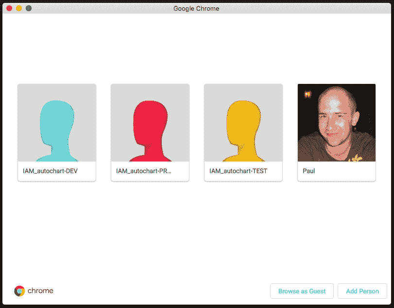

# 如何作为多个 IAM 用户同时连接到 AWS 控制台

> 原文：<https://dev.to/paulswail/how-to-connect-to-the-aws-console-as-multiple-iam-users-at-the-same-time-11a>

如果你曾经不得不同时管理多个 AWS 帐户，无论是针对[不同的客户端项目](https://winterwindsoftware.com/managing-separate-projects-in-aws/)还是同一应用程序的不同环境，你可能会遇到不得不作为一个用户退出 AWS 控制台，然后作为另一个用户登录的痛苦。如果您启用了多因素身份认证([，这是您应该做的](https://aws.amazon.com/iam/details/mfa/)，这只会增加摩擦。

你告诉自己，这是 UX 为了安全而进行的交易。

但是我们可以有我们的蛋糕并且吃它！🍰

通过使用 Chrome 中有点模糊的[人物档案](https://support.google.com/chrome/answer/2364824)功能，你将能够:

*   双击打开新用户配置文件的 AWS 控制台窗口
*   如果您的配置文件是针对 root 用户而不是 IAM 用户的，请避免切换到单独的登录屏幕

人物档案实际上就像一个沙箱，每个人都有自己的 cookies、缓存、本地存储、扩展等。

只需按照以下快速步骤创建您的个人资料，对您经常使用的每个 AWS 用户重复这些步骤:

1.  打开一个 Chrome 窗口，点击右上角的圆形用户图像打开一个菜单
2.  点击“管理人员”按钮，然后点击“添加人员”按钮。
3.  将用户命名为与其 AWS 用户名相同的名称(可以选择前缀“AWS”或“IAM”)。

就是这样！

现在返回到原始用户的窗口，再次打开“管理人员”弹出窗口。您应该会看到您创建的所有用户。

[T2】](https://res.cloudinary.com/practicaldev/image/fetch/s--Mcb8YUOm--/c_limit%2Cf_auto%2Cfl_progressive%2Cq_auto%2Cw_880/https://winterwindsoftware.com/img/blog-images/chrome-manage-people.png)

只需点击你想连接的用户，一个新的沙盒浏览器窗口就会打开。

一旦他们的会话过期，你仍然必须以每个用户的身份登录([目前设置为 12 小时](https://aws.amazon.com/console/faqs/#session_expire))，但至少现在你可以在早上完成一次登录过程，并为你一整天的工作保持多个窗口打开。

一些额外提示:

*   在您的个人资料中，将您的主页设置为 [`https://console.aws.amazon.com/console/home`](https://console.aws.amazon.com/console/home) ，这样您将立即进入 AWS 控制台主页。
*   如果您想在登录时快速自动填写密码，请确保为每个用户配置文件安装您最喜欢的密码管理器扩展(1Password/LastPass)。
*   使用`CMD+ ``在 OSX 打开的浏览器窗口之间快速切换。
*   在用户层面定制你的浏览器窗口的主题(例如，你可能想要一场[大火🔥主题](https://chrome.google.com/webstore/detail/fire-flame-close-up-lsp/apahdohilpbfhfbnjepjilngffpoepif?hl=en-GB)针对您的生产环境用户)。

勇往直前，提高效率！

* * *

💌 ***如果你喜欢这篇文章，你可以注册[到我关于在 AWS](https://winterwindsoftware.com/newsletter/) 中构建无服务器应用的每周时事通讯。***