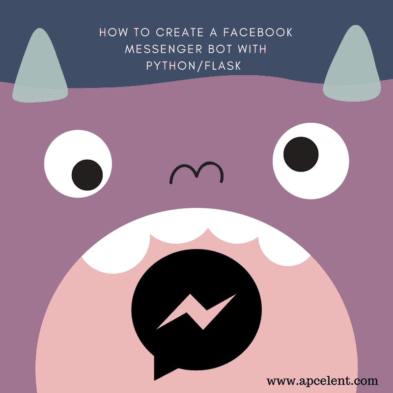
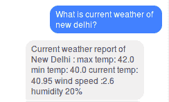
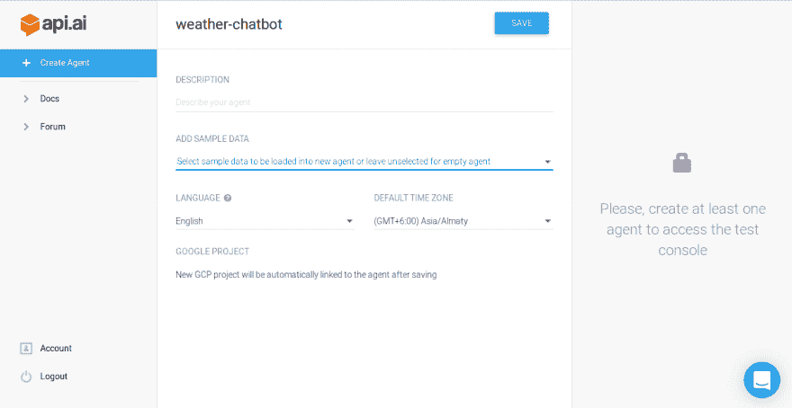
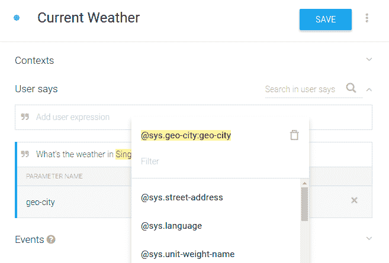
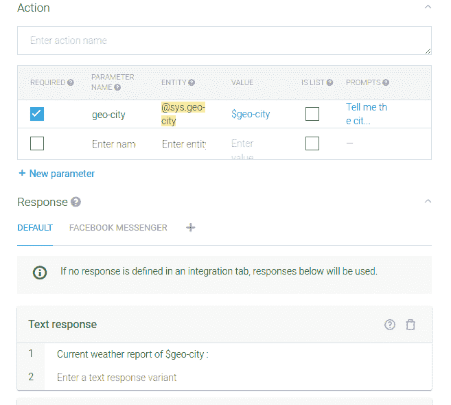
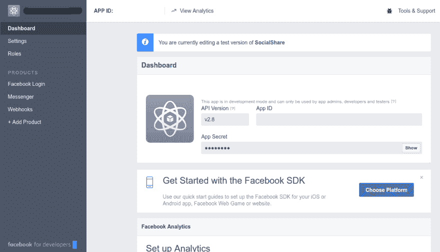
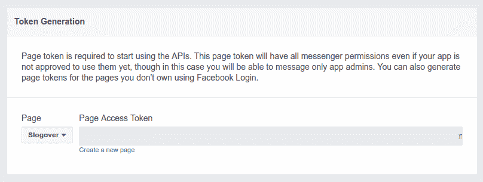
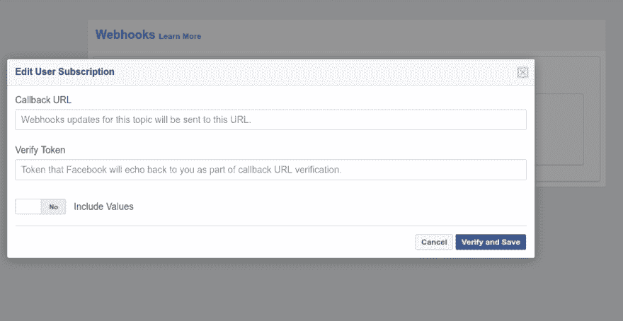
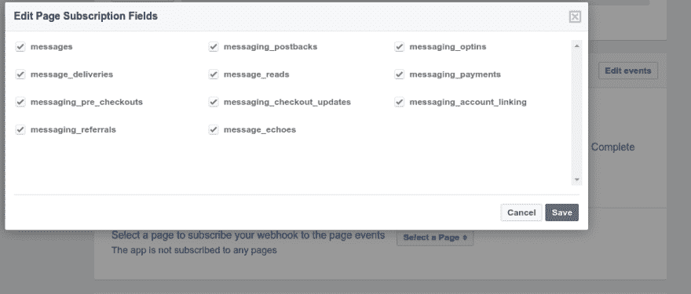

# 如何用 Python Flask 创建 Facebook Messenger Bot

> 原文：<https://dev.to/apcelent/how-to-create-a-facebook-messenger-bot-with-python-flask-50j2>

机器人革命已经开始，每个人都在制造机器人。在这篇文章中，我们将带你使用 Python/Flask 创建你的第一个机器人。代码库可以在 [Github](https://github.com/codecraf8/facebook-messenger-bot-python-flask) 上找到。

[T2】](https://res.cloudinary.com/practicaldev/image/fetch/s--mF-aLfAQ--/c_limit%2Cf_auto%2Cfl_progressive%2Cq_auto%2Cw_880/https://blog.apcelent.cimg/facebook-messenger-bot-python-flask.png)

需要创建一个轻量级的 web 应用程序来补充我们的机器人。

我们将使用的不同技术如下:

*   服务器后端: [Flask](http://flask.pocoo.org/)
*   到本地主机的安全隧道: [Ngrok](https://ngrok.com/)
*   自然语言处理平台: [API AI](https://dialogflow.com/)
*   在 Facebook Messenger 上部署
*   用于天气预报的 [OpenWeatherMap web API](https://openweathermap.org/) 的 [Python 包装器](https://github.com/csparpa/pyowm)

我们将演示一个非常简单的功能:

询问一个地方的当前天气，聊天机器人应该返回天气信息。

示例:

问题:新德里现在的天气如何？

回复:新德里当前天气报告:最高温度:42.0 最低温度:40.0 当前温度:40.95 风速:2.6 湿度 20%

[T2】](https://res.cloudinary.com/practicaldev/image/fetch/s--QBF8zJ75--/c_limit%2Cf_auto%2Cfl_progressive%2Cq_auto%2Cw_880/https://blog.apcelent.cimg/chatbot_may_17_weather_chatbot.png)

## 1。设置 API AI

API AI 是一个对话式体验平台。在 [API AI](https://console.dialogflow.com/api-client/#/login) 注册并创建账户。创建代理来访问测试控制台。导航到代理的设置并获取客户端访问令牌。

[T2】](https://res.cloudinary.com/practicaldev/image/fetch/s--cl5KLKfx--/c_limit%2Cf_auto%2Cfl_progressive%2Cq_auto%2Cw_880/https://blog.apcelent.cimg/chatbot_may_17_create_agent.png)

### 创建意图

意图是用户表达和期望响应之间的映射。

我们添加了一个带有用户表达的意图“新加坡的天气如何？”

[T2】](https://res.cloudinary.com/practicaldev/image/fetch/s--wYPcQkuu--/c_limit%2Cf_auto%2Cfl_progressive%2Cq_auto%2Cw_880/https://blog.apcelent.cimg/chatbot_may_17_intent_contexts.png)

其中新加坡被标记为@sys.geo-city 类型的实体。该参数可以取对话中的任何值，并用于确定应用程序中的响应。

我们为用户表达式添加以下响应:“$geo-city 的当前天气报告”

[T2】](https://res.cloudinary.com/practicaldev/image/fetch/s--b5tMrbAv--/c_limit%2Cf_auto%2Cfl_progressive%2Cq_auto%2Cw_880/https://blog.apcelent.cimg/chatbot_may_17_intent_user_response.png)

### ai python 客户端 API

我们可以用 [API AI python SDK](https://pypi.org/project/apiai/1.2.3/) 进行自然语言处理。

## 2。设置打开天气图

Open Weather Map 提供了 [API](https://openweathermap.org/api) 用于访问地球上任何位置的当前天气数据。有很好的 [python 包装器](https://github.com/csparpa/pyowm)来使用这些 API。注册打开天气地图，并获取获取天气数据的 API 键。

```
owm = pyowm.OWM('your_open_weather_map_api_key')  # You MUST provide a valid API key 
forecast = owm.daily_forecast(input_city)

observation = owm.weather_at_place(input_city)
w = observation.get_weather()
print(w)                      
print(w.get_wind())                 
print(w.get_humidity())      
max_temp = str(w.get_temperature('celsius')['temp_max'])  
min_temp = str(w.get_temperature('celsius')['temp_min'])
current_temp = str(w.get_temperature('celsius')['temp'])
wind_speed = str(w.get_wind()['speed'])
humidity = str(w.get_humidity()) 
```

Enter fullscreen mode Exit fullscreen mode

如果您有 open weather map 的专业订阅，请使用以下内容:

```
owm = pyowm.OWM(API_key='your-API-key', subscription_type='pro') 
```

Enter fullscreen mode Exit fullscreen mode

## 3。设置 Flask 服务器

```
import apiai 
```

Enter fullscreen mode Exit fullscreen mode

添加客户端访问令牌、页面访问令牌和验证令牌

```
CLIENT_ACCESS_TOKEN = 'your_client_access_token_from_api_ai'
PAGE_ACCESS_TOKEN = 'your_facebook_page_access_token'
VERIFY_TOKEN = 'verification_token_for_facebook_chatbot_using_python'

ai = apiai.ApiAI(CLIENT_ACCESS_TOKEN) 
```

Enter fullscreen mode Exit fullscreen mode

脸书 webhook 向应用程序发送请求，如果验证完成，应用程序返回的令牌是否与 Facebook 应用程序中输入的令牌相匹配

```
@app.route('/', methods=['GET'])
def handle_verification():
    if (request.args.get('hub.verify_token', '') == VERIFY_TOKEN):
        print("Verified")
        return request.args.get('hub.challenge', '')
    else:
        print("Wrong token")
        return "Error, wrong validation token" 
```

Enter fullscreen mode Exit fullscreen mode

应用程序将解析 facebook messenger 发送的所有消息

```
@app.route('/', methods=['POST'])
def handle_message():
    '''
    Handle messages sent by facebook messenger to the applicaiton
    '''
    data = request.get_json()

    if data["object"] == "page":
        for entry in data["entry"]:
            for messaging_event in entry["messaging"]:
                if messaging_event.get("message"):

                    sender_id = messaging_event["sender"]["id"]
                    recipient_id = messaging_event["recipient"]["id"]  
                    message_text = messaging_event["message"]["text"]  
                    send_message_response(sender_id, parse_natural_text(message_text)

     return "ok" 
```

Enter fullscreen mode Exit fullscreen mode

使用 python 请求库调用 facebook Graph API 向 facebook 用户发送消息

```
def send_message(sender_id, message_text):
    '''
    Sending response back to the user using facebook graph API
    '''
    r = requests.post("https://graph.facebook.com/v2.6/me/messages",

        params={"access_token": PAGE_ACCESS_TOKEN},

        headers={"Content-Type": "application/json"},

        data=json.dumps({
        "recipient": {"id": sender_id},
        "message": {"text": message_text}
    })) 
```

Enter fullscreen mode Exit fullscreen mode

使用 API AI 解析用户发送的消息，并从 API AI 接收机器人响应。从打开的天气地图客户端获取天气数据，并在报告中添加机器人响应。

```
def parse_user_text(user_text):

    '''
    Send the message to API AI which invokes an intent
    and sends the response accordingly
    The bot response is appened with weaher data fetched from
    open weather map client
    '''

    request = ai.text_request()
    request.query = user_text

    response = json.loads(request.getresponse().read().decode('utf-8'))
    responseStatus = response['status']['code']
    if (responseStatus == 200):
        print("Bot response", response['result']['fulfillment']['speech'])

        weather_report = ''

        input_city = response['result']['parameters']['geo-city']

        #Fetching weather data
        owm = pyowm.OWM('edd197717da7951b85f8f6936fc27b13')  # You MUST provide a valid API key 
        forecast = owm.daily_forecast(input_city)

        observation = owm.weather_at_place(input_city)
        w = observation.get_weather()
        print(w)                      
        print(w.get_wind())                 
        print(w.get_humidity())      
        max_temp = str(w.get_temperature('celsius')['temp_max'])  
        min_temp = str(w.get_temperature('celsius')['temp_min'])
        current_temp = str(w.get_temperature('celsius')['temp'])
        wind_speed = str(w.get_wind()['speed'])
        humidity = str(w.get_humidity())
        weather_report = ' max temp: ' + max_temp + ' min temp: ' + min_temp + ' current temp: ' + current_temp + ' wind speed :' + wind_speed + ' humidity ' + humidity + '%'
        print("Weather report ", weather_report)
        return (response['result']['fulfillment']['speech'] + weather_report)
    else:
        return ("Please try again")

def send_message_response(sender_id, message_text):
    sentenceDelimiter = ". "
    messages = message_text.split(sentenceDelimiter)

    for message in messages:
        send_message(sender_id, message)

if __name__ == '__main__':
    app.run() 
```

Enter fullscreen mode Exit fullscreen mode

激活一个[虚拟环境](https://virtualenv.pypa.io/en/stable/)，安装所有软件包

```
pip install -r requirements.txt 
```

Enter fullscreen mode Exit fullscreen mode

并运行脚本

```
python fb-chatbot.py 
```

Enter fullscreen mode Exit fullscreen mode

### 设置隧道传输到本地主机

我们已经使用 ngrok 将本地 web 服务器暴露在互联网上，以便它可以用于回调验证需要使用 facebook 应用程序的 webhook。

```
sudo apt-get update
sudo apt-get install ngrok-client 
```

Enter fullscreen mode Exit fullscreen mode

并运行 ngrok 客户端

```
./ngrok http -bind-tls=true 5000 
```

Enter fullscreen mode Exit fullscreen mode

请注意，需要一个安全的回拨 URL (https)进行验证。

### 设置 facebook messenger

创建一个 [facebook 页面](https://www.facebook.com/pages/creation/?ref_type=logout_gear)和 [facebook 应用](https://developers.facebook.com/)。将 Webhook 添加到应用程序中。

[T2】](https://res.cloudinary.com/practicaldev/image/fetch/s--FAS7PeeS--/c_limit%2Cf_auto%2Cfl_progressive%2Cq_auto%2Cw_880/https://blog.apcelent.cimg/chatbot_may_17_facebook_app.png)

获取应用程序 ID 并在脚本中更新它。

将 Messenger 添加到应用程序中，并为必须用于聊天的页面生成令牌。

[T2】](https://res.cloudinary.com/practicaldev/image/fetch/s--2x45W6IF--/c_limit%2Cf_auto%2Cfl_progressive%2Cq_auto%2Cw_880/https://blog.apcelent.cimg/chatbot_may_17_page_access_token.png)

[T2】](https://res.cloudinary.com/practicaldev/image/fetch/s--3zr69nhL--/c_limit%2Cf_auto%2Cfl_progressive%2Cq_auto%2Cw_880/https://blog.apcelent.cimg/chatbot_may_17_subscription_webhook.png)

并为页面订阅选择事件

[T2】](https://res.cloudinary.com/practicaldev/image/fetch/s--lIoLdikC--/c_limit%2Cf_auto%2Cfl_progressive%2Cq_auto%2Cw_880/https://blog.apcelent.cimg/chatbot_may_17_page_subscription.png)

重启服务器，现在聊天机器人已经准备好了。脸书进一步提供了 UI 元素，你可以在这里使用它们[。](https://developers.facebook.com/docs/messenger-platform/reference/send-api)

这篇文章将帮助你使用 API.AI 建立一个你自己的聊天机器人。如果有任何疑问或请求，请随时联系我们。

这篇文章最初出现在 [Apcelent 科技博客](https://blog.apcelent.com/How-to-Create-a-Facebook-Messenger-Bot-with-Python-Flask.html)上。