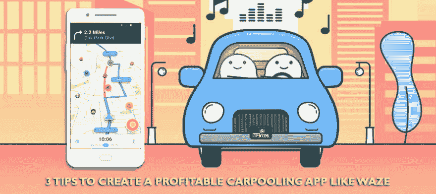

# 如何打造 Waze 这样的盈利拼车 App

> 原文：<https://dev.to/itfirms/how-to-create-a-profitable-carpooling-app-like-waze-41od>

 
如果你正在寻找创建一个像 waze 一样盈利的拼车应用程序，那么我们在这里提到了一些重要的提示:[https://www . it firms . co/3-tips-to-create-a-profitable-car pooling-app-like-waze/](https://www.itfirms.co/3-tips-to-create-a-profitable-carpooling-app-like-waze/)