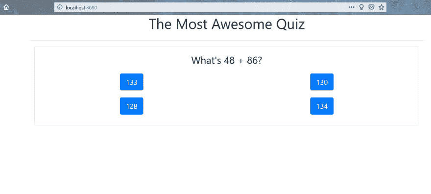
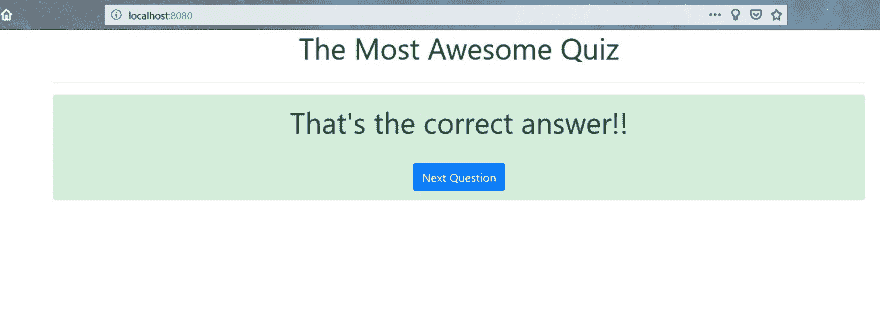

# 如何创建一个简单的数学测验应用程序

> 原文：<https://dev.to/napoleon039/how-to-create-a-simple-math-quiz-app-371j>

在本文中，我们将构建一个简单的测验 web 应用程序。它将在 Vue.js 中制作。

这将是一个简单的抽认卡格式。卡片上会有一个问题和一些选项。如果选择的选项是正确答案，卡片会翻转过来祝贺我们。为了这个效果，我们将利用一些过渡效果。最终结果会是这样的。

[T2】](https://res.cloudinary.com/practicaldev/image/fetch/s--tRwJMCgS--/c_limit%2Cf_auto%2Cfl_progressive%2Cq_auto%2Cw_880/https://thepracticaldev.s3.amazonaws.com/i/cc7uglnxf7szvu7nrf46.JPG)

[T2】](https://res.cloudinary.com/practicaldev/image/fetch/s--IviPHFuo--/c_limit%2Cf_auto%2Cfl_progressive%2Cq_auto%2Cw_880/https://thepracticaldev.s3.amazonaws.com/i/v7k2zdwx2h366eiftl9g.JPG)

* * *

首先，让我们建立我们的档案。打开您的终端，转到项目文件夹，并在终端键入以下命令。您可以为您的项目选择任何名称。你将不再需要 *Vuex* 或 *Vue-router* ，所以不要选择它们。剩下的选项由你决定，你可以选择你想要的。

```
#for Vue 3.x
vue create quiz-app

#for Vue 2.x (legacy version)
vue init webpack quiz-app 
```

Enter fullscreen mode Exit fullscreen mode

我们的初始文件准备好了。打开您最喜欢的代码编辑器/IDE，让我们开始吧。

从样板代码中删除`HelloWorld.vue`组件，因为我们不再需要它。其中一个主要组件是`App.vue`组件。基于抽认卡的测验有一个非常简单的结构。有一个问题，一边是一些选项(通常是 4 个)，另一边是答案。因此，我们可以将带有选项的问题放到一个名为`Question.vue`的独立组件中，并将答案放到一个名为`Answer.vue`的独立组件中。

让我们从`App.vue`开始，设置我们 app 的基本结构。我将在这个项目中使用 Bootstrap v4。你可以使用它或者任何你熟悉的库。

```
<template>
  <div class="container">
    <div class="row">
      <div class="col-sm">
        <h1 class="text-center">
          The Most Awesome Quiz
        </h1>
      </div>
    </div>
    <hr>
    <div class="row">
      <div class="col-sm">
        <transition name="flip" mode="out-in">
          <component :is="mode" @answered="answered($event)" @confirmed="mode = 'Question'"></component>
        </transition>
      </div>
    </div>
  </div>
</template> 
```

Enter fullscreen mode Exit fullscreen mode

我们有我们的标题*最牛的测验*。然后是一个带有一些属性的`<transition>`标签。如果你不熟悉*过渡*标签，这是 Vue 提供给我们的。它允许我们通过简单地用一个`<transition>`标签包装元素来应用过渡到任何东西。我们的标签有两个属性- **name** 是转场的名称，而`mode="out-in"`告诉 Vue 等到前一个转场完全结束后再开始新的转场。

在里面我们有另一个 Vue 提供的标签，叫做`<component>`。这用于动态组件。

基本结构是这样的——我们有一个动态组件，它最初总是被设置为显示`Question`组件。当我们在选项中选择正确答案时，它会将组件切换到`Answer`。这对于动态组件是可能的。由于有了`<transition>`标签，我们可以在组件之间切换时应用过渡。

至于我们的`<component>`标签的属性。最后两个是我们用于自定义事件的`v-on`。`@answered`将是由`Question`组件生成的自定义事件。它会告诉我们选择的答案是否正确。然后我们可以选择做什么。`@confirmed`是附在`Answer`组件上的。它所做的是切换回`Question`组件并显示一个新问题。

第一个属性`:is`是在动态组件之间切换所需要的。它本身是一个动态属性，因为它需要改变它的值。

模板中的其余代码只是用来给页面添加视觉效果的引导程序，这样它就不会看起来像早期互联网的东西。

现在是这个组件的核心逻辑。很小(虽然没有`Answer`的逻辑小)。

```
import Question from './components/Question.vue';
import Answer from './components/Answer.vue';
export default {
  data() {
    return {
      mode: 'Question'
    }
  },
  components: {
    Question,
    Answer
  },
  methods: {
    answered(isCorrect) {
      if (isCorrect) {
        this.mode = 'Answer';
      } else {
        this.mode = 'Question';
        alert("That's the wrong answer! Try again.")
      }
    }
  }
} 
```

Enter fullscreen mode Exit fullscreen mode

首先，我们导入将要创建的两个组件。我已经把它们放在单独的`/components`文件夹里了。

我们只有一个数据属性，用于在两个组件之间动态切换。唯一的方法是根据是否选择了正确的选项来采取特定的操作。

请注意，我们不决定是否选择了正确答案。这是由`Question`组件完成的。我们只是照着做。如果`Question`组件说选择了正确的答案，我们就切换到`Answer`组件，如果答案是错的，我们就显示一个警告。

现在模板和核心逻辑已经完成，让我们快速完成过渡效果。

```
.flip-enter-active{
  animation: flip-in 0.5s ease-out forwards;
}
.flip-leave-active{
  animation: flip-out 0.5s ease-out forwards;
}
@keyframes flip-out{
  from{
    transform: rotateY(0deg);
  } 
  to {
    transform: rotateY(90deg);
  }
}
@keyframes flip-in {
  from {
    transform: rotateY(90deg);
  }
  to {
    transform: rotateY(0deg);
  }
} 
```

Enter fullscreen mode Exit fullscreen mode

当我们给过渡命名时，类`.flip-enter-active`和`.flip-leave-active`也是由 Vue 提供的(Vue *给了我们这么多好东西)。当过渡处于*进入*阶段时使用第一个类，意味着它开始了。当过渡是*主动离开*或结束时，应用第二类。*

你最好去看实际操作，而不是我来解释。它有[这种效果](https://jsfiddle.net/NAPOLEON039/1058jvd2/1/)

* * *

组件不包含太多代码，因为它所做的只是显示一条祝贺消息。

```
<template>
    <div class="alrt alert-success text-center">
        <h1>That's the correct answer!!</h1>
        <hr>
        <button class="btn btn-primary" @click="onNextQuestion">Next Question</button>
    </div>
</template> 
```

Enter fullscreen mode Exit fullscreen mode

模板很容易理解。只有一个`<h1>`和一个显示下一个问题的按钮。

```
methods: {
    onNextQuestion() {
        this.$emit('confirmed');
    }
} 
```

Enter fullscreen mode Exit fullscreen mode

该方法通过单击按钮来调用，并向父`App.vue`组件发出一个*确认的*事件。如果您还记得，当这个事件被发出时，`App`组件切换到`Question`组件。

* * *

现在是最后一个，也可能是最长的三个部分。`Question`组件比前面的组件更有逻辑性，因为它处理创建新问题和确定是否选择了正确答案的关键任务。

```
<template>
    <div class="container text-center">
        <div class="card">
            <div class="card-body">
                <h3 class="card-title text-center">{{question}}</h3>
                <div class="card-text">
                    <div class="row">
                        <div class="col-sm">
                            <button class="btn btn-primary btn-lg" style="margin: 10px" @click="onAnswer(btnData[0].correct)"> {{btnData[0].answer}} </button>
                        </div>
                        <div class="col-sm">
                            <button class="btn btn-primary btn-lg" style="margin: 10px" @click="onAnswer(btnData[1].correct)"> {{btnData[1].answer}} </button>
                        </div>
                    </div>
                    <div class="row">
                        <div class="col-sm">
                            <button class="btn btn-primary btn-lg" style="margin: 10px" @click="onAnswer(btnData[2].correct)"> {{btnData[2].answer}} </button>
                        </div>
                        <div class="col-sm">
                            <button class="btn btn-primary btn-lg" style="margin: 10px" @click="onAnswer(btnData[3].correct)"> {{btnData[3].answer}} </button>
                        </div>
                    </div>
                </div>
            </div>
        </div>
    </div>
</template> 
```

Enter fullscreen mode Exit fullscreen mode

看似势不可挡，其实真的不是。它的主要部分是自举。该模板显示一张卡片(在 Bootstrap v4 中可用),上面有一个简单的加法或减法问题。数字是随机的，我们也随机操作。所以下一个问题是加法还是减法也是随机的。

接下来，我们有 4 个按钮。这些将是我们对这个问题的选择。其中一个会是正确答案(正确答案的位置也顺便随机变化)。相当多的随机性😉。但这才是有趣的地方！

理解了代码的其余部分之后，内插字符串的作用就变得很清楚了。

```
const MODE_ADDITION = 1;
const MODE_SUBTRACTION = 2
export default {
    data() {
        return {
            question: 'Oops, an error occured :/',
            btnData: [
                {correct: true, answer: 0},
                {correct: false, answer: 0},
                {correct: false, answer: 0},
                {correct: false, answer: 0}
            ]
        }
    }
} 
```

Enter fullscreen mode Exit fullscreen mode

我们有两个变量来表示操作模式。`btnData`是一个对象数组。每个物体代表一个*答案*。它有两个属性——**答案**是按钮代表的答案。每个按钮都有一个答案，可能正确，也可能不正确。这个属性将包含。正确的将会告诉我们这个答案是否正确。

即使第一个对象的*正确的*属性被设置为`true`，它也将在以后被改变。

默认情况下,`question`数据属性将有一个字符串。因此，如果我们生成问题的方法不管用，我们就会知道有问题。

```
created() {
    this.generateQuestion();
}, 
```

Enter fullscreen mode Exit fullscreen mode

接下来，我们有这个`created()`生命周期挂钩。当这个组件被创建时，就会执行`generateQuestion()`方法。正如所料，这个方法负责生成一个新问题，并将正确答案分配给四个按钮中的一个。

```
generateQuestion() {
    const firstNumber = this.generateRandomNumber(1, 100);
    const secondNumber = this.generateRandomNumber(1, 100);
    const modeNumber = this.generateRandomNumber(1, 2);

    let correctAnswer = 0;

    switch (modeNumber) {
        case MODE_ADDITION:
            correctAnswer = firstNumber + secondNumber;
            this.question = `What's ${firstNumber} + ${secondNumber}?`;
            break;
        case MODE_SUBTRACTION:
            correctAnswer = firstNumber - secondNumber;
            this.question = `What's ${firstNumber} - ${secondNumber}?`;
            break;
        default:
            correctAnswer = 0;
            // this.question = 'Oops, an error occurred :/';
    }
    this.btnData[0].answer = this.generateRandomNumber(correctAnswer - 10, correctAnswer + 10, correctAnswer);
    this.btnData[0].correct = false;
    this.btnData[1].answer = this.generateRandomNumber(correctAnswer - 10, correctAnswer + 10, correctAnswer);
    this.btnData[1].correct = false;
    this.btnData[2].answer = this.generateRandomNumber(correctAnswer - 10, correctAnswer + 10, correctAnswer);
    this.btnData[2].correct = false;
    this.btnData[3].answer = this.generateRandomNumber(correctAnswer - 10, correctAnswer + 10, correctAnswer);
    this.btnData[3].correct = false;

    const correctButton = this.generateRandomNumber(0, 3);
    this.btnData[correctButton].correct = true;
    this.btnData[correctButton].answer = correctAnswer;
} 
```

Enter fullscreen mode Exit fullscreen mode

相当长的函数，但是不要担心，我们会一起完成它。

首先，我们有三个变量。有一个`firstNumber`和`secondNumber`变量，在 *1 和 100* 之间有一个随机数。第三个变量`modeNumber`将代表操作模式。还有一个神秘的`generateRandomNumber()`功能。那有什么用？它为我们生成一个随机数，但逻辑略有不同。这个函数之后我们再来看。

然后，我们有另一个变量，可能是最重要的一个- `correctAnswer`。这将包含我们问题的正确答案。确保使用 **let** 而不是 *const* ，因为我们需要重新分配它。

在声明变量之后，我们有一个`switch case`。它将检查我们在 1 和 2 之间随机选择的`modeNumber`。原因是我们的第一个变量声明，在这里我们给我们的操作模式分配了一个数字。这将派上用场了。

根据随机选择的操作，我们可以很容易地改变我们的逻辑。如果随机数是 1，我们将把`firstNumber`和`secondNumber`变量相加，作为正确答案。如果是 2，我们就减去它们。然后，我们将适当的字符串分配给`question`数据属性。

我们的问题已经准备好了，我们也有正确的答案。接下来，我们将它随机分配给一个按钮。接下来的部分可能看起来令人困惑，但事实并非如此。

每个按钮的*正确的*属性设置为假。一个随机数将被分配给*答案*属性。但是我们不能只分配一个**完全的**随机数。例如，如果问题是*2+3 是多少？我们不能有一个选项显示 *573* 。这显然是错误的答案。因此，我们的选择需要是随机的，但仍在一个范围内。我们使用`generateRandomNumber()`函数并传递一个比正确答案少 10 *的最小数字和一个比正确答案多 10 *的最大数字。***

听起来是个好办法，不是吗？但是有第三个参数传递给了这个函数，它有什么作用呢？

很高兴你问了。现在我们不希望随机产生的选项成为实际答案，对吗？所以第三个参数告诉函数生成一个随机数，在我们传递的范围内，但它不应该是实际的答案。因此，所有按钮都有错误的答案。

现在我们要做的是生成一个随机的索引位置。然后，我们将正确答案分配给该索引处的按钮，并将其*正确的*属性设置为`true`。

简而言之，我们给了所有按钮随机选项，并声明它们是错误的。然后随机选择一个按钮，给它正确的答案，并宣布它是正确的。

为什么我们要这样做呢？难道我们不能随机选择一个按钮，给它分配答案，然后*再*开始给剩下的按钮分配错误的答案吗？我们当然可以。

但是，给除了之外的所有按钮*分配错误的答案，随机选择正确的答案？！这是一种痛苦。尽管以某种方式做这件事是可能的，但我很懒；).*

对于其余功能:

```
generateRandomNumber(min, max, except) {
    const rndNumber = Math.round(Math.random() * (max - min)) + min;
    if (rndNumber == except) {
        return this.generateRandomNumber(min, max, except);
    }
    return rndNumber;
},
onAnswer(isCorrect) {
    this.$emit('answered', isCorrect);
} 
```

Enter fullscreen mode Exit fullscreen mode

正如我解释过的`generateRandomNumber()`函数，它有 3 个参数。前两个是要生成随机数的范围。第三个参数仅在我们确定生成的随机数不是正确答案时使用。如果它匹配`correctAnswer`，函数将递归运行，直到我们得到一个不同的数字。

`onAnswer` click 处理程序发出一个`answered`事件，并将答案是否正确传递给父(`App.vue`)组件。

* * *

这样，我们的应用程序就准备好了。启动一个开发服务器来查看您的代码。

```
#for 3.x
npm run serve

#for 2.x
npm run dev 
```

Enter fullscreen mode Exit fullscreen mode

下面是代码的 [GitHub repo](https://github.com/NAPOLEON039/Quiz-App) 供参考。我希望你做得开心。我很乐意看到你修改和改进它。期待在下面的评论区听到你的消息。

* * *

这个应用程序最初来自于由[马克西米连·施瓦兹米勒](https://twitter.com/maxedapps)在 Udemy 上的 [Vue 课程](https://www.udemy.com/vuejs-2-the-complete-guide)。他教了很多关于 Vue 的惊人的东西，你肯定能在那门课程中找到一些有价值的东西。所以一定要去看看。

> 我目前正在学习他的课程，觉得很有价值。这不是一个赞助帖子，而是个人推荐。