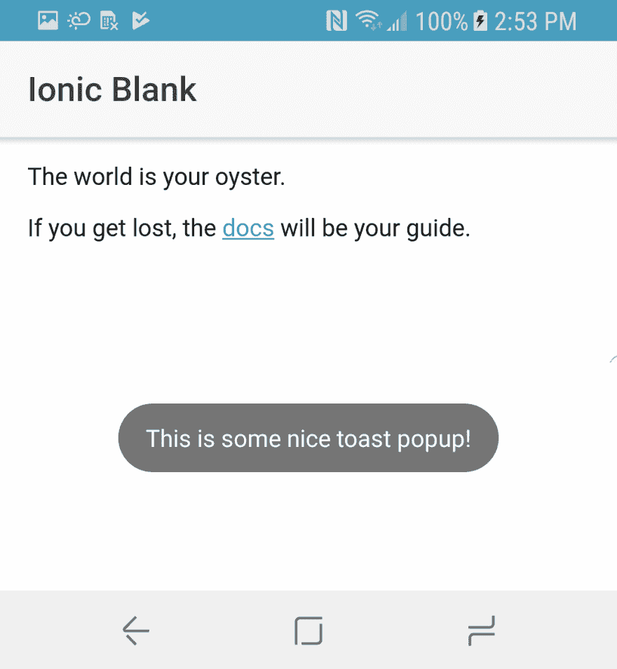

# 如何创建一个 Android Cordova 插件来显示吐司弹出窗口

> 原文：<https://dev.to/nikola/how-to-create-an-android-cordova-plugin-for-showing-toast-popups--9fb>

[T2】](https://res.cloudinary.com/practicaldev/image/fetch/s--n15n3FJo--/c_limit%2Cf_auto%2Cfl_progressive%2Cq_auto%2Cw_880/https://thepracticaldev.s3.amazonaws.com/i/89kvzy2qrz39ys8sm70k.jpg)

*原载于[我的博客](http://www.nikola-breznjak.com/blog/javascript/create-android-cordova-plugin-showing-toast-popups/)*

## TL；速度三角形定位法(dead reckoning)

在这篇文章中，我将一步一步地向你展示如何为 Android 构建一个 Cordova 插件来显示一个本地的 Toast 弹出窗口。

你可以在这里查看插件[的源代码，在这里](https://github.com/Hitman666/cordova-android-toast)查看使用这个插件[的演示 Ionic 应用的源代码。](https://github.com/Hitman666/IonicAndroidToastTest)

> 如果你正在寻找如何为 iOS 平台编写 Cordova 插件的指南，我在这里写了关于它的。

## plugin.xml

我们通过创建`plugin.xml`文件:
开始插件构建过程

```
<?xml version='1.0' encoding='utf-8'?>
<plugin id="cordova-android-toast" version="1.0.0" xmlns="http://apache.org/cordova/ns/plugins/1.0" xmlns:android="http://schemas.android.com/apk/res/android">
    <name>AndroidToast</name>

    <description>Android Toast Plugin</description>
    <license>Apache 2.0</license>
    <keywords>android, toast</keywords>

    <engines>
      <engine name="cordova" version=">=3.0.0" />
    </engines>

    <js-module name="AndroidToast" src="www/AndroidToast.js">
        <clobbers target="AndroidToast" />
    </js-module>

    <platform name="android">
        <config-file target="config.xml" parent="/*">
            <feature name="AndroidToast">
                <param name="android-package" value="com.nikolabreznjak.AndroidToast" />
            </feature>
        </config-file>

        <source-file src="src/android/AndroidToast.java" target-dir="src/com/nikola-breznjak/android-toast" />
    </platform>
</plugin> 
```

在这个文件中，您基本上定义了:

*   该插件支持的平台(`<platform name="android">`)
*   你的插件的源文件在哪里(`source-file`元素)
*   哪里是将成为从 Cordova 到本机代码的桥梁的 JavaScript 文件(`js-module`标签`src`属性)
*   你在科尔多瓦/爱奥尼亚代码(`<clobbers target="AndroidToast" />`)中引用的插件的名字是什么

## www/AndroidToast.js

接下来是所谓的“桥”文件，它连接本机和 JavaScript 端。通常将该文件放在`www`文件夹中。这个文件的内容如下:

```
var exec = cordova.require('cordova/exec');

var AndroidToast = function() {
    console.log('AndroidToast instanced');
};

AndroidToast.prototype.show = function(msg, onSuccess, onError) {
    var errorCallback = function(obj) {
        onError(obj);
    };

    var successCallback = function(obj) {
        onSuccess(obj);
    };

    exec(successCallback, errorCallback, 'AndroidToast', 'show', [msg]);
};

if (typeof module != 'undefined' && module.exports) {
    module.exports = AndroidToast;
} 
```

我们创建了`AndroidToast`函数，它在其他编程语言中基本上是一个类，因为我们在它的原型上添加了`show`函数。`show`函数，通过 Cordova 的`exec`函数，为本地端的`AndroidToast`类和`show`方法注册了`success`和`error`回调，我们很快就会展示。此外，我们将`msg`变量作为数组传递给本机`show`函数。

## src/Android/Android toast . Java

“本地”代码是用 [Java](https://www.ibm.com/developerworks/java/tutorials/j-introtojava1/) :
编写的

```
package com.nikolabreznjak;

import org.apache.cordova.CordovaPlugin;
import org.apache.cordova.CallbackContext;
import org.json.JSONArray;
import org.json.JSONObject;
import org.json.JSONException;
import android.content.Context;
import android.widget.Toast;

public class AndroidToast extends CordovaPlugin {
    @Override
    public boolean execute(String action, JSONArray args, CallbackContext callbackContext) throws JSONException {
        if ("show".equals(action)) {
            show(args.getString(0), callbackContext);
            return true;
        }

        return false;
    }

    private void show(String msg, CallbackContext callbackContext) {
        if (msg == null || msg.length() == 0) {
            callbackContext.error("Empty message!");
        } else {
            Toast.makeText(webView.getContext(), msg, Toast.LENGTH_LONG).show();
            callbackContext.success(msg);
        }
    }
} 
```

在实现文件中，我们定义了我们的函数。我们的例子中只有`show`和`execute`函数。在为 Android 编写 Cordova 插件时，桥文件中的每个函数都必须调用`exec`函数，然后该函数调用原生端的`execute`函数。然后，基于`action`参数，我们决定需要调用哪个函数。在我们的例子中，如果我们确定调用了`show`动作，我们将参数传递给私有的`show`函数，然后该函数使用本地的`Toast.makeText`函数来显示 Toast 消息。

当显示 Toast 时，我们的`show`方法需要访问应用程序的全局`Context`，这可以通过使用我们从扩展`CordovaPlugin`得到的`webView`对象来获得。这代表正在运行的 Cordova 应用程序，我们可以使用`webView.getContext()`从那里获得全球上下文。`makeText`函数的其他参数定义了我们想要显示的文本以及我们想要显示的持续时间。

在这一点上，你可以尽可能地自定义 toast 组件，没有任何限制，即使它是通过 Cordova 作为一种“包装器”使用的。你可以做的一些额外的事情在官方文档中列出。

## package.json

在 Cordova 的早期版本中，不需要这个文件。可以在`plugman`包的帮助下自动生成(没有的话用`npm install plugman -g`安装):

`plugman createpackagejson /path/to/your/plugin`。

如果你在插件文件夹中，那么命令是:`plugman createpackagejson .`。我的例子中的`package.json`文件现在看起来像这样:

```
{
    "name": "cordova-android-toast",
    "version": "1.0.0",
    "description": "Android Toast Plugin",
    "cordova": {
        "id": "cordova-android-toast",
        "platforms": [
            "android"
        ]
    },
    "keywords": [
        "android",
        "toast",
        "ecosystem:cordova",
        "cordova-android"
    ],
    "engines": [{
        "name": "cordova",
        "version": ">=3.0.0"
    }],
    "author": "Nikola Brežnjak<nikola.breznjak@gmail.com> (http://www.nikola-breznjak.com/blog)",
    "license": "Apache 2.0"
} 
```

## 使用插件

首先，你需要安装它。如果您使用离子型:

`ionic cordova plugin add cordova-android-toast`

如果您使用科尔多瓦:

`cordova plugin add cordova-android-toast`

在代码中，您将像这样显示 toast 消息:

```
constructor(platform: Platform, statusBar: StatusBar, splashScreen: SplashScreen) {
        platform.ready().then(() => {
            var androidToast = new AndroidToast();
            androidToast.show(
                'This is some nice toast popup!',
                function(msg) {
                    console.log(msg);
                },
                function(err) {
                    console.log(err);
                }
            );

        });
    } 
```

如果你使用的是最新版本(目前是 3 版)的 Ionic，那么在实际使用它之前，你必须在`app.component.ts`中的导入文件(或者任何其他你将使用插件的文件)之后添加这一行:`declare var AndroidToast: any;`。如果你用的是 Ionic 1，就不需要这么做了。

最后要注意的是，确保在`platform.ready()`触发后你正在访问插件，这样你就可以确保插件已经准备好可以使用了。

## 本地运行演示

克隆此回购:

`git clone https://github.com/Hitman666/cordova-android-toast.git`

CD 到克隆的项目中

`cd cordova-android-toast`

安装依赖项:

`npm install && bower install`

添加 Android 平台(请注意，此过程可能需要一段时间才能完成):

`ionic cordova platform add android`

添加插件:

`ionic cordova plugin add cordova-android-toast`

在设备上运行项目(如果已连接):

`ionic cordova run android`

在模拟器上运行项目:

`ionic cordova emulate android`

一旦应用程序在您的设备上运行，您应该会看到类似这样的内容:

[T2】](https://res.cloudinary.com/practicaldev/image/fetch/s--HGBp87Bo--/c_limit%2Cf_auto%2Cfl_progressive%2Cq_auto%2Cw_880/https://i.imgur.com/nbz8NwD.png)

## 结论

我希望这篇文章给了你足够的信息，让你有足够的危险去摆弄自己构建的 Android Cordova 插件💪

如果您有任何问题，请随时联系我们。