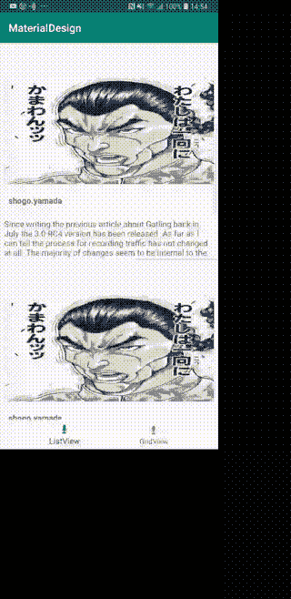

# 如何在 Android 中为 ListView 创建素材动画

> 原文：<https://dev.to/yshogo87/how-to-create-material-animation-for-listview-in-android-pk7>

[T2】](https://res.cloudinary.com/practicaldev/image/fetch/s--kJsyUhCZ--/c_limit%2Cf_auto%2Cfl_progressive%2Cq_66%2Cw_880/https://thepracticaldev.s3.amazonaws.com/i/8h6ch4s9al8lh2vwjsji.gif)

这个动画是材质过渡。

[https://material . io/design/navigation/navigation-transitions . html # hierarchical-transitions](https://material.io/design/navigation/navigation-transitions.html#hierarchical-transitions)

用科特林创作这个动画。

## 设置过渡名称

创建 xml 文件的转换名称。

```
<ImageView
            android:layout_width="match_parent"
            android:layout_height="200dp"
            android:id="@+id/profile_url"
            app:layout_constraintTop_toTopOf="parent"
            app:layout_constraintBottom_toBottomOf="parent"
            app:layout_constraintVertical_bias="0.32"
            app:layout_constraintEnd_toEndOf="parent"
            android:layout_marginEnd="8dp"
            android:transitionName="profileUrl"
            app:layout_constraintStart_toStartOf="parent"
            android:scaleType="fitXY"
            android:layout_marginStart="8dp"/> 
```

将`android:transitionName="profileUrl"`设置到制作视图动画的部分。

并对转换目标视图进行相同的设置。

```
<ImageView
            android:layout_width="383dp"
            android:layout_height="185dp"
            tools:srcCompat="@tools:sample/avatars"
            android:id="@+id/material_image"
            app:layout_constraintTop_toTopOf="parent"
            app:layout_constraintStart_toStartOf="parent"
            app:layout_constraintEnd_toEndOf="parent"
            android:transitionName="profileUrl"
            android:scaleType="fitXY"
            /> 
```

## 用 Kotlin 实现 Android 应用中的屏幕过渡

转换屏幕代码前

```
 Glide.with(context).load(userModel.profileUrl).into(profileUrl)
val intent = ListViewDetailActivity.createIntent(requireActivity(), userModel.profileUrl)
val viewPair = Pair(p0.profileUrl as View, ViewCompat.getTransitionName(p0.profileUrl))
val activityCompatOption = ActivityOptionsCompat.makeSceneTransitionAnimation(requireActivity(), viewPair)
ActivityCompat.startActivity(requireContext(), intent, activityCompatOption.toBundle()) 
```

转换后屏幕代码

```
class ListViewDetailActivity : AppCompatActivity() {

    companion object {
        fun createIntent(activity: Activity, url: String) : Intent {
            val intent = Intent(activity, ListViewDetailActivity::class.java)
            intent.putExtra("url", url)
            return intent
        }
    }

    override fun onCreate(savedInstanceState: Bundle?) {
        super.onCreate(savedInstanceState)
        setContentView(R.layout.activity_list_view_detail)

        val intent = intent
        val url = intent.getStringExtra("url")
        Glide.with(this).load(url).into(material_image)
    }
} 
```