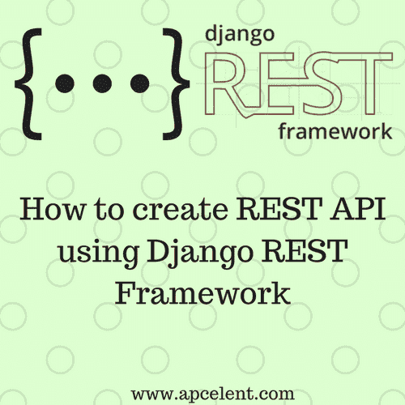

# 如何使用 Django REST 框架创建 REST API

> 原文：<https://dev.to/apcelent/how-to-create-rest-api-using-django-rest-framework-28em>

Django rest 框架是一个 [python](https://www.python.org/) 工具包，为 Django 应用程序创建 REST APIs。

[T2】](https://res.cloudinary.com/practicaldev/image/fetch/s--pkO9njhm--/c_limit%2Cf_auto%2Cfl_progressive%2Cq_auto%2Cw_880/https://blog.apcelent.cimg/django_rest_framework.png)

## 安装

为我们的项目创建一个虚拟环境，然后安装 Django 和 Dajngo REST 框架

```
sudo pip install virtualenv
virtualenv venv
source venv/bin/activate

pip install Django==1.9
pip install djangorestframework==3.6.3 
```

在 django 安装之后，创建一个项目 samplenote。在这个项目中，我们创建了一个应用程序 note:

```
django-admin.py startproject samplenote .
cd samplenote
django-admin.py startapp note 
```

更新 samplenote 文件夹中的`settings.py`文件，以包含新添加的 apps - note 和 rest_framework。

```
INSTALLED_APPS = [
    'django.contrib.admin',
    'django.contrib.auth',
    'django.contrib.contenttypes',
    'django.contrib.sessions',
    'django.contrib.messages',
    'django.contrib.staticfiles',

    #app
    'note',

    #rest_framework
    'rest_framework',
] 
```

## 型号

在便签 app 中编辑`models.py`文件。添加带有标题、描述、创建日期、创建者和优先级字段的注释模型类。

```
from django.db import models
from django.utils import timezone
from django.core.validators import MaxValueValidator, MinValueValidator
# Create your models here. 
class Note(models.Model):

    title = models.CharField(max_length=100)
    description = models.CharField(max_length=400)
    created_at = models.DateTimeField(default=timezone.now)
    created_by = models.CharField(max_length=50, blank=True, null=True)
    priority = models.IntegerField(validators=[MinValueValidator(1),
                                       MaxValueValidator(5)]) 
```

现在，通过执行以下命令来创建和应用模式迁移:

```
python manage.py makemigrations
python manage.py migrate 
```

## 创建序列化程序

序列化器用于将不同格式的数据(如 JSON、XMl)转换为复杂的数据类型(如 querysets 和 model instances ),反之亦然。

基于前面创建的节点模型创建一个 Note 序列化程序。该序列化器在 note app 的`note_api.py`文件中定义。

```
from rest_framework import serializers
from .models import Note

class NoteSerialiser(serializers.HyperlinkedModelSerializer):

    class Meta:
        model = Note
        fields = ('id', 'title', 'description', 'created_at', 'created_by', 'priority') 
```

## 视图集

视图集是提供视图集功能的类。基于 note app 的`note_api.py`文件中的 ModelViewSet 创建一个 NoteViewSet 类。

```
from rest_framework import viewsets

class NoteViewSet(viewsets.ModelViewSet):

    queryset = Note.objects.all()
    serializer_class = NoteSerialiser 
```

## 运行服务器

设置好序列化器和视图集之后，运行服务器:

```
python manage.py runserver 
```

要获取所有笔记的列表，请向以下 URL 发送获取请求

[http://127 . 0 . 0 . 1:9000/API/notes/](http://127.0.0.1:9000/api/notes/)

要添加新注释，请将 POST 请求发送到相同的 URL，请求的正文部分包含以下格式的数据。

```
 {
    "created_at": "2017-08-17 00:00", 
    "created_by": "v", 
    "description": "sample notes from api", 
    "priority": 1, 
    "title": "sample note from api"
} 
```

源代码可以在 [github](https://github.com/codecraf8/python-rest-api-djago-rest-framework) 上找到

希望这篇文章有所帮助！

这篇文章最初出现在 [Apcelent 科技博客](https://blog.apcelent.com/create-rest-api-using-django-rest-framework.html)上。