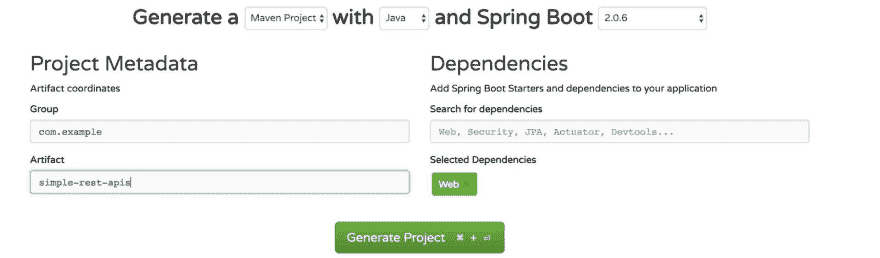
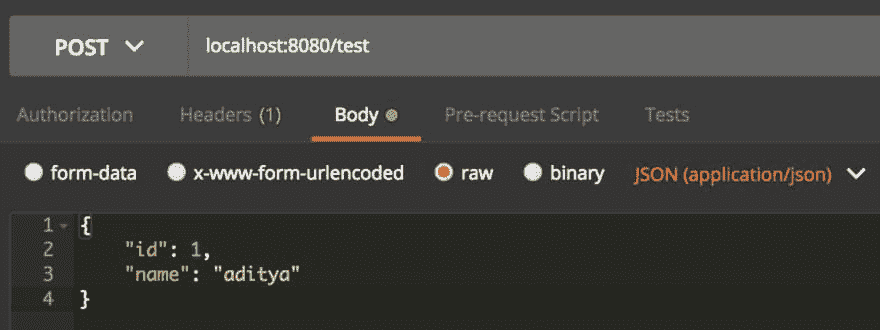

# 如何用 springboot 创建简单的 rest apis

> 原文：<https://dev.to/adityasridhar/how-to-create-simple-rest-apis-with-springboot-5h9f>

**本帖原载于[adityasridhar.com](https://adityasridhar.com/posts/how-to-create-simple-rest-apis-with-springboot)T3】**

作为本文的一部分，您将使用 Springboot 构建两个简单的 REST apis。这篇文章将给出一个关于如何快速开始 springboot 的想法。

所以让我们开始吧😄

# 先决条件

在开始阅读本文之前，请确保您的系统中已经安装了 Maven。

你可以从 https://maven.apache.org/安装 Maven

还要确保在路径中设置了 Maven，以便`mvn`命令能够工作。

您可以使用命令验证 maven 是否已安装并且可以访问

```
mvn -v 
```

还要确保设置了 [JAVA_HOME](https://docs.oracle.com/cd/E19182-01/820-7851/inst_cli_jdk_javahome_t/) 。

# 项目设置

第一步是设置您的项目。

建立一个 Springboot 项目非常容易。

去 https://start.spring.io/。

在站点中输入工件名称作为**simple-rest-API**，并在依赖项下添加 **Web** 。您也可以输入任何其他工件名称。

同样在顶部，确保你正在使用 Springboot 版本 **2.0.6** 用 **Java** 创建一个 **Maven** 项目，这是为了确保本文中的结果是可重复的。完成本文后，您可以选择其他选项进行试验😄

输入信息后，屏幕应该是这样的

[T2】](https://res.cloudinary.com/practicaldev/image/fetch/s--GGI9wtNl--/c_limit%2Cf_auto%2Cfl_progressive%2Cq_auto%2Cw_880/https://thepracticaldev.s3.amazonaws.com/i/281p6of56ys4f9kp6kvm.jpg)

点击生成项目，这将下载一个压缩文件到您的计算机上。解压缩这个 zip 文件。提取的文件夹是您的 springboot 项目。

您可以将项目导入到您喜欢的 IDE 中。我使用 eclipse 对此进行了尝试。

# 项目结构解释

## pom.xml

这个文件包含所有 maven 依赖项。需要注意的主要依赖关系如下

```
<dependency>
    <groupId>org.springframework.boot</groupId>
    <artifactId>spring-boot-starter-web</artifactId>
</dependency> 
```

spring-boot-starter-web 依赖关系确保项目可以用于 web 应用程序

pom.xml 中另一个需要注意的重要事情是

```
<parent>
        <groupId>org.springframework.boot</groupId>
        <artifactId>spring-boot-starter-parent</artifactId>
        <version>2.0.6.RELEASE</version>
        <relativePath/> <!-- lookup parent from repository -->
</parent> 
```

**spring-boot-starter-parent**作为该项目的父级。这确保了 springboot 所需的任何内部依赖都会被自动处理掉，开发人员不需要为此担心。

## 只是简单的复制。Java(Java)

该文件以项目名命名，后跟一个**应用程序**。

这个文件存在于 **src/main/java** 文件夹和**com . example . simplerestapis**包中。

该文件包含以下代码

```
package com.example.simplerestapis;

import org.springframework.boot.SpringApplication;
import org.springframework.boot.autoconfigure.SpringBootApplication;

@SpringBootApplication
public class SimpleRestApisApplication {

    public static void main(String[] args) {
        SpringApplication.run(SimpleRestApisApplication.class, args);
    }
} 
```

这里最主要的亮点是注释 **@SpringBootApplication** 。这在内部是以下 3 个注释的组合

1.  **@配置**:手动弹簧配置需要。添加这个注释可以确保配置可以在 java 类本身中完成，而不是使用单独的 xml 文件。
2.  **@ enable auto configuration**:Spring 需要做很多配置。这个注释确保了大量的配置是自动完成的。
3.  **@ComponentScan** :这告诉 Spring，在哪里扫描组件。

行`SpringApplication.run(SimpleRestApisApplication.class, args);`引导应用程序。

## 应用程序.属性

这个文件存在于 **src/main/resources** 中。该文件可用于列出运行应用程序时要使用的各种属性。例如，它可以用来指出应用程序应该在哪个端口上运行。

# 密码

这里构建的 API 的代码可以在这里找到

# 创建您的第一个 API

我们的第一个 API 将是一个演示 GET 请求的简单 API。

创建一个名为**com . example . simplerestapis . models**的包。在这个包里面创建一个名为 SampleResponse.java**的文件**

将下面的代码复制到**SampleResponse.java**中

```
package com.example.simplerestapis.models;
public class SampleResponse {
    private String message;
    private long id;

    public String getMessage() {
        return message;
    }

    public void setMessage(String message) {
        this.message = message;
    }

    public long getId() {
        return id;
    }

    public void setId(long id) {
        this.id = id;
    }

} 
```

SampleResponse.java 只是一个模特班。它表示 api 响应中出现的字段。

创建一个名为**com . example . simplerestapis . controller**的包。在这个包里面创建一个名为 WebController.java**的文件**

将下面的代码复制到**WebController.java**中

```
package com.example.simplerestapis.controller;
import org.springframework.web.bind.annotation.RequestMapping;
import org.springframework.web.bind.annotation.RequestParam;
import org.springframework.web.bind.annotation.RestController;

import com.example.simplerestapis.models.SampleResponse;

@RestController
public class WebController {

    @RequestMapping("/sample")
    public SampleResponse Sample(@RequestParam(value = "name",
    defaultValue = "Robot") String name) {
        SampleResponse response = new SampleResponse();
        response.setId(1);
        response.setMessage("Your name is "+name);
        return response;

    }
} 
```

在上面的代码中，注释 **@RestController** 表明这个类将有 Rest 端点。
这个注释基本上告诉我们这个类是一个控制器，从这个类中的函数返回的值将被转换成 JSON 或 XML。JSON 中的默认值。

**@RequestMapping** 将**/样本**端点映射到**样本**函数

**@RequestParam** 表示端点**/样本**将有一个名为**名称**的查询参数。**名称**的默认值是“机器人”

函数内部的代码非常简单。正在根据**名称**值设置响应。

转到命令提示符。进入您的项目文件夹，运行以下命令来启动应用程序

```
mvn spring-boot:run 
```

默认情况下，应用程序在本地主机的 8080 端口上运行。

为了测试 api 端点，你可以使用 [Postman](https://www.getpostman.com/) 。从给定的链接下载 postman。

转到 postman，输入以下网址
**localhost:8080/sample？然后点击发送。**

[T2】](https://res.cloudinary.com/practicaldev/image/fetch/s--ETElNkU9--/c_limit%2Cf_auto%2Cfl_progressive%2Cq_auto%2Cw_880/https://thepracticaldev.s3.amazonaws.com/i/8z0nkblriat03h4ci0x5.jpg)

这将返回以下响应

```
{
    "message": "Your name is aditya",
    "id": 1
} 
```

现在尝试下面的 URL
**localhost:8080/sample**并点击发送

这将返回以下响应

```
{
    "message": "Your name is Robot",
    "id": 1
} 
```

# 祝贺😄

您已经使用 springboot 创建了您的第一个 API。您已经学习了如何创建一个简单的带有查询参数的 GET rest api

# 创建您的第二个 API

第二个 API 将演示如何创建支持 POST 请求的 API

在**com . example . simplerestapis . models**包中，创建一个名为【PostRequest.java】T2 的 java 类

将下面的代码复制到**PostRequest.java**中

```
package com.example.simplerestapis.models;

public class PostRequest {
    int id;
    String name;
    public int getId() {
        return id;
    }
    public String getName() {
        return name;
    }
    public void setId(int id) {
        this.id = id;
    }
    public void setName(String name) {
        this.name = name;
    }

} 
```

POST 请求通常有一个作为输入发送的 POST 主体。**PostRequest.java**表示输入帖子正文中出现的所有字段

在**com . example . simplerestapis . models**包中，创建一个名为【PostResponse.java】T2 的 java 类

将下面的代码复制到**PostResponse.java**中

```
package com.example.simplerestapis.models;

public class PostResponse {
    int id;
    String message;
    String extra;
    public String getExtra() {
        return extra;
    }
    public int getId() {
        return id;
    }
    public String getMessage() {
        return message;
    }
    public void setExtra(String extra) {
        this.extra = extra;
    }
    public void setId(int id) {
        this.id = id;
    }
    public void setMessage(String message) {
        this.message = message;
    }

} 
```

**PostResponse.java**表示 POST 请求输出中出现的字段。

在**WebController.java**添加以下进口

```
import org.springframework.web.bind.annotation.RequestBody;
import org.springframework.web.bind.annotation.RequestMethod;

import com.example.simplerestapis.models.PostRequest;
import com.example.simplerestapis.models.PostResponse; 
```

在**WebController.java**中也增加以下功能

```
@RequestMapping(value = "/test", method = RequestMethod.POST)
public PostResponse Test(@RequestBody PostRequest inputPayload) {
    PostResponse response = new PostResponse();
    response.setId(inputPayload.getId()*100);
    response.setMessage("Hello " + inputPayload.getName());
    response.setExtra("Some text");
    return response;
} 
```

这段代码创建了一个名为 **/test** 的新端点，并将其映射到**测试**函数

代码`method = RequestMethod.POST`也表明**/测试** api 端点可以接受 POST 请求

**@ request body post request input payload**表示 post 请求将有一个类型为 **PostRequest** 的输入 post 主体。输入 post 体存储在 **inputPayload** 对象中。

代码非常简单，根据即将到来的输入设置响应。

来自输入有效载荷的 **id** 乘以 100，并设置为输出有效载荷

**名称**参数附加**你好**并设置为输出有效载荷

**额外的**参数被硬编码为一个字符串值**一些文本**

**WebController.java**中的最终代码代码如下

```
package com.example.simplerestapis.controller;
import org.springframework.web.bind.annotation.RequestBody;
import org.springframework.web.bind.annotation.RequestMapping;
import org.springframework.web.bind.annotation.RequestMethod;
import org.springframework.web.bind.annotation.RequestParam;
import org.springframework.web.bind.annotation.RestController;

import com.example.simplerestapis.models.PostRequest;
import com.example.simplerestapis.models.PostResponse;
import com.example.simplerestapis.models.SampleResponse;

@RestController
public class WebController {

    @RequestMapping("/sample")
    public SampleResponse Sample(@RequestParam(value = "name",
    defaultValue = "Robot") String name) {
        SampleResponse response = new SampleResponse();
        response.setId(1);
        response.setMessage("Your name is "+name);
        return response;

    }

    @RequestMapping(value = "/test", method = RequestMethod.POST)
    public PostResponse Test(@RequestBody PostRequest inputPayload) {
        PostResponse response = new PostResponse();
        response.setId(inputPayload.getId()*100);
        response.setMessage("Hello " + inputPayload.getName());
        response.setExtra("Some text");
        return response;
    }
} 
```

转到命令提示符。进入您的项目文件夹，运行以下命令来启动应用程序

```
mvn spring-boot:run 
```

打开 Postman 并设置如下图所示的值

[T2】](https://res.cloudinary.com/practicaldev/image/fetch/s--32OHAbvg--/c_limit%2Cf_auto%2Cfl_progressive%2Cq_auto%2Cw_880/https://thepracticaldev.s3.amazonaws.com/i/sfbx189pa4v1ekle5xqz.jpg)

基本上，请求类型被设置为 **POST**

enpoint URL 输入为 **localhost:8080/test**

进入文章正文，进入**正文**，选择 **raw** ，选择 **JSON(应用/json)**

给定的输入 POST 主体如下

```
{
    "id": 1,
    "name": "aditya"
} 
```

点击**发送**，将显示以下输出

```
{
    "id": 100,
    "message": "Hello aditya",
    "extra": "Some text"
} 
```

您可以通过发送不同的输入 post 主体进行试验。

# 祝贺😄

您现在知道了如何使用 Springboot 创建简单的基于 GET 和 POST 请求的 REST APIS😄

你可以去 https://spring.io/了解更多关于春天和跳羚的知识

### 请随时在 [LinkedIn](https://www.linkedin.com/in/aditya1811/) 与我联系，或者在 [twitter](https://twitter.com/adityasridhar18) 关注我。

### 如果你喜欢这篇文章，你可以去我的网站[https://adityasridhar.com](https://adityasridhar.com)看看其他类似的文章