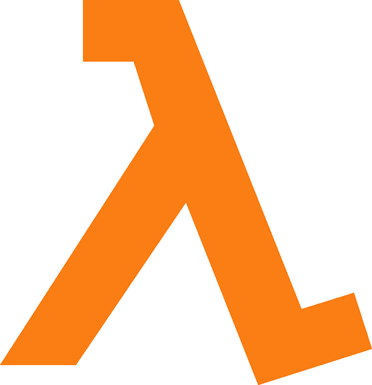
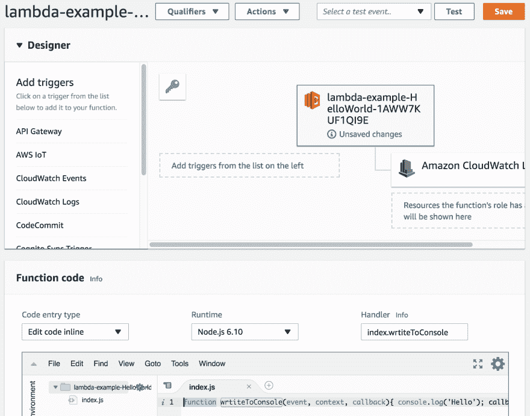

# 如何用 CloudFormation 部署 Lambda 函数？

> 原文：<https://dev.to/brightdevs/how-to-deploy-lambda-function-with-cloudformation-4id5>

无服务器部署现在很流行。以最小的代价，您可以让自己的代码等待并响应各种事件。AWS Lambda 和 Azure Functions 只是最大的云提供商提供的无服务器产品的两个例子。很长一段时间以来，我只在不适合长期发展的特定环境中考虑过它们。直到我发现，只需一点点努力，就可以像传统的后端一样对无服务器 API 进行版本化和部署。在这篇文章中，我将展示如何在工具 [Adam](https://adambar.pl/) 的帮助下部署 AWS Lambda 功能，该工具由 [Bright Inventions](https://brightinventions.pl/) 开发，名为 [cloudform](https://github.com/bright/cloudform) 。

[T2】](https://res.cloudinary.com/practicaldev/image/fetch/s--xvCum0-2--/c_limit%2Cf_auto%2Cfl_progressive%2Cq_auto%2Cw_880/https://thepracticaldev.s3.amazonaws.com/i/k1ejp3b3wp2w9rjuzapf.png)

## 第一步:定义模板

让我们安装 [cloudform](https://github.com/bright/cloudform) `npm i --save-dev cloudform`并定义一个最小模板:

```
import cloudform, { Lambda, IAM, Fn } from 'cloudform';

const LambdaExecutionRole = 'LambdaExecutionRole';

cloudform({
    Resources: {
        HelloWorld: new Lambda.Function({
            Code: {
                ZipFile: "exports.wrtiteToConsole = function (event, context, callback){ console.log('Hello'); callback(null); }"
            },
            Handler: "index.wrtiteToConsole",
            Role: Fn.GetAtt(LambdaExecutionRole, "Arn"),
            Runtime: "nodejs6.10"
        }),
        [LambdaExecutionRole]: new IAM.Role({
            AssumeRolePolicyDocument: {
                Statement: [{
                    Effect: "Allow",
                    Principal: { Service: ["lambda.amazonaws.com"] },
                    Action: ["sts:AssumeRole"]
                }]
            },
            Path: "/",
            ManagedPolicyArns: ["arn:aws:iam::aws:policy/service-role/AWSLambdaBasicExecutionRole"]
        })
    }
}); 
```

Enter fullscreen mode Exit fullscreen mode

模板中只定义了 2 个资源。`HelloWorld`是 AWS Lambda 函数定义。我们已经将`Runtime`属性设置为使用`nodejs6.10`，因此`Code.ZipFile`包含一段 JavaScript 代码。尽管 [`ZipFile`](https://docs.aws.amazon.com/AWSCloudFormation/latest/UserGuide/aws-properties-lambda-function-code.html#cfn-lambda-function-code-zipfile) 这个名字应该包含应用程序的纯文本源代码。显然 [`ZipFile`](https://docs.aws.amazon.com/AWSCloudFormation/latest/UserGuide/aws-properties-lambda-function-code.html) 只能用于最简单的功能。`S3Bucket`和`S3Key`属性可用于部署更复杂的函数实现。`Handler`定义了 Lambda 运行时应该调用`Code`中的哪个函数。在`ZipFile`的情况下，第一部分总是`index`。

`Role`是每个 AWS Lambda 功能的必需设置。它定义了 Lambda 运行时调用的代码拥有哪些权利。在上面的模板中，我们定义了一个可由`lambda.amazonaws.com`采用的策略，并引用了一个预定义的 AWS 托管策略 [`AWSLambdaBasicExecutionRole`](https://docs.aws.amazon.com/lambda/latest/dg/intro-permission-model.html) 。`AWSLambdaBasicExecutionRole`可以将 Lambda 函数日志推送到云观察。

## 第二步:创建 AWS Lambda 函数

使用 CloudFormation 部署我们的 Lambda 函数只需要一个命令:

```
aws cloudformation create-stack \
    --capabilities CAPABILITY_IAM \
    --stack-name lambda-example \
    --template-body file://<(node_modules/.bin/cloudform aws-template.ts) 
```

Enter fullscreen mode Exit fullscreen mode

每当云组织必须定义角色、策略或相关资源时，就需要使用`--capabilities CAPABILITY_IAM`。`--template-body file://<(node_modules/.bin/cloudform aws-template.ts)`指示 CloudFormation 使用文件中定义的模板。`<(...)`是将命令的输出传递给其他程序的 [bash 和 zsh 方式，就好像输出是一个文件一样。等待调用完成后，我们将在 AWS 控制台中看到以下内容:](https://superuser.com/questions/1059781/what-exactly-is-in-bash-and-in-zsh)

[T2】](https://res.cloudinary.com/practicaldev/image/fetch/s--SX_MsaBG--/c_limit%2Cf_auto%2Cfl_progressive%2Cq_auto%2Cw_880/https://thepracticaldev.s3.amazonaws.com/i/p93azpbvnx43vi5p33h6.png)

可以使用 AWS 控制台编辑器来测试和更改该功能。然而，如果我们认真对待无服务器方法，我们不应该忘记标准的实践，比如我们源代码的版本控制。

## 第三步:更新和版本化 AWS Lambda 函数

因为我们已经使用 cloudform 模板定义了 AWS Lambda 函数，所以我们可以将其版本化为任何其他代码。我们使用和配置的整个无服务器基础架构被视为源代码，允许轻松复制部署环境、审计跟踪和变更管理。让我们看看如何使用 cloudform 添加另一个函数，该函数将被第一个函数调用。

```
import cloudform, { Lambda, IAM, Fn } from 'cloudform';
import { FunctionProperties } from 'cloudform/types/lambda/function';
import { readFileSync } from 'fs';

const
    LambdaExecutionRole = 'LambdaExecutionRole',
    Alice = 'Alice',
    Bob = 'Bob';

function lambdaFunction(
    functionCode: string,
    options?: Partial<FunctionProperties>) {
    return new Lambda.Function({
        Code: { ZipFile: functionCode },
        Handler: "index.main",
        Role: Fn.GetAtt(LambdaExecutionRole, "Arn"),
        Runtime: "nodejs6.10",
        ...options
    });
}

export default cloudform({
    Resources: {
        [Alice]: lambdaFunction(readFileSync('Alice.js', 'utf-8'), {
            Environment: {
                Variables: {
                    BobFunction: Fn.GetAtt(Bob, "Arn")
                }
            }
        }),
        [Bob]: lambdaFunction(readFileSync('Bob.js', 'utf-8')),
        ... // LambdaExecutionRole see below
    }
}) 
```

Enter fullscreen mode Exit fullscreen mode

正如你在上面看到的，我们提取了一个函数`lambdaFunction`来简化 Lambda 函数声明。`Alice`和`Bob`函数体都在不同的文件中定义。有趣的是，在调用过程中，`Alice`函数将访问指向`Bob`函数 [ARN](https://docs.aws.amazon.com/general/latest/gr/aws-arns-and-namespaces.html) 的`BobFunction`环境变量。

我们的`LambdaExecutionRole`缺少调用另一个 Lambda 函数的权限。让我们来解决这个问题:

```
 [LambdaExecutionRole]: new IAM.Role({
        AssumeRolePolicyDocument: {
            Statement: [{
                Effect: "Allow",
                Principal: { Service: ["lambda.amazonaws.com"] },
                Action: ["sts:AssumeRole"]
            }]
        },
        Path: "/",
        ManagedPolicyArns: ["arn:aws:iam::aws:policy/service-role/AWSLambdaBasicExecutionRole"],
        Policies: [{
            PolicyName: "AllowCallingOtherLambda",
            PolicyDocument: {
                Version: "2012-10-17",
                Statement: [{
                    Sid: "InvokeLambdaPermission",
                    Effect: "Allow",
                    Action: ["lambda:InvokeFunction"],
                    Resource: "*"
                }]
            }
        }]
    }) 
```

Enter fullscreen mode Exit fullscreen mode

`Alice`和`Bob`源导出由 AWS Lambda 运行时调用的`main`函数:

```
// Alice.ts
import aws from 'aws-sdk';

export function main(event: any, context: any, callback: Function) {
    new aws.Lambda().invoke({
        FunctionName: process.env.BobFunction!,
        Payload: JSON.stringify({message: "Hi!. I'm Alice."})
    }, (error: Error, data: any) => {
        const response = JSON.parse(data.Payload);
        console.log('FromBob', error || response)
        callback(error);
    });
}

// Bob.ts
export function main(event: any, context: any, callback: any) {
    console.log('FromAlice', event)
    callback(null, {message: "Hi! I'm Bob. Nice to meet you!"});
} 
```

Enter fullscreen mode Exit fullscreen mode

因为我们现在使用 TypeScript 作为`Alice`和`Bob`源，我们需要安装编译器`npm i --save-dev typescript @types/node aws-sdk`。不幸的是，目前在 [cloudform](https://github.com/bright/cloudform) 中，无法使用自定义`tsconfig.json`进行编译。幸运的是，我们可以手动调用编译器，并将其输出用作任何其他 Node.js 源代码。带着`tsconfig.json` :

```
{  "compilerOptions":  {  "module":  "commonjs",  "target":  "es6",  "strict":  true,  "strictPropertyInitialization":  false,  "esModuleInterop":  true  },  "exclude":  ["node_modules"],  "compileOnSave":  true  } 
```

Enter fullscreen mode Exit fullscreen mode

我们可以使用以下命令来编译和部署 Lambda 函数:

```
./node_modules/.bin/tsc

aws cloudformation update-stack \
    --capabilities CAPABILITY_IAM \
    --stack-name lambda-example \
    --template-body file://<(node -e "console.log((require('./aws-template').default))") 
```

Enter fullscreen mode Exit fullscreen mode

堆栈更新完成后，我们现在应该有 2 个 Lambda 函数可用了。当我们调用`Alice`函数时，我们将看到 2 个 AWS Lambda 函数进行通信:

```
START RequestId: 6a87c764-251e-11e8-b921-f9ca7649c7d7 Version: $LATEST
2018-03-11T11:22:00.615Z    6a87c764-251e-11e8-b921-f9ca7649c7d7    Alice says: Hi!. I'm Alice.
2018-03-11T11:22:01.676Z    6a87c764-251e-11e8-b921-f9ca7649c7d7    Bob says: Hi! I'm Bob. Nice to meet you!
END RequestId: 6a87c764-251e-11e8-b921-f9ca7649c7d7
REPORT RequestId: 6a87c764-251e-11e8-b921-f9ca7649c7d7  Duration: 1110.68 ms    Billed Duration: 1200 ms    Memory Size: 128 MB Max Memory Used: 34 MB 
```

Enter fullscreen mode Exit fullscreen mode

无服务器基础设施提供了无限的可能性。有了 [cloudform](https://github.com/bright/cloudform) ，我们可以将 AWS Lambda 开发、变更管理和部署提升到下一个层次。

最初发布于 [brightinventions.pl](https://brightinventions.pl/blog/)

作者 Piotr Mionskowski，软件工程师@光明发明
[邮箱](//piotr.mionskowski@brightinventions.pl) [Stackoverflow](https://stackoverflow.com/users/155213/miensol) [个人博客](https://miensol.pl/)