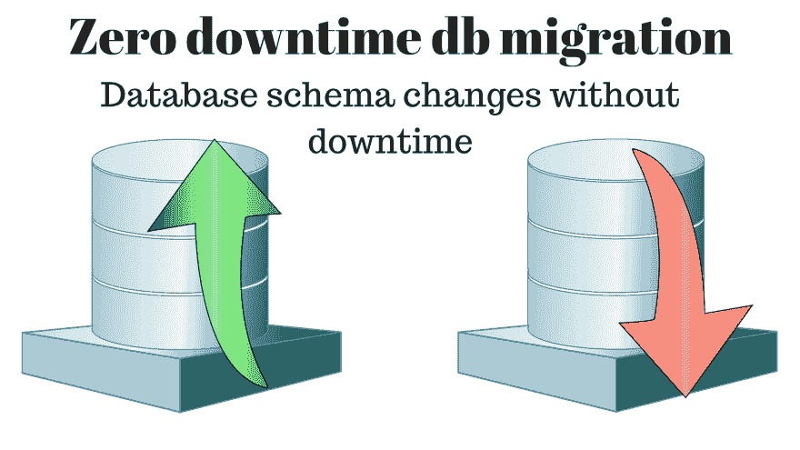
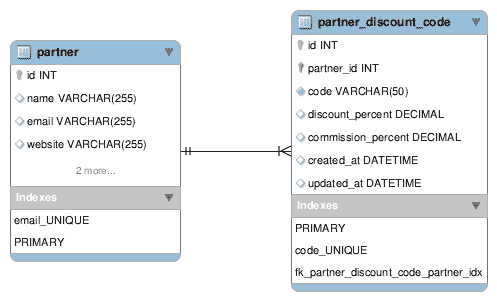
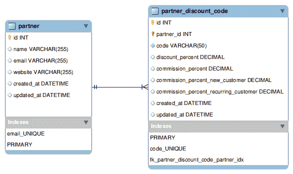
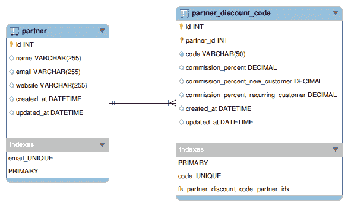

# 如何进行零停机数据库(DB)迁移(模式更改),并给出一个实例

> 原文：<https://dev.to/geshan/how-to-do-a-zero-downtime-database-db-migration-schema-change-with-a-practical-example-3jhe>

生产数据库上的数据库迁移从来都不简单。根据请求的数量，一些团队将数据库迁移安排在非工作时间。按照下面提到的步骤，通过一个实例，您可以在零停机或最小停机时间的情况下运行 alter 语句。

[T2】](https://res.cloudinary.com/practicaldev/image/fetch/s--LFfGhPNZ--/c_limit%2Cf_auto%2Cfl_progressive%2Cq_auto%2Cw_880/https://geshan.com.img/db-migration/db-migration.png)

## 举例

作为这篇文章的例子，让我们假设你在一家电子商务公司工作，这家公司既有老客户也有新客户。您的合作伙伴公布了在给定日期范围内有效的折扣代码，并通过他们的折扣代码跟踪了订单总额的百分比。下面是合作伙伴和优惠券代码的模式。以下是任何更改之前的初始模式:

[T2】](https://res.cloudinary.com/practicaldev/image/fetch/s--t_Xyevdg--/c_limit%2Cf_auto%2Cfl_progressive%2Cq_auto%2Cw_880/https://cdn-images-1.medium.com/max/2000/0%2Abq4fOX7aEBuZKo4u.png)

现在，新的要求是跟踪新客户和老客户的不同佣金百分比。新客户和老客户由不同的系统/微服务进行评估，它还负责根据订单总额计算佣金，这不在本示例的讨论范围内。

为了按客户类型进行佣金跟踪，我们将决定添加两个新列 commission _ percent _ new _ customer，commission _ percent _ recurring _ customer，困难的问题是如何在不停机的情况下推出它。

[T2】](https://res.cloudinary.com/practicaldev/image/fetch/s--I417p0Tk--/c_limit%2Cf_auto%2Cfl_progressive%2Cq_auto%2Cw_880/https://cdn-images-1.medium.com/max/2000/0%2AwkW6wq3-PGORXQ-k.png)

## 迁移脚本(DB schema alter 语句)

以下迁移脚本将 MYSQL 数据库的数据库模式更新为上述状态:

```
ALTER TABLE `partner_discount_code` ADD `commission_percent_new_customer` 
DECIMAL NULL AFTER `commission_percent`, ADD `commission_percent_recurring_customer` 
DECIMAL NULL AFTER `commission_percent_new_customer`
,algorithm=inplace,lock=none; 
```

Enter fullscreen mode Exit fullscreen mode

请注意算法=就地，锁=无，这将在下面讨论。

## 评估停机时间

在上述示例中，可能有如下两种类型的停机时间:

1.  迁移运行时锁定表

2.  由于新引入的列和与之不匹配的代码而停机

对于依赖于数据库的第一个停机问题，可以通过执行适当的 alter SQL 语句将其缓解到一个显著的水平。

> 例如，在 MYSQL 中，if，algorithm=inplace，lock=none 以 alter 为后缀，它将使用 0 到最小的表锁运行，从而在迁移运行时允许读写。

这在修改具有数百万行的表时尤其重要，因为根据所涉及的表的结构和数据量，修改可能需要几分钟的时间。

对于第二个问题，如果 DB alter and code release 是按照特定的顺序部署的，它可以处理得更好。下面列出了部署步骤:

## 部署步骤

1.  将这两个新列添加到 partner_discount_code 中，假设该代码现在在 1.1 版中

2.  部署代码 v 1.2，它添加并编辑所有 3 列—佣金百分比、佣金百分比新客户和佣金百分比经常性客户。

3.  测试所有的事情都像预期的那样工作，即使你需要回滚没有任何中断，它是完全向后兼容的

4.  当一切正常时，部署代码 v 1.3，只对 2 个新列进行添加或编辑

5.  测试一两天，然后根据需要，您可以删除 partner_discount_code 表上的 commission_percent 列，因为它不再使用了

## 删除 commission_percent 列后的最终模式

[T2】](https://res.cloudinary.com/practicaldev/image/fetch/s--Vv9XVt6v--/c_limit%2Cf_auto%2Cfl_progressive%2Cq_auto%2Cw_880/https://cdn-images-1.medium.com/max/2000/0%2Al8KoNkohtfWPY0tp.png)

## 要考虑的事情

*   始终小心数据库迁移。在执行 alter 语句之前，对将要运行 alter 语句的表进行备份肯定是安全的。

*   不要先部署写入新列的代码，然后运行迁移，这将导致错误，因为代码将尝试访问不存在的列。

*   总是想到向后兼容性，通常没有恢复迁移。通常，只有少数人有权访问生产数据库。

*   只有在完全确信新的更改不会破坏任何内容之后，才运行 drop 或 rename columns。

*   手动运行迁移(alter SQL)比作为部署的一部分更好，这样可以保持事情的独立性和可预测性。

## 结论

如果方法正确，数据库迁移并不困难。希望这篇文章能帮助你更顺利地运行数据库迁移。

* * *

*最初发表于[geshan.com.np](https://geshan.com.np/blog/2018/04/how-to-do-a-zero-downtime-database-db-migration-schema-change-with-a-practical-example/)。*