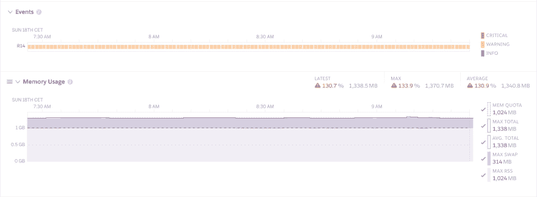
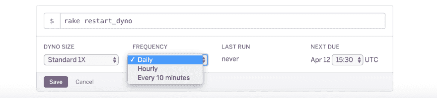

# 如何在 Heroku 上轻松避免触及内存极限

> 原文：<https://dev.to/nicolrx/how-to-easily-avoid-hitting-the-memory-limit-on-heroku-2mha>

[T2】](https://res.cloudinary.com/practicaldev/image/fetch/s--OBmIJi0o--/c_limit%2Cf_auto%2Cfl_progressive%2Cq_auto%2Cw_880/https://thepracticaldev.s3.amazonaws.com/i/zl9g7z7px2sg3r086cv3.jpg)

Heroku 是一个很好的工具，可以很容易地启动一个新的应用程序。然而，如果你的应用程序是内存密集型的，dynos 会很快达到极限。我的 Rails 应用就是这种情况，我开始花比预期更多的钱！

如果你已经按照 Heroku 的建议优化了内存[，那么是时候寻找另一个解决方案来避免花费太多的钱了。](https://devcenter.heroku.com/articles/optimizing-dyno-usage#basic-methodology-for-optimizing-memory)

## 如何定期重启 Heroku dynos

一种有效的解决方法是在接近内存限制时重启 dynos。不幸的是，你将不得不通过一整天(和晚上！)在你的电脑前如果你的应用程序正在泄漏内存！

解决方案是创建一个计划任务，在 dynos 达到极限之前重新启动消耗过多内存的 dynos。

### 在你的 app 里写一个任务

首先，将平台 api gem 添加到你的 Rails 应用中:

```
gem 'platform-api'

bundle install 
```

Enter fullscreen mode Exit fullscreen mode

使用 heroku-oauth 工具带插件创建 OAuth 令牌:

```
$ heroku plugins:install heroku-cli-oauth
$ heroku authorizations:create -d "Platform API example token"
Created OAuth authorization.
  ID:          2f01aac0-e9d3-4773-af4e-3e510aa006ca
  Description: Platform API example token
  Scope:       global
  Token:       e7dd6ad7-3c6a-411e-a2be-c9fe52ac7ed2 
```

Enter fullscreen mode Exit fullscreen mode

然后，在 Rails 应用程序的 lib/tasks 文件夹中创建一个`scheduler.rake`文件。

```
 require 'platform-api'

  task :restart_dyno => :environment do
    puts "task restart_worker is on"
    heroku = PlatformAPI.connect_oauth(YOUR OAUTH TOKEN)
    heroku.dyno.restart("APP_NAME", "web.1")
  end 
```

Enter fullscreen mode Exit fullscreen mode

您可以通过传递名称来指定您想要重新启动的 dyno。根据[文档](http://heroku.github.io/platform-api/PlatformAPI/Dyno.html)，你也可以同时重启所有的 dynos:

```
 require 'platform-api'

  task :restart_dyno => :environment do
    puts "task restart_worker is on"
    heroku = PlatformAPI.connect_oauth(YOUR OAUTH TOKEN)
    heroku.dyno.restart_all("APP_NAME")
  end 
```

Enter fullscreen mode Exit fullscreen mode

### 安排你的任务

为了重复执行任务，你必须安装 [Heroku Scheduler 插件](https://elements.heroku.com/addons/scheduler)。

日程安排有一个频率限制:你只能选择“每天”、“每小时”或“每 10 分钟”。

如果这些频率对您的内存消耗不理想，您可以在任务中添加一个条件来匹配您想要的频率。例如，如果您想一天重启两次 dyno:

```
 require 'platform-api'

  task :restart_dyno => :environment do
    t = Time.now.strftime('%H')
    if t == "07" or t == "14"
        puts "task restart_worker is on"
        heroku = PlatformAPI.connect_oauth(YOUR OAUTH TOKEN)
        heroku.dyno.restart("APP_NAME", "web.1")
    end
  end 
```

Enter fullscreen mode Exit fullscreen mode

一旦定义了频率，就向调度程序添加一个新任务:`rake restart_dyno`。

[T2】](https://res.cloudinary.com/practicaldev/image/fetch/s--AajH2noe--/c_limit%2Cf_auto%2Cfl_progressive%2Cq_auto%2Cw_880/https://thepracticaldev.s3.amazonaws.com/i/9kl9qk98vozu70lled8d.png)

现在，你将有你的 dynos 自动重启前达到内存限制。如果您有任何问题，请随时通过 Twitter 联系我[。](https://twitter.com/nico_lrx)