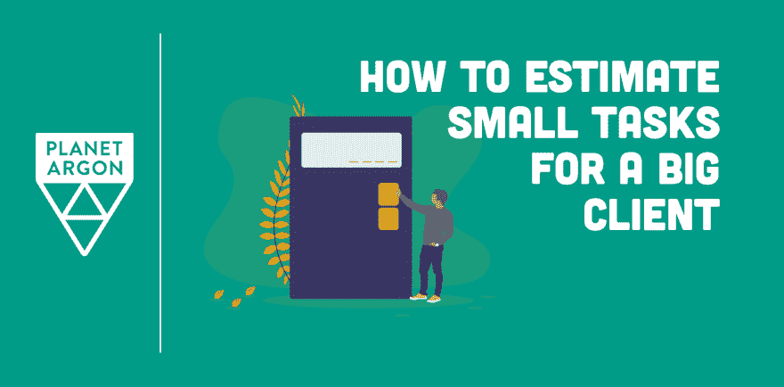

# 如何为大客户评估小任务

> 原文：<https://dev.to/dudleysr/how-to-estimate-small-tasks-for-a-big-client-31jf>

[T2】](https://res.cloudinary.com/practicaldev/image/fetch/s--waqUoUyd--/c_limit%2Cf_auto%2Cfl_progressive%2Cq_auto%2Cw_880/https://thepracticaldev.s3.amazonaws.com/i/w2dj4fyar5o54770vsah.png)

关于如何准确评估大型软件项目，有大量的文章、书籍和博客。一些需要多个开发人员花费一周、一个月或一年的时间的事情，几乎总是会有开发人员、项目经理和其他工作人员之间的会议，在会上评估会被检查和质疑。

不过，我一直在努力改进的地方是评估太常见的“小”票:大到足以进行评估，但小到没有必要引入额外的帮助或与其他开发人员协商。

对我来说，这些票通常在 4-15 小时的范围内。任何不足都可能是凭直觉的简单解决方案，任何更多的可能会影响我一周的时间表，所以我可能需要让别人来运行它。

以下是我发现的一些帮助我独立评估这类任务的技巧和诀窍

# 与已完成的票据进行比较

这个有点显而易见，但是如果你能把当前的任务和一个已经完成的任务进行比较，你就能得到一个非常好的工作基准。例如，如果客户希望模仿另一个报告的分析，但是引用一组新的数据，那么查看原始报告特性在票证中投入了多少小时可以帮助您得出一个大概的数字。

这也说明了标记和链接票证和问题的重要性。对于有经验的开发人员来说，项目和特定票证的机构知识是非常重要的，但是如果没有过去工作的一些线索或文档，新的开发人员将很难知道以前的工作可能适用于新的问题。虽然这可能会感觉乏味，但一定要充分学习和利用你的票务或项目管理系统的各种工具。

# 想想工作日，而不是小时

有时候，试图给一项任务分配特定的时间会让人望而生畏。弄清楚这个我知道我需要的特定循环需要一个小时吗？三个？也许三年半？估计一张票的具体元素会开始感觉特别模糊和随意，这很容易导致你在估计时失去控制。

当我发现自己处于这种情况时，我会经常问自己以下问题:

如果给我一整天的工作时间，我有信心完成这项任务吗？

这个问题可以帮助设定门票的界限。如果你的回答是一个快速而响亮的“是”，那么你知道估计可以缩小到 2-8 小时的范围内。如果你的回答是一个响亮的“不”，那么很可能是时候和项目经理谈谈了，或者至少花些时间弄清楚为什么这将是一个多天的任务。

如果你的答案是一个不太可靠的“是”或“可能”，那么其他一些考虑因素就应该发挥作用了。在这些情况下，上下文切换可能会成为一个问题，因为紧急的 bug 和会议极有可能会打断您在这种票证中的工作。当我在一个工作日内估计一张“可能”完成的票据时，我倾向于增加大约 10-20%的时间，无论我的最终估计纯粹是为了上下文切换。这样，离开票证不会有任何额外的压力来尝试和弥补上下文切换的时间。

# 橡皮鸭你的伪代码

这是我在评估中复查我的信心水平的一种方式。如果我能写下我的伪代码，然后通过我的方式讲述这些伪代码将如何完成需求，我就能确信我的估计是准确的。如果我很难说出整个过程，或者对解决方案的某些部分的确切位置感到不确定，那么我知道我应该在我的估计中添加一些填充。

我最近有一个例子，这个方法让我更准确地估计了一张票。我最初估计一张票需要四个小时，这是基于以前类似的票，但我决定后退一步，实际上写出一些解决方案的伪代码。当我在脑海中走过这个过程时，我有点纠结于计划代码的特定部分应该存在于控制器中还是模型中。由于我的犹豫，我把票上的估计时间缩短到了五个小时，最后在这个问题上花费的时间是四个小时四十七分钟。

# 回顾展

每当我在一张票上超过我的预算 10%或更多，我会试着花些时间想想为什么我低估了它。是沟通问题吗？我没有完全理解这些要求吗？我忘了包括写测试的时间了吗？上下文切换或跟上项目变更是一个问题吗？也许我只是简单地认为一个特定的方法不会像预期的那样复杂。

评估是一项技能，需要时间、努力和经验来提高。花点时间真正挖掘不准确评估的具体原因可以极大地提高你的评估技能。

# 本能和愿意失败

最后，你的直觉往往是评估门票最重要的部分之一。有时一个功能是全新的，没有相关的完整标签。也许它需要与一个新的框架交互，所以你不确定某件事是需要一天还是一周！这种情况可能特别令人伤脑筋，因为估计这些情况就像把自己暴露在一个完全错误的情况下。事实是，你可能会不时地。记住，从错误中学习永远是提高某方面的最好方法之一！

# 所有的部分都很重要

估计小项目可能看起来不像估计大项目那样重要或引人注目，但是对大量小项目始终给出更准确的估计对开发人员和客户来说都是一大福音。在小票上多加半个小时到一个小时的精度，很快就能累积出可观的数字。

它让客户更有信心告诉他们的利益相关者期望什么，并允许开发者更好的预测和资源。