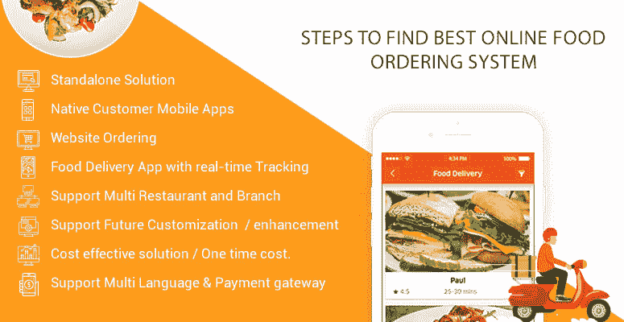

# 如何为餐饮业找到最好的网上订餐系统

> 原文：<https://dev.to/kopatech/how-to-find-best-online-food-ordering-system-for-restaurants-business-5dni>

 餐厅点餐系统提供各种解决方案，从独立解决方案到本地移动应用程序、通过网站点餐、电话点餐等。这些界面大多带有实时跟踪、简单的支付解决方案、多语言支持等。… [阅读更多](https://www.kopatech.com/blog/how-to-find-best-online-food-ordering-system-for-restaurants-business.html)