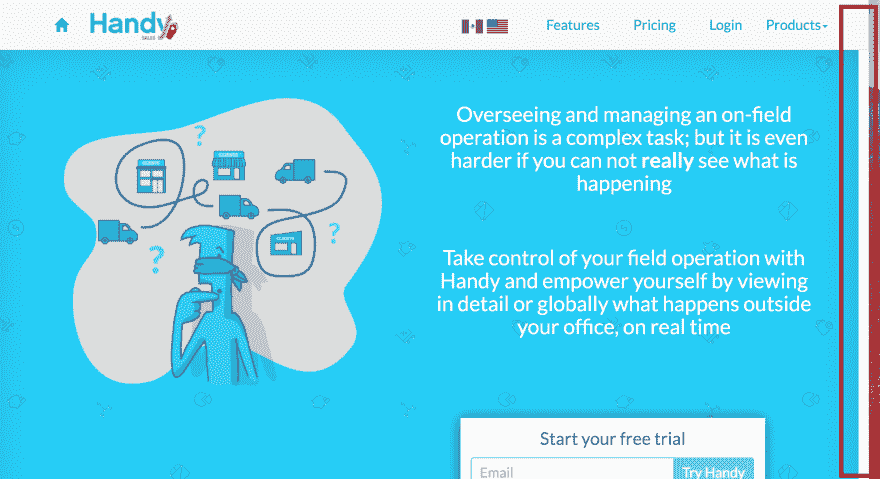
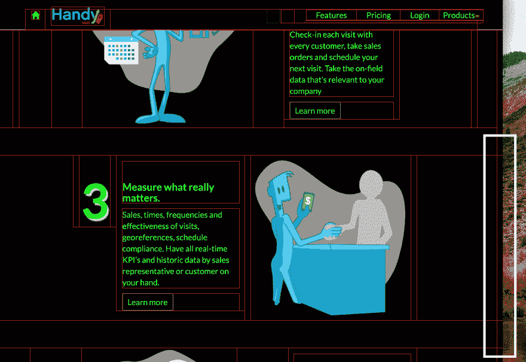

# 如何找到幽灵 CSS 元素

> 原文：<https://dev.to/david_ojeda/how-to-find-ghost-css-elements-1h00>

我最近在我们的登录页面上发现了一个错误，它导致了右侧奇怪的空白溢出:

[T2】](https://res.cloudinary.com/practicaldev/image/fetch/s--nlA2QPMk--/c_limit%2Cf_auto%2Cfl_progressive%2Cq_auto%2Cw_880/https://thepracticaldev.s3.amazonaws.com/i/o1q1hlen9lqdy7dsc7zz.png)

我找了几个小时，试图找到任何导致它的 CSS 间距，或者我的 HTML 上的一些错误元素，但没有找到任何不合适的地方。空白甚至不在🧐页面的元素中

然后我[偶然发现了这个帖子](http://wernull.com/2013/04/debug-ghost-css-elements-causing-unwanted-scrolling/)并迅速发现了问题。这篇博客文章建议了一些 CSS 样式来使幽灵元素可见👻:

```
* {
  background: #000 !important;
  color: #0f0 !important;
  outline: solid #f00 1px !important;
} 
```

Enter fullscreen mode Exit fullscreen mode

现在，我可以找到导致问题的部分:

[T2】](https://res.cloudinary.com/practicaldev/image/fetch/s--oGJEtDom--/c_limit%2Cf_auto%2Cfl_progressive%2Cq_auto%2Cw_880/https://thepracticaldev.s3.amazonaws.com/i/909z7bing8w3g1u0ssmf.png)

最后，这是一个修复一些不匹配的 HTML 元素的问题。

如果有这个 CSS 样式帮助我从一开始就进行调试，可以节省我几个小时的工作🤦🏻‍♂️