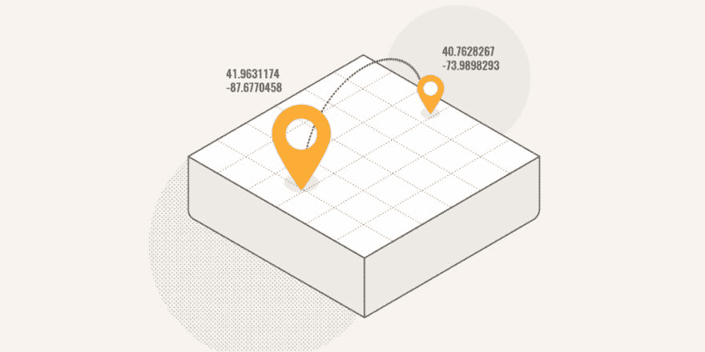

# 如何在 Laravel 5 中使用经纬度查找附近的地方

> 原文：<https://dev.to/parthp1808/how-to-find-nearby-places-using-latitude-and-longitude-in-laravel-5-4iih>

通常，在房地产、约会和其他类似的网站上，你可能已经注意到他们如何允许你搜索附近的任何位置。你可以在你的 laravel 应用程序中使用哈弗辛公式很容易地完成。

[T2】](https://res.cloudinary.com/practicaldev/image/fetch/s--4vupCkEA--/c_limit%2Cf_auto%2Cfl_progressive%2Cq_auto%2Cw_880/https://www.parthpatel.net/wp-content/uploads/2018/05/nearby-location-in-laravel-1024x512.png)

资料来源-Tighten.co

去年，我在大学里做了一个房地产项目，这是一个压顶项目，也是我开始做这个查询的时候。虽然哈弗辛公式很容易找到，但要通过雄辩在拉腊维尔使用它却很困难。我尝试了 Stackoverflow、laracasts 论坛和其他资源中的许多解决方案，但都不起作用。其中一些确实有效，但由于他们使用的是原始查询，我无法对结果进行分页，而这正是我所需要的。

经过反复试验，我终于使它工作了。所以，我在这里分享代码片段。

```
 $gr_circle_radius = 6371;
      $max_distance = 500;

      $distance_select = sprintf(
                                    "           
                                    ( %d * acos( cos( radians(%s) ) " .
                                            " * cos( radians( lat ) ) " .
                                            " * cos( radians( long ) - radians(%s) ) " .
                                            " + sin( radians(%s) ) * sin( radians( lat ) ) " .
                                        " ) " . 
                                    ")
                                     ",
                                    $gr_circle_radius,               
                                    $lat,
                                    $long,
                                    $lat
                                   );

        $properties = Property::select('*')
        ->having(DB::raw($distance_select), '<=', $max_distance)
        ->groupBy('properties.id')->paginate(1); 
```

在这里，我设置了最大距离= 500 Km，因此它将显示给定纬度和经度(使用$lat，$long 作为变量)500 Km 范围内的所有结果。

要看演示，请查看我的房地产项目- [一楼](http://firstfloor.parthweb.com/)

帖子[如何在 Laravel 5](https://www.parthpatel.net/nearby-places-using-latitude-and-longitude-in-laravel-5/) 中使用经纬度找到附近的地方最早出现在[的一位网络开发者 Parth Patel](https://www.parthpatel.net)上。