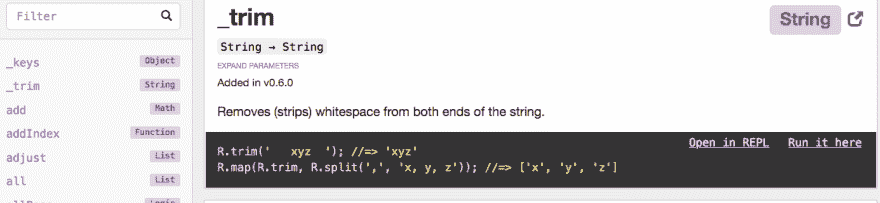
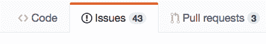

# 如何找到最好的开源 Node.js 项目来提高你的技能

> 原文：<https://dev.to/ccleary00/how-to-find-the-best-open-source-nodejs-projects-to-study-for-leveling-up-your-skills-1c28>

***原载于 [coreycleary.me](https://www.coreycleary.me/how-to-find-the-best-open-source-node-js-projects-to-study-for-leveling-up-your-skills/)** 。这是我的内容博客的交叉帖子。我每一两周发布一次新内容，如果你想直接在收件箱里收到我的文章，你可以[注册我的时事通讯](https://www.coreycleary.me/about/)！我还定期发送备忘单、其他开发人员的优秀教程的链接以及其他赠品！*

> 对高级开发人员:“你是怎么变得这么擅长编程的？” *“我不知道，我想我只是写了很多代码，也读了很多……”*

您是否曾经尝试过寻找一个开源 Node.js 项目来提高您的技能，但最终根本没有找到，因为您不知道实际上是什么使一个项目成为一个“好”的研究项目？

光是 GitHub 上就有成千上万的开源库，你怎么能缩小范围呢？你如何决定学习这个项目是否值得你宝贵的下班后时间(因为这通常是学习发生的时间)？

如果你花了几个小时去读它，却发现它实际上是不可读的，你比以前更困惑了，那该怎么办？

也许你从你在工作中使用的项目开始，或者那些流行的/广泛使用的项目。这是一个很好的起点，但不会让你一路走到终点。例如，仅仅因为它受欢迎/被广泛使用并不一定意味着它对学习有用(尽管这通常是一个好迹象)。

与其浪费宝贵的时间在 GitHub 上一个又一个的回购协议中搜寻，不如你能很快找出哪些是值得研究的好项目，哪些不是？这些项目将帮助你提升技能，达到职业生涯中的下一个水平，而不是让你花很多时间却没有学到很多东西...

### 指导你的一系列标准

我发现的识别优秀研究项目的最好方法是使用一套标准来缩小搜索范围，并在研究回购的几分钟内迅速知道它是否适合研究。

特别是在我职业生涯的早期，我阅读了大量各种项目的源代码，以便不仅能更好地阅读和理解代码，还能更好地编写代码，并理解设计模式。在我为提高技能所做的所有事情中，这是帮助我进步最快的事情之一。

在这篇文章中，我使用了(并且仍然在使用)一些标准来鉴别好的项目来进行研究。我已经按照大致的优先级顺序对它进行了排序(尽管下面的优先级不应该被认为是硬性规定，因为总是有例外)。

***边注:**这并不一定是一个关于具体**要研究什么的指南，尽管许多条准则都适用于此。***

 **它也不一定是为您的项目选择合适的库/框架的指南。但是，这可能是一个起点。如果你被从 635，000(！)npm 模块就在那里，[看看我写的这篇文章吧！](https://www.coreycleary.me/which-of-the-635000-npm-modules-do-i-choose/)

根据标准...

### 证明文件

当你评估一个项目时，文档可能是最重要的东西之一。无论你是用回购来学习，还是只是在项目中消费/使用，都是如此。

它非常重要，因为它是代码库的“入口点”。文档(我将项目示例作为其中的一部分，通常在回购中他们自己的文件夹中)通常是开发人员在开始编写代码之前首先遇到的东西。

由于开源项目经常是在别人的空闲时间写的，文档经常会被搁置，但是至少有一些级别的文档是很重要的，我总是优先考虑那些比少的文档。

良好的文档通常包括:

*   项目根目录下的 README.md 文件。有些项目的文档也分布在子文件夹中，虽然这比没有文档要好，但我发现这种风格更难阅读，也更难与其他目录中的信息合并。这应该有列出的公共 API/函数，它们做什么，如何使用，任何“陷阱”等。
*   可视图表(如果适用)
*   文档中的示例或包含多个示例的单独文件夹。拥有带有示例的文件夹的好处是，您可以克隆 repo 并在那里运行它们，而不必从 README.md 或其他 Markdown 文件复制/粘贴。这些例子应该向你展示如何设置、使用 API 等。

作为一个例子，[函数式编程库 Ramda](https://ramdajs.com/docs/) 为它的 API 提供了很好的文档，包括一个 REPL，它允许你在浏览器中运行例子和使用这个库！

[T2】](https://res.cloudinary.com/practicaldev/image/fetch/s--UW_tIoAE--/c_limit%2Cf_auto%2Cfl_progressive%2Cq_auto%2Cw_880/https://www.coreycleary.me/wp-content/uploads/2018/10/Screen-Shot-2018-10-04-at-7.02.30-AM.png)

学习存储库不仅仅是为了更好地读/写代码，也是为了更好地写文档。好的项目会有好的文档范例，你可以用它们来记录你的项目。

### 试验

在我的书中，测试和文档一样重要，所以就优先级而言，我会把它们放在同等的位置上。而文档会给你一个很好的项目概述，它的 API，等等。，当你在学习中遇到困难时，考试会真正帮助你。

希望代码本身写得很好，但是当你不能理解代码的时候，有测试可以依靠是非常重要的。即使您没有被卡住，我也发现让测试跟着一起进行非常有帮助，并且经常让测试文件和源文件在我的 ide 中并排打开。

测试和文档类似，如果你不能阅读它们，你就不能理解它们。好的测试会有可理解的断言，比如:

```
it('should filter out non-strings', () => { ... }) 
```

vs .模糊的断言，比如:

```
it('should filter the object', () => { ... }) 
```

快速评估单元测试的另一个可能的方法是在 README.md 中寻找代码覆盖率徽章。

然而，仅仅因为一个项目有很高的测试覆盖率并不意味着测试是好的或者以一种有意义的方式编写。我将这种检查与上面讨论的评估测试的其他方法结合起来。

### 结构/代码组织

由于节点项目缺乏“规范的”结构或代码组织，开发人员通常会从现有的开源项目中寻求指导。所以这是其中的一件事，如果你在项目中寻找结构的例子，这个标准可能更难搞清楚。

尽管如此，还是有一些简单的事情可以快速检查:

**首先是**，该项目是否完全遵循*任何*的结构？还是所有东西都在随机命名的文件夹和文件中？对于较小的项目，将所有代码放在项目根目录下的一个`index.js`文件中通常是好的，只要与项目的大小/特性相比有意义。如果这个文件有 3000 行代码长，并且做了很多不同的事情，那么它可能会读起来很混乱。

**第二**，即使结构对你来说很陌生，你能很快对组织有感觉吗？其中一部分是拥有适当命名的目录和子目录，但我发现“直觉检查”通常在这里有效。

例如，如果您发现有实用函数分布在 5 个不同的目录中，或者如果您发现有 4 层以上的目录结构，这通常是代码组织不好的迹象，您将在研究项目时努力找出东西在哪里。

### 代码质量

代码质量是一个备受争议的话题，取决于你问谁，有点主观。

尽管如此，还是有一些快速评估质量的方法:

除了小的，[单一责任](https://en.wikipedia.org/wiki/Single_responsibility_principle)功能，我能想到的最好的度量标准，尽管完全不科学，是代码本身是否可读。我通常拿一个源文件，花 30 秒阅读它——如果我不能对代码做什么有一个大致的了解，那么它可能写得不是很好。

如果不花超过 30 秒的时间通读，初级开发人员可能很难理解代码在做什么，所以如果这是你，我建议寻找有意义的函数和变量名，检查以确保函数不是 400 行代码，等等。可能需要多一点时间，但不会太久。

#### 现代 JS 版本

任何 JavaScript 版本的项目都是有效的，但是我不想把它作为一个完全独立的标准，我想指出的是，你可能想要寻找使用 ES6 或更高版本的项目。通过阅读任何 JavaScript 版本的代码，你都可以成为一名更好的开发人员，但因为现在是 2018 年，你可能想看看更现代版本的 ECMAScript 标准。

这不仅仅是为了“最新最棒”而“最新最棒”，而是要意识到现代模式。ES6 带来了很多变化，不仅仅是语法上的变化，还带来了新的模式。

许多稳定的、经过战斗考验的项目都是在 ES6 之前编写的，所以不要自动忽略这些项目。但是你可能想根据你想学的东西优先考虑 ES6+。

### 最近的发展和未决问题

如果项目在去年没有任何提交，这可能意味着它处于稳定状态，不需要更多的开发，或者它只是没有被维护。

如果不再维护，你*可能*会遇到一些事情不工作的问题，这可能会影响你对项目如何工作的理解。通常情况下，实际上并不是这样——毕竟它应该是有效的——但是要记住。

[](https://res.cloudinary.com/practicaldev/image/fetch/s--e2nvgIn4--/c_limit%2Cf_auto%2Cfl_progressive%2Cq_auto%2Cw_880/https://www.coreycleary.me/wp-content/uploads/2018/10/Screen-Shot-2018-10-09-at-6.58.07-PM.png) 
同样，如果一个项目有许多未解决的问题，这不应该取消它的资格，但是通过在问题的第一页进行一分钟的快速搜索，你应该能够判断这些是否只是来自社区的许多想法，来自用户的问题，或者如果项目实际上有许多真正的错误，会使你的研究更加困难。

当然，如果一个项目在现实世界中被使用，它已经被证明是有效的，并且真正的 bug 的存在也不会真正成为一个障碍。

### 一个开始的地方

现在您已经有了一套筛选项目的标准，那么如何从应用该标准的初始项目列表开始呢？

***项目规模***
你要花多长时间学习？显然，如果你没有太多的时间投入，选择一个大项目来研究并不是一个好主意。

当然，你不需要研究项目的整体来学习一些东西，但是我认为如果你不研究代码库的重要部分，你会有一个不完整的画面。

***你使用的东西***
正如本文开头提到的，研究你目前使用的项目/工具是找到一些项目的好地方，当你选择研究项目时，可以应用这里的标准。

您的优势在于知道项目是做什么的，也许还知道一些它的 API 是什么，这将使学习代码变得容易得多。

***你感兴趣的东西***
但愿这是不言自明的...

***项目类型(库 vs 框架 vs 应用)***
最后，你可能要慎重选择你想学习的项目的*类型*。

例如，您是否每天都在工作中使用 HTTP 框架，但却不知道它实际上是如何工作的？您的团队是否要构建一个新的库，供您公司的 100 名其他开发人员使用，并且您想要学习 API 设计的最佳实践？或者您只是想更熟悉应用程序是如何构建的？

### 包扎

我们在这里讨论了很多，但是当你实际浏览 GitHub 或任何你用来搜索代码库的开源托管工具时，使用上面的标准来进行评估可以很快完成。单个项目应该只需要 5-10 分钟。

如果你发现一个项目有好的文档，好的测试，等等。那么它很可能是赢家。

相比之下，盲目搜索回购或在网上向陌生人寻求推荐，不知道研究这些项目的时间投资是否值得。相反，有了一套标准，只需花一点时间就能找到好的标准。

从我推荐的几样东西开始，在此基础上列出潜在项目，然后应用我列出的标准过滤掉不符合标准的项目。

你不仅能快速建立一个可靠的学习清单，你还能找到成为更好的开发人员所需的知识！

我正在编写许多新内容，以帮助 Node 和 JavaScript 更容易理解。更容易，因为我觉得不需要像有时候那么复杂。如果你喜欢这篇文章，并发现它很有帮助[这里是再次链接](https://www.coreycleary.me/about/)订阅我的时事通讯！**