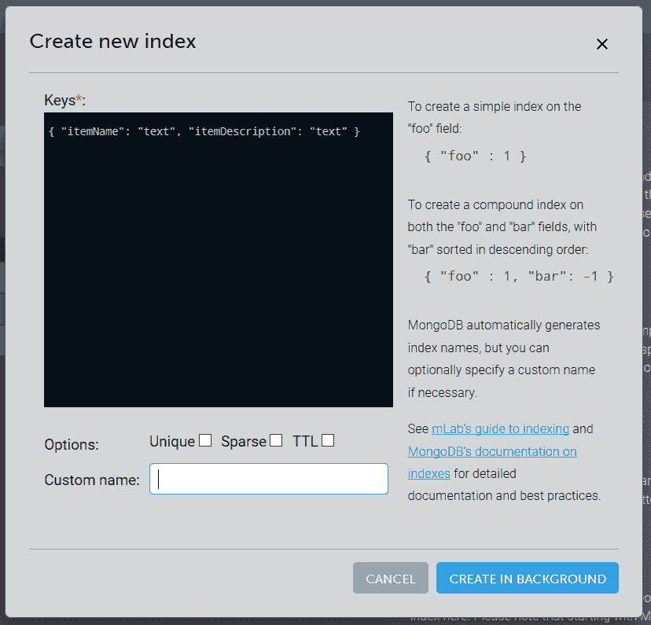

# 如何在 mLab 和 MongoDB 中查找字符串中的单词

> 原文：<https://dev.to/tnguyen303/how-to-find-word-in-string-in-mlab-and-mongodb-1je5>

如果您是编程新手，您可能不知道什么是索引。它实际上在你的周围无处不在，如果一个网站有一个数据库，它可能会启用某种类型的索引。

让我来介绍索引！索引是一个在数据库上运行的过程，目的是更有效地查找内容，非常有效！它通过查看所有数据库并*映射*所需的字段来实现这一点。然后，这些新的“值/链接对”按字母数字顺序排序。当你点击一个关键词时，它会遍历这个*排序的*映射值列表，并快速查找你的查询(更多细节请参考谷歌大 O 符号)。

## 现在来看看实现这一点的实际代码:

示例:我们想在 MongoDB 数据库的“itemName”和“itemDescription”字段中搜索一个单词。我们的模式中还定义了其他字段，但是您不应该索引超过您需要的字段，因为这会创建冗余的值/链接，并且会影响数据库的查询速度。我们将使用$text 符号在索引字段中查找单词。

首先，我们必须有一个函数来运行$text 查询:

```
const Inventory = require("./../models/inventory");

const queryResult = function(searchQuery) {
  Inventory.find({ $text: { $search: searchQuery } });
};

console.log(queryResult("shoes")); 
```

然后，我们必须对我们的 mLab/MongoDB 数据库进行管理，需要登录(通过 Heroku 或 mLab)，选择您的集合>索引标签>添加索引:

[T2】](https://res.cloudinary.com/practicaldev/image/fetch/s--hwxi-pya--/c_limit%2Cf_auto%2Cfl_progressive%2Cq_auto%2Cw_880/https://thepracticaldev.s3.amazonaws.com/i/mp0sfmmi3hkbj8sjvkh4.PNG)

填写需要索引的字段，在我们的例子中，我们在数据库集合中索引“itemName”和“itemDescription”字段；启用$text 符号需要“text”。

[T2】](https://res.cloudinary.com/practicaldev/image/fetch/s--py8ffwie--/c_limit%2Cf_auto%2Cfl_progressive%2Cq_auto%2Cw_880/https://thepracticaldev.s3.amazonaws.com/i/kcxguolabyfljedl70tx.PNG)

最后，点击后台创建，你会得到一个弹出提示，这可能需要几分钟到几个小时，这取决于你的数据库的大小和索引字段的数量。

就是这样！您的站点仍在运行，但在索引操作仍在进行之前，您可能会注意到性能问题，所以最好等待。

谢谢你看了我的第一篇帖子，有任何问题/输入/评论请告诉我！