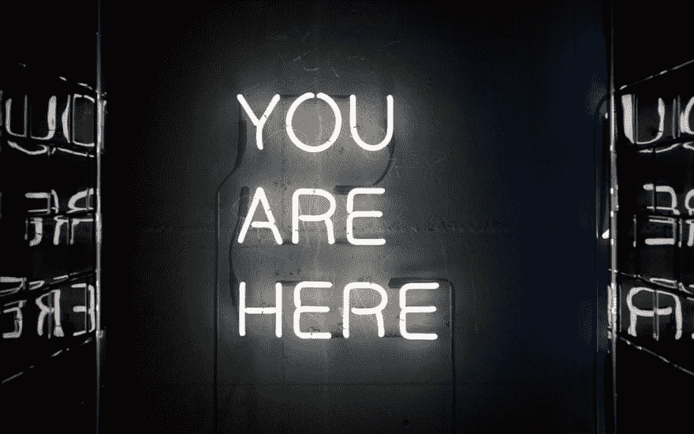

# 如何找到最适合自己的职业

> 原文：<https://dev.to/aviaryan/how-to-find-your-best-career-fit-3c6l>

[T2】](https://res.cloudinary.com/practicaldev/image/fetch/s--oGD2YYtU--/c_limit%2Cf_auto%2Cfl_progressive%2Cq_auto%2Cw_880/https://s3.us-east-2.amazonaws.com/devletters/covers/youhere.jpeg)

> 首次发布于 [Dev Letters](https://devletters.com/letters/choosing-your-career/)

我越是努力建立自己的事业，我就越意识到找到你梦想中的“职业”比看起来要简单得多。

我举个例子。

几乎每个人都想成为初创企业的创始人，你知道，像埃隆·马斯克或马克·扎克伯格那样经营百万/十亿美元的企业。

但是你真的想和他们一样吗？

也就是说，你准备好接受他们工作需要的 16 小时工作日了吗？

你愿意因为你犯的一个小错误而被数百万人憎恨吗？

你愿意因为你是一个如此受欢迎的人而与世界分享太多你的个人生活吗？

我们可以举的另一个例子是好莱坞名人和 Instagram 模特。

作为广告活动的一部分，你同意分享你的身体来赚钱吗？

你能应付从凌晨 4 点到晚上 10 点的长时间拍摄吗？他们可能会要求你对同一个场景拍摄 30 次。(这可能会非常令人沮丧，相信我，我有亲身经历)

你能接受你的生活在公共场合太多吗？

思考一下这些问题。想想如果你在那里，你的生活会怎样。

我相信你们中的大多数人会对这些情况中的至少一种或全部有问题。

然而，你仍然想成为下一个扎克伯格或下一个小罗伯特·唐尼

现在，我将解释为什么你会在看起来如此辉煌的职业中发现利益冲突。

是因为你是独一无二的，你在生活中有一定的优先级。

这就是这篇关于**的文章的意义所在，但为什么** - [如何选择职业(实际上适合你)](https://waitbutwhy.com/2018/04/picking-career.html)会有所帮助。我知道我以前推荐过它，但是它太好了，所以我在这里再次推荐它。

拿出你生命中的一个小时，过一遍。然后进行上面提到的练习，然后回来。

我在等待。

还在等...

完成了吗？

真的结束了吗？

很好。

所以你现在应该对你的生活有一套优先顺序了。

也有可能在这个过程中你发现了一些关于你的黑暗的，不那么文明的事情。这很好，对每个人的整体福祉都是一件好事。

怎么会？让我看看我的优先事项清单。

1.  良好的食物和生命安全(触手=实用)
2.  世界上所有的自由时间，高质量的生活方式(触手=生活方式，有点个人化)
3.  社会尊重和认可(触手=社会，有点个人，有点道德)
4.  私有不能共享(触手=个人)
5.  道德责任，比如让世界变得更美好

我知道，你可能会想阿维，你太自私了。你的社会认可度排在第三位，让世界变得更美好排在第五位，低于你自己的需求，比如良好的生活方式、食物和安全感。

但我还是会袖手旁观他们。

为什么呢？

假设我真的改变了这个顺序，把道德责任放在首位。

会让我更开心吗？很可能不是。

我会对世界产生重大的积极影响吗？

我可能有一些，但是你认为这是我能做的最好的吗？

假设我保持当前优先事项清单不变，让自己拥有良好的生活方式，当这些需求得到满足时，我会继续拯救世界，让世界变得更美好。

现在，因为我有一个高质量的生活方式，社会的尊重和一切，你可以假设我可以做一个很大的不同与我的立场。没有吗？

我们举个例子。比尔·盖茨对世界的积极影响比不上你们当地的非政府组织吗？很明显，没有。

比尔·盖茨可能已经满足了他所有的优先事项，所以他正在尽他对这个世界的道德义务。他做得很好。

像蒂姆·费里斯这样的人也一样。他的免费播客是世界上许多人(主要是企业家)的巨大知识库。

你认为如果他的首要任务是从一开始就开始播客，他会有这样的影响力吗？可能没有。但他在这里。

我可以继续说下去，但我想我已经说明了我的观点。

遵循你自己的优先事项清单，而不是大众社会强加给你的清单，对你和你周围的人都有好处。

你会更快乐，更成功，更有冲击力，更多“一大堆其他好形容词”。

我知道你们大多数人可能跳过了那篇文章，所以你又来了。阅读[如何选择适合自己的职业](https://waitbutwhy.com/2018/04/picking-career.html)。