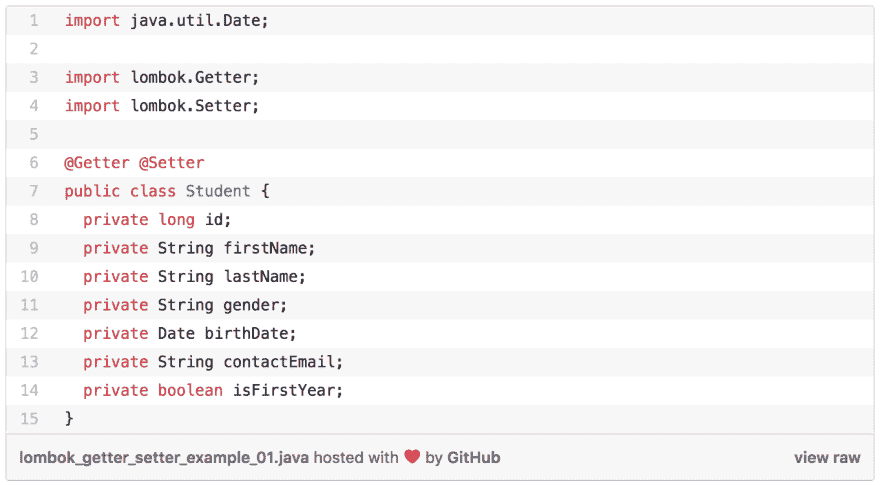
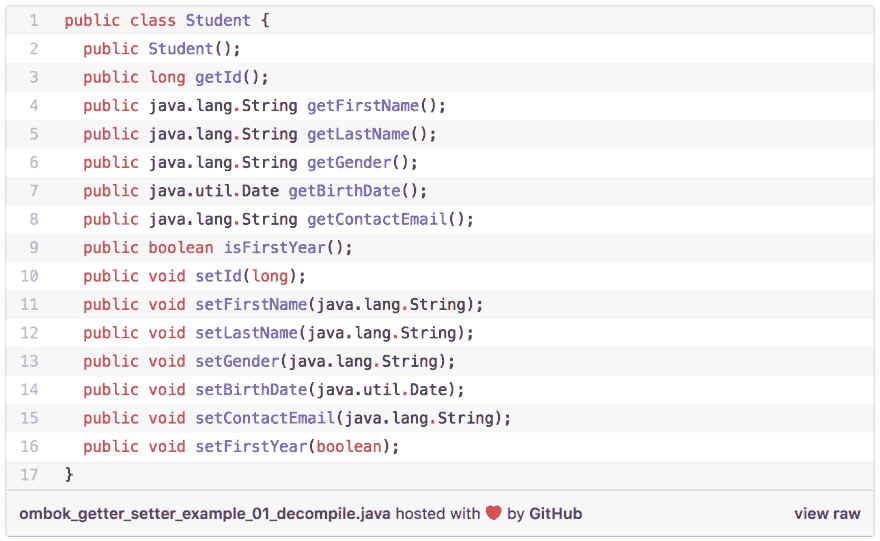

# 如何用 Lombok 生成 Java Getters 和 Setters(第 1 部分)

> 原文：<https://dev.to/andremare/how-to-generate-java-getters-and-setter-with-lombok-part-1-53j5>

### 快速小结

Lombok 项目是一个 java 库，它帮助开发人员生成样板代码，比如针对普通旧 Java 对象(POJOs)的“getter”和“setter”方法。通过简单地将 Lombok 库添加到您的 IDE 和构建路径中，Lombok 库将根据注释自动生成 Java 字节码，放入。类文件。

这篇文章将关注如何利用类顶部的@Getter 和 [@setter](https://dev.to/setter) 注释来生成类的 mutator 和 accessor 方法。

### 要求

下面的列表定义了我用来实现示例代码的技术和库:

*   龙目岛图书馆版本 1.16.20。[(下载)](https://projectlombok.org/download)
*   [JDK 1.8](http://www.oracle.com/technetwork/java/javase/downloads/index.html)
*   Spring 工具套件[(下载)](https://spring.io/tools/sts/all)

### 多个帖子

这将是关于如何使用 Lombok java 库为 java 类自动生成 getter 和 setter 方法的系列文章的一部分。

*   [如何用 Lombok 生成 Java Getters 和 Setter(第一部分)](https://www.code2bits.com/how-to-generate-java-getters-and-setters-with-lombok-part-1/)
*   [如何用 Lombok 生成 Java Getters 和 Setter(第二部分)](https://www.code2bits.com/how-to-generate-java-getters-and-setters-with-lombok-part-2/)

### 介绍

在 Java 中，mutator 方法是一种用于控制 Java 类中变量变化的方法。它们也被广泛称为 setter 方法。setter 通常伴随着 getter(也称为 accessor)，它返回私有成员变量的值。

关于 Getter 和 Setter 方法的使用，以及何时正确使用它们，有很多观点，但这不会在本帖中讨论。让我们假设您已经正确地将 OO 原则应用到 Java 类的设计中，并且需要 getter 和 setter 方法。

如果一个 Java 类包含大量成员属性，它将包含大量样板代码，如 getter 和 setter 方法，因此使用 Lombok 库可以更容易地生成代码。这意味着在自己编写代码时会出现更少的错误，并且类更容易阅读和理解。

### 示例 1:类的 Getter 和 Setter

@Getter 和/或 [@setter](https://dev.to/setter) 注释可以放在类声明中。这类似于用注释对该类中的所有非静态字段进行注释。

下面的例子说明了如何将@Getter 和/或 [@setter](https://dev.to/setter) 注释添加到类的顶部。

[T2】](https://res.cloudinary.com/practicaldev/image/fetch/s--v2havIU9--/c_limit%2Cf_auto%2Cfl_progressive%2Cq_auto%2Cw_880/https://thepracticaldev.s3.amazonaws.com/i/hxoqbxdsf0uuw01kbnpf.png)

要真正体会 Lombok 库的魅力，您应该在终端中使用“javac”命令来编译 Student 类。要成功运行该命令，应该确保 Lombok Jar 文件和 Student.java 文件位于执行该命令的同一个目录中。编译完学生类后，您应该使用“javap”命令反汇编学生 Java 类文件。

```
$ javac -cp lombok.jar Student.java
$ javap Student.class

```

javap 命令打印出传递给它的类的 package、protected 和 public 字段和方法。javap 命令将其输出显示到 stdout。因此，没有打印出 Student 类的私有成员属性，但是现在可以看到如何为该类的每个非静态私有成员创建 getter 和 setter 方法。

[T2】](https://res.cloudinary.com/practicaldev/image/fetch/s--cLdHxIKr--/c_limit%2Cf_auto%2Cfl_progressive%2Cq_auto%2Cw_880/https://thepracticaldev.s3.amazonaws.com/i/s1hjk3c048jzhk7k6gsu.png)

第 3 - 9 行列出了 7 个 getter (accessor)方法，第 10 - 16 行列出了 7 个 setter (mutator)方法。生成的 getter/setter 方法将是公共的，除非您显式指定 AccessLevel。getter 和 setter 注释的访问级别将在下一篇文章中讨论。

### 摘要

恭喜你！！！通过使用 Lombok java 库，您已经成功地为 Java 类生成了 Getter 和 Setter 方法。请寻找更多关于如何利用 Lombok 项目来简化 Java 编码体验的例子。