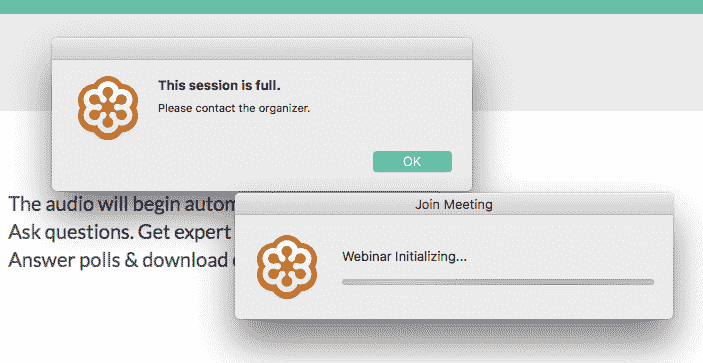

# 如何获得 METRC 认证

> 原文：<https://dev.to/whoisryosuke/how-to-get-certified-for-metrc-2pm5>

您是否希望符合您所在州的医疗或娱乐大麻追踪系统？也许你是第三方，希望咨询或创建与状态跟踪 API 交互的应用程序。无论哪种方式，你都会发现自己正在申请所在州的 METRC 认证。

我们在这里帮助你揭开这个过程的神秘面纱，这样你就可以访问 METRC。

## 什么是 METRC？

METRC 是一家第三方公司，与许多州签订了合同，负责种子销售跟踪。METRC 为种植者、经销商和零售商提供了一个在线界面和 API，以更新他们的大麻种植进度(从种植种子到销售收据)。在 METRC 系统下，每个工厂和“包装”都分配有一个由 METRC 单独分发的唯一 RFID 标签。这种独特的 RFID 通过系统跟踪植物。

## 认证流程

要访问 METRC，您必须首先获得使用 METRC 系统的认证。这包括学习他们的术语和工作流程，然后参加 40 道题的选择题测试。

通过认证后，您可以申请访问贵公司需要访问的某些 API 端点。例如，如果您正在开发一个种子销售应用程序，您将申请访问植物、植物批次、品系、房间和收获端点。要申请访问，您必须完成每个端点的能力测试(通常是 GET、POST、UPDATE 和 DELETE 请求)。

## 步骤

获得认证是一个相当简单的过程。如果你访问你所在州的 METRC 网站，你会在那里找到他们的清单。从技术上讲，这是获得认证和使用 API 的最低要求:

*   接触度量
*   参加网络研讨会
*   获取沙盒 API 密钥
*   参加沙盒测试
*   获得生产 API 访问权限

## 初始步骤

最初的几个步骤很容易，尽管很费时间。联系 METRC 很容易，他们会在一天内回复更多的细节。初次联系时，确保为网上研讨会预留位置，减少来回奔波。

他们每隔几周才举办一次网络研讨会，共分两次会议(上午和下午)。因此，如果你没有抓住它，你必须等待几个星期，直到你可以进步。

> 网上研讨会把你的生活吸干了。我在网上研讨会上的经历非常糟糕。

他们使用 GoToMeeting，要求我下载那个程序。当我第一次点击邀请链接时，网上研讨会已经满员了，我尝试了大约 20 次，直到 15 分钟后才进入。最终进入网上研讨会后，音频工作正常，但屏幕演示者的幻灯片在演示的前半部分不起作用。幸运的是，在聊天中抱怨之后，他们发出了一个 PDF 副本的链接。演讲者很糟糕，大部分时间都在喃喃自语，而且在主题上语无伦次。

<figure> 

<figcaption>METRC 超额预订网络研讨会，尽管要求您预订一个位置</figcaption>

</figure>

在演示结束时，我拿到了一本 200 多页的 METRC 手册，基本上是被打发去做一些家庭作业。

## 认证测试

这个测试是最难的部分之一，主要是因为我收集的参考资料参差不齐。你还需要知道 METRC 在线界面是如何工作的。这本 200 多页的手册有大量的网站截图，但它可能会令人困惑。

下面是其中一个问题的例子:

<figure> 

<figcaption>英国 METRC 认证考试</figcaption>

</figure>

有些相当简单。其他可能是相当无害的。而有些问题甚至不在提供的任何文档中。有一个问题问道:“销售的输入需要以下哪些属性？”。手册引用道:“请查看您所在州的补充信息，以便将销售额输入 METRC”。我不得不在谷歌上追踪这条补充信息。问题不断重复。这是一个有 40 个问题的测试，大约有 3-4 个问题完全相同。

## 沙盒测试

一旦您参加了第一次测试并获得认证，您就可以请求 API 访问。METRC 发送沙盒 API 信息，以及包含 API 检查的 Word 文档。

获取 API 访问权限的沙盒测试是我最近收到的最糟糕的惩罚之一。在本质上[不完整的 API 文档](https://api-ca.metrc.com/Documentation/#Plants.post_plants_v1_create_plantings)和无用的手册之间，你被留下来探索和督促如何正确使用大部分 API。

以下是我在沙盒测试中遇到的一些关键问题:

### 凭空猜测

METRC simple 没有为您提供足够的数据来完成测试，从他们不完整的文档到您偶尔转发的神秘文件。我不得不四处摸索他们的 API，并试验哪些有效。

测试中的第一个问题要求您对一个端点执行一个`POST`请求，但是没有给出完成该请求所需的参数(许可证号)。所以我不得不去他们的设施端点(`GET /facilities/v1/`)，仔细检查每一个，并找到一个符合`POST`请求的许可证号。如果涉及实验室测试，我必须找到与测试实验室相关的许可证。

在看到设施端点之后，我意识到 Metrc 已经通过电子邮件给我发送了 JSON 文件，文件名中包含许可证号。邮件或任何文件中从未提及，显然我不得不*凭直觉*获取信息。即使在检查了 JSON 文件之后，它们仍然会要求您`GET`请求多个端点来判断哪个设备是哪个设备。

### 半屁股单据

工厂批次 API 端点到`POST`工厂生长变化需要 2 个额外的参数，文件没有列出-但是一个错误消息会通知你。菌株名称和实际日期以及文档中提到的其他 6 个字段都是必需的。

### 查找您的帖子结果

一旦你知道如何用一个有效的许可证号发出一个`POST`请求，你将得到一个 200 的响应代码，表示成功- ***，除此之外别无其他。*** `POST`对 Metrc 的请求不提供任何响应，甚至不提供您刚刚发布的帖子的 id。

要查找您的帖子，请使用相同的许可证号并请求活动帖子的`GET`端点。根据端点，您必须指定时间范围。如果你有几个菌株，你会在 T2 找到它们。

通常，您需要刚刚创建的项目的 ID，因此您必须在适当的部分的端点上执行`GET`来找到它。有点麻烦，特别是当你做一批请求的时候。

### 不超时

回应可能需要很长时间。确保不要在 HTTP 请求上设置超时。我设置了一个 2 秒的超时，并且由于错误生成的强度(**9993 毫秒)而无法向一些端点发布。**)。我只希望生产 API 的速度能快一半，因为一个普通的药房每小时服务大约 1000 个客户(每分钟 16 个，每秒 0.2 个)，外加任何其他 API 请求(库存变化、患者验证等)。

### 停机

说到慢速服务器，API 沙箱在我的测试期间崩溃了，在他们能够让我的应用程序重新上线之前，我无法测试我的应用程序 3 天。如果你在时间表中给自己分配了时间，请记住这一点。

<figure> 

<figcaption>沙盒 API 显示错误消息</figcaption>

</figure>

### 跟踪和追踪流程

**了解 METRC 的流程**，因为医生不会给你任何提示。如果你*幸运*的话，你会得到一个错误信息，给你指出正确的方向。

每株植物都必须有一个与之相关的标签，植物属于与菌株和植物类型相关联的批次。下面是创建新项目的操作顺序，从第一个到最后一个:

> 菌株>房间>单株>收获>包装

制造植物需要菌株。但是像**植物批次**这样的东西可以在没有首先创建植物的情况下被创建(就像一个包含某种类型植物的类别)。一开始有点混乱(而且有漏洞)，但是一旦你经历了几次流程，就更容易管理了。

### 植物缺少标记？

我遇到了一个大问题，我必须找到植物来改变它们的生长阶段，但是我使用的设施没有任何带有植物标签的植物。该区域为`null`，使得无法通过需要电厂标签作为参考点的某些端点进行访问。这显然是 METRC 方面的一个错误，要么将不完整的样本数据输入到沙盒中，要么允许用户发送不完整的 POST 请求，从而中断系统流程。

我就这个问题联系了 METRC 的工作人员，但从未得到任何支持。唯一的解决办法是改变设施，找到另一个有真正标签的工厂，并使用它。

<figure> 

<figcaption>植物需要标记，但有些植物没有标记</figcaption>

</figure>

您也不能使用 API 创建新工厂。要么是沙盒不允许，要么是当你从他们那里购买 RFID 标签时，METRC 被期望输入每一个新工厂。*我不知道，*因为在联系 METRC 后，我没有收到任何回复。

### 新增植物标签

如果一个`POST`请求需要一个新的工厂标签，您必须查看标有您的设施许可证号的 JSON 文件。如果在文件中找不到您的许可证号，您必须更改为提供的选项之一。

有时，植物标签可能已经被沙盒环境中的其他用户获取。从样本数据中再抓一个就行了。

## 就是这样！

一旦你完成检查，它会被发送到第三方进行检查，你会得到生产级别的 API 密匙。

由于 METRC 的不完整和混乱的方向，这是一个有点麻烦的过程。应该是一个简单的过程很容易变成一个多星期的努力，通过他们的系统的老鼠窝导航。

我写这篇文章是因为我找不到任何人记录任何形式的过程，尽管 METRC 在 9 个不同的州被使用。如果你有任何想要分享或澄清的信息，请给我们发送一份，我们将根据你的见解更新这篇文章。

保持规律！~

奥斯卡

* * *

**继续阅读:**

*   【METRC 官方网站
*   [加州 METRC API 文档](https://api-ca.metrc.com/Documentation/)
*   [加州大麻追踪系统](https://cannabis.ca.gov/track-and-trace-system/)