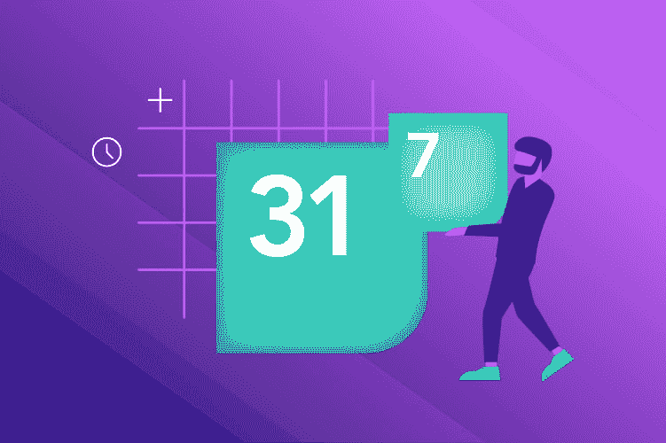
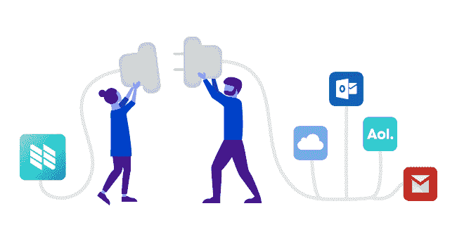

# 如何使用 Nylas 日历 API 获得完整的日历同步和 CRUD

> 原文：<https://dev.to/nylas/how-to-get-full-calendar-sync--crud-with-the-nylas-calendar-api-1242>

[T2】](https://www.nylas.com/blog/all-about-the-nylas-calendar-api-and-how-it-works)

需要构建一个日历集成吗？只需四行代码，即可让您的应用实现实时、安全的日历同步。了解一下 [Nylas 日历 API](https://www.nylas.com/calendar-sync) 能有什么帮助。

我们每天都要记录几个会议和约会，不管是私人的还是工作上的。我们非常依赖日历来跟踪我们的活动。仔细想想，我们生活中的所有事件实际上都分散在不同的日历提供商之间。

所有这些日历都有自己的系统功能，以不同的方式处理数据。我们需要为各个提供商建立独立的连接。最重要的是，我们还必须保持这些联系，并确保软件能够与每个提供商的 API 更新的过去、现在和未来版本一起工作(有时他们会引入阻碍其功能的突破性变化)。

您可以选择与每个单独的日历提供者建立独特的连接，也可以使用 Nylas Calendar API，通过一个简单的集成节省开发人员几个月的时间。

这样，您可以花更多的时间专注于您喜欢构建的功能。

我们的[日历 API](https://www.nylas.com/calendar-sync) 为您的应用提供实时、安全的日历同步。为什么问这个很重要？这很重要，因为建立日程安排和日历同步功能对许多软件公司来说是至关重要的。

如果没有 Nylas，开发人员很容易花 12 个月或更长时间来建立与每个日历提供商的连接，这些提供商的基础设施在 Gmail、Outlook.com、Exchange、Office 365 等之间有所不同。

在本帖中，我们将看到如何通过深入研究日历 API 的一些特性和功能来避免这一切。

[T2】](https://res.cloudinary.com/practicaldev/image/fetch/s---V3g2tPs--/c_limit%2Cf_auto%2Cfl_progressive%2Cq_auto%2Cw_880/https://cdn2.hubspot.net/hubfs/3314308/Calendar_API_2.png)

**尼拉斯日历 API**

Nylas 日历 API 充当所有日历提供者之上的抽象层。您可以简化调度流程并实时更新。

当一个账户通过 Nylas 认证后，我们的一个同步服务器会认领这个账户，并自动开始将日历数据同步到 Nylas 的数据库中。连接到 Nylas 的每个帐户可以有多个日历，每个日历可以有一个单独事件的集合。

calendar API 访问所有信息，以确保时间符合每个人的日程安排。它还可以让您要会见的人访问您的日历，并让他们选择最合适的时间。

一旦预约时段被预订，日历会立即更新，因此永远不会有重复预订或错过会议的机会。

**【Outlook.com 历通】T3】**

 **如果您正在构建一个需要与 Outlook.com 日历连接的软件，那么 API、服务和模板通常会导致更多的依赖性，而不是解决方案。

Nylas Calendar API 抽象了构建与 Outlook.com 日历集成的应用程序的所有复杂性，并处理所有产品更改和 API 修改，因此您不会遇到停机或服务中断。

Nylas 简化了来自 Outlook.com 和其他日历提供商(Gmail、Exchange、Office 365 等)的日历同步，给你一个可靠的 API，智能地适应日历提供商引入的任何变化。

使用 API，您可以通过强大的 API 原语获得完整的 CRUD(创建、读取、更新和删除)功能。除此之外，Nylas 还支持客户需要的所有日历功能。

**预订和取消**

 **通过访问所有同步日历和实时更新，预订和取消变得易于管理。从团队日历上的单个事件到定制的重复事件，Nylas 日历 API 都可以处理。

您可以从日历中更新您的计划，这些更改将实时反映在受影响的每个人的日程安排中。

**约会提醒和任务安排**

无论错过约会背后的原因是什么，对你的公司来说都是昂贵的。有了 Nylas，每个人都会收到自动约会提醒，提醒所有人预定的会议。

该集成还可以访问所有日历，这使得安排任务更加容易，并使截止日期管理变得轻而易举。

**生产率分析**

API 还通过分析跨团队可用性来接收生产力数据。它从日历中提取数据，并计算打开率、点击率、电子邮件使用量(发送和接收了多少封电子邮件)和日历会议(安排会议的频率)。它收集所有这些数据，以确定时间是如何花费的，并帮助提供一个解决方案来改善时间。

**快速启动 SDK**

使用 Nylas，您不必从头开始构建日历集成。我们提供了一套 SDK 来帮助您快速入门，这样您就可以花更多的时间根据用户的具体要求来迭代特性。

我们提供三种核心语言的 SDK:Ruby、Node JS 和 Python。只需几行代码，您就可以更快地将 Nylas 集成到您的应用程序中，保持更高的代码质量，并腾出时间来构建核心功能。

T4】

**安全与隐私**

[企业级安全和隐私控制](https://www.nylas.com/security/)一直是我们工作的核心。Nylas Calendar API 采用军用级安全标准对 100%的数据进行加密。

以下是我们保护基础架构中数据的一些方法:

*   透明度和合规性认证:Nylas 通过了 SOC2 认证、GDPR 合规性认证、欧盟隐私保护认证和 HIPAA ready。
*   加密和访问控制:使用企业级标准对静态用户数据进行加密。
*   网络传输和存储:Nylas 系统对公共和私有网络实施 TLS，并且只支持由知名 ca 签署的证书。
*   基础设施和物理安全:我们的产品运行在 AWS 上的安全设施中，具有主动监控、整体系统日志记录和安全性。

**准备好入门了吗？**T3】

Nylas 日历 API 是由开发人员为开发人员构建的，允许您共享团队日历、链接到特定会议、安排定期会议等等。

我们的日历 API 帮助您轻松开发应用程序的连接性。

关于如何开始的更多信息，[点击这里](https://dashboard.nylas.com/register)。

[T2】](https://res.cloudinary.com/practicaldev/image/fetch/s--OY4ZuUH0--/c_limit%2Cf_auto%2Cfl_progressive%2Cq_66%2Cw_880/https://track.hubspot.com/__ptq.gif%3Fa%3D3314308%26k%3D14%26r%3Dhttps%253A%252F%252Fwww.nylas.com%252Fblog%252Fall-about-the-nylas-calendar-api-and-how-it-works%26bu%3Dhttps%25253A%25252F%25252Fwww.nylas.com%25252Fblog%26bvt%3Drss)****