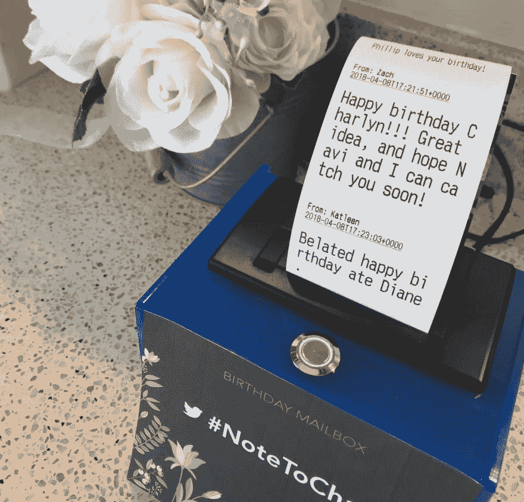
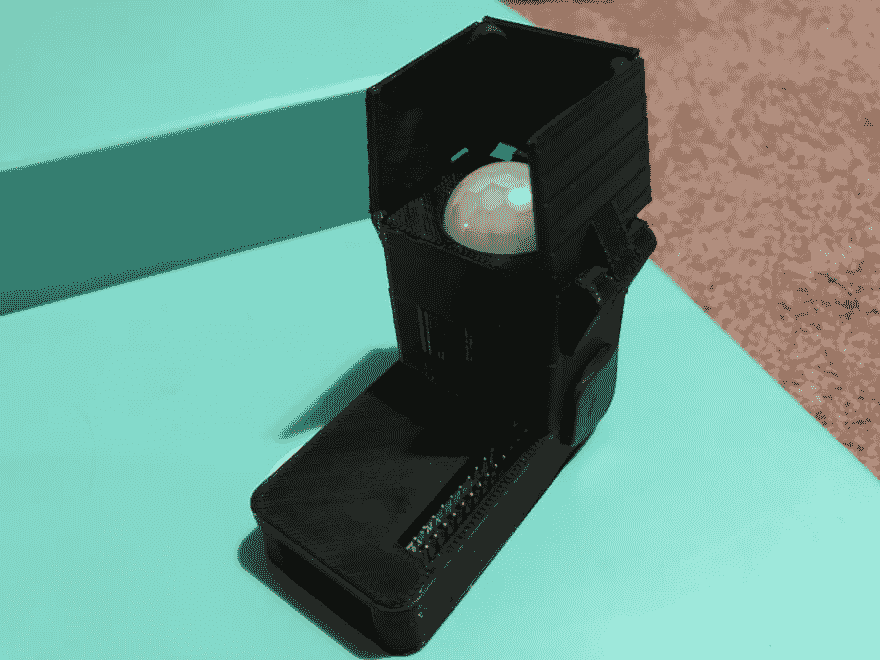

# 如何获得灵感(关于制作东西！)

> 原文：<https://dev.to/charlyn/how-to-get-inspired-about-making-things-42e7>

*您好！我已经为 [12 个月的制作](https://dev.to/chardane/12-months-of-makes-7pg)享受了制作东西的乐趣(正如我的桌子的状态所证明的那样，哈哈)，我认为这篇文章将有双重目的:提供我最近在做什么的更新，并回答几个朋友表达的问题。*

我经常从朋友那里听到这种情绪:“我真的很想做点什么，但我不知道该做什么，也不知道从哪里开始寻找灵感。”朋友们，这是一个普遍的问题，你并不孤单。一些人试图通过看着要买的东西或者在他们知道要做什么之前买一堆东西来解决这个问题。这是一条路要走，但我认为如果你在购买一堆随机物品之前，心中有一个项目，你将有更好的机会获得完成的动力。好消息:有办法让你的创造力源源不断。这里有 5 种方法可以克服创造者的障碍并获得灵感。

# 1。看教程

[T2】](https://res.cloudinary.com/practicaldev/image/fetch/s---EndLJUG--/c_limit%2Cf_auto%2Cfl_progressive%2Cq_auto%2Cw_880/https://thepracticaldev.s3.amazonaws.com/i/tp2mtm5i8g7gbwcydpjg.jpg)

这是获得灵感的好方法。有些人的全职工作就是激励你去创造东西。让他们的魔法发生吧。有时你会发现，有一本指南可以准确地指导你一直想做的事情。有时候，你会看到一个项目，然后想到一个让它成为独一无二的你的转折。查看 [Adafruit 的教程](https://learn.adafruit.com/)或[制作:杂志](https://makezine.com/)中的任何内容。这就是我如何制作上图所示的四月礼物的方法:一台**生日邮箱打印机**——这是一台直播打印机，打印出生日快乐的推文，以及我的 FB 页面上的消息。这些信息是温暖人心的，人们很高兴看到他们的数字信息变成了纸质笔记！

# 2。把你最喜欢的故事中的东西变成现实

你有没有看过一部电影，读过一本书，或者玩过一个游戏，然后想“我绝对会生活在那个世界里”？VR/XR 革命即将到来，但在我们等待的时候，你可以今天制作你最喜欢的道具*的复制品，感觉更加沉浸其中。制作 BOTW 林克的[守护剑++](https://learn.adafruit.com/breath-of-the-wild-guardian-sword-led-3d-printed/overview) 怎么样？或者做一个赫敏的魔杖，当你每次挥动它的时候，它都会正确地说“wingardium levi-ohh-sah ”?让你对故事的热爱驱动你的创造力。*

# 3。为你的其他爱好做点什么

我碰巧住在硅谷，那里乒乓球是办公室运动的首选。我在这方面很糟糕。但是，我已经做了一些与之相关的东西，比如[这个我不久前做的漂亮奖杯](https://twitter.com/WRSUpdates/status/746434389370802180)和一个记录办公室团队分数的在线内部办公工具。想想你喜欢做的其他事情，以及你可以做些什么来增加它的趣味。例如，如果你喜欢直播，[这里有一个互动大炮](https://makezine.com/projects/livestream-interactive-confetti-cannon/)，你可以用一种新的方式吸引你的观众。

# 4。为生活中的斗争(或大或小)创造解决方案

与其买些东西来帮你摆脱困境，为什么不自己做一个并在过程中学习一些东西呢？有一只宠物，并希望能够检查他们？你可以为此购买一个产品，或者你可以选择制造它！这里有一个来自 Pimoroni 的 Octocam 套件，可以满足你的一切需求。作为奖励，自己做东西通常意味着你可以找到一种方法来满足你的特殊需求。我很想看到有人在他们不在的时候黑掉这个相机，扔个球或飞盘和他们的宠物一起玩。

本着只做不买的精神，我想在我新公寓的墙上挂一幅艺术作品，但它必须是特别的、有意义的，还能作为餐厅的一盏明亮的灯。因此，在我的六月制作中，我创作了这个**墙壁艺术装置**，用来挂我从世界各地收集和收到的 instax 照片和明信片。符合我的所有标准，第一次使用了 Dremel，并了解了 forstner 钻头[。另外，它由 Google Home 控制。超级满足。](https://www.rockler.com/how-to/the-value-of-forstner-bits/)

# 5。为其他人制作

最后，但绝对不是最不重要的，我发现最能激励人的项目是那些给别人的生活带来快乐的项目。我的二月制作是一个[普什恩瓦伦丁](https://dev.to/chardane/february-make-pusheen-heart-18h0)，上图是我的五月制作，一个 **3D 打印的鸭嘴兽奖杯，安装在手工着色的木制底座**上，用来表彰我的队友们的辛勤工作。这类项目令人满意，因为我知道我让我关心的人开心，而且在这个过程中我提高了自己的技能。

现在你有了 5 种方法来获得灵感，制作自己的项目。回过头来看看这个列表，我认为大部分或者全部也适用于软件项目😄。我的最后一个建议是:

> ## Don't pursue perfection, it's not as good as perfection.

总会有更好的制作方法，总会有更好的解决方案。不要让这阻止你卷起袖子做出点什么。你会学到新的东西，提高你的技能，这是非常宝贵的。制作的经历并不总是与最终产品有关。给你自己[一些基本的工具](https://www.adafruit.com/product/136?gclid=Cj0KCQjwn4ncBRCaARIsAFD5-gXw-3Hg803W7iWDfyeYFHLVwvKfn80TgaHUasATam7Cycdjcsq2zCMaAvoYEALw_wcB)，挑选一个让你兴奋的想法，然后开始建设。如果你正在寻找一个可以分享想法或一起制作东西的团体，加入我们的 FB 团体[白天编码员//夜晚制造者](https://www.facebook.com/groups/2273336896228558) -我们很高兴能帮助你，也很高兴能和你在一起！:D

当然，不要忘记在 Dev.to 上分享你的制作！这个社区非常支持我，优秀的 Dev.to 团队给我留下了深刻的印象，你们如此鼓舞人心，真的让我刮目相看。继续牛逼，继续做东西！

上面有你想了解更多的项目吗？请在下面的评论中留言，我很乐意就此单独发帖！PS:我会在 [Github Universe 谈论制作东西](https://twitter.com/chardane/status/1033854824213667841?s=21)，希望在那里见到你！