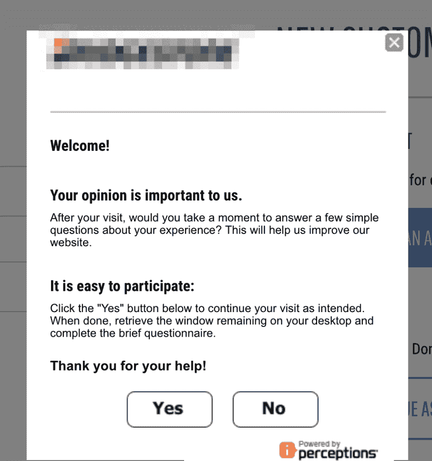

# 如何在你的木偶测试中处理讨厌的模态

> 原文：<https://dev.to/benenewton/how-to-handle-pesky-modals-in-your-puppeteer-tests-2igm>

如果你在任何大型电子商务网站工作过，你可能会遇到 iPerception 模型。每个主要品牌似乎都有这项调查，当你试图做一些重要的事情时，它将不可避免地出现。对大多数用户来说，好消息是如果你关闭它，你就再也看不到它了。但是，对于开发人员来说，如果您运行可视化回归测试或集成测试，您会一遍又一遍地看到这种模式。

### 什么是 iPerception 模态？

[T2】](https://res.cloudinary.com/practicaldev/image/fetch/s--4LaQqlOm--/c_limit%2Cf_auto%2Cfl_progressive%2Cq_auto%2Cw_880/https://benenewton.com/static/iperceptionModal-d9261e8e5975ec235c9c9fe174154c16-b7e98.png)

### 情态的问题

在我的具体案例中，我正在对我目前正在做的一个网站的电子商务漏斗进行集成测试。该流程从主页开始，然后通过一系列步骤点击到确认页面。当我编写测试时，我会在每个额外的步骤后运行测试，以确保它们通过。在进行第 3 步的时候，我突然开始遇到第 2 步的测试失败，而这在之前已经通过了。

我在木偶师配置中将 headless 设置为 true，并在浏览器中观察测试。我很快意识到 iPerception 模式在步骤 2 中已经开始弹出，阻止我的测试点击正确的 CTA 来继续流程，因此测试失败。

### 在木偶戏中找到并处理情态

如果我想通过测试并继续下一步，我必须检查每个页面上的模态并关闭它。我希望有一种简单的方法来设置不显示模态，毕竟，这是在我的本地环境中。但在这种情况下，它是一个庞大的代码库，有许多机构在研究它，我没有访问触发模式的代码。因此，我必须找到一种方法来测试模态，并在尝试单击 CTA 进入漏斗的下一步之前关闭它。

我试图通过 ID 或类来识别模态，但是它们都不使用。我猜这是为了避开广告拦截器。我发现在模态中我真正需要针对的唯一选择器是“NO”CTA。我只需在页面上检查这个 CTA，如果它存在，单击它关闭模式。我发现既然它是一个图像，我可以使用 src 属性作为选择器。所以现在，在每次截屏和点击 CTA 之前，Puppeteer 会检查“否”CTA，如果存在，它会点击它并继续测试。我将它添加为一个助手库，因为我必须在多个测试中多次调用它。

下面是我添加到测试中的模块。我不得不在每一页都调用它。模式不仅仅是为主页设置的。就我而言，在编写测试的过程中，它出现在每一页。

```
// Checks for survey modal and clicks "NO" if it is on page during testing.

const checkForSurvey = async page => {
  const SELECTOR =
    'img[src="https://ips-invite.iperceptions.cimg/templates/Layer/theme1/no_1.png"]';

  if ((await page.$(SELECTOR)) !== null) {
    await page.click(SELECTOR);
  }
};

export default checkForSurvey; 
```

下面是我在测试中如何使用上述模块的一个例子。我现在在这个特别的网站上的所有木偶测试中使用这个。没有它，我的测试会一直随机失败。

```
import puppeteer from 'puppeteer';
import { toMatchImageSnapshot } from 'jest-image-snapshot';
import config from './config';
import checkForSurvey from './checkForSurvey';

expect.extend({ toMatchImageSnapshot });

let page;
let browser;

beforeAll(async () => {
  browser = await puppeteer.launch({
    args: ['--no-sandbox', '--enable-features=NetworkService', '--ignore-certificate-errors', '--disable-web-security'],
    headless: !config.showBrowser,
    // slowMo: 80,
    ignoreHTTPSErrors: true,
    devtools: config.showDevtools
  });

  page = await browser.newPage();
});

afterAll(async () => {
  await browser.close();
});

describe('Visual Regression Test Home Page', () => {
  test('Home page screenshot should match', async () => {
    await page.setViewport({ width: 1280, height: 800 });
    await page.goto(config.homePageUrl);
    // Check for iPerseption Survey Modal and close if it exists.
    await checkForSurvey(page);
    const screenshot = await page.screenshot();

    expect(screenshot).toMatchImageSnapshot();
  });

  test('Page 2 Page should match screenshot', async () => {
    await page.click('.linkToPage2');
    await page.waitForNavigation();
    // Check for iPerseption Survey Modal and close if it exists.
    await checkForSurvey(page);
    const screenshot = await page.screenshot();

    expect(screenshot).toMatchImageSnapshot();
  });
}); 
```

到目前为止，这个助手成为我编写的每个测试的必需品。如果你有类似的东西，可能会接管你正试图为之编写木偶测试的页面，我希望这能帮助你。如果您使用这个来删除测试中的 iPerception 模型，请在评论中告诉我。如果你有不同的处理方式，请告诉我。