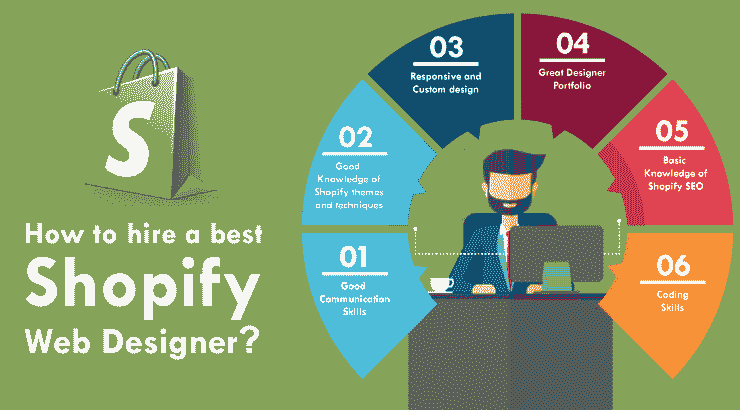

# 如何为你的电子商务商店找到最好的 Shopify 网页设计师

> 原文：<https://dev.to/designomate/how-to-hire-best-shopify-web-designer-for-your-e-commerce-store-oc2>

 
要想设计成功的 Shopify 电子商务网站，雇佣一个能为你的企业设计高质量电子商务商店的设计师是很重要的。由于 Shopify 的流行，有成千上万的 Shopify 设计师准备接手你的项目，但很难判断他们并为你的项目挑选最好的一个。我们整理了一份每个合格的 [Shopify 网站设计师](http://www.designomate.com/shopify-web-designer/)所具备的素质清单。

每个网站都是卖家的身份，也是他完美的推销员。在成为网页设计师之前，让我们先决定:

**什么:你希望你的电子商务商店里有什么？**

在开始寻找合适的 Shopify 网站设计师之前，你应该决定你想在你的网站上做什么。你需要确保在表达你对网站的要求时没有留下漏洞。你的网页设计师可能需要的一些非常基本的细节是:

你有实体店吗？
你的网页设计师可能需要这些信息来探索你的实体店，收集你的想法和功能。这将有助于你的网页设计师保持你的审美，并把你的品牌带到数字空间，就像在现实世界一样。这让你的忠实顾客保持联系，让他们更容易购物。

你想要一个新网站吗？
对于一个新网站，你的网页设计师需要在每一个细节上下功夫。明确你的想法和对网站的期望。在这里，你的网页设计师不仅要考虑设计，还要考虑适当的搜索引擎优化技术，以确保你获得巨大的投资回报。这是你的网页设计师的责任，以确保你的投资没有流失。

 **你要不要更新现有的网站如果你需要一个新的网站或者你要更新现有的网站，你的网站设计师需要很好的了解。你的网页设计师会相应地计划他的行动。对于一个已经存在的网站，你的网页设计师将不得不考虑利润减少的原因。它可以是基本的设计，用户界面或其他。重要的是，你的网页设计师正确地分析你的网站，以找到解决方案，并为你提供高转化率。**

 **目标受众
对目标受众的简单了解将有助于你的网页设计师决定如何规划你的网站。这更多的是你的网页设计师的工作，做完整的研究，但你应该向他简单介绍一下，让他有一个前进的轨道。

有在第三方网站上销售的计划吗？
如果你是亚马逊或 EBay 之类的第三方卖家。万一你不和他们一起卖，你打算和他们一起卖吗？这将有助于你的网页设计师决定使用的产品图片。他们还可以帮助你将你的 Shopify 网站与亚马逊或 EBay 整合。

既然你已经清楚地介绍了你对网页设计的要求，现在是时候寻找[最佳 Shopify 网页设计师](http://www.designomate.com/shopify-web-designer/)了。以下是让网页设计师成为“SHOPIFY 网页设计专家”的技巧

良好的沟通技巧

你雇佣的网页设计师拥有良好的沟通技巧是很重要的。他必须善解人意，还必须能够很好地解释什么在逻辑上是可能的，什么是不可能的。此外，通过定期的互动，你的网页设计师可以让你了解网站的最新进展。您的网页设计师将与在线营销团队和其他参与该过程的人进行沟通，重要的是，他拥有良好的沟通技巧，能够将自己的想法传达给团队，并获得最终想要的结果。

**2)对 Shopify 主题和技术的深入了解**
Shopify 为其网页设计师提供了广泛的模板来使用和定制他们的网站。Shopify 专家必须对 Shopify 主题有很好的掌握，但也要不断更新自己，让自己了解 Shopify 为用户提供的进步。

快速响应和定制设计
如今，任何网站的主要要求之一就是快速响应。确保你的网页设计师在设计响应性网站方面有丰富的经验，在手机或 iPad/平板电脑上看起来和在 pc 上一样赏心悦目。此外，由于你的网站是你的网上商店，它必须以一种能最好地反映你的业务的方式进行定制。

优秀设计师作品集
雇佣一个有丰富电子商务项目经验的网页设计师并不一定能保证他适合你的企业。相反，在给定的基础上判断一个网页设计师组合:

网站美学
一个专业的网页设计师的作品是不言自明的。每个网站都有自己的身份，这反映了你所选择的网页设计师的创造力和创新。确保设计师的设计技能符合你的设计期望，或者至少在审美方面接近你想要的。
 **用户友好性网上购物者需要在最少的点击次数内找到他们想要的产品。重要的是，你的网站设计者要想出一个网站，用最少的点击量提供最多的相关产品。如果搜索结果中出现很多不相关的东西，这可能是买家最后一次访问你的网站。网站速度是让你的网站在购物者中受欢迎的最重要的因素之一。浏览作品集时，一定要检查网站加载的快慢。这也有助于你判断你的网页设计师的搜索引擎优化技术有多好。**

 ****5)Shopify SEO 的基础知识**
不要指望网页设计师是 SEO 专家，但他应该具备 SEO 的基础知识。基本搜索引擎优化包括至少主页，关于，联系和其他信息页面的元标题和描述，网站速度优化和谷歌分析设置。

编码技能
虽然对他/她的编码技能评价太多是不公平的，但人们希望他使用 Shopify 应用程序在这里和那里处理小的定制功能开发。询问您的设计师，我们是否可以在现有主题或 Shopify 应用程序中进行一些定制，以实现您的关键目标。

谁:确保你的网页设计师了解你的目标受众是谁

你的**设计师应该了解你的目标受众是谁**并根据你的业务目标受众来设计网站。最好选择一个已经为你的目标用户设计过网站的设计师，或者给出一些好主意，告诉他如何设计网站来吸引你的目标用户的注意力。

比如，如果你的目标是向专业人士销售你的产品，它应该是微妙和美学外观的结合。如果是给青少年看的，那么这个网站一定会有一点时髦，使用不同类型的颜色，而不是给专业人士看的。

**何时:及时交货。**
守时不仅是网页设计师，也是每个专业人士必须具备的素质之一。与你的网页设计师确认部署你的网站的日期，并确保他坚持这样做。

多少钱:
在开始做网页设计师之前，和你的网页设计师讨论你的预算和投资计划是很重要的。这有助于他在你的预算范围内尽最大努力规划你的网站。从长远来看，这有助于你增加投资回报。

在 [DesignOmate](http://www.designomate.com) 这里，我们有一个由 [Shopify 专家](http://www.designomate.com/shopify-web-designer/)组成的团队来处理您所有的 Shopify 需求。无论是商店设置，定制商店设计，搜索引擎优化或网站重新设计。凭借他们的技能和沟通的便利性，我们的网页设计师随时准备挑战他们的极限，为您的电子商务业务提供开箱即用的想法。****