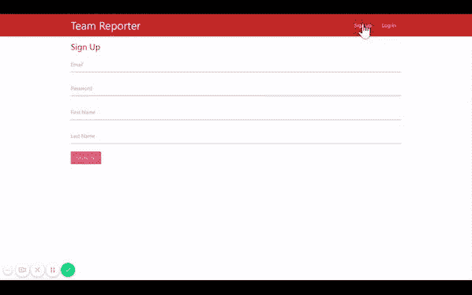
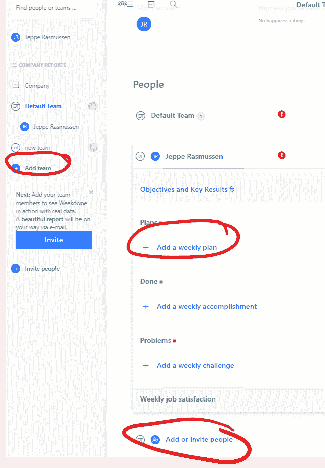

# 如何在 MERN app 中实现群组功能？

> 原文：<https://dev.to/jepras/how-to-implement-group-feature-in-mern-app-22b8>

我是一名有抱负的程序员，我开始构建一个完整的团队报告应用程序，以弄清楚一切是如何一起工作的。

我已经知道了如何设置 API，如何用 Redux 处理 state 来显示通过我的 React 前端发布到我的 MongoDB 的数据。

> <video loop="" controls=""><source src="https://video.twimg.com/tweet_video/DqC0RSXX4AADHFo.mp4" type="video/mp4"></video>杰普拉斯姆森@杰普拉斯 _第 78 天的 [#100DaysOfCode](https://twitter.com/hashtag/100DaysOfCode) :
> -完成 fcc redux 跟踪。开始了另一个 React/Redux 教程，并把它用于我自己的测试项目。对我的过程感到有点自豪，同时还在为我的头发感到焦虑，因为我还没有啊哈时刻🥴2018 年 10 月 21 日下午 16:0348

然而，现在我需要弄清楚如何实现一个组/团队特性。我需要一个用户能够创建一个团队，邀请其他用户加入该团队&然后只显示相关团队下记录的任务。

举个这样的例子:

我不知道从哪里开始。这是我应该在数据库安全设置中配置的吗？在我用于数据库的模型中？我获取数据的方式？饼干有问题吗？

当我在谷歌上搜索时，我没有找到任何对我有帮助的东西，因此我在这里提问。

**从哪里开始？你能给我指一下正确的方向吗？**

如果你能帮助我，谢谢你和我的爱:)