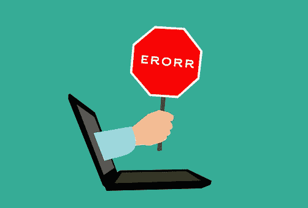
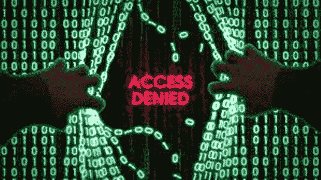

# 如何提高 DevOps 安全性

> 原文：<https://dev.to/kingatmo/how-to-improve-devops-security-2m5d>

# 如何提高 DevOps 安全性

DevOps 提供了一个很有潜力提高安全性的环境。自动化、协作、持续测试、更好的反馈循环等实践提供了将安全性作为开发运维流程的一个组成部分进行集成的机会。

通常，云环境、容器和开发人员在制作应用程序时依赖的其他资源中存在广泛的安全缺陷和风险。这包括第三方代码、工具、网络和开发系统的其他组件。如果没有适当的工具、控制和保护，这些领域可能会导致不稳定和不安全的应用程序。增加脆弱性的一些因素包括:

*   容器的错误配置和弱点
*   不安全的内部和第三方代码、特权暴露等。
*   脚本或 CI/CD 工具中的安全缺陷
*   恶意的内部人士
*   不安全的基础设施和员工行为。

[T2】](https://res.cloudinary.com/practicaldev/image/fetch/s--bD9RK3IO--/c_limit%2Cf_auto%2Cfl_progressive%2Cq_auto%2Cw_880/https://thepracticaldev.s3.amazonaws.com/i/oopanks6m86w0po6eak0.jpg)

在这篇文章中，由为团队提供服务状态通知的科技公司 [Downosaur](https://downosaur.com/) 赞助，我们将了解为什么公司不采用 DevOps 安全性，以及他们可以做些什么来改变。

## 为什么公司不在开发运维中采用安全实践

尽管自动化过程和集成不同的团队是有助于提高应用程序安全性的实践，但是大多数软件公司并没有在他们的 DevOps 程序中利用它们。挑战包括文化、安全和开发团队独立工作，缺乏技能和工具，抵制变化，不优先考虑安全，缺乏自动化等等。

### 落后的安全措施

虽然现在创建应用程序的速度更快了，但大多数安全团队无法与开发运维实践保持同步。

DevOps 使发布应用程序变得更容易更快，这样，传统上需要一年半以上的时间在六周或更短的时间内变得可能。然而，基础设施、自动化和其他 DevOps 工具继续改变着开发环境，使得传统的安全方法变得无效。

### 安全性和开发人员之间的目标冲突

尽管开发人员希望尽快向市场发布软件，但安全团队在测试代码和应用程序的漏洞时可能会放慢速度。如果他们在测试中发现了缺陷，他们会要求开发人员首先解决它们，从而进一步推迟发布。

### 不重视安全性

通常，组织希望加快推出新应用程序的过程。在这样做的时候，他们可能想要跳过一些步骤，比如那些可以识别代码中的安全缺陷的步骤。此外，他们可能会避免增加代码的安全性。

开发人员可能会将增加安全性或任何减慢他们开发过程的事情视为他们竞争能力的阻碍或障碍。最常见的情况是，这种方法会导致发布易受攻击的应用程序，或者在安全问题上没有经过充分的测试。

### 缺乏技能

将安全性构建到开发运维中需要一套新的优先级、工具和技能。最常见的情况是，传统的安全专业人员可能没有足够的技能来处理动态的 DevOps 环境。例如，他们可能不熟悉 API、编写代码和脚本，也不具备将传统安全任务自动化并集成到 DevOps 环境中的知识。

## 使用 DevOps 提高安全性

越来越多的软件公司现在将 DevOps 视为加强合规性和安全性的有效平台。通过适当的方法和安全策略，DevOps 实践允许团队比传统方法更快地发现和解决潜在的安全问题和漏洞。

开发人员不应该将安全性作为附加组件添加，而应该将其集成到整个开发周期中，同时在开发过程中进行监控和测试，并在进入开发链的下一个过程之前解决任何漏洞。有助于提高 DevOps 安全性的有效措施包括:

### 改变组织的心态和文化

拆除开发、运营和安全之间的墙是至关重要的。将安全性与 DevOps 融合时，改变传统的安全性实践是主要挑战之一。

公司应该创造一种文化，让每个人，包括其他部门，都为应用程序和流程的安全性做出贡献。这避免了将保护 DevOps 系统的责任留给安全部门或专业人员。

理想情况下，组织应该努力发展一种副产品是安全性的文化。这应该；

*   促进开发、运营和安全团队之间的合作。
*   让每个人都对安全负责，将它从排他性转变为包容性。
*   消除传统的官僚和沟通障碍。
*   在开发、运营和安全团队之间建立清晰的沟通途径。

### 增加投资安全技能、工具和流程

随着 DevOps 技术的成熟，潜在威胁也在增加，组织必须投入更多资金来提高安全性。这包括利用必要的工具、人员、技能和持续培训。软件公司需要让每个人在开发应用程序时掌握处理安全及其流程的基本技能。

此外，管理人员、开发人员、操作人员和安全团队必须团结协作，相互支持。

[T2】](https://res.cloudinary.com/practicaldev/image/fetch/s--2Fv-fYCX--/c_limit%2Cf_auto%2Cfl_progressive%2Cq_auto%2Cw_880/https://thepracticaldev.s3.amazonaws.com/i/f0ohor59laq5s5t38w5r.jpg)

### 在应用程序开发过程中集成安全性

与查看成品安全性的传统方法不同，最佳实践是从早期阶段和整个开发周期应用安全性和测试。

最佳实践是在构建应用程序时添加安全性，然后使其成为系统的一部分，而不是作为附加组件或事后的想法。此外，强化和测试 CI/CD 管道，而不要太依赖于开发人员友好的默认设置。

在所有级别实施安全措施，执行安全需求评估，并尽可能自动化大部分流程。跨整个基础架构自动执行安全测试、更新和其他重复性任务。

### 添加自动化

沿着整个开发管道的大多数过程的自动化提高了速度和效率。除了提高一致性和可预测性之外，自动化还降低了手动流程中出现人为错误的几率。

最佳实践是在开发和测试代码、配置基础设施、部署和任何其他适用流程的初始阶段添加自动化。

要自动化的常见任务包括持续集成、持续测试、持续扫描和监控、扫描代码、版本控制、编排、容器化以及配置管理和部署。

虽然自动化在某种程度上会起作用，但是仍然有必要使用手工测试来捕捉自动化脚本遗漏的一些问题。自动测试的其他限制包括无法测试可用性，以及它只适用于可预测的事件。

### 安全代码和开发环境

要开发干净的应用程序，拥有一个安全的基础设施是至关重要的。理想情况下，这意味着保护云和内部环境，并确保针对内部和外部攻击提供足够的保护。

最佳实践是保护代码、IDE、基本映像和其他任何东西，直到整个应用程序和操作环境。

此外，定期评估和解决开发流程中可信第三方代码、云平台、持续集成组件和其他资源中的漏洞。

### 保护所有数据

除了基础设施和应用程序之外，您还必须保护所有位置的数据，包括休息时和使用时。

敏感数据类型(如私人信息、信用卡或医疗保健)具有更大的风险，因此需要在存储、处理或传输等各个层面实施特定的安全控制和合规性。

[T2】](https://res.cloudinary.com/practicaldev/image/fetch/s--EYSN0VK4--/c_limit%2Cf_auto%2Cfl_progressive%2Cq_auto%2Cw_880/https://thepracticaldev.s3.amazonaws.com/i/dogb5969nnhsfgc5azft.jpg)

### 进行静态、动态和渗透测试

静态应用程序安全测试(SAST)检查应用程序二进制文件、源代码以及字节码的安全漏洞。它有助于在开发的早期识别和缓解安全问题。

动态应用程序安全测试(DAST)在应用程序运行时对其进行检查，并可以识别出表明安全漏洞的异常行为。

渗透测试包括模拟多个真实世界的攻击，以及黑客可以做什么来获得对应用程序的访问。
建立内部控制和实践

*   仅给予员工执行任务所需的权限和访问权
*   建议员工使用智能密码，避免重复使用旧密码，或者在不同帐户之间共享密码或其变体。特别是，强制要求他们必须使用由字母、特殊字符和数字组成的安全密码。
*   创建并记录在保护应用程序、环境和数据时应遵循的流程。
*   开发和推广安全最佳实践
*   日志访问和事件

### 减少攻击面

不要忘记遗留的安全实践，如 web 应用程序防火墙和其他保护措施。

*   保护和强化基础设施和操作系统
*   减少 API 的攻击面，强化那些需要暴露的 API。
*   遵循安全最佳实践
*   使用 web 应用程序防火墙来阻止外部威胁
*   定期更新和修补安全工具

## 结论

将安全实践融入开发运维流程有助于为环境和应用创建有效的安全层。从长远来看，这可以更主动、更高效地确保安全性和合规性。