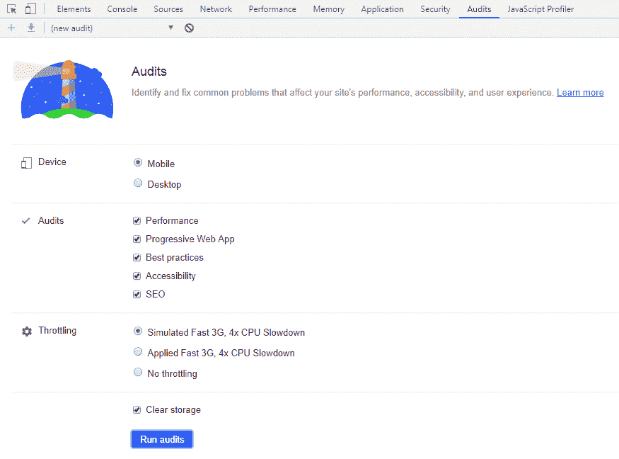

# 如何从 Chrome Lighthouse 提高站点评分

> 原文：<https://dev.to/pranesh229/how-to-improve-the-site-score-from-chrome-lighthouse-3fca>

这份文件是关于我通过使用 Chrome Developer Tools 进行审核来为我的个人资料网站获得高分所遵循的一系列步骤。

### 如何使用 Chrome 开发者工具审计你的网站

在我们做任何改变以优化网站之前，我们需要首先评估和了解问题。Chrome 增加了 light house——一个网站评估工具，可以在开发活动中评估你的网站。它简单、快速，不仅能给你一个分数，还能给你解决问题的必要建议。
[T3】](https://res.cloudinary.com/practicaldev/image/fetch/s--9PPbNxDU--/c_limit%2Cf_auto%2Cfl_progressive%2Cq_auto%2Cw_880/https://thepracticaldev.s3.amazonaws.com/i/oi2lco83s74lw446o5qc.PNG)

### 评估结果

既然你已经知道了结果，那就更容易找到开发者需要在哪里做正确的优化。因为灯塔将评级分为 5 个基本类别

1.  表演
2.  渐进式网络应用
3.  最佳实践
4.  易接近
5.  搜索引擎优化

#### 表现

为了提高性能，最好先解决容易解决的问题。如果网站的性能通过执行简单的技术得到了显著的提高，那么就不需要在可能不会产生大影响的小问题上花费更多的时间。建议的一些简单而重要的技术是

1.  ***缩小下载文件的大小***——HTML、JavaScript、CSS 等文件可以通过缩小过程轻松压缩。文件大小最多可以减少到文件实际大小的 1/4。图片占据了大部分的页面大小，所以网站中应该总是有压缩的图片。有几个图像压缩工具可以优化网站图像而不影响其清晰度。如果你使用的是 JPEG 图像，最好使用渐进式 JPEG。还要根据需要覆盖的区域的大小来缩小图像的大小。
2.  减少文件请求的数量——站点来回从服务器接收每个文件是很昂贵的，因为它很耗时。最好是合并文件，比如将多个 JavaScript 和 CSS 文件合并成一个，将较小的图像或图标合并成一个 sprite 图像，将多个服务调用合并成一个。你也可以延迟下载资源，因为用户并不总是需要向下滚动到页面的末尾。
3.  减少初始页面加载活动——总是避免对初始页面加载视图无用的执行。在确认这些阻塞活动之前，最好先进行调查，这些活动可以是脚本、绘画或渲染。Chrome 开发人员工具提供了站点性能评估工具，该工具运行于整个站点，并提供了需要优化的区域的清晰视图。它还可以提供代码内评估，以便更容易地找到并解决这些阻塞。

#### 渐进式网络应用

PWA 是目前最流行的东西，因为它能够像原生移动应用程序一样工作，而无需在 App Store 或 Play store 中注册。它非常轻便，可以在离线模式下工作。PWA 还提供了性能优势，因为它在后台下载所有必要的资源并提供服务，而无需发出 HTTP 请求。设置起来非常简单，Chrome 已经为用户提供了一个弹出建议，将该网站作为一个应用程序添加到你的手机中。你可以很容易地在这方面得到 100 分。

#### 最佳实践

一个网站应该是安全的，不应该让人讨厌。该网站应该更好地服务于 https 和所有的数据请求通过该网站应该有相同的域。私人数据应该始终加密，并且应该有一个到期时间。人们不应该使用有安全漏洞的 JavaScript 库。

#### 可达性

你的网站对没有清晰愿景的用户有帮助吗？对于不会用鼠标的用户来说，你的网站更容易使用吗？人们需要确保在背景和前景之间使用足够的颜色对比。保持表单区域简单，因为浏览器会自动提供标签索引。

#### SEO

确保你的网站有标题和网站图标。通过添加社交媒体元标签来营销你的网站。需要设置一个页眉，它应该在 H1 标签中。该网站的网址应该像任何其他网站，不应该作出任何特殊的改变来修改它。该网站应支持移动和桌面

### 参考文献

[page speed Insights](https://developers.google.com/speed/pagespeed/insights)
[light house](https://developers.google.com/web/tools/lighthouse/#devtools)
[Minify JavaScript-Uglify](http://lisperator.net/uglifyjs/)
[Minify CSS](https://www.npmjs.com/package/gulp-clean-css)
[Minify HTML](https://www.npmjs.com/package/html-minifier)
[合并文件](https://www.npmjs.com/package/gulp-concat)
[压缩图像](https://www.imagemagick.org/script/index.php)
[Lazyload 图像和视频](https://developers.google.com/web/fundamentals/performance/lazy-loading-guidance/images-and-video/)
[渐进式 webapp 检查表](https://developers.google.com/web/progressive-web-apps/checklist)
[颜色对比检查器](https://webaim.org/resources/contrastchecker/)