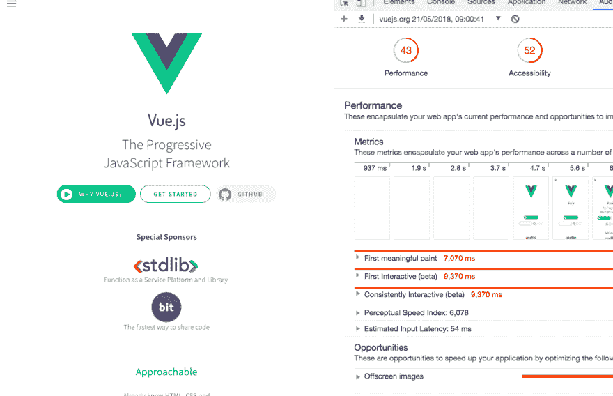
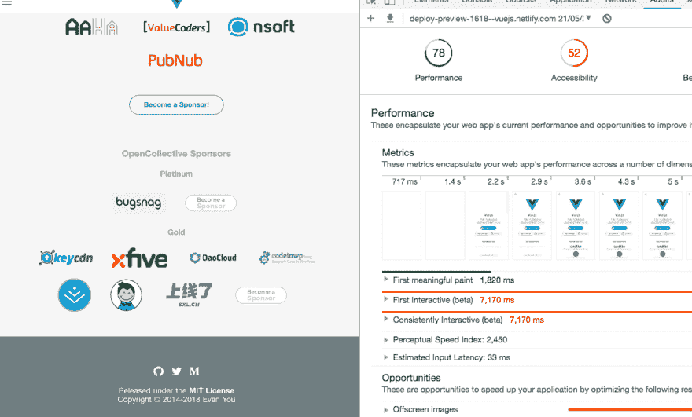
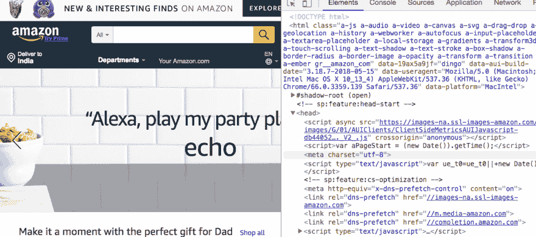
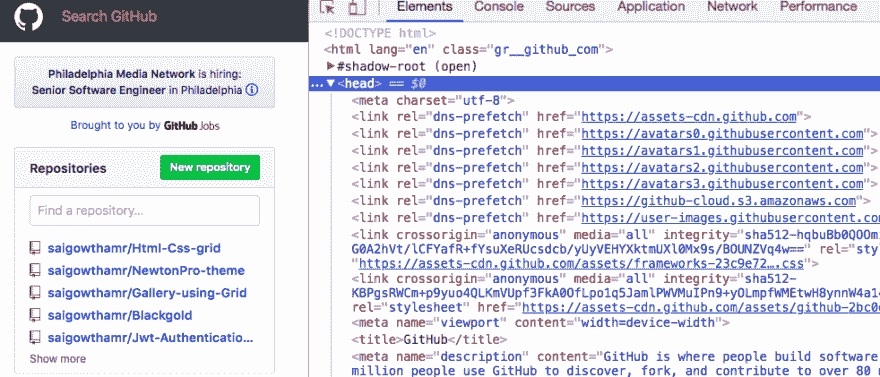

# 如何通过使用(预加载、预连接、预取)来提高 web 性能

> 原文：<https://dev.to/sait/how-to-improve-web-performance-by-usingpreload-preconnect-prefetch-1pc1>

今天，我将展示一些简单的技巧，让你的网站快速加载。

首先，我们需要知道什么是预加载、预连接和预取。

**Preload:** 当我们在链接标签中使用 Preload 时，它会发出早期获取请求来获取资源。主要用于获取当前路由中使用的高优先级资源。

**预连接:**解析 DNS 和 TCP 握手。

**DNS-Preconnect** :只解析 DNS。

**预取:**它有助于获取资源并将其放入缓存。
每当资源可能需要时，它会从缓存中获取，而不是发出另一个请求。

我想你可能会怀疑预加载和预取之间的区别。预加载用于高优先级资源，预取用于低优先级资源。

现在我们来看一个 [Vuejs](//vuejs.org) 网站的实例。

默认情况下，vuejs 网站不使用以上任何一种。

让我们使用 chrome 审计来检查 vue 站点的 web 性能。

[T2】](https://res.cloudinary.com/practicaldev/image/fetch/s---TM7UzLb--/c_limit%2Cf_auto%2Cfl_progressive%2Cq_auto%2Cw_880/https://thepracticaldev.s3.amazonaws.com/i/fsvx74sjpuv6sjmwmgck.png)

你见过 43%是我机器上的性能吗？

## 我在使用预连接和预加载之后。

现在业绩 78%。

[T2】](https://res.cloudinary.com/practicaldev/image/fetch/s--jrJtaSo4--/c_limit%2Cf_auto%2Cfl_progressive%2Cq_auto%2Cw_880/https://thepracticaldev.s3.amazonaws.com/i/y51dck7n70dob2bt1bot.png)

这里是[例子](https://deploy-preview-1618--vuejs.netlify.com/)你可以在自己的机器上检查。

### 现在让我们看看哪些顶级网站正在使用上述资源提示。

## 亚马逊

[T2】](https://res.cloudinary.com/practicaldev/image/fetch/s--AV0b7_-Z--/c_limit%2Cf_auto%2Cfl_progressive%2Cq_auto%2Cw_880/https://thepracticaldev.s3.amazonaws.com/i/k4cj0oqq4w0awthmmvhc.png)

## Github

[T2】](https://res.cloudinary.com/practicaldev/image/fetch/s--HgLXH4ZF--/c_limit%2Cf_auto%2Cfl_progressive%2Cq_auto%2Cw_880/https://thepracticaldev.s3.amazonaws.com/i/8alvmkooag9ruwzbckmj.png)

## 网飞

[T2】](https://res.cloudinary.com/practicaldev/image/fetch/s--R4AKcqQ1--/c_limit%2Cf_auto%2Cfl_progressive%2Cq_auto%2Cw_880/https://thepracticaldev.s3.amazonaws.com/i/t028wgb2dbqm6dk5gd5d.png)

如果你有任何疑问，请随时询问。

结账- > [最佳编程笔记本电脑](https://reactgo.com/best-programming-laptops/)