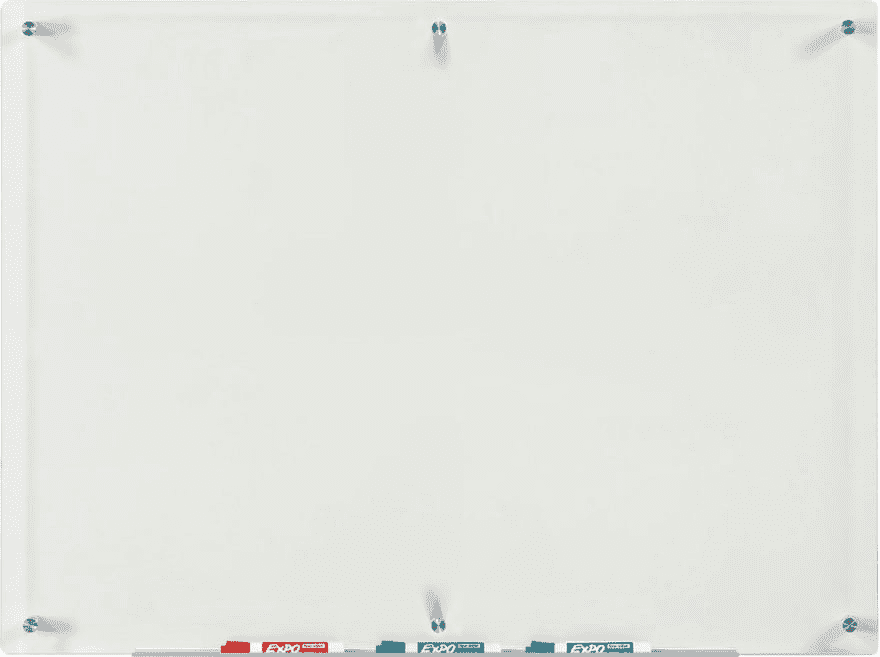

# 如何改善你的开发体验

> 原文：<https://dev.to/theoutlander/how-to-improve-your-development-experience-ldl>

要成为更快的开发人员，你需要考虑编码速度以外的问题。你不仅需要提高自己的核心技能，还需要改善物理环境、工具和解决问题的方法。

如果你刚刚开始，不要被细节所困扰。我有一个精心的设置，因为我在家工作，我已经编程超过 25 年了！

随着时间的推移，你将积累专业知识，并调整最适合你的方式。我在分享对我有效的方法。

## 舒适的环境

我再怎么强调一张尺寸合适的桌子有多重要也不为过。你需要足够的空间来放置你的机器和涂鸦。确保可以放置记事本、写字板、台灯等。并且仍有空间舒适地工作。

<figure>

[T2】](https://res.cloudinary.com/practicaldev/image/fetch/s--WiYL3AaH--/c_limit%2Cf_auto%2Cfl_progressive%2Cq_auto%2Cw_880/https://images-na.ssl-images-amazon.cimg/I/71O6qyv3sAL._SL1500_.jpg)

<figcaption>[Bush Business Furniture Series C 72W x 30D Office Desk in Mocha Cherry](https://www.amazon.com/Bush-Business-Furniture-Office-Hansen/dp/B000W8JLD2/)</figcaption>

</figure>

随之而来的是一把超级舒适的带扶手的椅子。我强烈建议买个头枕。如果你打算每天花 10-20 个小时编码，你需要一把好椅子。即使是简单的事情也很重要，如扶手如何调节或颈部支撑放置的位置等。

<figure>

[T2】](https://res.cloudinary.com/practicaldev/image/fetch/s--bPHwoDvR--/c_limit%2Cf_auto%2Cfl_progressive%2Cq_auto%2Cw_880/https://images-na.ssl-images-amazon.cimg/I/41Z9O6qq2qL.jpg)

<figcaption>[Steelcase Leap v2](https://store.steelcase.com/seating/office-chairs/leap)</figcaption>

</figure>

## 找到合适的硬件

在快速开发的机器上工作是很重要的，这样你就不会花太长时间来编译你的代码或者渲染应用程序。好的键盘、鼠标和显示器也是如此。这些东西会增加疲劳。我记得在使用 Java 1.0 的时候，我的研究项目花了大约六个月的时间来实现，我实际上花了三个月的时间来等待代码编译。

<figure>

[T2】](https://res.cloudinary.com/practicaldev/image/fetch/s---A1wuUuD--/c_limit%2Cf_auto%2Cfl_progressive%2Cq_auto%2Cw_880/https://www.duckychannel.com.tw/page-en/ducky-shine-5/img/ducky_shine_5_30.jpg)

<figcaption>[Ducky Shine 5](https://www.duckychannel.com.tw/page-en/ducky-shine-5/)</figcaption>

</figure>

多显示器设置非常重要。我用一个 43 英寸的 4K 显示器作为我的主显示器，两边各有一个 24 英寸的高清显示器。对于大多数复杂的应用程序来说，这是完美的。原因是你需要足够的空间来很好地了解代码编辑器、服务调试器、UI 调试器、浏览器、电子邮件、stack overflow/论坛、仪表盘、SSH 会话、Spotify、dev.to:)等等。使用笔记本电脑没问题，但我发现当我一次看到所有东西时，我的效率非常高，而且不用不停地在窗口之间切换。

<figure>

[T2】](https://res.cloudinary.com/practicaldev/image/fetch/s--NsMksVT---/c_limit%2Cf_auto%2Cfl_progressive%2Cq_auto%2Cw_880/https://www.lg.com/img/monitors/md05832389/gallery/medium02.jpg)

<figcaption>[43" 4K UHD Monitor](https://www.lg.com/us/monitors/lg-43UD79-B-4k-uhd-led-monitor)</figcaption>

</figure>

## 挑选合适的编程语言

不管你在做什么，一定要选择一种有很好的工具和社区支持的语言。例如，Javascript、Python 和 Ruby 是目前大多数项目的常见选择。我喜欢使用 C++和 C#，但是选择编译语言必须有一个好的理由。

## 找到合适的工具

在过去，使用文本编辑器可能是可以接受的，但现在肯定没有效率。你需要找到合适的软件工具。您需要一个非常好的集成开发环境(IDE ),因为这是您花费大部分时间的地方。你需要找到能让你留在那个环境中的东西。一些不错的选择有 Visual Studio Code、Webstorm、Pycharm 等。

## 学习计算机科学核心理论&概念

*   数据结构
*   算法
*   设计模式
*   数学
*   问题解决

你可以在 YouTube、Udemy、Coursera、Udacity 等网站上找到以上所有内容的在线教程。你也应该超越仅仅学习理论。开始编写这些算法和数据结构，因为它将帮助你提高对事物如何工作的理解，并帮助你学习良好的编码实践。

想出解决你自己问题的方法，并用这些方法来磨练你的技能。这是一个强大的组合，它有助于你保持动力。

## 高层思维/架构

你需要超越写代码，用抽象的术语思考。想象一下在白板(或笔记本)上把问题分解成大盒子，盒子之间用线隔开。你需要先想到如何在纸上解决问题。在一个公司环境中，你最终也要写软件设计文档。通常，这些有助于提前发现实现中的基本问题。构建好的软件就是思考整个过程，将问题分解成可以重用的模块。

<figure>

[T2】](https://res.cloudinary.com/practicaldev/image/fetch/s--jHT00nNe--/c_limit%2Cf_auto%2Cfl_progressive%2Cq_auto%2Cw_880/https://images-na.ssl-images-amazon.cimg/I/51fg0MdzaPL._SL1250_.jpg)

<figcaption>[Clear Glass Dry-Erase Board](https://www.amazon.com/dp/B005DDPFC2/)</figcaption>

</figure>

## 软技能

重要的是要学会如何沟通，并解释什么是传达给你。如果您能够理解来自客户或您的团队的问题/特性请求，并通过如何模块化解决方案的增量计划将其转化为适当的需求，您将在实际开发过程中节省大量时间。

一般来说，我在白板上花了大部分时间思考解决问题，并与团队的其他成员协调。我会说编码可能是 60%的工作。然而，这些天我在做一名独立顾问。

## 在关闭

在一天结束的时候，你将花时间在键盘上和显示器前编写你的代码。你需要熟悉热键/键盘快捷键。这些可以节省大量时间。这是我在面试应聘者时努力观察到的。

此外，您需要自动化任何事情和一切。你首先是一名工程师，需要运用你的技能使你的工作更容易。如果你发现你在重复自己，你需要找到一种自动化的方法。你写的每一段代码都需要是可重用的。您还需要编写测试自动化，这样您就减少了破坏代码的可能性，也减少了以后浪费时间寻找和修复问题的可能性。

让自己熟悉大量的库、框架和 SaaS 产品，简化你的生活。然而，至少要在其中一个方面积累专业知识。同时，一定要花一些时间了解各种技术的工作原理，避免盲目使用。

最后，在你开始编码之前，花足够的时间去理解需求，并在纸上做出高层次的图表。如果你能先解决纸面上的问题，那之后就是人工的问题了。

* * *

如果这篇文章有帮助，❤️ it 和[在 Twitter 上关注我](https://twitter.com/intent/follow?screen_name=theoutlander)。

 [## 我在微软做过 MSN，Live，Bing 搜索，问我什么都行！

### 尼克卡尼克 9 月 12 日 181 分钟阅读

#ama #career #search #beginners](/theoutlander/i-worked-on-msn-live-and-bing-search-at-microsoft-ask-me-anything-2eb3)