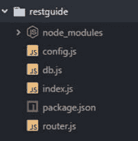
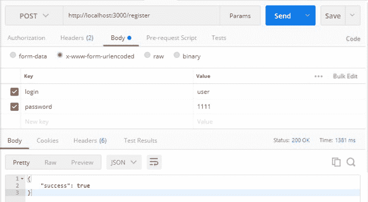
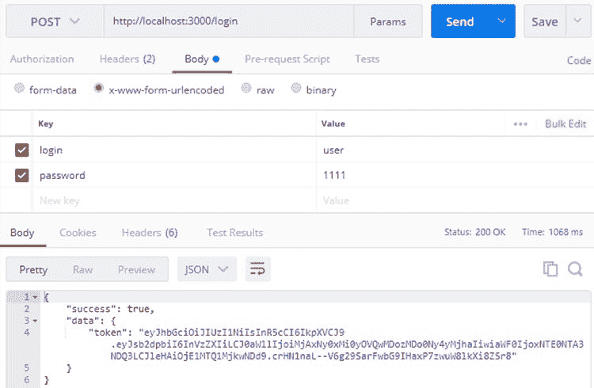
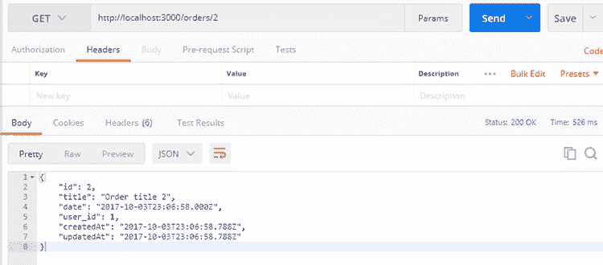
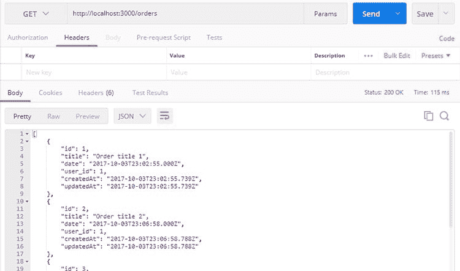
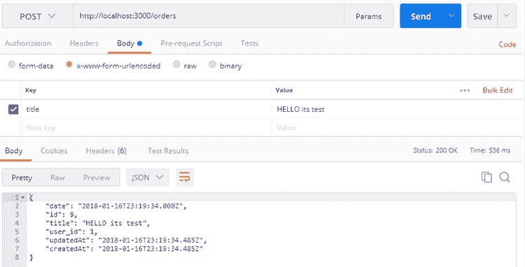
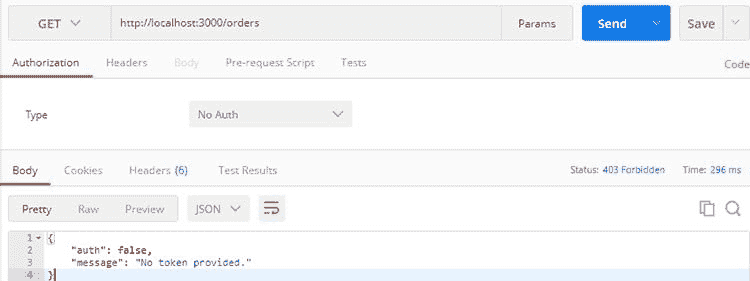

# 如何用 JWT 认证和 PostgreSQL 三步初始化多层 Node.js RESTful API

> 原文：<https://dev.to/vitaliikulyk/how-to-initialize-multilayer-nodejs-restful-api-with-jwt-auth-and-postgresql-in-3-steps--c8c>

一个鲜为人知的事实是，当 Julius Caesar 发表他的名言“分而治之”时，他实际上是在谈论使用分层架构来构建 web 应用程序。其原理在于将用户界面与业务逻辑分离，并将业务逻辑与数据访问逻辑分离。分层架构提供了更高的灵活性、可维护性和可伸缩性，并且更易于编写、测试和维护。听起来不错，但是如何使用现代技术实现它呢？

对于那些不熟悉 Node.js 和 RESTful API 的人，我们已经编写了一个操作指南，帮助你创建一个可以开发成大型服务的 RESTful API。在本教程中，我们将向您展示如何通过三个步骤开始构建 RESTful API。JSON Web Token 技术将帮助我们处理认证，PostgreSQL 将是我们的数据库。

因此，我们编写 RESTful API 的步骤是:

1.  初始化 Node.js 项目
2.  JWT 认证
3.  添加层

### 初始化 Node.js 项目

让我们开始构建我们的应用程序。使用以下命令创建一个空文件夹并初始化一个新项目:npm init

要安装必要的软件包，请运行以下命令:NPM I bcrypt blue bird body-parser express http jsonwebtoken lodash pg sequelize sequelize-values—save

接下来，在主文件夹中创建以下文件:

*   **config.js** (应用程序的配置，如数据库连接、密码盐等。)
*   **db.js** (负责数据库连接)
*   **router.js** (处理 http 请求并将它们分派给控制器)
*   **index . js**——(一个启动文件)



下面是我们的文件包含的代码:

#### 配置文件:

```
module.exports = {
     port: 3000,
     dbConnectionString: 'your postgresql connection',
     saltRounds: 2,
     jwtSecret: 'yo-its-a-secret',
     tokenExpireTime: '6h'
}
```

#### db.js:

```
const config = require('./config');
const Sequelize = require('sequelize');
var sequelize = new Sequelize(config.dbConnectionString);
require('sequelize-values')(sequelize);
```

```
module.exports = sequelize;
```

#### router.js:

```
module.exports.set = app => {
     //endpoints will be here soon
}
```

#### index.js:

```
const express = require('express');
const http = require('http');
const bodyParser = require('body-parser');
const app = express();
const config = require('./config');
const router = require('./router');
```

```
app.use(bodyParser.json());
app.use(bodyParser.urlencoded({
     extended: true
}));
app.use(express.static('client'));
router.set(app);
```

```
app.listen(config.port, () => console.log('App listening on port '+ config.port));
```

在主文件夹中创建完文件后，您必须定义数据模型。为此，创建一个包含文件 **index.js** 的文件夹模型。像这样:

#### /models/index.js:

```
const Sequelize = require('sequelize');
const sequelize = require('../db');
```

```
const User = sequelize.define('user', {
    login: Sequelize.STRING,
    password: Sequelize.STRING,
});
```

```
const Order = sequelize.define('order', {
     title: Sequelize.STRING,
     date: {
         type: Sequelize.DATE,
         defaultValue: Sequelize.NOW
      },
     user_id: {
         type: Sequelize.INTEGER,
         references: {
              model: User,
              key: 'id'
          }
      }
 });
```

```
User.hasMany(Order, {foreignKey: 'user_id'});
```

```
module.exports = {
     User,
     Order
 }
```

这就是开始多层 Node.js 项目的方式。此时，我们有了应用程序的入口点( **index.js** )，两个 DB 模型( **models/index.js** )和一些基本配置。

### JWT 认证

在编写实际的 API 之前，让我们为应用程序添加身份验证。用文件 **user.js** 和 **auth.js** 创建一个服务文件夹。像这样:

#### /services/index.js

```
const sequelize = require('../db');
const Users = require('../models').User;
```

```
const addUser = user => Users.create(user);
```

```
const getUserByLogin = login => Users.findOne({where: {login}});
```

```
module.exports = {
    addUser,
    getUserByLogin
}
```

用户登录后，每个后续请求都将包含一个令牌(JWT)，允许用户根据令牌中存储的权限访问路由、服务和资源。

#### /services/auth.js 将处理 JWT 身份验证:

```
const bcrypt = require('bcrypt');
const jwt = require('jsonwebtoken');
```

```
const Users = require('../models').User;
const config =  require('../config');
```

```
const authenticate = params => {
      return Users.findOne({
          where: {
              login: params.login
          },
          raw: true
     }).then(user => {
          if (!user)
              throw new Error('Authentication failed. User not found.');
          if (!bcrypt.compareSync(params.password || '', user.password))
              throw new Error('Authentication failed. Wrong password.');
          const payload = {
              login: user.login,
              id: user.id,
              time: new Date()
          };
```

```
 var token = jwt.sign(payload, config.jwtSecret, {
              expiresIn: config.tokenExpireTime
          });
          return token;
      });
}
```

```
 module.exports = {
    authenticate
}
```

为了处理注册和认证请求，我们的应用程序应该有一个控制器。

让我们创建一个文件 **auth.js** ，并将它放在 controllers 文件夹中。

#### /控制器/auth.js:

```
const config =  require('../config');
const jwt = require('jsonwebtoken');
const bcrypt = require('bcrypt');
```

```
const authService = require('../services/auth');
const userService = require('../services/user');
```

```
function login(req, res){
     return authService.authenticate(req.body)
     .then(token => {
          res.send({
               success: true,
               data: { token }
          });
     })
     .catch(err => {
          res.send({
               success: false,
               message: err.message //not the best error handling.
               //for better error handling visit github repository, link provided below
          });
     })
};
```

```
function register(req, res){
     var login = req.body.login;
     return userService.getUserByLogin(req.body.login || '')
     .then(exists => {
```

```
 if (exists){
               return res.send({
                   success: false,
                   message: 'Registration failed. User with this email already registered.'
               });
          }
```

```
 var user = {
               login: req.body.login,
               password: bcrypt.hashSync(req.body.password, config.saltRounds)
           }
```

```
 return userService.addUser(user)
          .then(() => res.send({success: true}));
     });
};
```

```
module.exports = {
    login,
    register
}
```

在这之后，我们需要向我们的 API 添加端点。

#### 您可以在 router.js 文件中完成:

```
const authController = require('./controllers/auth');
```

```
module.exports.set = app => {
    app.post('/login', authController.login);
    app.post('/register', authController.register);
}
```

让我们通过运行命令 node **index.js** 来启动服务器，并测试登录和注册功能。



### 添加层

现在，我们的应用程序中有了控制器层和数据访问层。为了将它们链接在一起，我们需要在它们之间有一个服务层。使用层是确保职责分离的好方法，它允许使数据、业务逻辑和表示代码相互独立。表示层(用户)与控制器层(API)交互，控制器层使用服务层(业务规则)通过数据访问层访问和修改数据。

因此，让我们从订单模型的第一个服务开始。

#### 创建文件 services/order.js

```
const Orders = require('../models').Order;
```

```
const getAll = () => Orders.findAll();
```

```
const getById = id => Orders.findById(id);
```

```
const add = order => Orders.create(order);
```

```
module.exports = {add, getAll, getById};
```

现在，我们可以创建一个控制器来处理该服务。

#### 控制器/order.js

```
const orderService = require('../services/order');
```

```
function getOrders(req, res){
    orderService.getAll()
    .then(data => res.send(data));
};
```

```
function getOrder(req, res){
    orderService.getById(req.params.id)
    .then(data => res.send(data));
}
```

```
function addOrder(req, res){
    orderService.add({
        title: req.body.title,
        user_id: 1
    })
    .then(data => res.send(data));
};
```

```
module.exports = {
    getOrders,
    getOrder,
    addOrder
}
```

#### 我们需要完成 RESTful API 的订单部分的另一件事是向 router.js 添加端点:

```
const orderController = require('./controllers/order');
…
   app.get('/orders', orderController.getOrders);
   app.get('/orders/:id', orderController.getOrder);
   app.post('/orders', orderController.addOrder);
```

下面是一个有效 API 的测试示例:



我们需要的下一件事是只允许经过身份验证的用户访问。为此，让我们添加检查用户是否登录的中间件:

#### 中间件/auth.js:

```
const jwt = require('jsonwebtoken');
const config =  require('../config');
```

```
const checkAuth = (req, res, next) => {
    var token = req.headers['token'];
    if (!token)
        return res.status(403).send({ auth: false, message: 'No token provided.' });

    jwt.verify(token, config.jwtSecret, (err, decoded) => {
        if (err)
            return res.status(500).send({ auth: false, message: 'Failed to authenticate token.' });
```

```
 req.user = {
         login: decoded.login,
         id: decoded.id
    };
```

```
 next();
    });
}
```

```
module.exports = {
    checkAuth
}
```

在这之后，认证中间件应该被用作端点函数中的中间件参数(第二个)。现在，如果不提供有效的身份验证令牌，用户就无法访问数据。

```
app.get('/orders', authMiddleware.checkAuth, orderController.getOrders);
app.get('/orders/:id', authMiddleware.checkAuth, orderController.getOrder);
app.post('/orders', authMiddleware.checkAuth, orderController.addOrder);
app.get('/user_orders', authMiddleware.checkAuth, userController.getUsersWithOrders)
```

如你所见，它是有效的:)



#### 我们需要做的最后一件事是定义 addOrder 函数。

```
function addOrder(req, res){
    orderService.add({
         title: req.body.title,
         user_id: req.user.id
    })
    .then(data => res.send(data));
};
```

就这样！我们用 RESTful API 创建了一个小应用程序。根据多层体系结构的概念，我们有控制器层、服务层和数据访问层。我们的 API 经过 JWT 授权，可以很容易地添加表示层，例如 web 应用程序或移动应用程序。

可以随意查看 [**资源库**](https://github.com/VitaliiKulyk/asap) 中的代码。好了，不要只是站在那里——你自己去试试吧。好运来自[T5】elift echT7】！](https://www.eliftech.com/)