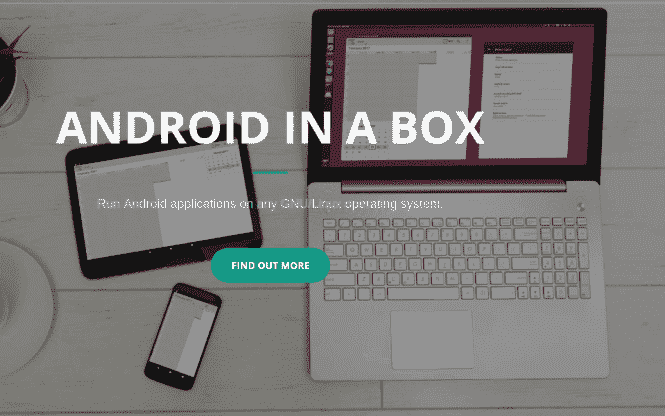
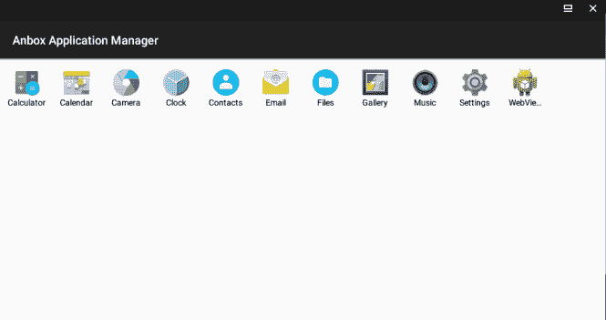

# 如何在 Ubuntu Linux 中安装 Anbox

> 原文：<https://dev.to/xeroxism/how-to-install-anbox-in-ubuntu-linux-26d3>

[T2】](https://i2.wp.com/fossnaija.com/wp-content/uploads/2018/09/how_to_install_anbox_banner.png?ssl=1)

Anbox 是一个用于 Linux 系统的嵌入式 android 仿真平台。简单地说，Anbox 允许你在 Linux 系统上运行原生的 android 应用程序。在这篇文章中，我将向你展示如何在 Ubuntu Linux 系统上安装它。

目前，获得一个盒子的唯一方法是通过它的 snap 版本。所以要安装 Anbox，你的系统需要支持 [**快照**](https://dev.to/xeroxism/how-to-install-and-use-snap-applications-in-linux-12da-temp-slug-6115022) 。在本文的演示中，使用了 Ubuntu 16 它支持开箱即用的快照包。事实上，[根据 Anbox 项目](https://github.com/anbox/anbox/blob/master/docs/install.md)他们**“只有在 Launchpad 的 PPA 中为 Ubuntu 准备的包。**”。

如果你不知道快照[获得什么是快照、如何在你的发行版上安装对它们的支持以及如何使用它们的介绍](https://dev.to/xeroxism/how-to-install-and-use-snap-applications-in-linux-12da-temp-slug-6115022)。

# **安装 Anbox【步骤】:**

Anbox 的安装包括两个步骤。

## **1。安装必要的内核模块**

为了支持 Android 容器的强制内核子系统 **ashmem** 和 **binder** ，你必须安装两个基于 DKMS 的内核模块。内核模块的源代码由 Anbox 项目[维护。](https://github.com/anbox/anbox/blob/master/docs/install.md)

为了将 [PPA](https://fossnaija.com/how-to-install-software-using-ppa-ubuntu/) 添加到你的 Ubuntu 系统中，请运行以下命令:

```
$ sudo add-apt-repository ppa:morphis/anbox-support
$ sudo apt update
$ sudo apt install anbox-modules-dkms 
```

Enter fullscreen mode Exit fullscreen mode

这将把 PPA 添加到您的系统中，并安装包含 ashmem 和 binder 内核模块的 anbox-modules-dkms 包。它们会在每次系统内核更新时自动重建。安装了 anbox-modules-dkms 包之后，您必须手动加载内核模块。下次你的

系统启动时，它们将被自动加载。

```
$ sudo modprobe ashmem_linux
$ sudo modprobe binder_linux 
```

Enter fullscreen mode Exit fullscreen mode

现在，您的 systems /dev 目录中应该有两个新节点:

```
$ ls -l /dev/{ashmem,binder} 
```

Enter fullscreen mode Exit fullscreen mode

大阿什姆

/dev/binder

## **2。安装 Anbox 卡扣:**

第二步将从商店安装 Anbox snap，并为您提供运行完整 Anbox 体验所需的一切。

这样做非常简单，输入下面的命令:

```
$ snap install --devmode --beta anbox 
```

Enter fullscreen mode Exit fullscreen mode

如果你还没有登录 Ubuntu 商店，snap 命令会要求你使用 sudo snap …来安装 snap:

```
$ sudo snap install --devmode --beta anbox 
```

Enter fullscreen mode Exit fullscreen mode

需要**–devmode**，因为 Anbox snap 尚未完全受限。据该项目称:“上游 snapd 项目的工作已经开始，以获得对全面限制的支持。作为使用**–devmode**的副作用，快照不会自动更新。”

如果你想更新到一个新的版本，你可以运行:

```
$ snap refresh --beta --devmode anbox 
```

Enter fullscreen mode Exit fullscreen mode

有关 snap 当前可用版本的信息，请访问:

```
$ snap info anbox 
```

Enter fullscreen mode Exit fullscreen mode

## **当你想卸载 Anbox**

如果您想从系统中删除 Anbox，首先必须删除 snap:

**注意:**通过删除快照，您将从系统中删除存储在快照中的所有数据。没有办法把它带回来。

```
$ snap remove anbox 
```

Enter fullscreen mode Exit fullscreen mode

移除快照后，您还必须移除已安装的内核模块:

```
$ sudo apt install ppa-purge
$ sudo ppa-purge ppa:morphis/anbox-support 
```

Enter fullscreen mode Exit fullscreen mode

之后 Anbox 就会从你的系统中移除。

你走向你的 Ubuntu dash，在“anbox”中输入，然后点击带有 android 标志的“”来启动它。可用的默认应用程序包括:联系人、图库、文件、电子邮件音乐、计算器、时钟、设置和电子邮件。

[T2】](https://i0.wp.com/fossnaija.com/wp-content/uploads/2018/09/anbox-default-apps.png?ssl=1)

快乐的 Linux！

帖子[如何在 Ubuntu Linux 中安装 Anbox](https://fossnaija.com/how-to-install-anbox-in-ubuntu-linux/)最早出现在 [Foss Naija](https://fossnaija.com) 上。