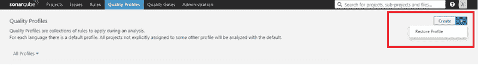

# 如何使用声纳扫描仪安装和配置声纳库，为您的…生成声纳报告

> 原文：<https://dev.to/sirius93/how-to-install-and-configure-sonarqube-with-sonarscanner-for-generating-sonar-report-for-your-1ejf>

1.  安装 SonarQube 的步骤:

*转到[https://www.sonarqube.org/downloads/](https://www.sonarqube.org/downloads/)并点击下载 LTS

*下载完成后，将声纳文件解压到 c 盘或 D 盘。

*转到{您的根路径} \ sonar qube-6 . 7 . 1 \ bin \ windows-x 8664 并单击。StartSonar.bat 文件上。

它将在 localhost:9000 启动一个声纳服务器，你可以用下面的预设凭证登录到你的声纳。

用户名:管理员

密码:管理员

1.  安装声纳扫描仪的步骤:

*进入

[https://docs . sonar cube . org/display/SCAN/Analyzing+with+sonar cube+Scanner](https://docs.sonarqube.org/display/SCAN/Analyzing+with+SonarQube+Scanner)点击 Windows 64 bit。

*下载完成后，解压文件并保存到 C 或 D 盘。

*您可以通过将**{您的根路径}\sonar-scanner\bin** 添加到您的路径来为 Sonar-scanner 设置路径变量

1.  生成声纳报告的步骤:

*转到您的项目根目录。

*执行以下命令。

SONAR-scanner-D SONAR . PROJECT KEY = "您的声纳项目密钥"-D sonar.sources=。" JAVASCRIPT 源文件夹的路径"-D sonar . host . URL =[http://localhost:9000](http://localhost:9000)

1.  配置您的 javascript 质量配置文件:

*登录后，单击质量配置文件，然后单击创建旁边的下拉按钮。

*单击恢复配置文件，导入您的自定义 JavaScript-profile XML，浏览 JavaScript 配置文件并上传。

[T2】](https://res.cloudinary.com/practicaldev/image/fetch/s--UTZamn16--/c_limit%2Cf_auto%2Cfl_progressive%2Cq_auto%2Cw_880/https://cdn.hashnode.com/res/hashnode/image/upload/v1653045730008/rXttQs3zR.png)